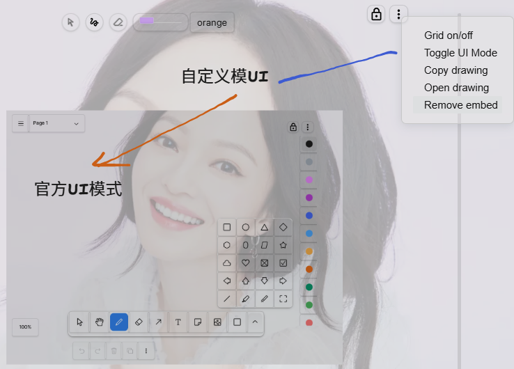

# Ink
A plugin for [Obsidian](https://obsidian.md) that adds the ability to hand write or draw with a stylus between paragraphs in your notes.

Hand write or draw directly between paragraphs in your notes using a digital pen, stylus, or Apple pencil. Useful for handwriting, sketches, scribbles, or even math equations and scientific notation. Runs on the tldraw framework and drawing provides an infinite canvas.

## Custom
新命令：
Ink: Existing命令行打开已有的Ink文件，可以预览中选择插入文件到文档
Ink: Library命令打开素材库，只显示手动添加的内容。
Ink: Import SVG file 打开整个库中所有svg
Ink: Convert V1 Embeds to Current Format 旧文件类型转换新svg格式，一个文档中多个Ink文件也能直接转换。

### Drawing
**UI模式切换**
- 支持`custom`和`official`两种UI模式
- 通过插件设置动态切换
- 组件配置的精细控制

custom 为自定义UI，包含笔刷大小调节 颜色选取 自定义右键菜单 键盘快捷键 导出到素材库等
official为tldraw官方UI，完整的tldraw功能

两种UI都在自定义扩展菜单（保存和全屏）中添加了UI切换的选项

两种UI模式 使用相同画布，内容共享，编辑状态下快捷切换UI。
官方UI自由选择要使用的菜单组件，不常用的可以在设置中关闭。

规范svg格式，加了XML和DOCTYPE声明和完整的命名空间声明，包含图片的svg，电脑端也可以直接预览。

右键菜单添加 "导入svg”选项，ink格式下tldraw的draw、geo、image等常见类型元素从右键菜单选导入，svg能直接打开进入全屏编辑，

### Writing

1、在宽敞的“放大区域”中书写，停顿后捕捉书写的笔画，把写的内容缩放（统一行高）移动（自动排列）到正文末尾（流式布局：自动换行）。
2、添加自定义右键菜单。

## 🎥 Demo

  <a href="https://www.youtube.com/watch?v=qgir8F7ezNM" target="_blank">
       
      Click to play demo
  </a>

**Demo Note** 
In the video above, I have set up this plugin's commands to be visible in another plugin called [Slash Commander](https://github.com/alephpiece/obsidian-slash-commander) - This allows me to select the insert command quickly by simply typing `/`.

## 📓 Development Diaries
I record regular development diaries. [Subscribe and follow along](https://www.youtube.com/@designdebtclub) to see features in development.

    <a href="https://youtube.com/playlist?list=PLAiv7XV4xFx2NMRSCxdGiVombKO-TiMAL&si=TarnAk9A4kzzy0Gu" target="_blank">
         
        Click to view development diaries
    </a>

  
  
  
  

## 🗺️ Rough roadmap
I've been building this plugin since December 2023 and I'm currently developing it further and using it daily. 
Below are the high level features in my current development plan along with their expected timeframes.

Historical

- [x] Proof of concept handwriting input.
- [x] Proof of concept drawing input.
- [x] Embeddable in markdown files.
- [x] Automatic screenshotting.
- [x] Proof of concept OCR (Transcripts).
- [x] Refined UI.

Current feature focus

- [ ] Ability to reframe embedded drawings.
- [ ] Pen smoothing enhancements (Not eReader related).

Speculative

- [ ] Convert embed format to persist beyond uninstall.
- [ ] Separate touch interactions.
- [ ] Multiple pen styles.
- [ ] Automatic OCR (Transcripts).
- [ ] Writing edit interactions.

## ⚠️ Be careful
>As with most Obsidian plugins, this is a free gift to the community, provided 'as is' to help you out. While I'm doing my best to make it awesome (And I love feedback), there are always chances things might not work quite right. To be safe, **please always back up your files**.

## 🪳 Report a bug
Found something that's not quite working right or do you have a feature request? Don't be shy, feel free to make some noise over on the [GitHub Issues](https://github.com/daledesilva/obsidian_project-browser/issues) page. But be sure to check if someone has already posted the same issue and comment on theirs if they have.

## 💾 Installation
You can find this plugin in the plugin directory within Obsidian.

Click for help installing plugins

1. Open your Obsidian vault and go to **Settings**.

2. Click on **Community Plugins** in the side bar.

3. If you haven't already, you will need to turn on community plugins.

4. Search 'Dale de Silva' and install **Ink**.

If you would like to install new versions of the plugin that are still being tested, you can install this plugin through BRAT instead.
BRAT is another community plugin that allows you to install a Beta version. New features are released as a Beta version first and can take from a few days to a month before landing in the standard version.

Click for Beta version installation instructions

1. Open your Obsidian vault and go to **Settings**.
2. Click on **Community Plugins** in the side bar.
3. Turn on community plugins and click **Browse**.
4. Search and install **BRAT**.
5. Scroll down and **activate** BRAT.
6. In the BRAT menu in the side pane, select **Add Beta Plugin**.
7. Follow the instructions presented.
8. When a URL is requested, use: `https://github.com/daledesilva/obsidian_ink`

Click for Beta version update instructions

- BRAT is set to update Beta plugins by default on startup, however, this can sometimes take some time.
- To force an update, run BRAT's Obsidian commnd `Choose a single plugin to update` and choose Ink.

## 🏛️ License
>Please note that while this repository is public and can be browsed and modified for your personal use, it is not open source. It is licensed under [CC BY-NC-ND 4.0](https://creativecommons.org/licenses/by-nc-nd/4.0/)

## 🗒️ Notes

#### Optimisation Notes
The plugin currently works based on the [tldraw](https://tldraw.dev/) framework, however, tldraw is implemented using SVG elements which slow down greatly on iOS platforms and possibly others. This equates to significant lag while writing after about 200-300 strokes on iOS (Which is about 3-4 paragraphs). To temporarily mitigate this, the plugin hides strokes while writing that are several lines old. The strokes are still saved and reappear upon freezing the embed, reopening the file, or adjusting the infinite canvas view.

In the future, this plugin will transition off tldraw (at least for writing functionality), to Canvas based input. When this occurs any files that users have created will be converted automatically if necessary—You can count on this as I already have many files in my own vaults that rely on this plugin.

#### Embed Format Notes
The embed implementation is currently based on a code block that tells the plugin how to display the embed. I'm not happy with this, however, as it means if anyone ever wants to transition off this plugin they have to keep it installed in order to see their old handwritten sections.

I will be modifying this to simply be an image embed that the plugin recognises and enhances. This will mean that even if you uninstall the plugin, all your embeds will still be visible as static images.

#### Drawing Functionality Notes
There's currently 2 file formats that the plugin implements as embeddable sections. A handwriting file, and a drawing file. This enables the plugin to aid the user in different ways and provide more intuitive UIs for each input mode. The drawing file, however, while I have found that I already prefer using it over other Obsidian plugins, is not the primary goal of this plugin at this stage. It should therefore be treated with caution regarding future support.

Note, however, that the embed format described above will apply here also, which means your exist drawings will still remain visible as static images even if support is removed.

Note also that the drawing functionality will not take the place of Excalidraw. Excalidraw provides a feature rich ability to diagram holistically, whereas this plugin is built around freeform natural pen input. I personally like sketching more freeform with only minimal aid of drag and drop elements, so this is what drawing here is focussed on as that aligns with a handwritten style of taking notes as well.

## ❤️ Support
If you find this plugin saves you time or helps you in some way, please consider supporting my development of plugins and other free community material like this.

  
  
  
  
  

## 🤖 My other work
You can find links to my other projects on [designdebt.club](https://designdebt.club), where I blog about design and development, as well as release other plugins like this one. You can also find my writing at at [falterinresolute.com](https://falterinresolute.com) where I combine philosophy and animation.

  
  

