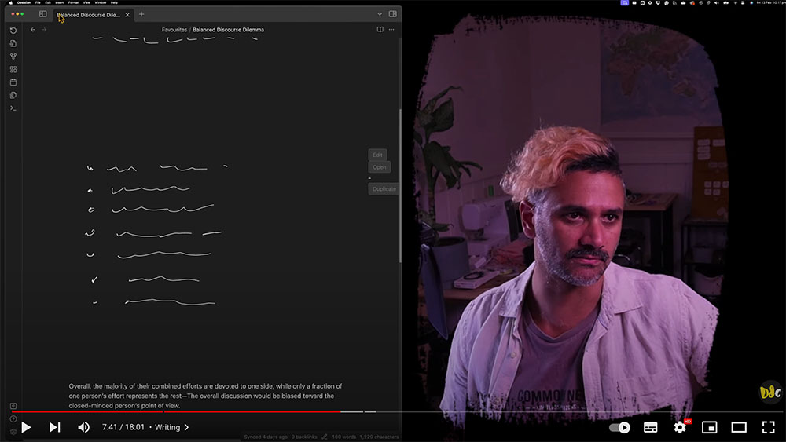

# Obsidian Handwrite
A plugin for [Obsidian](https://obsidian.md) that adds the ability to handwrite with a stylus into sections of markdown files.

!! ***This plugin is not yet released.*** 
Please also note that while the repository is public, the plugin it is not currently open source.

## 🎥 Demo

  <a href="https://www.youtube.com/watch?v=qgir8F7ezNM" target="_blank">
       
      Click to play demo
  </a>

**Demo Note** 
In the video above, I have set up this plugin's commands to be visible in another plugin called [Slash Commander](https://github.com/alephpiece/obsidian-slash-commander) - This allows me to select the insert command quickly by simply typing `/`.

## 📓 Development Diaries
I record regular development diaries. [Subscribe and follow along](https://www.youtube.com/@designdebtclub) to see features in development.

    <a href="https://youtube.com/playlist?list=PLAiv7XV4xFx2NMRSCxdGiVombKO-TiMAL&si=TarnAk9A4kzzy0Gu" target="_blank">
         
        Click to view development diaries
    </a>

  
  
  
  

## 🗺️ Rough roadmap
I've been building this plugin since December 2023 and I'm currently developing it further and using it daily. 
Below are the high level features in my current development plan along with their expected timeframes.

- [x] Proof of concept handwriting input.
- [x] Proof of concept drawing input.
- [x] Embeddable in markdown files.
- [x] Automatic screenshotting.
- [x] Begin using internally.
- [x] Proof of concept OCR (Transcripts).
- [x] Basic UI Refinement.
- [x] Improve interaction of markdown files while using embeds. ***January***
- [ ] Simplify & turn off drawing functionality by default ***January***
- [ ] **ALPHA release March 2024.**
- [ ] Convert embed format to persist beyond uninstall. ***March***
- [ ] More intuitive UI refinements. ***April 2024***
- [ ] Multiple pen styles. ***April***
- [ ] Convert to canvas framework. ***April***
- [ ] More intuitive touch/stylus input refinement. ***May***
- [ ] **BETA release in plugin repository.**
- [ ] Automatic OCR (Transcripts).
- [ ] Intuitive selection of words.
- [ ] Ability to reorder text.
- [ ] Consider primary support for drawing functionality.

## Notes

#### Optimisation Notes
The plugin currently works based on the [tldraw](https://tldraw.dev/) framework, however, tldraw is implemented using SVG elements which slow down greatly on iOS platforms and possibly others. This equates to significant lag while writing after about 200-300 strokes on iOS (Which is about 3-4 paragraphs). To temporarily mitigate this, the plugin hides strokes while writing that are several lines old. The strokes are still saved and reappear upon freezing the embed, reopening the file, or adjusting the infinite canvas view.

In the future, this plugin will transition off tldraw (at least for writing functionality), to Canvas based input. When this occurs any files that users have created will be converted automatically if necessary—You can count on this as I already have many files in my own vaults that rely on this plugin.

#### Embed Format Notes
The embed implementation is currently based on a code block that tells the plugin how to display the embed. I'm not happy with this, however, as it means if anyone ever wants to transition off this plugin they have to keep it installed in order to see their old handwritten sections.

I will be modifying this to simply be an image embed that the plugin recognises and enhances. This will mean that even if you uninstall the plugin, all your embeds will still be visible as static images.

#### Drawing Functionality Notes
There's currently 2 file formats that the plugin implements as embeddable sections. A handwriting file, and a drawing file. This enables the plugin to aid the user in different ways and provide more intuitive UIs for each input mode. The drawing file, however, while I have found that I already prefer using it over other Obsidian plugins, is not the primary goal of this plugin at this stage. It should therefore be treated with caution regarding future support.

Note, however, that the embed format described above will apply here also, which means your exist drawings will still remain visible as static images even if support is removed.

Note also that the drawing functionality will not take the place of Excalidraw. Excalidraw provides a feature rich ability to diagram holistically, whereas this plugin is built around freeform natural pen input. I personally like sketching more freeform with only minimal aid of drag and drop elements, so this is what drawing here is focussed on as that aligns with a handwritten style of taking notes as well.

## ❤️ Support
If you find this plugin saves you time or helps you in some way, please consider supporting my development of plugins and other free community material like this.

  
  
  
  
  

## 🤖 My other work
You can find links to my other projects on [designdebt.club](https://designdebt.club), where I blog about design and development, as well as release other plugins like this one. You can also find my writing at at [falterinresolute.com](https://falterinresolute.com) where I combine philosophy and animation.

  
  

