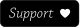

# Obsidian Handwrite
A plugin for [Obsidian](https://obsidian.md) that adds the ability to handwrite with a stylus into sections of markdown files.

## This plugin is not yet released.

### Rough roadmap
These are the high level features I will be working on.
- [x] Proof of concept handwriting input.
- [x] Proof of concept drawing input.
- [x] Embeddable in markdown files.
- [x] Automatic screenshotting.
- [x] Begin using internally.
- [x] Proof of concept OCR (Transcripts).
- [ ] Basic UI Refinement. (January)
- [ ] Improve interaction with of markdown files while using embeds. (January)
- [ ] Convert embed format to persist beyond uninstall. (January)
- [ ] **Alpha release.**
- [ ] More intuitive UI refinements. [February]
- [ ] Multiple pen styles. (February)
- [ ] Convert to canvas framework. (March)
- [ ] More intuitive touch/stylus input refinement. (April)
- [ ] Implement automatic OCR (Transcripts).
- [ ] Implement finger selection of words
- [ ] Ability to reorder text.
- [ ] Consider drawing functionality.

---

## ❤️ Support
If you find this plugin saves you time or helps you in some way, please consider supporting my development of plugins and other free community material like this. A simply way is to follow and message me on twitter at [@daledesilva](https://twitter.com/daledesilva) or Mastodon at [indieweb.social/@daledesilva](https://indieweb.social/@daledesilva), and you can also support with a donation below.

  
  
  

## 🤖 My other work
You can find links to my other projects on [designdebt.club](https://designdebt.club), where I blog about design and development, as well as release other plugins like this one. You can also find my writing at at [falterinresolute.com](https://falterinresolute.com) where I combine philosophy and animation.

  
  

