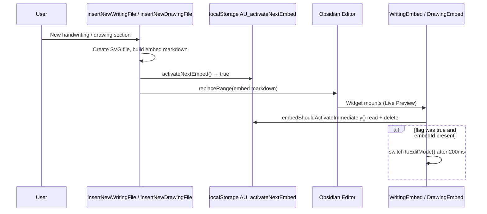

# Activate next embed (device-local flag)

## Why it exists

When the user runs **New handwriting section** or **New drawing**, the plugin inserts fresh embed markdown into the note. The embed widget is not mounted at command time—it appears later when Live Preview (or the editor widget layer) renders the new lines.

Without a bridge, the new embed would stay in **locked preview** until the user clicks to unlock. The `activateNextEmbed` flag tells the **next** embed that mounts to open in **edit mode** automatically so the user can start inking immediately.

## Conceptual understanding

Think of it as a **one-shot, device-local signal**:

- Set to `true` immediately **before** the embed markdown is written into the editor.
- Read once on embed **first mount**, then **cleared** from `localStorage`.
- Only the first embed that checks the flag consumes it.

It is **not** stored in vault `data.json` and does not sync across devices. See [Plugin memory and persistence](plugin-memory-and-persistence.md) for how this fits with other `AU_*` keys.

## Flows

### New section command → auto-edit

### What does *not* set the flag

- Embedding an **existing** writing/drawing file.
- Paste flows (including pending-paste duplicate/reference banners).
- Opening a note that already contains embeds.

## Technical details

| Item | Detail |
|------|--------|
| **API** | [`src/logic/utils/storage.ts`](../src/logic/utils/storage.ts) — `activateNextEmbed()`, `embedShouldActivateImmediately()` |
| **Storage key** | `activateNextEmbed` via `saveLocally` → full key `AU_activateNextEmbed` (`LOCAL_STORAGE_PREFIX`) |
| **Set** | [`insert-new-writing-file.ts`](../src/commands/insert-new-writing-file.ts), [`insert-new-drawing-file.ts`](../src/commands/insert-new-drawing-file.ts) |
| **Consume** | First-mount `useEffect` in current [`writing-embed.tsx`](../src/components/formats/current/writing/writing-embed/writing-embed.tsx) and [`drawing-embed.tsx`](../src/components/formats/current/drawing/drawing-embed/drawing-embed.tsx) (requires `embedId`); legacy v1 embed editors check the flag without `embedId` |
| **Delay** | `200ms` `setTimeout` before `switchToEditMode()` so layout/widget setup can settle |

## Technical Gotchas

- **First consumer wins:** If several embed widgets mount in the same tick, only the first `embedShouldActivateImmediately()` call sees `true`; the key is deleted immediately. Normal insert flow adds one new embed, so this is usually fine.
- **Tests:** Jest mocks `embedShouldActivateImmediately` to return `false` ([`tests/setupTests.ts`](../tests/setupTests.ts)) so components do not auto-enter edit mode. E2E tests set `AU_activateNextEmbed` manually in `localStorage` to simulate post-insert behaviour without running the insert command.
- **Not vault data:** Clearing site data or switching Obsidian profiles resets the flag; it does not travel with the vault.

## Related documentation

- [Plugin memory and persistence](plugin-memory-and-persistence.md) — `AU_*` localStorage keys
- [Development](development.md) — test mocking of `embedShouldActivateImmediately`
