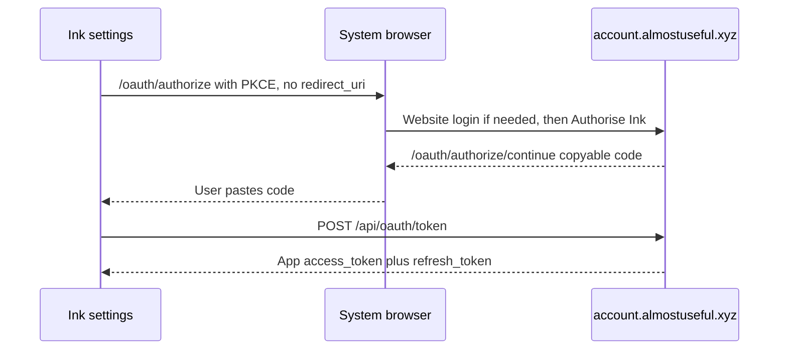
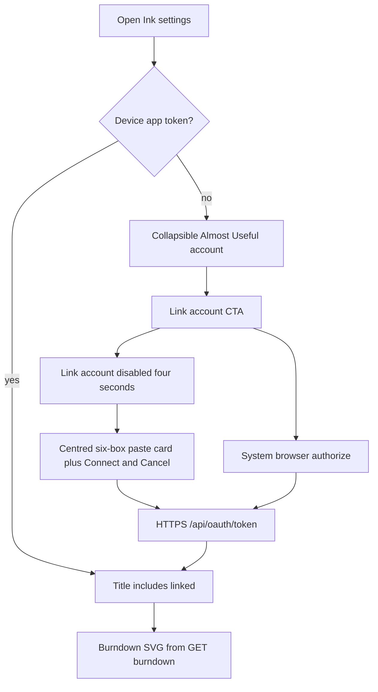

# Almost Useful account (Ink settings)

Settings login for Almost Useful. Passwords stay on the website. Protocol and broker details live in the portal repo (`docs/conceptual/AUTH.md`, `docs/conceptual/CROSS_APP_CLIENT_TRUST.md`) — this page is Ink UX, storage, and credit charts only.

---

## Why it exists

Ink needs a signed-in Almost Useful identity to show Pool A remaining credits and to call portal AI jobs (including handwriting transcription). A public plugin must not collect the website password or embed `/account` (that page is cookie-only). Browser **authorize** plus device-local **app tokens** plus burndown JSON keeps secrets on the portal and still shows the same remaining/spend information as Project Post.

---

## Conceptual understanding

Ink never shows an email/password form. **Link account** opens the system browser to `https://account.almostuseful.xyz/oauth/authorize` with `client_id=ink` and `display_name=Ink` (no `redirect_uri`). After the user signs in on the website (if needed) and taps **Authorise Ink**, the portal stays on `/oauth/authorize/continue` with a copyable one-time **code**. The user pastes that code in the **same Obsidian window** that started Link account (that window holds the PKCE verifier). Ink then `POST`s `/api/oauth/token` over HTTPS and stores a portal **app JWT** (`typ=almostuseful_app`) on this device only. Plan 2 user-JWT blobs without that `tokenType` are discarded so the user must consent again.

Signed-in settings show credit **charts** that match Project Post (allotment-scaled burndown + ideal line, Ink vs other apps spend). There is **no** “Remaining this period: $…” line — remaining is the burndown bars only. Hover or tap a day for **Credits remaining** (% of monthly pool) on burndown, or **% of day’s use** plus **% of monthly credits** on the stack. Styling uses Obsidian CSS variables. Charts are hand-built SVG from burndown JSON — not TanStack, not an iframe of `/account`.

The production portal URL shipped in the plugin is a public client identifier. It is not a company secret. Never add a service role, OpenRouter, Stripe key, or Supabase anon key here.

---

## Flows

---

## Technical details

### Settings UI

Inserted at the top of the plugin settings tab (`almostuseful-account-section.ts`), after the intro paragraph. The block is a **collapsible** `ddc_ink_section-wrapper ddc_ink_almostuseful-account-section` like Getting started. Expand/collapse is in-memory (`isAlmostUsefulAccountSectionExpanded`) so a session refresh does not snap it shut. The collapsible **header** and section **outline** use Obsidian theme accent tokens (`--interactive-accent` background, `--text-on-accent` title and chevron, `--interactive-accent-hover` on hover; inset `box-shadow` on the card) so the block matches CTA buttons and accent links — not Almost Useful portal marketing lime. Link account / Manage / Log out use `ddc_ink_bare-setting` + `ddc_ink_button-set` so controls are **left-aligned** and not nested in a second card.

| State | Header | Content |
|-------|--------|---------|
| Signed out | Almost Useful account | Standard two-column setting: name **Link account**, description **Create and link an Almost Useful account to utilise handwriting transcription.** Control is a larger CTA with an outline head-and-shoulders icon left of the label (`ddc_ink_link_account_user`, registered in `onload` because `ButtonComponent#setIcon` plus CTA text does not paint reliably). No Create account / Forgot password links — those live on the portal login page after the browser opens |
| Opening (first ~4s after Link account) | Almost Useful account | **Same signed-out row**; Link account is **disabled**. Paste UI is not shown yet so the browser can open without a layout jump |
| Pending | Almost Useful account | Centred grey card. Full-width instruction **Confirm in your browser, then paste the code from the website here.** Then six tall rounded character boxes (`XXX-XXX`; hyphen is smaller and not bold). **Cancel pending login** then **Connect** (Connect on the right). Boxes and Cancel use `var(--background-primary)` so they stay darker than the card wash. Link account is hidden so paste is not competing with a second CTA |
| Signed in | Almost Useful account: linked (email when known) | **Manage account** / **Log out** (left-aligned); credit charts (or empty-pool products CTA) |
| 401 | Treated as signed out | Local session cleared |

Obsidian often closes Settings when the app backgrounds for the browser. After pasting the code, reopen Ink settings if it closed.

**Manage account** opens `/account` in the system browser (website cookie; a second website login is expected).

### Charts

`GET /api/me/usage/burndown?tz=` with the device IANA zone and `Authorization: Bearer` **app** token. Remaining series is computed on the portal (net hold/settle/release). Y-max is `max(allotment, remaining, ideal)`; bars are not capped at allotment. Non-zero burndown bars inflate to **2px**; stacked usage segments inflate to **4px**. Future days have no remaining bars. Do **not** print a remaining-dollar sentence above the chart.

**Period subtitle:** `Start of {date} → End of {date}` without weekday in brackets (e.g. `Start of 16 Sept → End of 15 Oct`). X-axis edge ticks keep weekday (`Wed 16 Sep`).

**Usage distribution** stacks **Ink** (`client_id` `ink`) at the base with **Other apps** on top, clipped to one top-rounded silhouette per day. Hidden when there is no spend through today. **Other apps** fill uses a muted wash (`rgba(0, 0, 0, 0.18)`), not solid black.

**Refresh** sits on the same row as the pool title (first pool only). The icon spins during refetch.

Full-height day hit rects (and per-segment hits on the stack) drive vanilla **tippy.js** anchored to the chart’s `ownerDocument` (required when Settings is popped out to another Electron window). Placement to the right of the pointer (`offset: [0, 12]`, flip left). Hover/tap **dims** non-focused bars. On touch, tap again or tap outside to dismiss. Geometry lives in `credit-pool-chart-layout.ts` (same slot math as Project Post). Portal chart contract: portal `docs/conceptual/CREDIT_POOL_USAGE_CHARTS.md`.

Last successful pools are cached in device-local storage (`au_ink_almostuseful_usage_cache`, keyed by `userId`). Reopening settings paints the cache immediately, then refetches. Cache is **not** cleared on Log out so the same user sees charts instantly after signing in again; a different `userId` ignores the blob.

**Handwriting transcription** (writing or drawing editor overflow → Transcribe, plus optional auto on close) calls `POST /api/jobs/handwriting-transcription` with the app token and debits Pool A. Requires the same signed-in session as the charts. See [writing-transcription.md](writing-transcription.md).

This settings UI does **not** call placeholder job routes.

### Protocol and storage

- There is **no** `obsidian://` protocol handler for app-token login. Finish by pasting the continue-page code.
- Desktop opens the authorize URL with Electron `shell.openExternal`; mobile uses `window.open`.
- Session suffix passed to `saveLocally`: `almostuseful_session` → full key `au_ink_almostuseful_session`. Do not double-prefix. Shape: `{ tokenType: 'almostuseful_app', accessToken, refreshToken, expiresAtEpochSeconds, grantId, userId, clientId, displayName, userEmail }`.
- Usage cache suffix: `almostuseful_usage_cache` → `au_ink_almostuseful_usage_cache`.
- In-flight PKCE: `almostuseful_handoff`. **Cancel pending login** clears it.
- Refresh: `POST /api/oauth/token` with `grant_type=refresh_token`. `invalid_grant` / 401 clears storage.
- Log out: `POST /api/oauth/grants/:grantId/revoke` with the app Bearer, then delete the session key. Vault **Reset settings** does not need to wipe `data.json` to sign out.
- Website **Revoke** on Connected apps makes the next burndown call 401 → signed-out UI.

Official job attribution constants (for later job POSTs; not used by this settings UI): `ink` / `Ink`.

Staging host overrides can still exist under suffix `almostuseful_debug` if set in localStorage. Settings no longer expose a Debug portal host form.

---

## Technical Gotchas

- **OAuth must return to authorize.** If Google users land on `/account` and Ink stays signed out, the portal `next` query was dropped — that is a portal bug, not a reason to add a password field in Ink.
- **Tokens never belong in the continue URL as JWTs.** Only a one-time `code` (and `state` in the query). The app exchanges over HTTPS.
- **Paste only works in the window that clicked Link account.** A new Obsidian instance has no verifier. The continue code is six characters (`AB2-CD3`); this window normalises hyphens and case before exchange. Repeated wrong pastes are not locked out because this process already holds the verifier — guessing the short code from outside Obsidian still cannot exchange it.
- **Open source does not reveal the PKCE verifier.** `createAlmostUsefulPkcePair` draws 32 random bytes into device-local `almostuseful_handoff` for that login only, then deletes them after exchange or cancel.
- **Clones can complete the same OOB paste** if the user consents on the portal. Accepted for a public plugin. Do not invent a secret plugin API key.
- **Per-device login:** localStorage does not sync with the vault. Sign in again on another computer.
- **Portal app-token authorize does not use a redirect allow-list.** `obsidian://` is not required on the Supabase Auth redirect list for this grant.
- **Do not iframe `/account` for charts.** Cookie session ≠ plugin app token.
- **Do not add TanStack Charts** to match the portal renderer. Remaining/spend parity is the layout math and burndown JSON, not the chart library. The plugin bundle is already large.
- **2px / 4px min-segment heights are visual only.** Tooltips use true remaining / spend. Vanilla tippy follows the pointer (`offset: [0, 12]`); the tooltip is non-interactive so it cannot steal hover.
- **Popped-out Settings:** tippy `appendTo` and pointer listeners must use `svg.ownerDocument`, not the module `document`, or tooltips mount on the wrong Electron window.
- **Opening vs pending.** `scheduleAlmostUsefulPasteUi` waits 4000ms before `onRerender` to pending. Until then, only disable Link account in place — do not remove the button or change copy.
- **Paste boxes are not a single text field.** Paste (including Cmd+V) strips hyphens and spaces and fills all six cells. The hyphen is display-only. Obsidian’s global settings `input` rules set height and background; the handoff cells override those with a scoped selector and `!important`, or the boxes stay short and the same colour as the card. Cancel uses the same `background-primary` fill so it does not disappear into the card wash.
- **Do not add a remaining-dollar line** above the burndown. Remaining is the chart.
- **Plan 2 sessions are discarded.** Users who signed in with a user JWT must Link account again so they can Authorize Ink.
