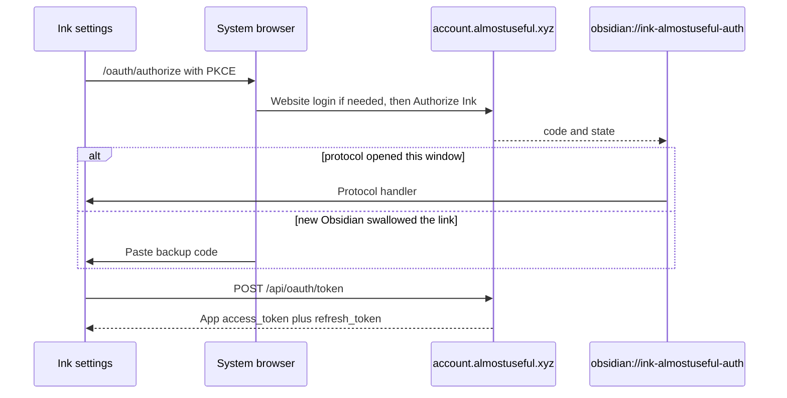
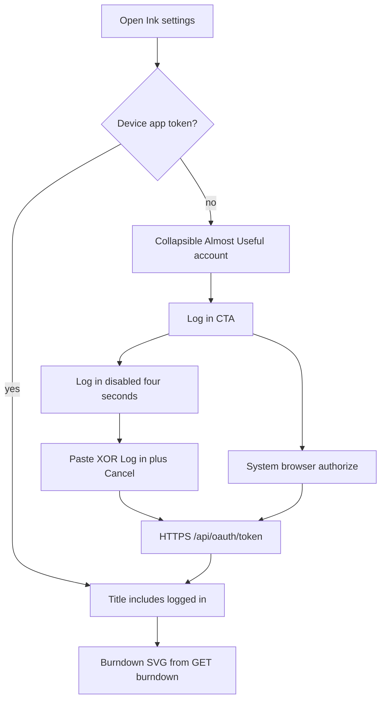

# Almost Useful account (Ink settings)

Settings login for Almost Useful. Passwords stay on the website. Protocol and broker details live in the portal repo (`docs/conceptual/AUTH.md`, `docs/conceptual/CROSS_APP_CLIENT_TRUST.md`) — this page is Ink UX, storage, and credit charts only.

---

## Why it exists

Ink needs a signed-in Almost Useful identity to show Pool A remaining credits and, later, to call portal AI jobs. A public plugin must not collect the website password or embed `/account` (that page is cookie-only). Browser **authorize** plus device-local **app tokens** plus burndown JSON keeps secrets on the portal and still shows the same remaining/spend information as Project Post.

---

## Conceptual understanding

Ink never shows an email/password form. **Log in with Almost Useful** opens the system browser to `https://account.almostuseful.xyz/oauth/authorize` with `client_id=ink` and `display_name=Ink`. After the user signs in on the website (if needed) and taps **Authorize Ink**, the portal returns `obsidian://ink-almostuseful-auth?code=&state=` with a one-time code — **not** tokens. If that deep link opens a **new** Obsidian window, the original window still holds the PKCE verifier; the user pastes the website **backup code** there. Ink then `POST`s `/api/oauth/token` over HTTPS and stores a portal **app JWT** (`typ=almostuseful_app`) on this device only. Plan 2 user-JWT blobs without that `tokenType` are discarded so the user must consent again.

Signed-in settings show credit **charts** that match Project Post (allotment-scaled burndown + ideal line, Ink vs other apps spend). There is **no** “Remaining this period: $…” line — remaining is the burndown bars only. Styling uses Obsidian CSS variables. Charts are hand-built SVG from burndown JSON — not TanStack, not an iframe of `/account`.

The production portal URL shipped in the plugin is a public client identifier. It is not a company secret. Never add a service role, OpenRouter, Stripe key, or Supabase anon key here.

---

## Flows

---

## Technical details

### Settings UI

Inserted at the top of the plugin settings tab (`almostuseful-account-section.ts`), after the intro paragraph. The block is a **collapsible** `ddc_ink_section-wrapper` like Getting started. Expand/collapse is in-memory (`isAlmostUsefulAccountSectionExpanded`) so a session refresh does not snap it shut. Log in / Manage / Log out use `ddc_ink_bare-setting` so they are not nested in a second card.

| State | Header | Content |
|-------|--------|---------|
| Signed out | Almost Useful account | Browser-login copy; **Log in with Almost Useful**; Create account / Forgot password |
| Opening (first ~4s after Log in) | Almost Useful account | **Same signed-out row**; Log in is **disabled**. Paste UI is not shown yet so the browser can open without a layout jump |
| Pending | Almost Useful account | **Confirm in your browser**; **Paste backup code** + Connect (disabled while Connecting…) + **Cancel pending login**. Log in is hidden so paste is not competing with a second CTA |
| Signed in | Almost Useful account: logged in (email when known) | **Manage account** / **Log out**; credit charts (or empty-pool products CTA) with a spinning **refresh-cw** while refetching |
| 401 | Treated as signed out | Local session cleared |

Obsidian often closes Settings when the app backgrounds for the browser. `openInkSettingsTab` reopens the Ink tab after protocol return.

**Manage account** opens `/account` in the system browser (website cookie; a second website login is expected).

### Charts

`GET /api/me/usage/burndown?tz=` with the device IANA zone and `Authorization: Bearer` **app** token. Bars use allotment as y-max. Future days have no remaining bars. Do **not** print a remaining-dollar sentence above the chart. Usage distribution stacks **Ink** (`client_id` `ink`) on top of **Other apps**, hidden when there is no spend through today. Geometry lives in `credit-pool-chart-layout.ts` (same slot math as Project Post). Portal chart contract: portal `docs/conceptual/CREDIT_POOL_USAGE_CHARTS.md`.

Last successful pools are cached in device-local storage (`au_ink_almostuseful_usage_cache`, keyed by `userId`). Reopening settings paints the cache immediately, then refetches. A `refresh-cw` icon in the usage toolbar spins during that fetch (and on tap). Cache is **not** cleared on Log out so the same user sees charts instantly after signing in again; a different `userId` ignores the blob.

**Handwriting transcription** (writing editor overflow → Transcribe) calls `POST /api/jobs/handwriting-transcription` with the app token and debits Pool A. Requires the same signed-in session as the charts. See [writing-transcription.md](writing-transcription.md).

This settings UI does **not** call placeholder job routes.

### Protocol and storage

- Handler: `registerObsidianProtocolHandler('ink-almostuseful-auth', …)` in `src/main.ts`.
- Desktop opens the authorize URL with Electron `shell.openExternal`; mobile uses `window.open`.
- Session suffix passed to `saveLocally`: `almostuseful_session` → full key `au_ink_almostuseful_session`. Do not double-prefix. Shape: `{ tokenType: 'almostuseful_app', accessToken, refreshToken, expiresAtEpochSeconds, grantId, userId, clientId, displayName, userEmail }`.
- Usage cache suffix: `almostuseful_usage_cache` → `au_ink_almostuseful_usage_cache`.
- In-flight PKCE: `almostuseful_handoff`. **Cancel pending login** clears it.
- Refresh: `POST /api/oauth/token` with `grant_type=refresh_token`. `invalid_grant` / 401 clears storage.
- Log out: `POST /api/oauth/grants/:grantId/revoke` with the app Bearer, then delete the session key. Vault **Reset settings** does not need to wipe `data.json` to sign out.
- Website **Revoke** on Connected apps makes the next burndown call 401 → signed-out UI.

Official job attribution constants (for later job POSTs; not used by this settings UI): `ink` / `Ink`.

Staging host overrides can still exist under suffix `almostuseful_debug` if set in localStorage. Settings no longer expose a Debug portal host form.

---

## Technical Gotchas

- **OAuth must return to authorize.** If Google users land on `/account` and Ink stays signed out, the portal `next` query was dropped — that is a portal bug, not a reason to add a password field in Ink.
- **Tokens never belong in `obsidian://` URLs.** Only `code` and `state`.
- **Paste only works in the window that clicked Log in.** A new Obsidian instance has no verifier.
- **Clones can reuse the same protocol action.** Accepted for a public plugin. Do not invent a secret plugin API key.
- **Per-device login:** localStorage does not sync with the vault. Sign in again on another computer.
- **Portal authorize allow-list** includes `obsidian://ink-almostuseful-auth`. That URI does not need to be on the Supabase Auth redirect list.
- **Do not iframe `/account` for charts.** Cookie session ≠ plugin app token.
- **Do not add TanStack Charts** to match the portal renderer. Remaining/spend parity is the layout math and burndown JSON, not the chart library. The plugin bundle is already large.
- **Opening vs pending.** `scheduleAlmostUsefulPasteUi` waits 4000ms before `onRerender` to pending. Until then, only disable Log in in place — do not remove the button or change copy.
- **Do not add a remaining-dollar line** above the burndown. Remaining is the chart.
- **Plan 2 sessions are discarded.** Users who signed in with a user JWT must Log in again so they can Authorize Ink.
