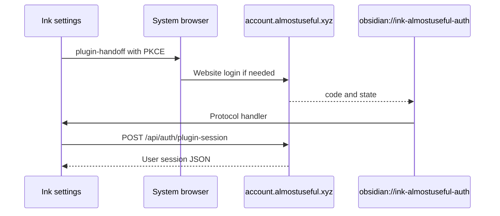

# Almost Useful account (Ink settings)

Settings login for Almost Useful. Passwords stay on the website. Protocol and broker details live in the portal repo (`docs/conceptual/AUTH.md`, `docs/conceptual/CROSS_APP_CLIENT_TRUST.md`) — this page is Ink UX and storage only.

---

## Conceptual understanding

Ink never shows an email/password form. **Log in with Almost Useful** opens the system browser to `https://account.almostuseful.xyz/auth/plugin-handoff`. The user signs in on that origin (email or Google / Apple / GitHub). **Continue to Ink** returns `obsidian://ink-almostuseful-auth?code=&state=` with a one-time code — **not** tokens. Ink then `POST`s the portal session exchange over HTTPS and stores a **Supabase user JWT** on this device only.

The portal URL and Supabase **anon** key shipped in the plugin are public client identifiers. They are not company secrets. Never add a service role, OpenRouter, or Stripe key here.

---

## Technical details

### Settings UI

Inserted at the top of the plugin settings tab (`almostuseful-account-section.ts`), after the intro paragraph.

| State | What you see |
|-------|----------------|
| Signed out | Copy that login happens in the browser; **Log in with Almost Useful**; Create account / Forgot password links |
| Pending | “Finish sign-in in your browser…” |
| Signed in | Name / email; **Manage account**; **Log out**; remaining credits; simplified burndown SVG + app names from burndown JSON |
| 401 | Local session cleared; treated as signed out |

Charts are SVG from `GET /api/me/usage/burndown?tz=`. They are **not** an iframe of `/account`. This UI does **not** call placeholder job routes.

### Protocol and storage

- Handler: `registerObsidianProtocolHandler('ink-almostuseful-auth', …)` in `src/main.ts`.
- Desktop opens the handoff URL with Electron `shell.openExternal`; mobile uses `window.open`.
- Session suffix passed to `saveLocally`: `almostuseful_session` → full key `au_ink_almostuseful_session`. Do not double-prefix.
- Log out deletes that key. Vault **Reset settings** does not need to wipe `data.json` to sign out.
- Refresh uses `@supabase/supabase-js` with the **anon** key, `persistSession: false`, and `setSession` so tokens do not land in the default supabase-js storage key.

Official job attribution constants (for later job POSTs; not used by this settings UI): `ink` / `Ink`.

Optional **Debug portal host** in settings stores a staging origin plus matching public Supabase URL and anon key under suffix `almostuseful_debug`. Never paste a service role key.

---

## Technical Gotchas

- **OAuth must return to plugin-handoff.** If Google users land on `/account` and Ink stays signed out, the portal `next` query was dropped — that is a portal bug, not a reason to add a password field in Ink.
- **Tokens never belong in `obsidian://` URLs.** Only `code` and `state`.
- **Clones can reuse the same protocol action.** Accepted for a public plugin. Do not invent a secret plugin API key.
- **Per-device login:** localStorage does not sync with the vault. Sign in again on another computer.
- **Portal-minted codes** do not need `obsidian://ink-almostuseful-auth` on the Supabase Auth redirect allow-list (that list is for native Supabase PKCE, which this flow does not use).
