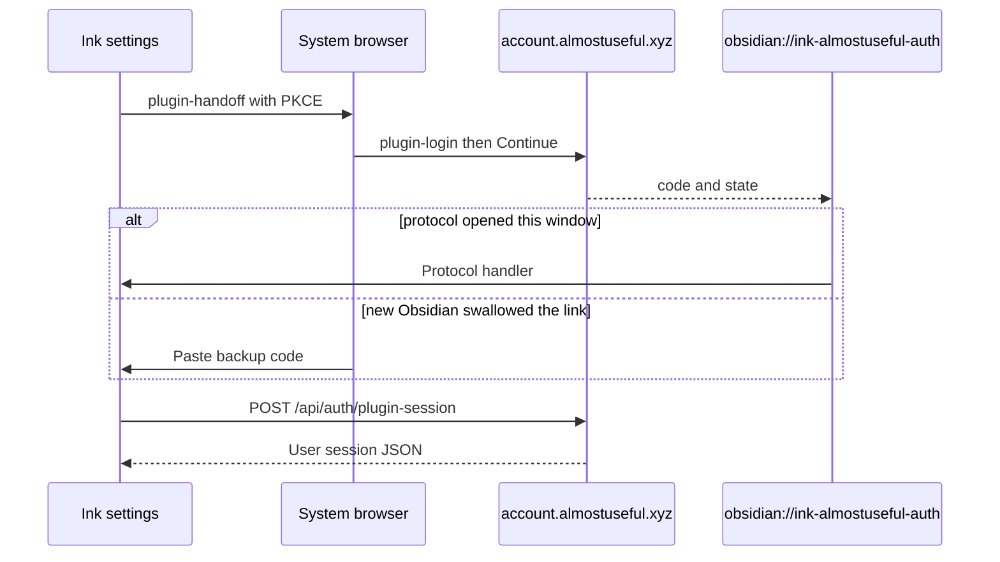
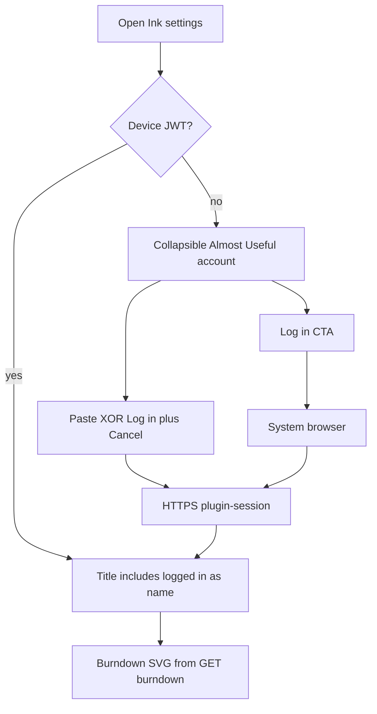

# Almost Useful account (Ink settings)

Settings login for Almost Useful. Passwords stay on the website. Protocol and broker details live in the portal repo (`docs/conceptual/AUTH.md`, `docs/conceptual/CROSS_APP_CLIENT_TRUST.md`) — this page is Ink UX, storage, and credit charts only.

---

## Why it exists

Ink needs a signed-in Almost Useful identity to show Pool A remaining credits and, later, to call portal AI jobs. A public plugin must not collect the website password or embed `/account` (that page is cookie-only). Browser login plus device-local JWT plus burndown JSON keeps secrets on the portal and still shows the same remaining/spend information as Project Post.

---

## Conceptual understanding

Ink never shows an email/password form. **Log in with Almost Useful** opens the system browser to `https://account.almostuseful.xyz/auth/plugin-handoff`. The user signs in on a **login-only** portal page (`/auth/plugin-login`). **Continue to Ink** returns `obsidian://ink-almostuseful-auth?code=&state=` with a one-time code — **not** tokens. If that deep link opens a **new** Obsidian window, the original window still holds the PKCE verifier; the user pastes the website **backup code** there. Ink then `POST`s the portal session exchange over HTTPS and stores a **Supabase user JWT** on this device only.

Signed-in settings show credit **information** that matches Project Post (remaining through today, allotment-scaled burndown + ideal line, Ink vs other apps spend). Styling uses Obsidian CSS variables. Charts are hand-built SVG from burndown JSON — not TanStack, not an iframe of `/account`.

The portal URL and Supabase **anon** key shipped in the plugin are public client identifiers. They are not company secrets. Never add a service role, OpenRouter, or Stripe key here.

---

## Flows

---

## Technical details

### Settings UI

Inserted at the top of the plugin settings tab (`almostuseful-account-section.ts`), after the intro paragraph. The block is a **collapsible** `ddc_ink_section-wrapper` like Getting started. Expand/collapse is in-memory (`isAlmostUsefulAccountSectionExpanded`) so a session refresh does not snap it shut. Log in / Manage / Log out use `ddc_ink_bare-setting` so they are not nested in a second card.

| State | Header | Content |
|-------|--------|---------|
| Signed out | Almost Useful account | Browser-login copy; **Log in with Almost Useful**; Create account / Forgot password |
| Pending | Almost Useful account | Finish-in-browser copy; **Paste backup code** + Connect (disabled while Connecting…) + **Cancel pending login**. Log in is hidden so paste is not competing with a second CTA |
| Signed in | Almost Useful account: logged in as `{displayName or email}` | **Manage account** / **Log out**; credit charts (or empty-pool products CTA) |
| 401 | Treated as signed out | Local session cleared |

Obsidian often closes Settings when the app backgrounds for the browser. `openInkSettingsTab` reopens the Ink tab after protocol return.

### Charts

`GET /api/me/usage/burndown?tz=` with the device IANA zone. Remaining is the last **through-today** point, formatted as `$X.XX` (not the raw usage-API numeric string). Bars use allotment as y-max. Future days have no remaining bars. Usage distribution stacks **Ink** (`client_id` `ink`) on top of **Other apps**, hidden when there is no spend through today. Geometry lives in `credit-pool-chart-layout.ts` (same slot math as Project Post). Portal chart contract: portal `docs/conceptual/CREDIT_POOL_USAGE_CHARTS.md`.

This UI does **not** call placeholder job routes.

### Protocol and storage

- Handler: `registerObsidianProtocolHandler('ink-almostuseful-auth', …)` in `src/main.ts`.
- Desktop opens the handoff URL with Electron `shell.openExternal`; mobile uses `window.open`.
- Session suffix passed to `saveLocally`: `almostuseful_session` → full key `au_ink_almostuseful_session`. Do not double-prefix.
- In-flight PKCE: `almostuseful_handoff`. **Cancel pending login** clears it.
- Log out deletes the session key. Vault **Reset settings** does not need to wipe `data.json` to sign out.
- Refresh uses `@supabase/supabase-js` with the **anon** key, `persistSession: false`, and `setSession` so tokens do not land in the default supabase-js storage key.

Official job attribution constants (for later job POSTs; not used by this settings UI): `ink` / `Ink`.

Staging host overrides can still exist under suffix `almostuseful_debug` if set in localStorage. Settings no longer expose a Debug portal host form.

---

## Technical Gotchas

- **OAuth must return to plugin-handoff.** If Google users land on `/account` and Ink stays signed out, the portal `next` query was dropped — that is a portal bug, not a reason to add a password field in Ink.
- **Tokens never belong in `obsidian://` URLs.** Only `code` and `state`.
- **Paste only works in the window that clicked Log in.** A new Obsidian instance has no verifier.
- **Clones can reuse the same protocol action.** Accepted for a public plugin. Do not invent a secret plugin API key.
- **Per-device login:** localStorage does not sync with the vault. Sign in again on another computer.
- **Portal-minted codes** do not need `obsidian://ink-almostuseful-auth` on the Supabase Auth redirect allow-list (that list is for native Supabase PKCE, which this flow does not use).
- **Do not iframe `/account` for charts.** Cookie session ≠ plugin JWT.
- **Do not add TanStack Charts** to match the portal renderer. Remaining/spend parity is the layout math and burndown JSON, not the chart library. The plugin bundle is already large.
