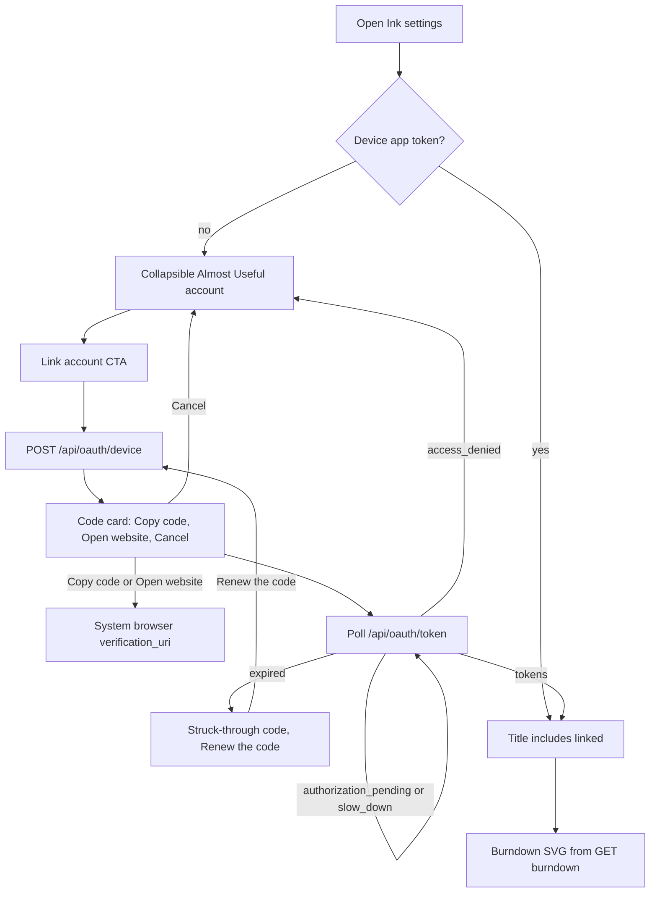

# Almost Useful account (Ink settings)

Settings login for Almost Useful. Passwords stay on the website. Protocol and broker details live in the portal repo (`docs/conceptual/AUTH.md`, `docs/conceptual/CROSS_APP_CLIENT_TRUST.md`) — this page is Ink UX, storage, and credit charts only.

---

## Why it exists

Ink needs a signed-in Almost Useful identity to show Pool A remaining credits and to call portal AI jobs (including handwriting transcription). A public plugin must not collect the website password or embed `/account` (that page is cookie-only). A browser **device-code** sign-in plus device-local **app tokens** plus burndown JSON keeps secrets on the portal and still shows the same remaining/spend information as Project Post.

---

## Conceptual understanding

Ink never shows an email/password form. Sign-in uses the OAuth **device-code grant**: the **app shows the code** and the user types it on the website — never the other way round.

1. **Link account** `POST`s `https://account.almostuseful.xyz/api/oauth/device` with `client_id=ink`, `display_name=Ink`, a per-install `device_id`, and a short `device_label` such as `Mac` (unauthenticated, no Bearer). The id is minted once with `crypto.getRandomValues` and stored in device-local storage (`almostuseful_device`). It is not a constant in source. The portal returns a `device_code`, a short `user_code` (`XXXX-XXXX`), `verification_uri`, `expires_in` and a poll `interval`.
2. Ink stores the device code on this device and shows the user code in a card. **Link account** does not open the browser.
3. **Copy code** copies the code and then opens `verification_uri`. **Open website** opens that same URI. On the website the user signs in (if needed), enters the code on `/oauth/device`, and approves Ink. The website has **no copy button** and no code to bring back to Ink.
4. Ink waits **10 seconds** before the first poll, because the website cannot have approved the code yet. It then polls `POST /api/oauth/token` with `grant_type=urn:ietf:params:oauth:grant-type:device_code` every `interval` seconds (portal default **3**) and only while Obsidian is in front. Leaving the app stops the timer. Coming back polls immediately, then on that interval again. Once approved, the response carries a portal **app JWT** (`typ=almostuseful_app`) plus refresh token, stored on this device only.

A code lasts **2 minutes** (portal `expires_in`). When it expires, Ink stops polling and leaves that code on screen, struck through. **Copy code** and **Open website** hide. **Renew the code** (on the same line as **Code expired**) requests a fresh code. Ink does not mint a replacement by itself. Plan 2 user-JWT blobs without the app `tokenType` are discarded so the user must consent again.

```mermaid
sequenceDiagram
  participant Settings as Ink settings
  participant Browser as System browser
  participant Portal as account.almostuseful.xyz
  Settings->>Portal: POST /api/oauth/device (client_id, display_name, device_id, device_label)
  Portal-->>Settings: device_code, user_code, verification_uri, expires_in, interval
  Note over Settings: show user_code; browser stays closed
  Settings->>Browser: Copy code or Open website opens verification_uri
  Browser->>Portal: Website login if needed, enter code, approve Ink
  Note over Settings: wait 10s, then poll only while Ink is in front
  loop Every interval while in front, until the code expires
    Settings->>Portal: POST /api/oauth/token (device_code grant)
    Portal-->>Settings: authorization_pending / slow_down / expired_token
  end
  Portal-->>Settings: App access_token plus refresh_token
```

Signed-in settings show credit **charts** that match Project Post (allotment-scaled burndown + ideal line, Ink vs other apps spend). There is **no** “Remaining this period: $…” line — remaining is the burndown bars only. Hover or tap a day for **Credits remaining** (% of monthly pool) on burndown, or **% of day’s use** plus **% of monthly credits** on the stack. Styling uses Obsidian CSS variables. Charts are hand-built SVG from burndown JSON — not TanStack, not an iframe of `/account`.

The production portal URL shipped in the plugin is a public client identifier. It is not a company secret. Never add a service role, OpenRouter, Stripe key, or Supabase anon key here.

---

## Flows

```mermaid
flowchart TD
  OpenSettings[Open Ink settings]
  OpenSettings --> SignedIn{Device app token?}
  SignedIn -->|no| LoggedOut[Collapsible Almost Useful account]
  LoggedOut --> Idle[Link account CTA]
  Idle --> DeviceCode[POST /api/oauth/device]
  DeviceCode --> Pending[Code card: Copy code, Open website, Cancel]
  Pending -->|Copy code or Open website| BrowserLogin[System browser verification_uri]
  Pending --> Poll[Poll /api/oauth/token]
  Poll -->|authorization_pending or slow_down| Poll
  Poll -->|expired| Expired[Struck-through code, Renew the code]
  Expired -->|Renew the code| DeviceCode
  Poll -->|access_denied| LoggedOut
  Pending -->|Cancel| LoggedOut
  SignedIn -->|yes| Header[Title includes linked]
  Header --> Charts[Burndown SVG from GET burndown]
  Poll -->|tokens| Header
```

---

## Technical details

### Settings UI

Inserted at the top of the plugin settings tab (`almostuseful-account-section.ts`), after the intro paragraph. The block is a **collapsible** `ddc_ink_section-wrapper ddc_ink_almostuseful-account-section` like Getting started. Expand/collapse is in-memory (`isAlmostUsefulAccountSectionExpanded`) so a session refresh does not snap it shut. The collapsible **header** and section **outline** use Obsidian theme accent tokens (`--interactive-accent` background, `--text-on-accent` title and chevron, `--interactive-accent-hover` on hover; inset `box-shadow` on the card) so the block matches CTA buttons and accent links — not Almost Useful portal marketing lime. Link account / Manage / Log out use `ddc_ink_bare-setting` + `ddc_ink_button-set` so controls are **left-aligned** and not nested in a second card.

| State | Header | Content |
|-------|--------|---------|
| Signed out | Almost Useful account | Standard two-column setting: name **Link account**, description explains handwriting transcription and that Almost Useful is Dale de Silva’s accounts portal for Ink. Control is a larger CTA with an outline head-and-shoulders icon left of the label (`ddc_ink_link_account_user`, registered in `onload` because `ButtonComponent#setIcon` plus CTA text does not paint reliably). No Create account / Forgot password links — those live on the portal once the user opens the website. Below that (signed out and signed in): **Processing your data** — info-only row describing HTTPS → Almost Useful → OpenRouter → Gemini and that SVG/transcript are not stored on portal servers after processing |
| Requesting code | Almost Useful account | **Same signed-out row**. The label becomes **Getting code…**. The button is disabled and non-interactive (`pointer-events: none`, muted fill) so the pointer does not change. If the portal does not answer within 20 seconds, or the request fails, the label returns to **Link account** and a notice appears |
| Pending | Almost Useful account | Centred card: instruction **Enter this code on the Almost Useful website to authorise Ink.**, the user code in a box that hugs the text (`XXXX-XXXX`, display-only, not an input), then **Copy code** under it with a small gap. **Code expires in m:ss** sits close under Copy code. While the code is valid, the next lines are **Waiting for your authorisation on the website.** and **This screen will update automatically a few seconds after that's given.** A larger gap sits before **Open website** and **Cancel** on one row. **Copy code** writes the code (hyphen included) and then opens `verification_uri`; the label shows **Copied** for 1.5s. There is **no** **I've approved it** and **no paste field**. When the code expires it turns red with a strikethrough, **Copy code**, **Open website**, and the waiting lines hide, and **Code expired** shares a line with **Renew the code**. **Cancel** stays |
| Signed in | Almost Useful account: linked (email when known) | **Manage account** / **Log out** (left-aligned); **AI Credit Pool** settings card (burndown + usage distribution, or empty-pool products CTA); **Transcription Queue** card when the device-local queue is non-empty |
| Signed out | — | **Transcription Queue** card hidden — unsigned devices do not enqueue jobs |
| 401 | Treated as signed out | Local session cleared |

Obsidian often closes Settings when the app backgrounds for the browser. The device code survives in device-local storage, so reopening Ink settings shows the same card and starts the 10-second wait again. If sign-in finished while Settings was closed, that next poll completes it. While Settings stays open, leaving Obsidian cancels the timer, and bringing it back polls immediately.

**Manage account** opens `/account` in the system browser (website cookie; a second website login is expected).

### Charts

`GET /api/me/usage/burndown?tz=` with the device IANA zone and `Authorization: Bearer` **app** token. Remaining series is computed on the portal (net hold/settle/release). Y-max is `max(allotment, remaining, ideal)`; bars are not capped at allotment. Non-zero burndown bars inflate to **2px**; stacked usage segments inflate to **4px**. Future days have no remaining bars. Do **not** print a remaining-dollar sentence above the chart.

**Period subtitle:** `Start of {date} → End of {date}` without weekday in brackets (e.g. `Start of 16 Sept → End of 15 Oct`). X-axis edge ticks keep weekday (`Wed 16 Sep`).

**Usage distribution** stacks **Ink** (`client_id` `ink`) at the base with **Other apps** on top, clipped to one top-rounded silhouette per day. Hidden when there is no spend through today. **Other apps** fill uses a muted wash (`rgba(0, 0, 0, 0.18)`), not solid black. The app-token burndown already collapses every other `client_id` into one `other-apps` point, so the chart does not learn the names of the user’s other products.

**Refresh** sits on the same row as the pool title (first pool only). The icon spins during refetch.

Full-height day hit rects (and per-segment hits on the stack) drive vanilla **tippy.js** anchored to the chart’s `ownerDocument` (required when Settings is popped out to another Electron window). Placement to the right of the pointer (`offset: [0, 12]`, flip left). Hover/tap **dims** non-focused bars. On touch, tap again or tap outside to dismiss. Geometry lives in `credit-pool-chart-layout.ts` (same slot math as Project Post). Portal chart contract: portal `docs/conceptual/CREDIT_POOL_USAGE_CHARTS.md`.

Last successful pools are cached in device-local storage (`au_ink_almostuseful_usage_cache`, keyed by `userId`). Reopening settings paints the cache immediately, then refetches. Cache is **not** cleared on Log out so the same user sees charts instantly after signing in again; a different `userId` ignores the blob.

**Handwriting transcription** (writing or drawing editor overflow → Transcribe, plus optional auto on close) calls `POST /api/jobs/handwriting-transcription` with the app token and debits Pool A. Requires the same signed-in session as the charts. Unsigned devices do not add jobs to the queue; manual **Transcribe** shows a notice instead. See [writing-transcription.md](writing-transcription.md).

After **20 saved ink closes** without a linked account, Ink may show a one-time notice ([`auto-transcribe-account-notice.ts`](../src/components/dom-components/auto-transcribe-account-notice.ts)) explaining auto-transcription and offering **Open Ink settings** or **Dismiss** (device-local; never shown again after either action, or after linking).

### Settings cards

Signed-in content below the action row uses nested **settings cards** (`ddc_ink_almostuseful-settings-card`): `background-color: var(--setting-items-background)`, `border-radius: var(--radius-l)`, and the same inset padding as other Ink collapsible sections. Cards are stacked with `0.65em` gap — matching spacing between setting rows in Writing / Drawing.

| Card | Visibility | Contents |
|------|------------|----------|
| **AI Credit Pool** | Signed in only | Pool title row + refresh; period subtitle; burndown SVG; **Usage distribution** subtitle + stacked spend SVG; Ink / Other apps legend at `font-ui-small` muted size |
| **Transcription Queue** | When `readHandwritingTranscriptionQueueSnapshot()` is non-empty | Title row with **Clear** (no confirmation); file rows in run order with basename label, full path on hover, spinner on the in-flight job, per-row **×** remove |

**Clear** and per-row **×** call `clearHandwritingTranscriptionQueue` / `removeHandwritingTranscriptionFromQueue`. Waiting jobs are deleted from `pending`; an in-flight POST is not aborted but its result is discarded when it returns. The card is removed from the DOM when the queue empties (no empty-state copy). Live updates use `subscribeHandwritingTranscriptionQueueChanged` while settings stay open.

The Manage / Log out row uses `ddc_ink_almostuseful-account-actions` so Obsidian’s empty `setting-item-info` row (forced full-width by `ddc_ink_button-set`) does not add extra top padding above the buttons.

This settings UI does **not** call placeholder job routes.

### Protocol and storage

- There is **no** `obsidian://` protocol handler and no paste step for app-token login. Sign-in finishes when the token poll returns tokens.
- Desktop opens `verification_uri` with Electron `shell.openExternal`; mobile uses `window.open`. The portal does not send `verification_uri_complete`, so the code is never put in the URL.
- Session suffix passed to `saveLocally`: `almostuseful_session` → full key `au_ink_almostuseful_session`. Do not double-prefix. Shape: `{ tokenType: 'almostuseful_app', accessToken, refreshToken, expiresAtEpochSeconds, grantId, userId, clientId, displayName, userEmail }`.
- Device id suffix: `almostuseful_device`. Created once and reused on later Link account calls so a second vault stays signed in. Re-login on this install replaces only this grant. Jobs and charts require the app token; a Supabase user JWT is rejected.
- Usage cache suffix: `almostuseful_usage_cache` → `au_ink_almostuseful_usage_cache`.
- In-flight device code: `almostuseful_handoff` (`deviceCode`, `userCode`, `expiresAt` epoch ms, `intervalSeconds`, `verificationUri`). Replaced when a fresh code is requested; cleared on success, `access_denied`, or **Cancel**. Older PKCE-shaped handoffs read as absent, so the user just sees Link account again.
- Token poll (`startAlmostUsefulDevicePolling`): runs only while the code card is on screen (stopped on section re-render and in the settings tab `hide()`). The first poll waits 10 seconds (`INITIAL_FOREGROUND_POLL_DELAY_MS`). Later polls use `intervalSeconds` from the portal (fallback 3 if the response omits `interval`). Window `blur` or a hidden document clears the timer. `focus` or becoming visible polls once immediately, then the interval starts again. A focus event while Ink never left does not skip the 10-second wait. `authorization_pending` keeps waiting; `slow_down` adds 5 seconds to the interval for the rest of that code; `expired_token` or a passed `expiresAt` stops the poller, including on a later return to the front, and leaves the stored code for **Renew the code**; `access_denied` clears the handoff; success persists tokens via `persistAlmostUsefulTokenResponse`, clears the handoff, and starts session refresh.
- Refresh: `POST /api/oauth/token` with `grant_type=refresh_token`. `invalid_grant` / 401 clears storage.
- Log out: `POST /api/oauth/grants/:grantId/revoke` with the app Bearer, then delete the session key. Vault **Reset settings** does not need to wipe `data.json` to sign out.
- Website **Revoke** on Connected apps makes the next burndown call 401 → signed-out UI.

Official job attribution constants (for later job POSTs; not used by this settings UI): `ink` / `Ink`.

Staging host overrides can still exist under suffix `almostuseful_debug` if set in localStorage. Settings no longer expose a Debug portal host form.

---

## Technical Gotchas

- **OAuth must return to the device page.** If Google users land on `/account` instead of back on `/oauth/device`, the portal `next` query was dropped — that is a portal bug, not a reason to add a password field in Ink.
- **The code goes app → website only.** Do not add a paste field in Ink or expect a copy button on the website. The user reads or copies the code from Ink and types it on `/oauth/device`.
- **Never replace an expired code automatically.** The struck-through code stays until **Renew the code**. The old `device_code` is abandoned only then.
- **Only the window holding the device code can finish.** The `device_code` is device-local; the user code alone cannot claim tokens. A different Obsidian install shows Link account.
- **Clones can complete the same device sign-in** if the user approves them on the portal. Accepted for a public plugin. Do not invent a secret plugin API key.
- **Per-device login:** localStorage does not sync with the vault. Sign in again on another computer.
- **Portal app-token authorize does not use a redirect allow-list.** `obsidian://` is not required on the Supabase Auth redirect list for this grant.
- **Do not iframe `/account` for charts.** Cookie session ≠ plugin app token.
- **Do not add TanStack Charts** to match the portal renderer. Remaining/spend parity is the layout math and burndown JSON, not the chart library. The plugin bundle is already large.
- **2px / 4px min-segment heights are visual only.** Tooltips use true remaining / spend. Vanilla tippy follows the pointer (`offset: [0, 12]`); the tooltip is non-interactive so it cannot steal hover.
- **Popped-out Settings:** tippy `appendTo` and pointer listeners must use `svg.ownerDocument`, not the module `document`, or tooltips mount on the wrong Electron window.
- **Link account does not open the browser.** **Copy code** (after a successful clipboard write) and **Open website** open the stored `verificationUri` through `openAlmostUsefulBrowserUrl`.
- **Do not poll faster than the stored interval.** The portal answers `slow_down` and Ink adds 5 seconds for the rest of that code. A return from the background is one immediate poll, then the interval. Polling on every click inside Settings would trip that cap.
- **Do not add a remaining-dollar line** above the burndown. Remaining is the chart.
- **Plan 2 sessions are discarded.** Users who signed in with a user JWT must Link account again so they can Authorize Ink.
