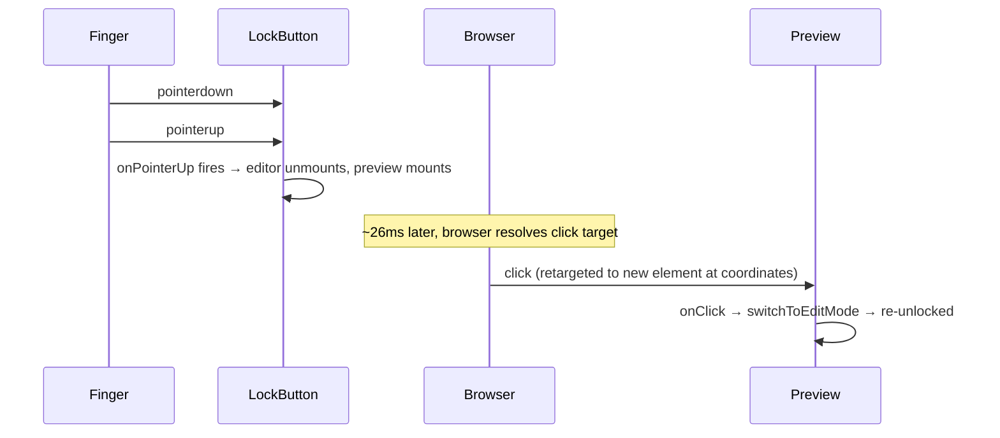
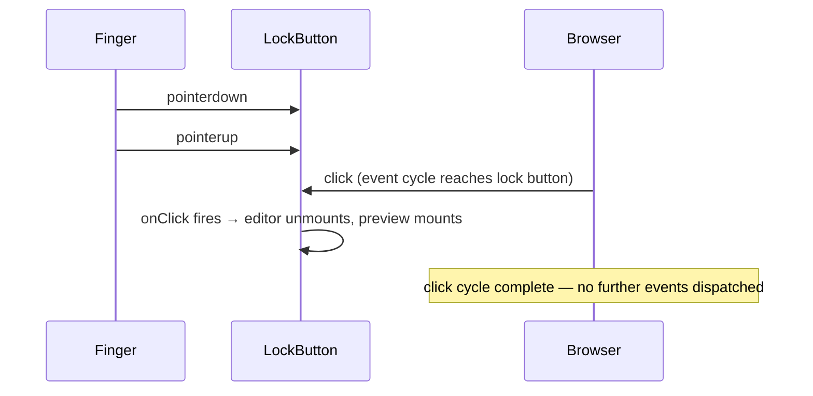

# Android WebView Synthetic Click Retargeting

## Why it exists

Android Chromium (the WebView used in Obsidian on Boox) retargets synthetic `click` events to whatever DOM element is at the tap coordinates at the moment the click fires — not the element that received `pointerdown`. This is different from Safari (iPad) and desktop Electron, which keep the click bound to the original target.

This caused a bug where tapping the lock button while the sticky menu bar was scrolled over the embed body caused the embed to lock and immediately re-unlock itself.

---

## Conceptual understanding

A finger tap generates a sequence of three distinct browser events:

```
pointerdown  →  pointerup  →  click
```

These fire in order. Between `pointerup` and `click` there is a short delay (~20–30 ms on Android) during which the browser resolves the final tap target.

On **Android Chromium**, if the DOM changes between `pointerup` and `click` — for example, because a `pointerup` handler unmounts an editor and mounts a preview in its place — the browser resolves the `click` target based on **which element is at those coordinates right now**, not which element was there at `pointerdown`. This is called synthetic click retargeting.

On **iPad Safari** and **desktop Electron**, the `click` stays bound to the original target even if the DOM changes beneath it, or is suppressed when the target is removed.

---

## The specific bug

The `PrimaryMenuBar` uses a CSS `transform: translate(0, -100%)` to stay visible when the user scrolls down inside an embed. This means the lock button can physically overlap the embed body (the preview surface) when the user has scrolled far enough.

When the user tapped the lock button in this state:

1. `pointerdown` on lock button
2. `pointerup` on lock button → handler ran → editor unmounted → preview mounted at the same position
3. Browser resolved `click` target → preview div was now at the tap coordinates → `onClick` fired on preview → `switchToEditMode()` ran → embed re-unlocked itself

A long hold suppressed the synthetic `click` (Android treats long press as a non-click gesture), which is why hold-then-release worked while a quick tap failed.

### Timing evidence from logs

```
Bug case (fast tap):
  T+0ms   lock-button pointerUp
  T+1ms   saveAndSwitchToPreviewMode  ← editor unmounted, preview mounted
  T+26ms  preview onClick             ← stray retargeted click (smoking gun)
  T+27ms  switchToEditMode            ← embed re-enters edit mode

Working case (hold-then-release):
  T+0ms   lock-button pointerUp
  T+1ms   saveAndSwitchToPreviewMode
           [no preview onClick — long press suppressed synthetic click]
```

---

## The fix

Move the lock button handler from `onPointerDown`/`onPointerUp` to `onClick`.

When the handler is on `onClick`, the browser fires `click` on the button, the handler runs, and the DOM changes. The event dispatch cycle for that `click` is already **complete** — the browser will not fire another `click` event. There is nothing left in the sequence to retarget.

**Files changed:**
- [extended-drawing-menu.tsx](../src/components/jsx-components/extended-drawing-menu/extended-drawing-menu.tsx)
- [extended-writing-menu.tsx](../src/components/jsx-components/extended-writing-menu/extended-writing-menu.tsx)

```tsx
// Before (vulnerable on Android WebView)
<button onPointerDown={() => props.onLockClick?.()}>

// After (safe on all platforms)
<button onClick={() => props.onLockClick?.()}>
```

---

## Platform differences

| Platform | Behaviour when DOM changes between pointerup and click |
|---|---|
| Android Chromium (Boox WebView) | `click` is retargeted to element at coordinates at time of dispatch |
| iPad Safari | `click` stays with original target or is suppressed if target was removed |
| Desktop Electron (macOS/Windows) | `click` stays with original target |
| Android long-press (any) | Synthetic `click` is suppressed entirely — treated as a non-click gesture |

---

## Flows

### Fast tap — bug case (before fix)



### Fast tap — fixed case (onClick)



---

## Is the FingerBlocker involved?

**No.** The `FingerBlocker` component (`finger-blocker.tsx`) only intercepts events where `pointerType === 'pen'` or `pointerType === 'mouse'`. It explicitly allows `touch` events through with `touch-action: pan-x pan-y`. The lock button tap arrives as `pointerType === 'touch'`, so the FingerBlocker plays no part in this bug — it never sees the event.

---

## Technical Gotchas

**Use `onClick` for buttons that cause DOM changes exposing new click targets.** If a button's handler unmounts a component and mounts something else at the same screen position, always handle the action on `onClick`, not `onPointerDown` or `onPointerUp`. On Android Chromium, `onPointerDown` and `onPointerUp` both fire before `click`, leaving the browser free to retarget the remaining `click` event to whatever element is now at those coordinates.

**Long-press masking.** The Android long-press suppression of `click` meant that hold-then-release appeared to work correctly with the broken `onPointerUp` handler. This masked the bug in casual testing — only quick taps exposed it.

**This is not a CSS pointer-events problem.** The preview surface has `pointerEvents: 'all'`, which is correct and intentional (it needs to be tappable). The fix is at the event handler level, not in CSS.
