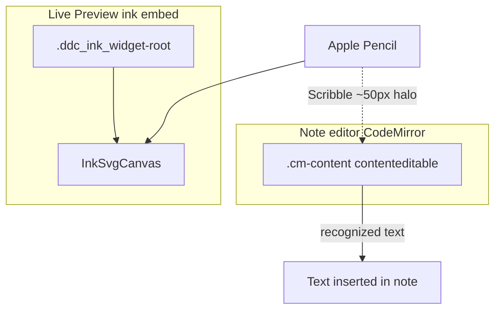
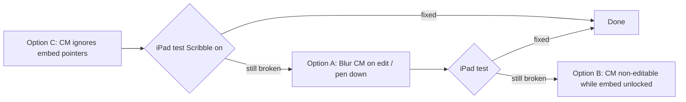

# Apple Pencil Scribble (iPadOS)

## Why this exists

On iPad with **Settings → Apple Pencil → Scribble** enabled, pen strokes in **Live Preview ink embeds** can be interpreted as handwriting and inserted as **markdown text in the note** instead of ink on the canvas. The same ink file in **dedicated (full-screen) view** usually works fine.

Scribble is an iOS system feature. It targets editable text surfaces — especially CodeMirror’s `.cm-content` (`contenteditable`) in the note editor. Embed widgets sit inside that editor, so pen input can be captured for text conversion even when the user is drawing on the ink surface.

User-facing guidance already appears in plugin settings and the iPad welcome notice: disabling Scribble in iPadOS settings is a reliable workaround. This document records **plugin-side mitigations** we are trying or may try next.

---

## Conceptual understanding

| Context | CodeMirror in leaf? | Typical Scribble behaviour |
|---------|---------------------|----------------------------|
| Live Preview embed (unlocked) | Yes | Strokes may become note text |
| Dedicated ink view | No | Drawing works with Scribble on |

Dedicated view has no note `contenteditable` in the same pane, so Scribble has no markdown target there.

---

## Mitigation options (implementation order on record)

We are tackling these in **C → A → B** order: smallest CM integration fix first, then focus management, then the strongest editable toggle if still needed.

### Option C — CodeMirror ignores embed pointer events (implemented first)

**Goal:** Stop CodeMirror from treating pen/touch inside an embed as editor input (cursor move, selection change, refocus `.cm-content`).

**Implementation:** `preventCodeMirrorHandlingWidgetsEvents()` in `src/components/formats/current/utils/createWidgetRootDomEventHandlers.ts` — extend `EditorView.domEventHandlers` to return `true` for `pointerdown`, `pointerup`, and `pointercancel` when the event target is inside `.ddc_ink_widget-root`, matching existing `mousedown` / `touchstart` / `click` behaviour.

**Branch:** `fix/ipad-scribble-cm-pointer-events`

**Expected effect:** Cleaner separation between note editor and embed; may reduce cases where CM holds focus when the user draws. **Does not** disable Scribble by itself — iOS can still target nearby `contenteditable`.

**Verify on iPad (Scribble on):** Unlock writing and drawing embeds; draw without text appearing in the note; tap note text then draw in embed; confirm note typing still works after locking the embed.

---

### Option A — Blur CodeMirror when editing an embed (next)

**Goal:** Remove the **focused** Scribble target when the user enters embed edit mode or puts pen to the canvas.

**Sketch:**

- On `switchToEditMode` (writing and drawing embeds), blur the host `.cm-content` / active element inside the leaf’s `.cm-editor`.
- In `FingerBlocker`, call the same blur on **pen `pointerdown`** (not only `pointerenter`, which is unreliable without hover on iPad). Optionally gate with `isIpad()`.

**Expected effect:** Helps when the note editor kept focus from a prior tap. May be insufficient if Scribble’s ~50px halo still associates strokes with unfocused `.cm-content`.

---

### Option B — Disable CodeMirror editable while any embed is unlocked (last resort)

**Goal:** Remove `contenteditable` from `.cm-content` while any ink embed is in edit mode so Scribble has no markdown target in that editor.

**Sketch:**

- Unified signal when any writing or drawing embed is in edit mode (`embedsInEditModeAtom` + `embedsInEditModeAtom_v2`).
- CodeMirror compartment toggling `EditorView.editable.of(false)` on enter; restore on lock/exit.

**Trade-off:** User cannot type into the note while an embed is unlocked (usually acceptable while drawing).

**Expected effect:** Highest confidence for fixing “text inserted elsewhere” if Options C and A are not enough.

---

## Flows

---

## Technical details

### Related code

| Area | File |
|------|------|
| CM widget event guard (Option C) | `src/components/formats/current/utils/createWidgetRootDomEventHandlers.ts` |
| Writing embed extension | `src/components/formats/current/writing/writing-embed-extension/writing-embed-extension.tsx` |
| Drawing embed extension | `src/components/formats/current/drawing/drawing-embed-extension/drawing-embed-extension.tsx` |
| Pen overlay / blur today | `src/components/jsx-components/finger-blocker/finger-blocker.tsx` |
| Embed edit mode | `writing-embed.tsx`, `drawing-embed.tsx` |
| User-facing tip | `settings-tab.ts`, `welcome-notice.ts` |
| iPad detection | `src/logic/utils/isIpad.ts` |

### Embed scrolling doc overlap

Pen-vs-finger scrolling and CM event interception for embeds are also described in `docs/embed-scrolling.md`. That doc covers scroll pinning; this doc covers Scribble-specific behaviour and the mitigation roadmap.

---

## Technical Gotchas

- **No public Safari API** to disable Scribble per element today. Native apps use `UIScribbleInteraction`; Obsidian’s WKWebView does not expose that to plugins.
- **Proposed web standards** (`handwriting="false"`, `touch-action` without a `handwriting` keyword) are not dependable on current iPadOS Safari — do not rely on them alone.
- **`pointer-events: none` on `.cm-content`** can block Scribble on that node but a nearby editable may still receive text; it also blocks clicking into the note while active.
- **Dedicated view** remains the known-good path with Scribble enabled; “Open in dedicated view” is a valid fallback until embed mitigations are verified on device.
