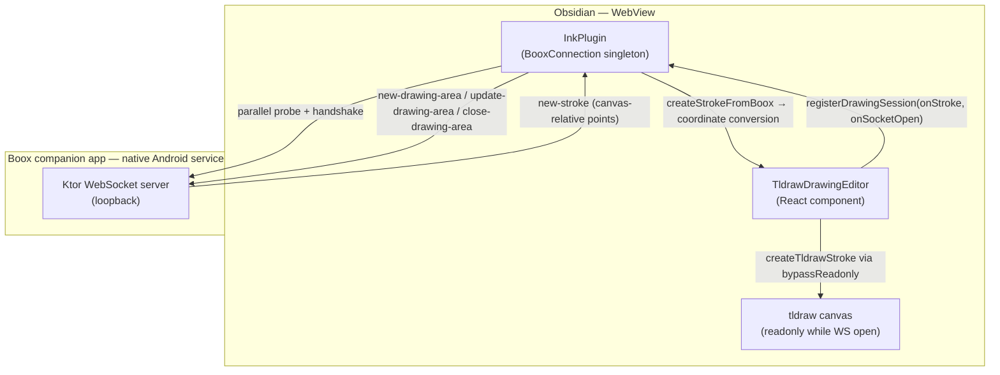
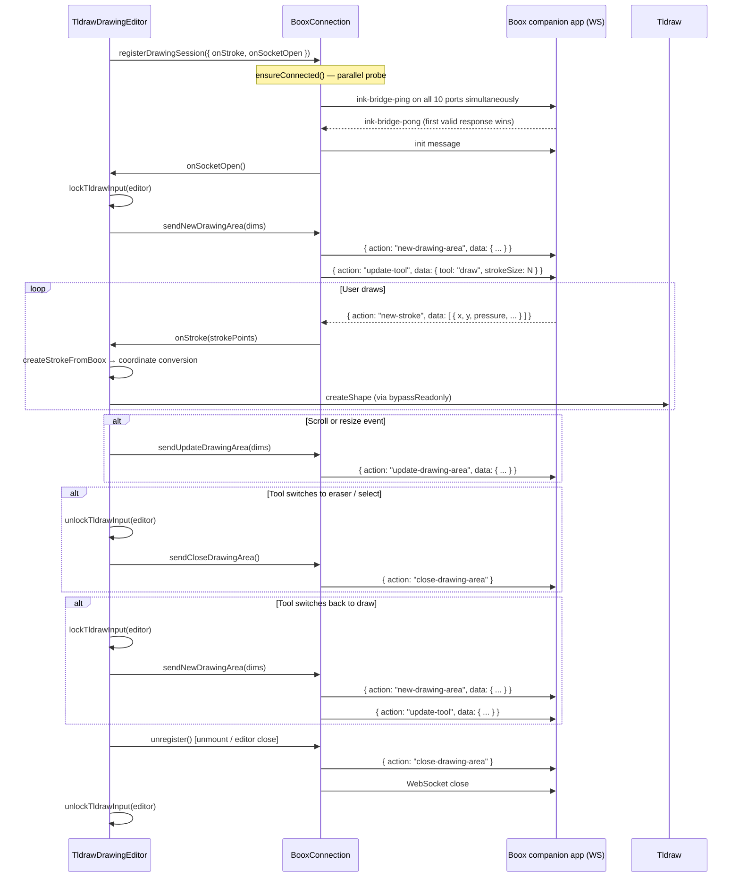
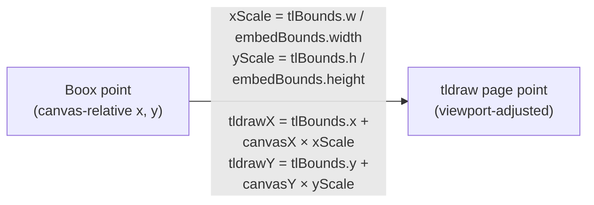

# Boox companion app integration — Obsidian Ink plugin side

> The Boox companion app counterpart (protocol messages, overlay positioning, `new-stroke` format) lives in `eink-bridge/docs/implementations/obsidian-ink-embed-integration.md`.

For **USB debugging, remote DevTools, and logs on real hardware**, see [Debugging on device](debugging-on-device.md) (plugin) and [Debugging eInk Bridge on device](../../eink-bridge/docs/debugging-on-device.md) (native app). For **keeping the companion app running** (battery, boot, recovery notifications), see [Keeping eInk Bridge reliable](../../eink-bridge/docs/keeping-bridge-reliable.md).

## Why it exists

Boox eInk devices expose a raw stylus API that is inaccessible from a WebView. The Obsidian Ink plugin cannot capture stylus input directly; instead it connects over loopback WebSocket to the **Boox companion app** running as a native Android service on the same device. The companion app captures pen input, renders EPD ink, and streams completed strokes back to the plugin.

---

## Conceptual model



---

## Flows

### Drawing session lifecycle



### Coordinate conversion: canvas-relative → tldraw page space

The Bridge overlay positions itself over the embed element and reports stroke points in **canvas-relative coordinates** (origin = top-left of the embed's DOM element). tldraw uses its own **page coordinate space** that depends on the current camera zoom and pan.



`tlBounds` is `editor.getViewportPageBounds()`. `embedBounds` is the editor wrapper div's `getBoundingClientRect()`. Both are read at stroke-receive time, not cached.

---

## Technical details

### BooxConnection

`src/connections/boox/boox-connection.ts`

Instantiated once by `InkPlugin` and stored on `InkPlugin.booxConnection`. The WebSocket is open **only while at least one drawing session is registered**; it is closed (after `close-drawing-area`) as soon as the last session unregisters.

| Method | Purpose |
|---|---|
| `registerDrawingSession(entry)` | Adds a session, triggers `ensureConnected()`. Returns an unregister function. |
| `ensureConnected()` | Idempotent. Runs `runParallelProbeWaves()` if the socket is not already open. |
| `sendNewDrawingArea(dims)` | Sends `new-drawing-area` JSON frame. |
| `sendUpdateDrawingArea(dims)` | Sends `update-drawing-area` JSON frame (caller must debounce). |
| `sendCloseDrawingArea()` | Sends `close-drawing-area` JSON frame. |
| `sendUpdateTool(tool, strokeSize)` | Sends `update-tool` so the Bridge overlay matches the active tldraw tool and size. |
| `isConnected()` | Returns `true` if the socket's `readyState` is `OPEN`. |
| `dispose()` | Plugin unload — tears down the socket unconditionally. |
| `onSettingsChanged()` | Called when the user toggles the Boox connection setting — resets and closes. |

### Parallel port probing

`ensureConnected()` opens 10 WebSockets simultaneously — one per candidate port — and sends `ink-bridge-ping` on each. The first to return a valid `ink-bridge-pong` is promoted to the production socket; all others are closed. Bridge binds the first free port from the same ordered list, so the first reachable port always wins.

```
8080, 37810, 37811, 37812, 37813, 37814, 37815, 37816, 37817, 37818
```

Timings:

| Constant | Value |
|---|---|
| `WAVE_HANDSHAKE_TIMEOUT_MS` | 1200 ms |
| `INTER_WAVE_DELAY_MS` | 500 ms |
| `MAX_PROBE_WAVES` | 3 |

After the first successful open, unexpected disconnects trigger exponential-backoff reconnection (base 1 s, cap 30 s, up to `MAX_AFTER_DISCONNECT_CONNECT_ATTEMPTS = 5` retries). After all retries are exhausted, reconnection stops silently.

### Drawing area dimensions

The client-coordinate integers sent in `new-drawing-area` / `update-drawing-area`:

| Field | Source |
|---|---|
| `x`, `y` | `Math.round(editorWrapperEl.getBoundingClientRect().x / y)` |
| `canvasWidth`, `canvasHeight` | `Math.round(editorWrapperEl.getBoundingClientRect().width / height)` |
| `appWidth`, `appHeight` | `window.innerWidth` / `window.innerHeight` |

`update-drawing-area` is debounced 200 ms (`adjustThrottleRef`) and fired on:
- `scroll` on the nearest `.cm-scroller` ancestor
- `ResizeObserver` on the editor wrapper div

### Stroke size sent to Bridge

`sendUpdateTool('draw', strokeSizeDevicePx)` is called on socket open and on every tool-size change. The size in device pixels is:

```
basePx = TLDRAW_SIZE_TO_BASE_PX[sizeStyle]   // s→2, m→3.5, l→5, xl→10
strokeSizeDevicePx = basePx × cameraZoom × BOOX_STROKE_SIZE_SCALE (= 2)
```

The ×2 scale compensates for pressure-sensitivity differences: Bridge overlay strokes render lighter than equivalent tldraw strokes at the same nominal size.

### tldraw input locking

| Call | When | Effect |
|---|---|---|
| `lockTldrawInput(editor)` | WS opens; tool switches to draw while WS is open | Sets tldraw to readonly — pointer events on canvas do not create shapes |
| `unlockTldrawInput(editor)` | WS closes; tool switches to eraser/select | Restores normal pointer input |
| `bypassReadonly(editor, fn)` | Around each `editor.createShape(...)` call | Temporarily lifts readonly for programmatic shape creation |

Source: `src/components/formats/current/utils/tldraw-helpers.ts`.

### Stroke point interface

`CanvasRelativeStrokePoint` (defined in `tldraw-drawing-editor.tsx`):

| Property | Used in tldraw | Notes |
|---|---|---|
| `x`, `y` | Yes — converted to page space | Canvas-relative coordinates |
| `pressure` | Yes — assigned to tldraw point `z` | Pre-normalised to [0, 1] by Bridge; `z` drives variable thickness when `isPen: true` |
| `size` | No (available) | Nib size from Boox SDK |
| `tiltX`, `tiltY` | No (available) | Tilt angles |
| `timestamp` | No (available) | Time in ms |

`createTldrawStroke` creates a `draw` shape with `isPen: true` and a single `free` segment, so tldraw treats the `z` pressure values as pen pressure for calligraphic stroke width.

### Relevant files

| File | Role |
|---|---|
| `src/connections/boox/boox-connection.ts` | `BooxConnection` class — probing, reconnection, session registration, message dispatch |
| `src/components/formats/current/drawing/tldraw-drawing-editor/tldraw-drawing-editor.tsx` | Session registration, drawing area lifecycle, `createStrokeFromBoox`, `createTldrawStroke`, tool-change handling |
| `src/components/formats/current/utils/tldraw-helpers.ts` | `lockTldrawInput`, `unlockTldrawInput`, `bypassReadonly` |

---

## Technical gotchas

- **tldraw must be locked while the WebSocket is open.** Stylus events leak through the WebView layer even when Bridge is active; without the lock, each stroke is written twice — once from the WebSocket path and once from the native pointer event.

- **Coordinate conversion must use live values.** `embedBounds` (`getBoundingClientRect`) and `tlBounds` (`getViewportPageBounds`) are read at stroke-receive time. Caching them (e.g. on socket open) means strokes shift whenever the camera pans, zooms, or the embed scrolls.

- **`update-drawing-area` must be debounced.** Scroll and resize events fire many times per frame. The 200 ms debounce prevents flooding the WebSocket and causing overlay flicker on Bridge's side.

- **Tool changes must close and re-open the drawing area.** When the user switches to `eraser` or `select`, `close-drawing-area` is sent and the editor is unlocked. If the user switches back to `draw`, `new-drawing-area` is sent again and the editor is re-locked. Skipping `close-drawing-area` leaves Bridge capturing strokes while the wrong tool is active.

- **The socket is only open while a session is registered.** When the last drawing editor unmounts, `unregister()` closes the socket immediately after `close-drawing-area`. The next editor mount triggers a fresh `ensureConnected()` probe.

- **Probe sockets must not bleed into production message handling.** During the probe each socket's `onmessage` handles only `ink-bridge-pong`. On success, `attachProductionHandlers` replaces `onmessage` with `dispatchStrokeMessage`. A lingering probe handler would silently drop all `new-stroke` frames.

- **Use `ws://127.0.0.1`, not `ws://localhost`.** On some Android WebView runtimes `localhost` resolves differently from the loopback address. The constant `INK_BRIDGE_WEBSOCKET_PORTS` in `boox-connection.ts` already uses the numeric form.
