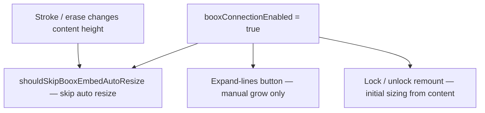

# Boox companion app integration (Obsidian Ink)

> **Cross-component documentation** for how Obsidian Ink and eInk Bridge work together lives in the **eink-bridge** repo, not here:
>
> - **[Obsidian Ink surfaces and eInk Bridge](../../eink-bridge/docs/implementations/obsidian-ink-surfaces-and-boox.md)** — writing/drawing embeds and dedicated views, session stack, leaf visibility, writing resize queue
> - **[Obsidian Ink drawing embed integration (protocol)](../../eink-bridge/docs/implementations/obsidian-ink-embed-integration.md)** — WebSocket messages and Bridge behaviour
> - **[Overlay corner alignment markers](../../eink-bridge/docs/implementations/overlay-corner-alignment-markers.md)** — `cornerMarkers` on drawing-area payloads (embed width/radius, drawing embed hides bottom-right, dedicated views hide all corners)
> - **[Single active embed constraint](../../eink-bridge/docs/implementations/single-active-embed-constraint.md)** — one unlocked embed when Boox is enabled

For **USB debugging and correlated logs**, see [Debugging on device](debugging-on-device.md) (plugin) and [Debugging eInk Bridge on device](../../eink-bridge/docs/debugging-on-device.md) (native app).

Plugin implementation entry point: `src/connections/boox/boox-connection.ts`.

## Connection feedback (no toast on connect)

When the WebSocket handshake succeeds, ink canvas editors (`writing-editor.tsx`, `drawing-editor.tsx`) run the same `onSocketOpen` lifecycle as before — lock local pen input, register overlay geometry, and send `update-tool` — but **do not** show an Obsidian `Notice`. Connection is communicated through existing Boox UI instead:

| Signal | When |
|---|---|
| `ddc_ink_boox-eink` chrome on the editor root | **Enable Boox companion app** is on (device-local toggle) |
| Expand-lines control in embedded writing | Toggle on (not gated on live WebSocket state) |
| Local canvas input locked | Active editor session with an open Bridge socket |
| `debug(...)` in dev builds | `onSocketOpen` in the editor |

Failed connects still surface only through dev logging / vault logs (`BooxConnection` probe path), not a success toast.

## Plugin-side overlay marker payloads

Drawing and writing editors call `buildBooxCornerMarkers()` (`src/connections/boox/boox-corner-markers.ts`) when sending `new-drawing-area` / `update-drawing-area`:

| Surface | Payload |
|---|---|
| Embed | `{ width: 3, radius: <computed embed border-radius> }`; drawing embed also sets `bottomRight: false` (resize handle) |
| Dedicated view | All four corner flags `false` — no alignment brackets |

Embed border radius is applied in CSS on `.ddc_ink_resize-container--boox` only (`ink-boox-eink-chrome.scss`), not on dedicated Boox editors.

## Boox writing-embed toolbar visibility

Embedded writing editors position the primary menu bar **above** the canvas using `transform: translate(0, -100%)` when active (`primary-menu-bar.scss`). Boox high-contrast chrome applies `overflow: hidden` on `.ddc_ink_boox-eink .ddc_ink_writing-editor` so rounded embed outlines clip cleanly.

That combination **clips the translated menu** unless the embed overrides overflow. Drawing embeds already set `overflow: visible` on the editor root; writing embeds match that in `writing-editor.scss`:

```scss
.ddc_ink_embed .ddc_ink_writing-editor.ddc_ink_boox-eink {
	overflow: visible;
}
```

Without this override, the toolbar remains in the DOM (and in `excludeRects`) but is not visible on Boox tablets. Changing Bridge `cornerMarkers.width` does not affect Obsidian toolbar layout.

## Writing embed height when Boox companion is enabled

With **Enable Boox companion app** on (device-local `booxConnectionEnabled`), embedded writing editors **do not auto-grow or auto-shrink** with stroke content. Bridge overlay open/close and tool switches (draw vs erase/select) must not change that rule — only the device toggle does.


```mermaid
flowchart TD
    toggleOn["booxConnectionEnabled = true"]
    stroke["Stroke / erase changes content height"]
    skip["shouldSkipBooxEmbedAutoResize — skip auto resize"]
    expandBtn["Expand-lines button — manual grow only"]
    lockUnlock["Lock / unlock remount — initial sizing from content"]

    toggleOn --> skip
    stroke --> skip
    toggleOn --> expandBtn
    toggleOn --> lockUnlock
```

### Auto-resize skip

**Sources:** `writing-editor.tsx` (`shouldSkipBooxEmbedAutoResize`, `applyPageHeightChange`, `debouncedEmbedResizePostProcess`); legacy tldraw path: `tldraw-writing-editor.tsx` (`instantInputPostProcess`).

| Trigger | Behaviour when Boox toggle is on |
|---|---|
| New strokes (local pen or Bridge) | Page height and embed DOM height stay fixed |
| Eraser / undo removing strokes | No contract-to-content resize |
| Editor initial mount after unlock | **Still runs** — syncs inviting height from strokes and updates the embed container (skip applies only to ongoing stroke-driven changes, not `isInitialMount`) |
| Boox toggle off | Normal inviting-height auto-resize resumes |

The skip keys off **`getBooxConnectionEnabled()`**, not `websocketConnectedRef`. Erase/select close the Bridge overlay and unlock local input, but they must not re-enable auto-resize.

### Manual expand-lines control

When the toggle is on, embedded writing editors show the **expand-lines** chevron in the secondary menu bar (alongside undo/redo). Visibility follows the toggle, not whether the WebSocket is currently connected.

Manual expand resizes inline (`setWritingPageHeight` + `notifyEmbedResize`) and does **not** route through `applyPageHeightChange`, so no bypass flag is needed for the next stroke.

### Lock / unlock and remount reserve

**Sources:** `writing-embed.tsx` (`useLayoutEffect` remount reserve); [embed-scrolling.md](embed-scrolling.md) (`remountReserveHeightPx`).

Non-Boox unlocked remounts seed container height from `remountReserveHeightPx` so CodeMirror virtualisation does not collapse a tall editor to preview aspect. That reserve can preserve a **manually expanded** height after lock → unlock.

When Boox is enabled, remount reserve is **not** applied while editing. Initial embed sizing (`applyInitialEmbedSizing` → `applyPageHeightChange` with `isInitialMount`) resets page and container height from current stroke content instead of the last expanded measurement.

### Technical Gotchas

- **Do not gate auto-resize skip on WebSocket session state** — eraser/select intentionally clear `websocketConnectedRef` for local input; gating on connection reintroduces post-stroke and post-erase resize bugs.
- **Do not set a “force next resize” flag on manual expand without clearing it in the same turn** — a leaked flag lets the next stroke bypass the Boox skip (historical bug).
- **Expand-lines button styling** — the control is absolutely positioned in `SecondaryMenuBar` (`expand-lines-button.scss`); it is outside `.ink_menu-bar` and needs the same button chrome as undo/redo plus `bottom: 8px` to align with the undo row.
