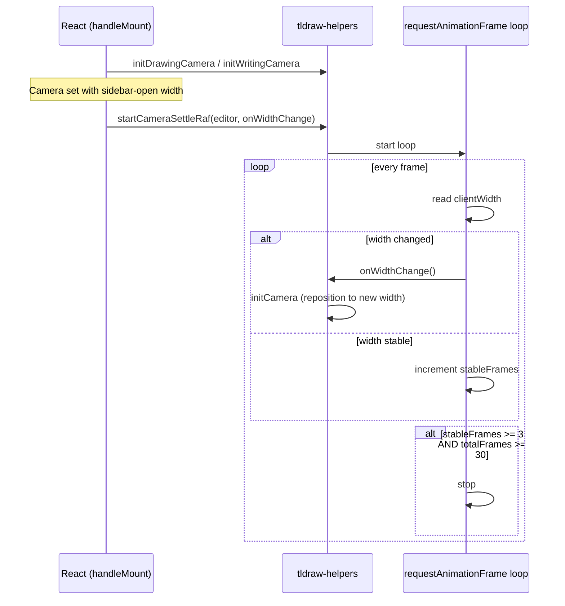
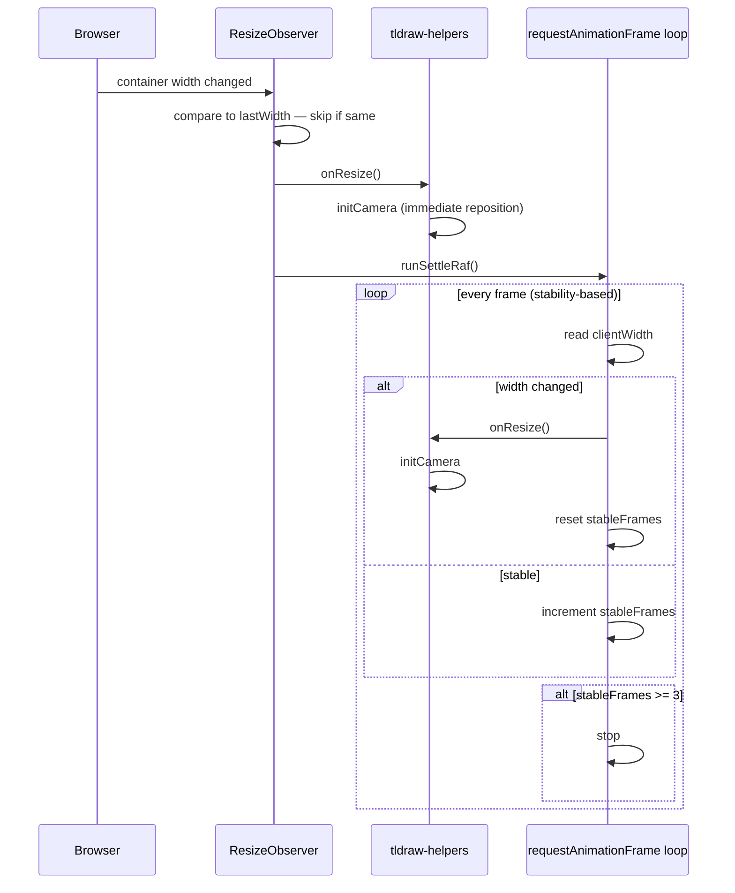

# Camera Repositioning on Resize

## Why it exists

The tldraw camera (position + zoom) must stay correct whenever the editor container changes size. This can happen at:

- **Mount time** — Obsidian's sidebar collapse animation runs *after* the editor mounts. The camera is set with the sidebar's pre-animation width and ends up wrong once the sidebar finishes animating away.
- **Mid-session** — the user toggles the left or right sidebar, opens a panel, or drags the Obsidian window to a new size.

Without active repositioning, the drawing or writing canvas appears panned or zoomed to the wrong position.

---

## Conceptual understanding

### The tldraw camera is instance-scoped

tldraw separates its store records into two scopes:

| Scope | Examples | Synced to peers? |
|---|---|---|
| Document | shapes, pages, assets | Yes |
| Instance | camera, selected shapes, tool state | No — local only |

The camera record (`typeName: 'camera'`) is **instance-scoped**. This matters because `mergeRemoteChanges` — an API designed for syncing document records from remote peers — **silently skips instance-scoped records**. Any `setCamera` call placed inside `mergeRemoteChanges` is a no-op. The correct way to programmatically update the camera without creating an undo history entry is:

```ts
editor.run(() => {
    editor.setCamera({ x, y, z: zoom });
}, { history: 'ignore' });
```

### Locked vs. unlocked cameras

Embedded editors lock the camera (`editor.setCameraOptions({ isLocked: true })`) so that accidental mouse movement doesn't pan or zoom the drawing. The `isLocked` flag also blocks programmatic `setCamera` calls. Any repositioning done while the camera is locked must temporarily unlock it:

```ts
editor.setCameraOptions({ isLocked: false });
initDrawingCamera(editor);
editor.setCameraOptions({ isLocked: true });
```

### Why width only — not height

The `ResizeObserver` fires on *any* dimension change. The writing template's height changes continuously as the user writes more lines, which would restart the settle RAF loop on every keystroke. Camera repositioning only depends on container **width** (zoom is calculated from width; x/y origins are also width-driven). Height changes are therefore intentionally ignored in `startCameraResizeObserver`.

---

## Flows

### Mount-time (dedicated view only)

Obsidian collapses sidebars via CSS animation *after* the editor mounts. The camera is initialised at mount with the wrong width, then a RAF loop runs until the width stabilises.



The minimum of 30 frames (~500ms at 60fps) ensures the loop outlives any sidebar CSS animation before it's allowed to declare stability.

### Ongoing resize (all contexts)

Window drags and sidebar toggles mid-session are handled by a `ResizeObserver` + inner settle RAF.



The inner settle RAF keeps repositioning on every frame *while the resize is still in progress* (e.g. dragging the window edge slowly). It stops only once width has been stable for 3 consecutive frames.

---

## Technical details

### Utilities — `src/components/formats/current/utils/tldraw-helpers.ts`

#### `initDrawingCamera(editor)`

Sets the camera so all current page shapes fit inside the viewport with a 16px inset, capped at zoom 1. If the page has no shapes, sets zoom to 0.3 (matching typical writing zoom).

Camera math:
```
zoom = min((vw - 32) / boundsW, (vh - 32) / boundsH, 1)
x    = vw/2 − bounds.midX × zoom
y    = vh/2 − bounds.midY × zoom
```

#### `initWritingCamera(editor, topMarginPx?)`

Sets zoom so the writing canvas (2000px wide) fills the container width exactly. Pins `x` to 0 (no horizontal offset) and `y` to `topMarginPx` (used to push content below the menu bar in dedicated view).

```
zoom = containerWidth / 2000
x    = 0
y    = topMarginPx
```

#### `startCameraSettleRaf(editor, onWidthChange)`

- Polls `clientWidth` every animation frame
- Calls `onWidthChange` on each frame where width changed
- Stops after 3 stable frames **and** at least 30 total frames
- Returns a cancel function; must be called on unmount

#### `startCameraResizeObserver(editor, onResize)`

- Observes the editor container with `ResizeObserver`
- On each notification, compares `clientWidth` to the last seen width; **ignores height-only changes**
- On a width change: calls `onResize()` immediately, then starts an inner stability-based RAF loop that keeps calling `onResize()` until width is stable for 3 consecutive frames
- Returns a cleanup function (`observer.disconnect()` + `cancelAnimationFrame`)

### Per-editor behaviour

| Context | startCameraSettleRaf | startCameraResizeObserver | Camera locked? |
|---|---|---|---|
| Drawing — dedicated | ✅ (mount-time animation) | ✅ | No |
| Drawing — embedded | ✗ | ✅ | Yes — temporarily unlocked during reposition |
| Writing — dedicated | ✅ (mount-time animation) | ✅ | No |
| Writing — embedded | ✗ | ✅ | Yes — temporarily unlocked during reposition |

### Dedicated writing — y-position preservation on resize

> **Current-format ink-canvas writing:** dedicated views no longer scroll via camera Y. They use a tall HTML scroller; width-fit zoom changes rescale `scrollTop` in `syncDedicatedPageCssHeight`. See [dedicated-writing-html-scroll.md](dedicated-writing-html-scroll.md).

When the **legacy tldraw** writing dedicated view is resized, the user may have scrolled down into the document. A plain `initWritingCamera` would reset `y` back to the top margin. Instead, the resize observer callback:

1. Captures `prevY = editor.getCamera().y`
2. Calls `initWritingCamera` (resets zoom and x correctly, but y is now at `MENUBAR_HEIGHT_PX`)
3. Re-derives the camera limits for the new width
4. Clamps `prevY` within the new valid y-range and restores it via `editor.run(..., { history: 'ignore' })`

### Cleanup

Both utilities return cleanup functions. These are called in the editor's `unmountActions` handler:

```ts
cancelCameraSettleRaf?.();
disconnectResizeObserver?.();
```

---

## Technical Gotchas

- **`mergeRemoteChanges` is a no-op for the camera.** The camera is instance-scoped; `mergeRemoteChanges` (and therefore `silentlyChangeStore`) silently discards any `setCamera` call placed inside it. Always use `editor.run(fn, { history: 'ignore' })` for programmatic camera updates.

- **`isLocked` blocks all `setCamera` calls**, including programmatic ones. Embedded editors must temporarily set `isLocked: false`, call `setCamera`, then re-lock. Failing to re-lock leaves the embed camera interactive (zoom/pan on hover).

- **`startCameraSettleRaf` is not used for embedded editors.** At mount time, embedded editors exist inside the note's own layout — there is no sidebar collapse animation that affects *their* container specifically. The `ResizeObserver` alone handles resize. The settle RAF is only needed for dedicated (full-panel) views where the sidebar animation directly shrinks the editor's container.

- **ResizeObserver fires on height too.** The embedded writing template grows taller as the user writes. Without the `clientWidth === lastWidth` guard in `startCameraResizeObserver`, every line of text would restart the settle RAF indefinitely.

- **`initDrawingCamera` with no shapes.** If the drawing page is empty, `getCurrentPageBounds()` returns null. The function falls back to setting zoom = 0.3 (consistent with writing zoom), leaving x/y unchanged from the current camera position.

- **`initWritingCamera` uses `innerWidth` not `clientWidth`.** `innerWidth` on an HTML element is not a standard property and will always return `undefined`, resolving to `NaN` in the zoom calculation. This is a pre-existing bug — check the actual container width property if zoom behaviour is wrong after a resize.
