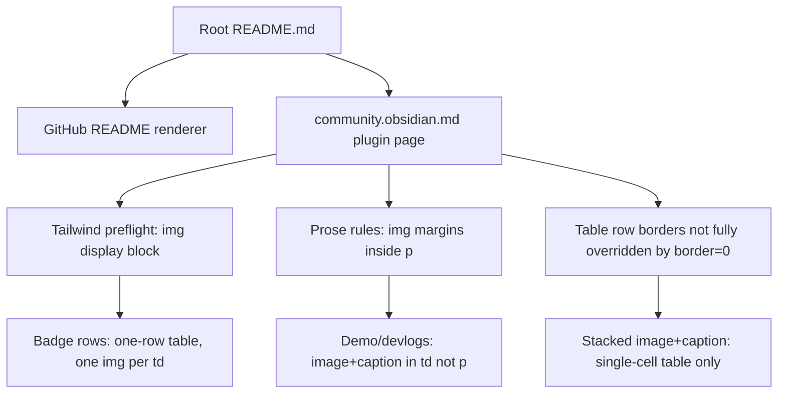

# Community README layout (community.obsidian.md)

## Why it exists

The public plugin page at [community.obsidian.md/plugins/ink](https://community.obsidian.md/plugins/ink) renders this repo’s root `README.md`. That site’s CSS (Tailwind preflight + prose rules) does **not** match GitHub’s README renderer. Markup that looks fine on GitHub can stack badges vertically, add large gaps under demo images, or draw horizontal rules between table rows on the community page.

This page records the verified constraints and the patterns in `README.md` so future edits do not regress the community listing.

## Conceptual understanding

Treat the community page as a stricter HTML/CSS host than GitHub:

- Images are forced to `display: block`, so adjacent `` (or badge SVGs) no longer sit on one line.
- Images inside a `
` get substantial vertical margin (~32px) that GitHub does not apply.
- Multi-row HTML tables can show a visible border between rows even when `border="0"` is set — site CSS wins over that attribute.
- Wrapping an entire `<table>` in an `<a>` is fragile: some renderers drop nearby content (e.g. an intro sentence before the link).

Prefer table cells for horizontal grouping and for demo image + caption blocks. Prefer a single cell when image and caption must appear stacked without a line between them.

## Flows

## Technical details

Patterns currently used in `README.md`:

### Inline badge / button rows

One-row `<table border="0" cellspacing="0" cellpadding="0">` with one badge `` per `<td>`. Cells stay side-by-side even when images are `display: block`.

Used for: social badges under Development Diaries, Support links, and “My other work” links.

### Demo and Development Diaries media

- Intro copy (if any) stays in a normal `
` — not inside a link that wraps a table.
- Image + caption live in a **single-cell** centered table.
- One `<a>` wraps both the `` and the caption text so image and label share one hit target.
- Use ` ` between image and caption inside that cell; do **not** put them in separate `<tr>` rows (row borders show on the community site).

### HTML comments in README

Short HTML comments above the first demo table and the first badge table explain *why* those patterns exist. Keep them when editing so the next change does not “simplify” back to `
`-only markup.

## Technical Gotchas

- **GitHub is not the source of truth for layout** — always sanity-check [community.obsidian.md/plugins/ink](https://community.obsidian.md/plugins/ink) after README visual changes (the page tracks the default branch / published README; local `release_*` work may not appear until merged/published).
- **Do not use multi-row tables for image + caption** — `border="0"` does not remove the community site’s between-row border.
- **Do not wrap `<table>` in `<a>`** — can drop preceding text; put the `<a>` inside the cell around image + caption instead.
- **Do not put large demo images in `
`** — community prose adds large top/bottom margins on those images.
- **Inline styles and class attributes** are unreliable on the community host; prefer structural HTML (tables/cells) over CSS workarounds that may be stripped.
