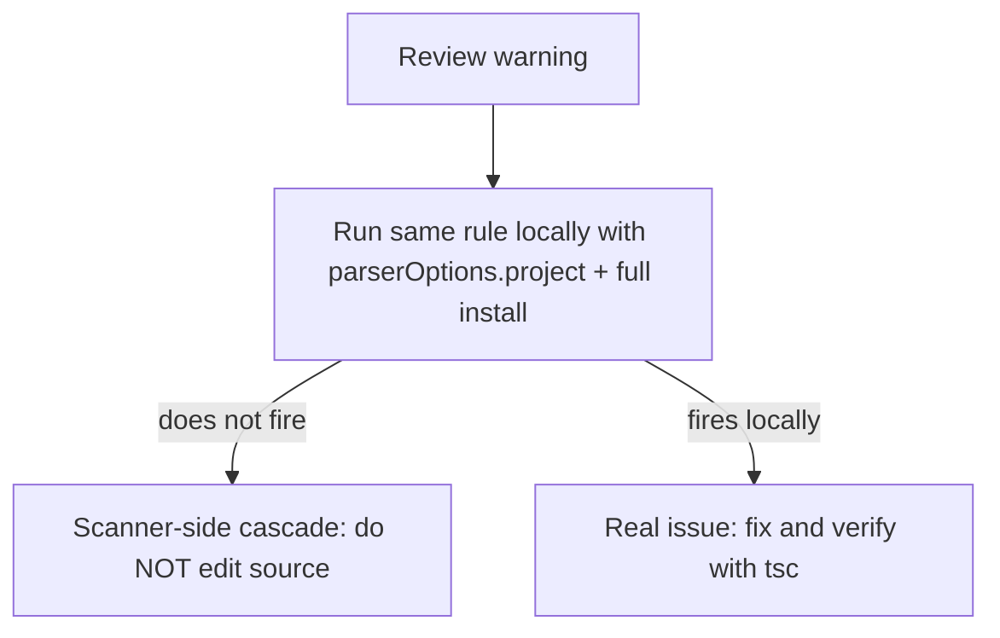
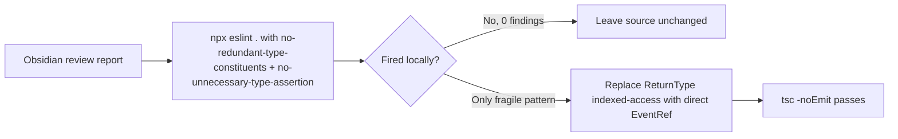

# Community review warnings that are scanner-side

## Why it exists

The Obsidian **community plugin review** (both the automated SOURCE CODE scan and the reviewer-facing report at submission) runs its own copy of `eslint-plugin-obsidianmd` plus type-aware `typescript-eslint` rules against a fresh clone of the repo. That environment does not always resolve the plugin's third-party types the way a healthy local checkout does. When `obsidian`, `@tldraw/tldraw`, or similar type packages collapse to `any`/`error` in the scanner's checker, every union, intersection, cast, and indexed-access that touches them cascades into a warning.

This page records which review warnings are **scanner-side false positives** (do not "fix" them — the fix would break the real build) versus the small set that were genuinely worth changing. It exists so a future maintainer does not spend a release cycle stripping `| null` unions or deleting required assertions to chase a green report that only turns green in a broken type environment.

For the local lint setup, popout-safe DOM rules, and the deprecated-API-vs-typings gotcha, see [ESLint and Obsidian plugin conventions](eslint-obsidian-conventions.md).

## Conceptual understanding

Two checkers look at the same code:

| Checker | Type environment | Behaviour |
|---|---|---|
| **Local** (`npx eslint .`, `tsc -noEmit`) | Full `npm install`, `parserOptions.project: ./tsconfig.json` | Resolves `obsidian` / `@tldraw` types; unions and casts are meaningful |
| **Hosted review** | Fresh clone; type resolution can degrade | Third-party types may become `any`/`error`; downstream unions/casts warn |

The deciding test for any of these warnings: **run the exact rule locally with a healthy checker.** If it does not fire locally, it is scanner-side.



## Flows

How this thread triaged the report:



## Technical details

### How the rules were verified locally

Both messages map to type-aware `typescript-eslint` rules. Run them over the whole tree with the project's own config:

```bash
# 'error' type that acts as 'any'  +  ''any'' overrides all other types in this union
#   -> @typescript-eslint/no-redundant-type-constituents
# assertion is unnecessary (…receiver accepts original type / …does not change the type)
#   -> @typescript-eslint/no-unnecessary-type-assertion
npx eslint . \
  --rule '{"@typescript-eslint/no-redundant-type-constituents":"error","@typescript-eslint/no-unnecessary-type-assertion":"error"}'
```

At the time of writing (TypeScript 5.7.2, ESLint 9.39.4, `eslint-plugin-obsidianmd` 0.4.2) this produced **0 findings** across the tree and on every file the review named. Only `obsidianmd/ui/sentence-case` warnings remained.

### Verdict per warning bucket

| Review warning | Rule | Local result | Action |
|---|---|---|---|
| `'error' type that acts as 'any'` (~50 files) | `no-redundant-type-constituents` | Does not fire | **Do nothing.** Legitimate unions (`TFile \| null`, `Editor \| InkCanvasEditor`, `StrokeOptions & {…}`). Stripping `\| null` to satisfy the scanner would break real types. |
| `assertion is unnecessary…` (6 `!` / 4 `as`) | `no-unnecessary-type-assertion` | Does not fire | **Do NOT touch.** Each is required by a healthy checker (see below); removing them fails local `tsc` and breaks real Obsidian. |
| `'any' overrides all other types in this union` (3 spots) | `no-redundant-type-constituents` | Does not fire | **One fixed, two left** (see below). |

### The assertions are load-bearing, not redundant

The review calls these "unnecessary," but they only look unnecessary once the base type has already degraded to `any`. With real types they each do work:

- `editorRef.current!` (`drawing-editor.tsx`) — removes `null` for a non-null parameter.
- `this.app as AppWithOptionalMobileEmulation` (`main.ts`) — genuinely widens `App` to probe the optional `emulateMobile` API.
- `editor?.cm as EditorView | undefined` (`ink-embed-refresh.ts`, and the writing/drawing embed extensions) — `cm` is not typed by Obsidian; the cast sits beneath a `@ts-expect-error`.
- `entry.changes.updated as Record<…>` (`finger-blocker.tsx`) — narrows `unknown` from a tldraw store diff.

Deleting any of these to satisfy the report would reintroduce a real type error locally.

### The one change that was worth making

`InkReadingEmbedHost` stored its `Vault.on('modify', …)` handle as:

```ts
private writingFileModifyRef: ReturnType<InkPlugin['app']['vault']['on']> | null = null;
```

`ReturnType<>` over the **overloaded** `Vault.on` resolves to the *last* overload's return type, and that indexed-access chain is exactly the kind of expression that collapses to `any` under a degraded checker — producing the `'any' overrides all other types in this union` warning. `Vault.on` always returns `EventRef`, which Obsidian exports, so the direct type is both clearer and resilient:

```ts
private writingFileModifyRef: EventRef | null = null;
```

`tsc -noEmit` stays clean. The other two `'any' overrides` spots (`dedicated-ink-editor-registry.ts`, `ink-editor-registry.ts`) are `Editor | InkCanvasEditor` unions where the tldraw `Editor` half is legitimate — left unchanged.

## Technical Gotchas

- **Never edit source to satisfy a warning that does not reproduce locally.** The scanner's checker is the thing that is wrong, not the code. Editing to appease it (removing `| null`, deleting `!`/`as`) breaks the healthy build and real Obsidian runtime.
- **`ReturnType<X['a']['b']>` over overloaded methods is fragile.** It binds to the last overload and cascades to `any` when resolution degrades. Prefer the exported named type (`EventRef`, etc.).
- **The deciding test is a local rule run, not reading the message.** Always re-run the specific `typescript-eslint` rule with `parserOptions.project` before believing a type-aware warning.
- **These are separate from the deprecated-API warnings.** `ButtonComponent.setWarning()` / `Notice.noticeEl` warnings are real deprecations, but the pinned `obsidian` typings still only declare the old names, so migrating breaks `tsc`. See [ESLint and Obsidian plugin conventions](eslint-obsidian-conventions.md).
- **Sentence-case warnings are real (product-name style), not covered here.** They are a copy decision, not a type cascade.
