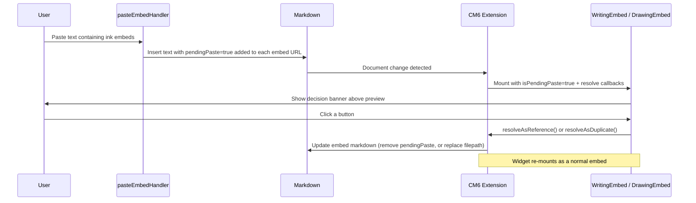

# Copy & paste embeds

## Copy

To copy an ink embed, select its markdown in the editor and use Ctrl+C (or Cmd+C). The embed text (including the image link and Edit link) is copied to the clipboard. No menu action or command is needed.

## Why it exists

When a user copies an ink embed and pastes it into a note, the plugin needs to know whether to create a shared reference to the same underlying file, or to produce an independent duplicate. This doc describes how that decision is surfaced and resolved.

## Conceptual overview

Rather than interrupting the user with a modal dialog at paste time, each embed shows the decision prompt inline as a compact banner at the top of the embed, with the file's preview visible beneath it. This means:

- Each pasted embed owns its own banner — pasting several at once works naturally.
- The prompt is tied to the markdown, not to UI state, so it survives editor scrolling and re-mounts.
- The user can act on each prompt at any time without being forced to decide immediately.
- The file preview remains visible so the user can identify the content before deciding.

## Flow



## Decision banner variants

The banner rendered at the top of an embed depends on whether the referenced file can be found in the vault:

```
┌──────────────────────────────────────────────────────┐
│  Insert copied writing   [Reference file]  [Duplicate] │  ← banner (file found + pending)
├──────────────────────────────────────────────────────┤
│                                                        │
│                      preview                           │
│                                                        │
└──────────────────────────────────────────────────────┘
```

**File found, pending paste** — "Reference existing file" and "Make duplicate" buttons, with the file's preview visible below. Choosing reference strips `pendingPaste=true` from the URL so the embed renders normally. Choosing duplicate creates a copy of the source file and replaces the embed with one pointing to the new file.

**File not found** — Shown regardless of whether `isPendingPaste` is true or false. A not-found banner displays the missing path and a "Locate file" button. No preview is shown. Clicking "Locate file" opens the SVG file picker pre-filtered to the correct ink file type; choosing a file replaces the filepath in the embed markdown. If the embed was pasted (`isPendingPaste=true`), `pendingPaste=true` is preserved so the user still sees the "Reference existing file" / "Make duplicate" prompt after locating.

## How the pending state is stored

The `pendingPaste=true` flag is appended as a URL query param to the embed's settings link in the markdown, e.g.:

```
  [Edit Writing](ink?type=inkWriting&version=1&pendingPaste=true)
```

The paste handler injects this flag for **every** ink embed found in the clipboard, regardless of whether the referenced file exists. The embed component then resolves the correct panel variant at render time based on whether the file is resolvable.

Because the flag lives in the document itself, the decision prompt persists across:
- Editor scroll (widget destroy and re-mount)
- Plugin reload
- Obsidian restart

## Resolution

**Reference existing file** — `resolveAsReference()` removes `&pendingPaste=true` from the URL in the markdown. The CM6 extension rebuilds the widget without `isPendingPaste`, so the embed renders normally.

**Make duplicate** — `resolveAsDuplicate()` calls `duplicateWritingFile` / `duplicateDrawingFile`, then replaces the entire widget's markdown range with a freshly built embed string pointing to the new file. No `pendingPaste` param is included in the replacement, so the embed renders normally immediately.

## Technical implementation details

| Layer | File | Responsibility |
|---|---|---|
| Embed builder | `utils/build-embeds.ts` | Accepts `options.pendingPaste` and appends `&pendingPaste=true` to the URL |
| URL parser | `utils/parse-settings-from-url.ts` | Returns `isPendingPaste: boolean` alongside `embedSettings` |
| Paste handler | `utils/paste-embed-handler.ts` | Non-anchored global regex; injects `pendingPaste=true` into every embed found in clipboard text |
| File picker utility | `src/logic/utils/open-ink-file-picker.ts` | Opens the modal immediately, sniffs ink SVG types without full JSON parse, builds sectioned layout (Recent, On current page, Other); shared by insert commands and the locate action. See [Insert existing file picker](insert-existing-file-picker.md). |
| CM6 widget (writing) | `writing-embed-extension.tsx` | Parses `isPendingPaste`, passes it, resolve callbacks, and `locateFile` to `WritingEmbed` |
| CM6 widget (drawing) | `drawing-embed-extension.tsx` | Same for drawing |
| React embed (writing) | `writing-embed.tsx` | When file is not found, always shows the not-found banner (with path + Locate button); when file is found and pending, shows the reference/duplicate banner above the preview |
| React embed (drawing) | `drawing-embed.tsx` | Same for drawing |

## File paths and copy-paste

### Obsidian path behaviour

Obsidian resolves embed paths in two ways (Settings → Files and Links):

- **Paths without `./` or `../`** — resolved from vault root.
- **Paths with `./` or `../`** — resolved relative to the note containing the embed.

The plugin uses `MetadataCache.getFirstLinkpathDest(linkpath, mdFile.path)` to resolve embeds. The second argument is the note’s path and is used only when the linkpath is relative.

### Plugin path behaviour

The plugin always writes vault-root paths when creating and copying embeds:

- Copy uses `TFile.path`, which is the full path from vault root (e.g. `Ink/Writing/hello-world.svg`).
- The plugin does not read Obsidian’s “New link format” setting and does not produce relative paths.

Because copied embeds use vault-root paths, they resolve correctly when pasted into notes in any folder. Relative paths (e.g. `../Ink/Writing/foo.svg`) will break when pasted into a note in a different folder, because `../` is then interpreted relative to the target note.

### Insert existing file modal

When inserting an existing drawing or writing file (or when locating a missing file), the picker shows results in three sections:

- **Recent drawings** / **Recent writing** — Up to 10 recently selected or newly created files, shown first in a horizontally scrolling row.
- **On current page** — Files already embedded in the active note, shown second in a horizontally scrolling row.
- **Other drawings** / **Other writing** — Remaining vault files in a grid.

A file may appear in both Recent and On current page when it qualifies for both. The Other section excludes files that appear in either of the first two sections. Recent selections are persisted to `localStorage` and updated whenever the user chooses a file from the picker.

A search input at the top filters visible results across all sections by matching the query against file basename or path (case-insensitive). When nothing matches, "No files match your search" is shown.

For open latency, type sniffing, and lazy viewport previews on large vaults, see [Insert existing file picker](insert-existing-file-picker.md).

### Path scenarios covered by e2e tests

The copy-paste e2e suite (`embed-copy-paste-paths.e2e.ts`) duplicates the resolution tests for each path scenario that corresponds to plugin × Obsidian settings:

| Scenario | Plugin noteAttachmentFolderLocation | Obsidian attachment path | Example embed path |
|----------|-------------------------------------|--------------------------|--------------------|
| root | root (or obsidian + root) | (irrelevant) | `Ink/Writing/hello-world.svg` |
| note | note | (irrelevant) | `16 - Copy Paste Paths/SourceFolder/Ink/Writing/note-mode-writing.svg` |
| obsidian-attachments | obsidian | Attachments | `Attachments/Ink/Writing/obsidian-mode-writing.svg` |

Each scenario runs: cross-folder paste (writing and drawing), deep nesting, duplicate embed, paste into 14 - Conversion Modal. The root scenario also runs a very long path test. A separate test verifies that relative paths (`../`) break when pasted into a different folder.

## Technical gotchas

- **`pendingPaste=true` is always appended last** by the paste handler, so `resolveAsReference` can safely strip it with `.replace(/&pendingPaste=true/, '')` without URL re-parsing.
- **Relative vs vault-root paths** — If an embed’s path is manually edited to use `./` or `../`, copying and pasting it into a note in another folder will likely break resolution. The plugin always emits vault-root paths; only hand-edited embeds can introduce relative paths.
- **`resolveAsDuplicate` rebuilds the full embed string** for the new file path and replaces the entire widget range in a single CM6 transaction. This naturally removes `pendingPaste` since the new string is built with no options.
- **`locateFile` replaces only the filepath** in the image portion of the embed string using `.replace(/\(<([^>]+)>\)/, `(<newPath>)`)`. When `isPendingPaste` is true, `pendingPaste=true` is kept so the reference/duplicate prompt still appears after locating. When `isPendingPaste` is false, any stray `pendingPaste=true` is stripped.
- **`writingFileRef` is `TFile | null`** in `WritingEmbed` props. The widget no longer casts via `as TFile`; both components branch on `!!props.writingFileRef` (or `!!props.embeddedFile`) as the sole gate for the not-found banner — `isPendingPaste` is irrelevant when no file is present.
- The `resolveAsDuplicate` callback is `async` because file duplication is async. No loading state is shown during the brief duplication.
- **Widget reuse guard** — both state fields have a `decorationAlreadyExists` optimisation that reuses the previous widget instance when mapped positions match. `resolveAsReference`, `resolveAsDuplicate`, and `locateFile` all modify the decoration's range, so a `rangeWasModified` check (via `ChangeSet.iterChangedRanges`) is applied before reuse: if any change overlaps the old decoration's range, a fresh widget is created with the updated state. Without this guard, the stale widget would be recycled, keeping the banner visible.
