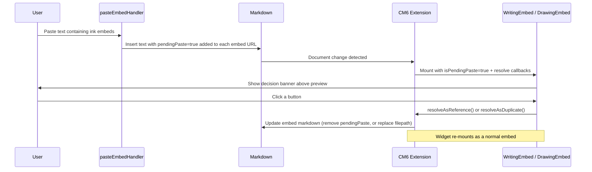

# Copy & paste embeds

## Why it exists

When a user copies an ink embed and pastes it into a note, the plugin needs to know whether to create a shared reference to the same underlying file, or to produce an independent duplicate. This doc describes how that decision is surfaced and resolved.

## Conceptual overview

Rather than interrupting the user with a modal dialog at paste time, each embed shows the decision prompt inline as a compact banner at the top of the embed, with the file's preview visible beneath it. This means:

- Each pasted embed owns its own banner — pasting several at once works naturally.
- The prompt is tied to the markdown, not to UI state, so it survives editor scrolling and re-mounts.
- The user can act on each prompt at any time without being forced to decide immediately.
- The file preview remains visible so the user can identify the content before deciding.

## Flow



## Decision banner variants

The banner rendered at the top of a pending embed depends on whether the referenced file can be found in the vault:

```
┌──────────────────────────────────────────────────────┐
│  Insert copied writing   [Reference file]  [Duplicate] │  ← banner
├──────────────────────────────────────────────────────┤
│                                                        │
│                      preview                           │
│                                                        │
└──────────────────────────────────────────────────────┘
```

**File found** — "Reference existing file" and "Make duplicate" buttons, with the file's preview visible below. Choosing reference strips `pendingPaste=true` from the URL so the embed renders normally. Choosing duplicate creates a copy of the source file and replaces the embed with one pointing to the new file.

**File not found** — A warning banner with a "Locate file" stub button. No preview is shown beneath it. The locate action is not yet implemented.

## How the pending state is stored

The `pendingPaste=true` flag is appended as a URL query param to the embed's settings link in the markdown, e.g.:

```
  [Edit Writing](ink?type=inkWriting&version=1&pendingPaste=true)
```

The paste handler injects this flag for **every** ink embed found in the clipboard, regardless of whether the referenced file exists. The embed component then resolves the correct panel variant at render time based on whether the file is resolvable.

Because the flag lives in the document itself, the decision prompt persists across:
- Editor scroll (widget destroy and re-mount)
- Plugin reload
- Obsidian restart

## Resolution

**Reference existing file** — `resolveAsReference()` removes `&pendingPaste=true` from the URL in the markdown. The CM6 extension rebuilds the widget without `isPendingPaste`, so the embed renders normally.

**Make duplicate** — `resolveAsDuplicate()` calls `duplicateWritingFile` / `duplicateDrawingFile`, then replaces the entire widget's markdown range with a freshly built embed string pointing to the new file. No `pendingPaste` param is included in the replacement, so the embed renders normally immediately.

## Technical implementation details

| Layer | File | Responsibility |
|---|---|---|
| Embed builder | `utils/build-embeds.ts` | Accepts `options.pendingPaste` and appends `&pendingPaste=true` to the URL |
| URL parser | `utils/parse-settings-from-url.ts` | Returns `isPendingPaste: boolean` alongside `embedSettings` |
| Paste handler | `utils/paste-embed-handler.ts` | Non-anchored global regex; injects `pendingPaste=true` into every embed found in clipboard text |
| CM6 widget (writing) | `writing-embed-extension.tsx` | Parses `isPendingPaste`, passes it and resolve callbacks to `WritingEmbed` |
| CM6 widget (drawing) | `drawing-embed-extension.tsx` | Same for drawing |
| React embed (writing) | `writing-embed.tsx` | Renders file-found or file-not-found banner when `isPendingPaste` is true; preview is shown beneath when file is found |
| React embed (drawing) | `drawing-embed.tsx` | Same for drawing |

## Technical gotchas

- **`pendingPaste=true` is always appended last** by the paste handler, so `resolveAsReference` can safely strip it with `.replace(/&pendingPaste=true/, '')` without URL re-parsing.
- **`resolveAsDuplicate` rebuilds the full embed string** for the new file path and replaces the entire widget range in a single CM6 transaction. This naturally removes `pendingPaste` since the new string is built with no options.
- **`writingFileRef` is `TFile | null`** in `WritingEmbed` props. The widget no longer casts via `as TFile`; the pending panel branches on `!!props.writingFileRef` to decide which variant to show.
- The `resolveAsDuplicate` callback is `async` because file duplication is async. No loading state is shown during the brief duplication.
- The "Locate file" button in the file-not-found panel is a stub — the `onClick` handler is a no-op pending future implementation.
