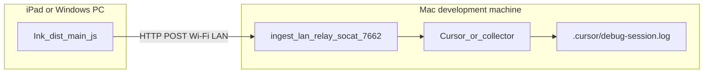

# Debugging Obsidian Ink over Wi‑Fi (LAN ingest)

## Why it exists

Cursor’s debug ingest listens on **localhost only** (`127.0.0.1:7662`). Obsidian on another machine — an **iPad**, or a **Windows PC on the same Wi‑Fi** — cannot reach that socket. If the plugin posts to `127.0.0.1`, it talks to **itself**, not the Mac.

Startup crashes can also happen **before** `Plugin.onload` (while tldraw or other imports evaluate). Logs that wait until `onload` never leave the process.

This pipeline exposes ingest on the LAN, bakes the Mac’s Wi‑Fi IP into a local `dist/` build, and posts a canary **before** the rest of the bundle runs.

For iPad Safari breakpoints, see [Debugging on iPad](debugging-on-ipad.md). For Boox USB (`adb reverse`), see [Debugging on device](debugging-on-device.md).

---

## Conceptual understanding

| Piece | Role |
|--------|------|
| **Baked LAN URL** | `http://<Mac-en0-IPv4>:7662/ingest/<uuid>` inside `dist/main.js` |
| **LAN relay** | `socat` on the Mac: `0.0.0.0:7662` → `127.0.0.1:<target>` |
| **Cursor ingest** | Normal destination when a Debug session owns `127.0.0.1:7662` |
| **Collector** | Python stand-in when Cursor is not listening; writes `.cursor/debug-<session>.log` |
| **Banner / footer** | JS prepended/appended by esbuild so import-time crashes still emit a line |
| **`postCursorDebugIngest`** | Runtime helper used after the plugin module has loaded |



**Mental model:** the remote Obsidian process is a browser/Electron client. It must POST to the **Mac’s LAN IPv4**, never to loopback on the remote OS.

---

## Flows

### 1. Cursor Debug session (preferred)

1. Note **session ID**, **ingest path** (`/ingest/<uuid>`), and log file from the Debug session context.
2. On the Mac: `bash scripts/ingest-lan-relay.sh` (needs `socat`). Allow TCP **7662** if the firewall prompts.
3. Build on the Mac so esbuild bakes **this machine’s** Wi‑Fi IP:

   ```bash
   INK_DEBUG_CURSOR_SESSION_ID=<sessionId> \
   INK_DEBUG_INGEST_PATH=/ingest/<uuid-from-cursor> \
   npm run build
   ```

4. Copy **local** `dist/main.js`, `dist/styles.css`, and `dist/manifest.json` into `<vault>/.obsidian/plugins/ink/` on the remote device. GitHub **internal-test** / community installs do **not** include uncommitted instrumentation.
5. Quit and reopen Obsidian. Reproduce. Read `.cursor/debug-<sessionId>.log` on the Mac.

### 2. No Cursor ingest listener (collector)

Cursor Debug was not bound to `7662` in the Windows startup investigation. The collector gives the relay a destination:

```bash
python3 scripts/ingest-lan-collector.py --host 127.0.0.1 --port 17662 \
  --session <session> --log .cursor/debug-<session>.log
INGEST_RELAY_TARGET_PORT=17662 bash scripts/ingest-lan-relay.sh
```

Use **17662** (or another free port) for the collector so it does not fight Cursor for `127.0.0.1:7662`. The plugin still posts to **LAN `:7662`**; socat forwards to the collector.

Smoke-test from the Mac (hairpin to its own LAN IP) or from the remote PC:

```bash
curl -sS "http://<mac-lan-ip>:7662/"
```

### 3. Reading a startup trace

When ingest env is baked, a successful load looks like:

1. Banner: `plugin bundle started evaluating` (host probe: userAgent, `process.platform`, …)
2. Footer: `plugin bundle finished evaluating` — if this is missing after the banner, the crash was **during imports**
3. `onload entered` with `collectInkHostProbe()` (`isWin`, `isDesktop` / `isMobile` **UI** flags, baked URL)
4. Per-step `start` / `ok` (or `fail` + stack)
5. `onload completed`

Global `window.error` and `unhandledrejection` handlers are installed in the banner.

---

## Technical details

### URL resolution

[`src/logic/utils/cursor-debug-ingest.ts`](../src/logic/utils/cursor-debug-ingest.ts):

1. `localStorage` key `ink-debug-ingest-url` if it starts with `http`
2. Else **`http://<INK_DEBUG_LAN_IPV4>:7662<INK_DEBUG_INGEST_PATH>`** whenever **both** LAN IP and path were baked — including **Windows desktop**, not only `Platform.isMobile`
3. Else `http://127.0.0.1:7662<INGEST_PATH>` for same-machine Mac debugging without a LAN IP

esbuild defines `INK_DEBUG_LAN_IPV4` from `ipconfig getifaddr en0` / `en1` (or `INK_DEBUG_LAN_IPV4` env).

### Early canaries (esbuild banner / footer)

[`esbuild.config.mjs`](../esbuild.config.mjs) injects an IIFE **before** bundled imports and another **after** they finish, only when LAN IP **and** ingest path are non-empty. Posts use **synchronous XHR** (and `sendBeacon` on the banner) so a crash in the next statement can still flush.

### Runtime posts

`postCursorDebugIngest` sends **sync XHR first**, then async Obsidian **`requestUrl`**. Console `[InkDebug]` and vault `.ink-cursor-debug.ndjson` are extras. Default `runId` is `windows-startup-crash` when the caller omits `runId`.

`Plugin.onload` wraps major steps in `runInkOnloadStep` so the last `ok` / `fail` line is the last-known step.

### Related scripts

| Script | Purpose |
|--------|---------|
| `bash scripts/ingest-lan-relay.sh` | `0.0.0.0:7662` → `INGEST_RELAY_TARGET_HOST:INGEST_RELAY_TARGET_PORT` (defaults `127.0.0.1:7662`) |
| `python3 scripts/ingest-lan-collector.py` | HTTP POST sink + CORS; GET `/` returns `{ ok, session, log }` |

---

## Technical Gotchas

- **`127.0.0.1` on Windows is the PC**, on iPad the iPad. Never bake loopback for a remote device. Gating LAN ingest on **`Platform.isMobile` is wrong**: that flag is **UI layout** (`isDesktop` / `isMobile`), not “this is a phone.” A Windows Electron app can report `isMobile: true` while `isMobileApp` is false (tablet UI or leftover `app.emulateMobile(true)`). Leave mobile UI with `app.emulateMobile(false)` in the desktop Developer Tools console (Ctrl+Shift+I).
- **Banner/footer only exist** when the build has **both** `INK_DEBUG_LAN_IPV4` and `INK_DEBUG_INGEST_PATH`. A production CI build on GitHub will not point at your Mac.
- **Duplicate NDJSON lines** for the same breadcrumb are expected: sync XHR plus `requestUrl` (banner also uses `sendBeacon`). The footer posts once (XHR only).
- **Do not bind two servers to `7662`.** Cursor and the Python collector cannot both own `127.0.0.1:7662`. Put the collector on another port and point `INGEST_RELAY_TARGET_PORT` at it.
- **Do not use `fetch`** for ingest on Obsidian mobile; keep **`requestUrl`** for the async path.
- **Copy local `dist/`** for this instrumentation. **`npm run internal-release`** builds committed code on CI only.
- **Never log vault contents or secrets** in ingest payloads.
