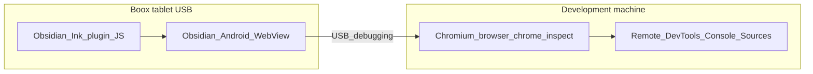

# Debugging Obsidian Ink on a physical device (Boox / Android)

**iPad:** see [Debugging on iPad (USB + Wi‑Fi)](debugging-on-ipad.md) — structured NDJSON ingest (preferred) and Safari Web Inspector.

## Why it exists

Ink behaviour differs between desktop Electron Obsidian and the **Obsidian Android app** (WebView). Stylus, eInk refresh, WebView version, and Boox-specific flows (companion WebSocket) are easiest to validate on real hardware. This page describes how to get **live JavaScript console output, breakpoints, and network traces** onto your development machine so tools such as Cursor can sit beside a running capture.

For **native Android logs** from eInk Bridge (`Log.d`, crashes), use the companion doc: [Debugging eInk Bridge on device](../../eink-bridge/docs/debugging-on-device.md). For **time-correlated** plugin NDJSON + Bridge + `logcat` in one workflow, see [eInk Bridge — Debug logging](../../eink-bridge/docs/implementations/debug-logging.md).

### Cursor Debug + Boox: what can be automated vs manual

| Piece | Who / how |
|-------|-----------|
| **Cursor NDJSON ingest + live Debug panel** | **Cursor only** — starts when you begin a **Debug**-mode agent session. The repo cannot open this listener from a shell script. |
| **`adb reverse tcp:7662 tcp:7662`** + **combined file logs** | **`eink-bridge/scripts/boox-debug-bootstrap.sh`** (sibling repo; runs reverse; **`--force-restart`** stops any existing capture and starts fresh — **Cursor agents must use this flag**). Without the flag, bootstrap skips if capture is already running (human convenience). **`eink-bridge/scripts/start-boox-debug-log-capture.sh`** also runs the same reverse if you start it directly. Both include **`scripts/capture-obsidian-android-webview-console.mjs`** — no separate Node step for normal Bridge + Obsidian work. |

**Agent behaviour:** When Boox USB + Cursor Debug work begins, the agent should follow **`eink-bridge/.cursor/rules/boox-usb-debug-automation.mdc`** when that repo is in the workspace (run reverse + bootstrap on the first turn, bootstrap in the background).

**Live Debug panel vs disk files:** The panel shows lines delivered over the session **HTTP ingest** (`requestUrl` from the plugin / Bridge). Lines that only go to **`.cursor/logs/eink-bridge-*.log`** or **`.cursor/logs/obsidian-webview-*.log`** do **not** automatically appear in that panel — open those files in the editor or ask the agent to **`Read`** them for correlation.

**Manual one-shot:** From the **eink-bridge** repo root: `bash scripts/boox-debug-bootstrap.sh` (add **`--force-restart`** to replace a running capture). Cursor agents: **`eink-bridge/.cursor/rules/boox-usb-debug-automation.mdc`** — always **`--force-restart`**.

---

## Conceptual understanding

| Where Obsidian runs | Shell | Where plugin JS runs | Typical “open DevTools” path |
|---------------------|--------|----------------------|------------------------------|
| Desktop (macOS, Windows, Linux) | **Electron** | Chromium inside Electron | Obsidian: toggle Developer Tools (`Cmd+Opt+I` / `Ctrl+Shift+I`) |
| Android (Boox tablet, phone) | **Android app** (Capacitor) | **System WebView** (Chromium) | **No** built-in console on device — use **USB + Chrome remote debugging** on the Mac/PC |

**Important:** On Boox you are almost always debugging the **Android app**, not Electron. Electron flags such as `--remote-debugging-port` apply to **desktop** binaries, not to Obsidian from the Play Store on a tablet.

Official Obsidian guidance matches this: [Mobile development — Inspecting the webview on the actual mobile device (Android)](https://github.com/obsidianmd/obsidian-developer-docs/blob/main/en/Plugins/Getting%20started/Mobile%20development.md).

---

## Flows



Optional second stream (noisy, not a full substitute for DevTools): some `console` output may also appear in `adb logcat` under Chromium-related tags — see the eInk Bridge debugging doc for filter examples.

---

## Technical details

### Quick deploy (plugin build → tablet)

From `obsidian_ink/`, with the Boox connected over USB:

```bash
npm run build:boox
```

This runs a production build and pushes `main.js`, `manifest.json`, and `styles.css` into configured vault plugin folders via `adb` (see [Development — Deploy to a Boox device](development.md#deploy-to-a-boox-device-usb)). Reload Ink in Obsidian after pushing.

### Prerequisites (Android)

1. On the tablet: **Settings → Developer options → USB debugging** enabled.
2. Connect **USB data** cable directly to the development machine (avoid charge-only cables and flaky hubs if the device does not appear).
3. Unlock the tablet; accept the **Allow USB debugging?** RSA prompt when it appears.
4. On the Mac/PC: `adb devices` should list the device as `device` (not `unauthorized` / `offline`).

### Primary: Chrome DevTools remote debugging

1. On the development machine, open **Chrome** or **Microsoft Edge** (Chromium).
2. Go to [`chrome://inspect/#devices`](chrome://inspect/#devices).
3. Enable **Discover USB devices**.
4. On the tablet, open **Obsidian** and reproduce the issue.
5. Under your device, find the **WebView** entry for Obsidian and click **inspect**.

From here you use the same panels as desktop: **Console**, **Sources** (breakpoints), **Network**, **Performance**. **Screencast** can mirror the tablet UI into DevTools (see [Chrome — Remote debug Android devices](https://developer.chrome.com/docs/devtools/remote-debugging)).

**Advanced (optional):** the same Chrome doc describes attaching via **`adb forward`** to the **Chrome DevTools Protocol** (e.g. listing targets over HTTP) if you want tooling outside the `chrome://inspect` UI.

### Automatic capture: WebView `console.*` → a file (CDP)

The DevTools **Console** UI does **not** offer a built-in “stream every message to disk” mode for remote WebViews. To get the same event stream the Inspect window uses, you attach over the **Chrome DevTools Protocol** and subscribe to:

- **`Runtime.consoleAPICalled`** — `console.log` / `warn` / `error`, etc., after **`Runtime.enable`**
- **`Runtime.exceptionThrown`** — uncaught JS errors
- **`Log.entryAdded`** (optional) — some browser-level messages after **`Log.enable`**

**Ink Suite helper:** For **Bridge + Obsidian** on USB, prefer **`eink-bridge/scripts/start-boox-debug-log-capture.sh`** or **`eink-bridge/scripts/boox-debug-bootstrap.sh`** — they start this Node capture for you alongside eInk Bridge `logcat`. Use the command below **only** when you want **WebView console only** (no Bridge `logcat`).

From the `obsidian_ink/` directory, with Obsidian **open on the tablet** and USB debugging working:

```bash
node scripts/capture-obsidian-android-webview-console.mjs --session-ts "$(date +%Y%m%d-%H%M%S)"
```

Or **`npm run capture:android-webview-console`** from **`obsidian_ink/`** (POSIX shell: npm passes a fresh **`--session-ts`** for you).

This script: resolves **`md.obsidian`**’s process PID (package and local devtools port **9223** are fixed in the script source — change there if you use a different build or port), runs **`adb forward tcp:<port> localabstract:webview_devtools_remote_<pid>`**, reads **`/json/list`**, picks the Obsidian WebView target, opens a **WebSocket** to that target’s `webSocketDebuggerUrl`, enables Runtime/Log, and appends each line to **`<repo>/.cursor/logs/obsidian-webview-<session-ts>.log`** (or under **`DEBUG_CAPTURE_LOG_DIR`** if that env var is set) and stdout. **`--session-ts YYYYMMDD-HHMMSS`** is **required** (run the script with no args to print instructions on stderr). The combined **`start-boox-debug-log-capture.sh`** passes the same slug as **`eink-bridge-<session-ts>.log`**. Stop with **Ctrl+C** (it removes the forward).

This captures **whatever the page logs to the console** — not network traffic. For structured, correlated Ink logs (including `requestUrl` ingest to Cursor), keep using [Debug logging](../../eink-bridge/docs/implementations/debug-logging.md).

### Desktop-first iteration (no tablet)

- **DevTools:** open the vault with your usual workflow (`npm run open-qa`, etc.) and use Obsidian’s Developer Tools. See [Development](development.md).
- **Mobile layout without hardware:** in desktop DevTools **Console**, run:

  ```ts
  this.app.emulateMobile(true);
  ```

  (Documented in Obsidian’s [Mobile development](https://github.com/obsidianmd/obsidian-developer-docs/blob/main/en/Plugins/Getting%20started/Mobile%20development.md) page.)

- **Verbose desktop builds:** `npm run open-qa-verbose` / `npm run open-qa-verbose-mobile` (see [Development](development.md)).

### Structured logs + HTTP ingest (Ink Suite)

When you need durable, ordered NDJSON on the host (especially for race conditions), use **`postCursorDebugIngest`** from [`src/logic/utils/cursor-debug-ingest.ts`](../src/logic/utils/cursor-debug-ingest.ts) — **`requestUrl`**-based ingest, not ad-hoc `fetch`. **iPad:** [Debugging on iPad](debugging-on-ipad.md). **Boox:** [Debug logging](../../eink-bridge/docs/implementations/debug-logging.md) and **`adb reverse`**.

### One command: Bridge `logcat` + Obsidian WebView console (two files)

From the **eink-bridge repository root** (with the Boox on USB, **`adb devices`** showing `device`, Obsidian open, eInk Bridge running if you want PID-scoped native logs):

```bash
cd ../eink-bridge   # when checked out as a sibling of obsidian_ink
bash scripts/start-boox-debug-log-capture.sh
```

This starts **`adb reverse tcp:7662 tcp:7662`** (for Cursor NDJSON ingest over USB), then **both** captures in parallel, and writes timestamped files under **eink-bridge**'s **`.cursor/logs/`** (override with **`DEBUG_CAPTURE_LOG_DIR`**). On each start it **prunes** older **`eink-bridge-*.log`** / **`obsidian-webview-*.log`** in that directory, keeping the **newest 5 per prefix** (set **`BOOX_CAPTURE_LOG_KEEP`** to change). **Bridge `logcat`** and **Obsidian WebView CDP** each **auto-reconnect** within the same session (same timestamped pair of files) when the underlying **`adb`** / process session ends. **Ctrl+C** stops both. Cursor agents run **`bash scripts/boox-debug-bootstrap.sh --force-restart`** from **eink-bridge** in the **background** (restarts capture so the latest scripts load; see **`eink-bridge/.cursor/rules/boox-usb-debug-automation.mdc`**). These commands do not launch Obsidian or Bridge — only port reverse and log capture.

### Boox drawing pipeline context

How the plugin talks to the companion app over loopback WebSocket (separate from DevTools) is documented in [Boox companion app integration](boox-companion-integration.md) (plugin side) and [Obsidian Ink drawing embed integration](../../eink-bridge/docs/implementations/obsidian-ink-embed-integration.md) (Bridge side).

---

## Technical Gotchas

- **`127.0.0.1` on the tablet is the tablet.** HTTP ingest to your Mac requires **LAN IP**, **`adb reverse`**, or the baked LAN URL from a local `npm run build` — details in [Debug logging](../../eink-bridge/docs/implementations/debug-logging.md).
- **Do not use `fetch` inside the plugin for Obsidian mobile ingest**; use the existing **`requestUrl`** path (`universal-dev-logging.ts`).
- **If `chrome://inspect` does not list Obsidian:** try replugging USB with the inspect tab focused, revoking USB debugging authorizations once, or another cable/port. Some release builds or OEM WebView stacks may limit inspection; fall back to structured ingest + `adb logcat` and desktop emulation.
- **CDP capture script:** the Node helper **re-attaches automatically** when the DevTools WebSocket drops (e.g. Obsidian restart → new PID): it re-runs **`pidof`**, refreshes **`adb forward`**, and picks the WebView target again, **appending to the same** `obsidian-webview-<session-ts>.log`. If host port **9223** clashes, change **`ADB_LOCAL_DEVTOOLS_PORT`** in **`obsidian_ink/scripts/capture-obsidian-android-webview-console.mjs`**. The abstract socket name is **`webview_devtools_remote_<pid>`** (Chromium’s WebView convention).
- **eInk Bridge `logcat` (combined capture):** **`start-boox-debug-log-capture.sh`** re-spawns **`adb logcat`** when a session ends, and **polls `pidof` every 2s** while **`--pid`** logcat is running so a Bridge restart is detected even if **`adb logcat`** would otherwise stay open—all **appending to the same** `eink-bridge-<session-ts>.log`. If the app is not running it uses tag-filtered **`logcat`** until a PID exists again.
- **WebView age:** Boox devices depend on **Android System WebView** updates; very old Chromium builds cause subtle JS failures unrelated to Ink.
- **Never log vault contents or secrets** in console or ingest payloads; keep debug data to IDs, counts, geometry, and state flags.
