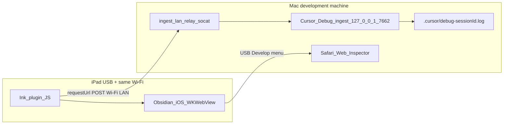

# Debugging Obsidian Ink on iPad (USB + Wi‑Fi)

## Why it exists

Obsidian on iPad runs inside **WKWebView**. Plugin behaviour (stylus, touch routing, embed widgets) differs from desktop Electron. When a Cursor agent debugs with you in **Debug mode**, it needs **runtime evidence** on the Mac — not guesses from code alone.

This page covers **two ways** to get live logs from a **USB-connected iPad** on the same Wi‑Fi as your Mac. Prefer **structured NDJSON ingest** so the agent can read `.cursor/debug-<session>.log` directly.

For Boox / Android, see [Debugging on device (Boox / Android)](debugging-on-device.md).

---

## Conceptual understanding

| Method | What you get | Best for |
|--------|----------------|----------|
| **1. Structured NDJSON → Cursor (preferred)** | Ordered NDJSON in `.cursor/debug-<sessionId>.log` + Cursor Debug panel | Agent-led debugging, hypothesis IDs, before/after log comparison |
| **2. Safari Web Inspector** | Live `console.*` in Mac Safari (Console, Sources, breakpoints) | Interactive inspection, breakpoints, quick human sanity checks |

Both can run together. NDJSON ingest does **not** replace breakpoints — use Safari when you need to pause in Sources.



---

## Flows

### Preferred: structured NDJSON → Cursor

1. Start a **Cursor Debug** agent session — note the **session ID**, **ingest path** (`/ingest/…`), and **log file path** from the system context (e.g. `.cursor/debug-e7cde3.log`).
2. On the Mac, start the LAN relay (Cursor listens on **localhost only**):

   ```bash
   bash scripts/ingest-lan-relay.sh
   ```

   Requires **`socat`** (`brew install socat`). Allows inbound TCP **7662** if macOS Firewall prompts.

3. Build with session values baked in (from `obsidian_ink/`):

   ```bash
   INK_DEBUG_CURSOR_SESSION_ID=<sessionId> \
   INK_DEBUG_INGEST_PATH=/ingest/<uuid-from-cursor> \
   npm run build
   ```

   esbuild also bakes **`INK_DEBUG_LAN_IPV4`** (Mac Wi‑Fi IP at build time) for mobile `requestUrl` posts.

4. **Deploy the built plugin to the iPad** — see [Deploy while debugging](#deploy-while-debugging) below.

5. Reproduce on iPad. The agent reads **`postCursorDebugIngest`** lines from the log file on the Mac.

**Plugin API:** use **`postCursorDebugIngest`** from [`src/logic/utils/cursor-debug-ingest.ts`](../src/logic/utils/cursor-debug-ingest.ts). It uses **`requestUrl`** (required on Obsidian mobile — do **not** use `fetch`). It also mirrors to **`[InkDebug]`** console JSON and appends to **`.ink-cursor-debug.ndjson`** in the vault as a fallback.

**Override ingest URL without rebuild** (Safari console on iPad, one-shot):

```js
localStorage.setItem('ink-debug-ingest-url', 'http://<mac-lan-ip>:7662/ingest/<uuid-from-cursor>')
```

**LAN IP changed?** Re-run `npm run build` on the Mac (or set `ink-debug-ingest-url` as above).

### Secondary: Safari Web Inspector (USB)

1. **iPad:** Settings → Safari → Advanced → **Web Inspector** ON.
2. Connect iPad to Mac with USB. **Mac Safari:** Settings → Advanced → show **Develop** menu.
3. First pairing: **Develop → [iPad] → Connect via Network** (optional after USB pair).
4. Open Obsidian on iPad, reproduce the issue.
5. **Develop → [iPad] → Obsidian** → **Console** (or **Sources** for breakpoints).

Filter for **`Ink verbose:`**, **`[InkDebug]`**, or strings you add during an investigation.

Official references: [WebKit Web Inspector](https://webkit.org/web-inspector/), [Obsidian mobile development](https://github.com/obsidianmd/obsidian-developer-docs/blob/main/en/Plugins/Getting%20started/Mobile%20development.md).

Safari shows console output only — it does **not** populate Cursor’s `.cursor/debug-*.log` unless you also use **`postCursorDebugIngest`**.

---

## Technical details

### Deploy while debugging

| Deploy path | Includes uncommitted debug code? |
|-------------|----------------------------------|
| Copy local **`dist/`** to iPad vault | **Yes** — uses your working tree after `npm run build` |
| **`npm run internal-release`** → install GitHub **`internal-test`** release | **No** — CI builds **committed** code at the tagged commit only |

**Agents must remind you:** before relying on `internal-release` for debug builds, **commit and push**, then tag — or **copy `dist/` manually**. See [`scripts/internal-release.sh`](../scripts/internal-release.sh) and [Development — Internal release](development.md#internal-release-github-actions).

Local copy targets (example):

`/<vault>/.obsidian/plugins/ink/main.js`, `styles.css`, `manifest.json`

Then fully quit and reopen Obsidian (or reload the plugin).

### Instrumentation example

```typescript
import { postCursorDebugIngest } from 'src/logic/utils/cursor-debug-ingest';

postCursorDebugIngest({
  hypothesisId: 'A',
  location: 'my-file.tsx:handler',
  message: 'short description',
  data: { count: 1 },
  runId: 'pre-fix',
});
```

Remove temporary **`postCursorDebugIngest`** calls after the investigation. Leave **`cursor-debug-ingest.ts`** in the repo for future sessions.

### Related tooling

| Script | Purpose |
|--------|---------|
| `bash scripts/ingest-lan-relay.sh` | LAN relay `0.0.0.0:7662` → Cursor `127.0.0.1:7662` |
| Boox USB ingest | [Boox debug automation](../../../.cursor/rules/boox-usb-debug-automation.mdc) + `adb reverse tcp:7662 tcp:7662` |

---

## Technical Gotchas

- **`127.0.0.1` on the iPad is the iPad**, not your Mac. Wi‑Fi ingest needs the **LAN relay** + baked Mac IP, or a full **`ink-debug-ingest-url`** in `localStorage`.
- **Do not use `fetch`** for ingest inside the plugin on mobile; **`postCursorDebugIngest`** uses **`requestUrl`**.
- **Safari console filters** may hide plain `console.debug` lines — `[InkDebug]` and **`Ink verbose:`** (via `universal-dev-logging.ts`) are easier to spot.
- **Simultaneous finger + Apple Pencil** in WKWebView is blocked by iPadOS (one pointer type at a time in the web layer). Native UIKit apps can do both; Obsidian mobile cannot. Do not assume desktop modifier-key behaviour on iPad without device logs.
- **Never log vault contents or secrets** in ingest payloads; use IDs, counts, flags, and geometry only.
- **Internal release CI** runs on GitHub (`ubuntu-latest`); **`INK_DEBUG_LAN_IPV4`** in CI builds is useless for iPad — always build on your Mac for device ingest, or set `localStorage` override.
