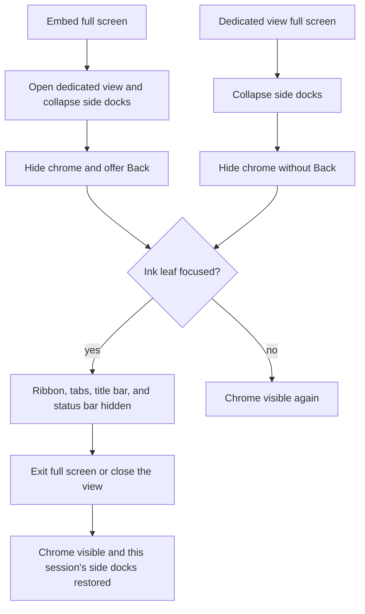

# Dedicated view full screen

## Why it exists

Opening an ink file in a dedicated view collapses the left and right side docks, but Obsidian still draws the left ribbon, the tab strip, the leaf title bar, and the status bar. Those bars take space the canvas could use, and the title bar is the only place Navigate back lives. Full screen hides that chrome for the active ink leaf and puts the controls the title bar used to provide onto the ink menu.

## Conceptual understanding

Full screen is a session on one workspace leaf. It is not a separate view type, and it is not Obsidian's own window full screen.

Two ways in:

- **From an embed.** The embed's full screen control opens the dedicated view. Side docks are already collapsed by that open. The session also hides workspace chrome and remembers that the user came from the note, so the ink menu shows Back beside Exit full screen.
- **From a dedicated view that is already open.** The same menu shows Full screen. That control collapses the side docks and hides workspace chrome. It does not offer Back, because the native title bar (and its back button) returns when the user exits.

Exit full screen drops the body class and, when this session collapsed the side docks, puts them back. Closing the dedicated view does the same. Switching to another leaf shows chrome again immediately; focusing the ink leaf hides it again. The session stays on that leaf until exit or close.

## Flows

### Embed

1. The embed calls `requestInkWorkspaceChromeForNextDedicatedView`, then `openInkFileInView`.
2. `openInkFileInView` collapses the side docks and opens the writing or drawing leaf.
3. Before the first React render, the view calls `applyPendingInkWorkspaceChromeHide`. Chrome is already hidden when the canvas appears.
4. The menu shows Back, then Exit full screen. Back runs the leaf history `back()` — the same action as the hidden title-bar button — which returns to the note and closes the ink view.
5. Exit full screen shows chrome again. The side docks stay collapsed until the dedicated view closes, because this session did not collapse them.

If the dedicated view never opens, the embed cancels the pending request so the next unrelated ink leaf does not inherit it.

### Dedicated view

1. Full screen calls `enterInkWorkspaceChromeHidden` with sidebar collapse and without navigate-back.
2. The menu replaces Full screen with Exit full screen only.
3. Exit restores the side-dock state captured at the start of this session, then shows chrome.

A later save calls `setViewData` again on the same leaf. That must not start a second session or clear the one already running. The pending flag is only for the next open, and it is consumed once.

## Technical details

Session state lives in `src/logic/utils/ink-workspace-chrome.ts`, outside React, because the body class has to be set before the editor's first render and has to survive `setViewData` replacing the React root.

The hidden class is `ddc_ink_hide-workspace-chrome` on `document.body`. `src/styles/ink-workspace-chrome.scss` sets `display: none` on:

- `.workspace-ribbon`
- `.workspace-tab-header-container`
- `.view-header`
- `.status-bar`

`display: none` is required. Obsidian's own rules set `display: flex` on the ribbon and the view header, so a lower-specificity hide does not win. The status bar is `position: fixed`; removing it from layout is what stops it covering the canvas.

The class is applied only while `workspace.activeLeaf` is the leaf that owns the session (`active-leaf-change`). Unloading the plugin calls `releaseInkWorkspaceChromeOnPluginUnload`.

Menu order in the left quick menu, when each control applies: Back, Full screen or Exit full screen, then the finger-drawing toggle. Tooltips are "Back", "Full screen", and "Exit full screen". Embeds only receive the expand handler. Dedicated views only receive enter, exit, and back. `WritingMenu` is not this path; writing and drawing both use `InkCanvasDrawingMenu`.

Back is offered only when this session set `showNavigateBack` and `leaf.history.backHistory` is non-empty. History can arrive after mount, so the control also listens to `history-change`. A dedicated view that enters full screen itself never sets `showNavigateBack`, even if that leaf still has history.

### macOS traffic lights

Hiding the tab strip pulls the ink menu into the title-bar row. On macOS the window traffic lights then cover the first two quick-menu buttons. While chrome is hidden and the window is not in native full screen (`body.is-fullscreen`), `.ink_quick-menu` gets a left margin of two button widths plus the 8px gap between them:

`calc(2 * 2.5 * var(--font-ui-small) + 8px)`

Quick-menu buttons are `2.5em` and Obsidian buttons use `--font-ui-small`. Native full screen already hides the traffic lights, so the inset does not apply then. `--frame-left-space` is not used: it subtracts `--ribbon-width`, and that variable stays set after the ribbon is `display: none`.

## Technical Gotchas

- **Side docks have two owners.** Embed open collapses them and restores them when no ink leaves remain (`restoreSidebarsAfterInkView`). Full screen from an already-open dedicated view captures its own snapshot and restores only that snapshot on exit. Mixing them would pop the docks back while the user is still in the dedicated view, or leave them collapsed after exit.
- **React unmount is not exit.** `setViewData` unmounts the editor root on every save. Exiting chrome from that unmount would flash the ribbon back on each stroke save. Exit runs from the menu and from the view's `onClose`.
- **One session, one leaf.** Entering full screen on a different leaf restores the previous leaf's side-dock snapshot first. `exitInkWorkspaceChromeHidden` ignores a leaf id that does not own the session.
- **Pending hide is one-shot.** It is consumed by the next dedicated view's first `setViewData`. A failed open must cancel it.
- **jsdom does not resolve the macOS `calc()`.** Tests assert the stylesheet rule text, not the computed `margin-left`.
