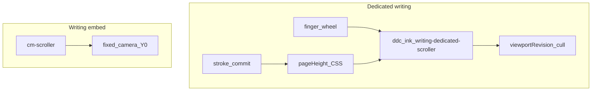

# Dedicated writing: tall HTML page scroll

## Why it exists

Dedicated writing used to scroll by panning **camera Y** on every finger/wheel frame. That forced full React re-renders, outline bounds (`getStroke` × all strokes) for clamp, and expensive remounts — while markdown **embeds** already felt fine because the note’s native scroller moved a mostly fixed camera through the viewport.

Dedicated writing now uses the same model: a **tall HTML page** inside an `overflow-y: auto` scroller so scroll is compositor-native and viewport culling re-evaluates without camera thrash.

Drawing dedicated views still use free pan/zoom (not this architecture).

---

## Conceptual understanding



| Concern | Behavior |
|---|---|
| Scroll | Native scroller, not `setCamera({ y })` |
| Camera | Pinned `x/y = 0`; zoom = `scrollerWidth / WRITING_PAGE_WIDTH` |
| Page size | CSS height = `pageHeight × zoom`; menubar cleared with `padding-top: MENUBAR_HEIGHT_PX` |
| Menus | Absolute overlays **outside** the scroller (do not scroll away) |
| Pen vs finger | Pen pins the dedicated scroller (FingerBlocker); finger scrolls |

---

## Flows

### Grow on write

1. Store notify → approx content maxY → inviting height.
2. `computeDedicatedWritingPageHeight(scrollTop, viewportHeight, zoom, inviting…)` → grow-only page height.
3. `setWritingPageHeight` + `syncDedicatedPageCssHeight`.

**Height growth must not change `scrollTop`.** Extending the page only adds space below; snapping to the bottom jumped ink under the pen. `scrollTop` is rescaled **only** when width-fit **zoom** actually changes (content portion past the fixed menubar padding).

`scrollbar-gutter: stable` on the scroller reduces clientWidth shrink when a scrollbar appears mid-write (which would change zoom and shift content).

### Culling + Boox

`InkSvgCanvas` listens to `.ddc_ink_writing-dedicated-scroller` for `viewportRevision`. Boox overlay updates also listen to that scroller and clamp surface rects to the visible viewport.

Related: [stroke viewport culling](ink-canvas-stroke-viewport-culling.md), [embed scrolling](embed-scrolling.md).

---

## Technical details

| Piece | Location |
|---|---|
| Scroller / page DOM + grow sync | `writing-editor.tsx`, `writing-editor.scss` |
| Scroll-based grow math | `computeDedicatedWritingPageHeight` in `tldraw-helpers.ts` |
| Camera pin / no writing wheel steal | `ink-svg-canvas.tsx` |
| Pen pin on dedicated scroller | `finger-blocker.tsx`, `restore-embed-cm-scroller-scroll.ts` |

DOM shape:

```
.ddc_ink_writing-editor.ddc_ink_dedicated-editor
  ├── .ddc_ink_writing-dedicated-scroller
  │     └── .ddc_ink_writing-dedicated-page  (height: page×zoom; padding-top: menubar)
  │           └── InkSvgCanvas
  ├── .ink_primary-menu-bar   (absolute overlay)
  └── .ink_secondary-menu-bar (absolute overlay)
```

---

## Technical Gotchas

1. **Do not reintroduce camera-Y pan for dedicated writing** — it regresses scroll performance on long pages.
2. **Never snap `scrollTop` to max on grow** — that causes the mid-write jump. Leave `scrollTop` alone for height-only growth.
3. **Legacy tldraw dedicated writing** may still use camera Y; docs under [camera-repositioning-on-resize](camera-repositioning-on-resize.md) describe that older path. Current-format ink-canvas writing uses HTML scroll.
4. **Drawing dedicated views** keep camera pan/zoom — do not apply this tall-page layout there without a separate redesign.
