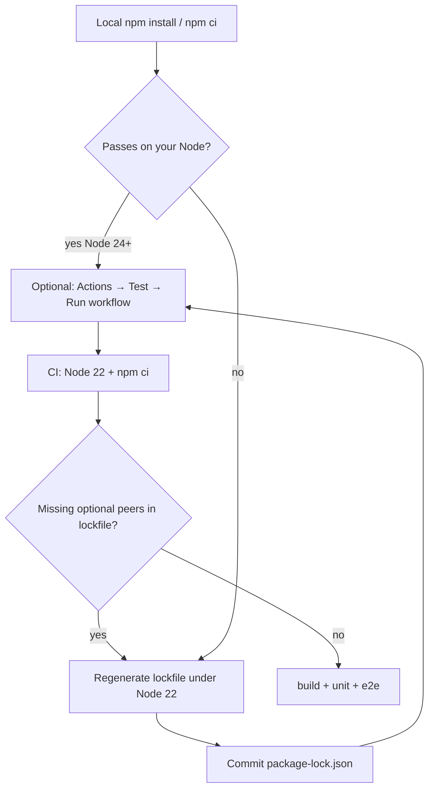
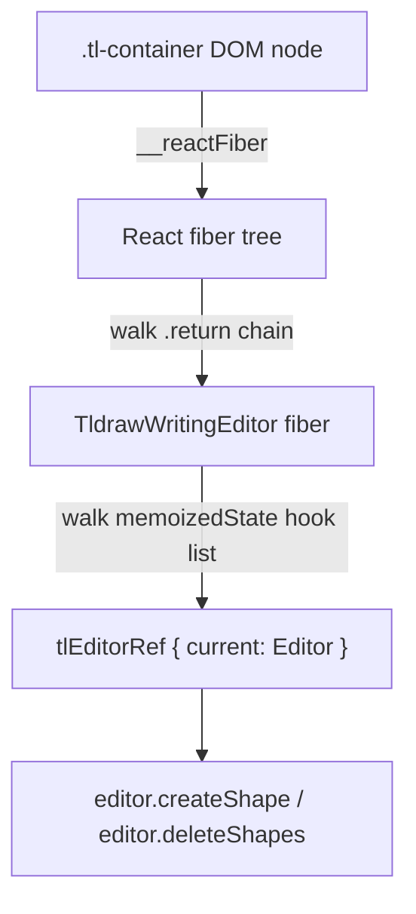

## Development

### Linting (Obsidian conventions)

This repo uses `eslint-plugin-obsidianmd` so Obsidian directory / popout guidelines are checked locally. See **[ESLint and Obsidian plugin conventions](eslint-obsidian-conventions.md)** for why it exists, what to use instead of `document` / `instanceof` / `Vault.delete`, and how Jest polyfills Obsidian globals.

```bash
npx eslint .
```

Config is **flat only** (`eslint.config.mjs`). Do not add a legacy `.eslintrc` — it previously referenced missing `@typescript-eslint/*` packages and fatally broke Obsidian’s hosted SOURCE CODE review.

### Repository license

Ink is licensed under **CC BY-NC-ND 4.0** (not open source). Keep these aligned:

- Root [`LICENSE`](../LICENSE) — official Creative Commons legal text only (no CLA appendix; contributions are covered by [CLA.md](CLA.md))
- `package.json` `"license": "CC-BY-NC-ND-4.0"`
- README license section

**Gotcha:** GitHub’s license detector does not treat CC-BY-NC-ND as a “recognized” OSS license, so the repo may still show `Other` / no SPDX badge even with a correct `LICENSE` file. Obsidian policy still requires a clear LICENSE + disclosure; the README states the NC-ND terms explicitly.

### Testing

This repository has three test modes:

1. **Unit and component tests (Jest)** — Fast, mocked tests for components and utilities.
2. **End-to-end tests (WebdriverIO)** — Automated E2E tests against a real Obsidian instance using [wdio-obsidian-service](https://github.com/jesse-r-s-hines/wdio-obsidian-service).
3. **Manual QA** — The [qa-test-vault](../qa-test-vault/README.md) with generated notes for visual regression testing.

#### Unit and component tests (Jest)

Jest runs with a browser-like environment (jsdom) and React Testing Library for React component tests.

#### What’s installed and why

- @testing-library/react: Render React components and query the DOM in tests (ergonomic, user-focused API).
- @testing-library/jest-dom: Extra DOM matchers for Jest (e.g., `toBeInTheDocument`, `toHaveAttribute`).
- jest-environment-jsdom: Provides a DOM for component tests (since Jest 28 it’s not bundled by default).
- @babel/preset-react: Transforms JSX/TSX so Jest can execute component tests.

#### How Jest is configured

See `jest.config.ts`:

- testEnvironment: `jest-environment-jsdom` so React components can render under a DOM.
- transform: `babel-jest` handles `.ts`, `.tsx`, `.js`, `.jsx` using the top-level `babel.config.js`.
- Babel presets: `@babel/preset-env`, `@babel/preset-typescript`, `@babel/preset-react`.
- moduleNameMapper:
  - Styles (`.scss`, `.css`) → `tests/__mocks__/styleMock.js` (no-ops in Node).
  - SVGs → `tests/__mocks__/fileMock.js`.
  - Absolute imports (`^src/(.*)$`) → `<rootDir>/src/$1`.
  - Plugin/main and host modules:
    - `^src/main$` → `tests/__mocks__/mainMock.js` (prevents loading the real plugin runtime).
    - `^obsidian$` → `tests/__mocks__/obsidianMock.js` (stubs Obsidian types like `Menu`, `Notice`).
- setupFilesAfterEnv: `tests/setupTests.ts` centralizes global mocks.
- transformIgnorePatterns: transpiles modern ESM packages like `chalk` used by logging utilities.

#### Global mocks and helpers

In `tests/setupTests.ts`:

- DOM shims: `window.matchMedia` and `IntersectionObserver` so components relying on these APIs don’t crash.
- Obsidian globals for popout-safe code paths: `Node.prototype.instanceOf` (→ `instanceof`), `activeDocument` / `activeWindow` (→ `document` / `window`). Required because production code uses those APIs and jsdom does not provide them.
- `react-inlinesvg` is mocked to a no-op component (previews render consistently in Node).
- `@tldraw/tldraw` is lightly mocked:
  - Exposes a `TldrawEditor` that immediately calls `onMount` with a minimal `Editor` stub.
  - Provides `ShapeUtil` and placeholders for `defaultTools`, `defaultShapeUtils`, etc., so shape utils/classes can import without failing.
- `src/logic/utils/tldraw-helpers` is mocked to no-op functions (camera, snapshot, etc.).
- `src/logic/utils/getInkFileData` returns a tiny `{ previewUri: 'data:image/png;base64,AAAA' }` by default.
- `src/stores/global-store.getGlobals()` returns a minimal `plugin` with settings and a vault stub (used by v2 preview components).
- `src/logic/utils/storage.embedShouldActivateImmediately()` returns `false` to keep embeds from auto-activating in tests. See [Activate next embed](activate-next-embed.md) for what this flag does in production.

These mocks ensure tests focus on component structure/logic without pulling in heavy runtime dependencies (Obsidian, real tldraw, filesystem).

#### CI install and Node version

**Why it exists** — The Test workflow (`.github/workflows/test.yaml`) is **manual-only** (`workflow_dispatch`). It does not run on push/PR to `main`; run unit/e2e locally, and start Test from Actions only when you want a full CI check. Release workflows (internal/beta/public) never run those tests — they only install and build.

When Test does run, GitHub Actions uses `npm ci` before build and tests. `npm ci` requires `package.json` and `package-lock.json` to be in sync; a lockfile that only “works on your laptop” can still fail that workflow.

**Conceptual understanding** — Local installs often use a newer Node/npm than CI. Different npm majors resolve optional peer dependencies differently. The Test workflow pins **Node 22.x** (ships **npm 10**). A lockfile refreshed only under Node 24 / npm 11 can omit optional peers that npm 10 still expects during `npm ci`.

**Flow**



**Technical details**

- Workflow step: `actions/setup-node@v4` with `node-version: "22.x"`, then `npm ci`.
- A known drift case: `create-wdio` (via `@wdio/cli`) pulls `@inquirer/*` packages with optional peer `@types/node` `>=18`. Under Node 22 / npm 10, `npm ci` expects nested lock entries such as `create-wdio/node_modules/@types/node@26.x` and `undici-types@8.x`. Those entries can be absent if the lockfile was last written only with a newer npm.
- Fix: use Node 22 locally, run `npm install` (or delete `node_modules` and reinstall) so the lockfile records those peers, then verify with `rm -rf node_modules && npm ci` on Node 22 before pushing.

**Technical Gotchas**

- Passing `npm ci` on Node 24 does **not** prove CI will pass — always re-check under Node 22 when touching the lockfile.
- Do not “fix” this by switching CI to `npm install`; keep `npm ci` and keep the lockfile honest for Node 22.
- Root `devDependencies` still pin `@types/node` to `^16` for the project; the nested `create-wdio` peers are separate lock entries and should not force a root `@types/node` bump unless you intentionally change TypeScript’s Node typings.
- Generated QA vault content under `qa-test-vault/` stays gitignored, but **`qa-test-vault/fixtures/` is tracked**. Jest migration tests and `generate.mjs` read those files directly; if they are missing on CI you get `ENOENT` under `qa-test-vault/fixtures/…`.
- **`npm run public-release` / `beta-release` / `internal-release` do not run unit or e2e.** They only push a tag that starts the matching draft/publish release workflow (install + build + package). If Actions “takes forever” after a release, check the job name: a long **Test** / **Run e2e tests** step is a different workflow (and no longer starts automatically on `main`).
- Re-enabling Test on every push/PR is a one-line trigger change in `test.yaml`; do not assume releases will start failing if someone does that — releases never call Test.

#### How to run tests

- **Unit tests** (Jest, with coverage):

```bash
npm test
# or
npm run test:unit
```

Coverage output appears under the `coverage/` directory.

- **E2E tests** (WebdriverIO + Obsidian):

```bash
npm run test:e2e
```

Each E2E run: builds the plugin, downloads test plugins (`scripts/download-test-plugins.sh`), generates the qa-test-vault, then runs WebdriverIO. The first run downloads Obsidian into `.obsidian-cache/`. Requires Node.js and a supported OS (Windows, macOS, Linux).

**E2E scripts**

| Script | Command | Purpose |
|--------|---------|---------|
| `test:e2e` | `wdio run ./wdio.conf.mts` (after build + plugins + vault) | Full E2E run (latest + beta when available) |
| `test:e2e:spec` | same + `--spec` (pass path after `--`) | Single spec file |
| `test:e2e:versions` | `node scripts/show-e2e-versions.mjs` | Print which Obsidian version(s) will be tested |
| `test:e2e:latest` | `OBSIDIAN_VERSIONS=latest/latest npm run test:e2e` | E2E against latest (stable) only |
| `test:e2e:beta` | `OBSIDIAN_VERSIONS=latest-beta/latest npm run test:e2e` | E2E against latest-beta only (requires Insiders; see below) |

Example for a single spec:

```bash
npm run test:e2e:spec -- tests/e2e/undo-redo.e2e.ts
```

**E2E Obsidian versions** — E2E runs against **latest (stable)** and **latest-beta** when available. Each run logs the version(s) at startup. Use `npm run test:e2e:versions` to see which versions will be tested without running the full suite. Use `npm run test:e2e:latest` to run only against latest (skipping beta) or `npm run test:e2e:beta` to run only against beta, for faster or targeted iteration. Override with `OBSIDIAN_VERSIONS` for ad-hoc testing (e.g. `OBSIDIAN_VERSIONS=latest/latest`). Pinned versions (e.g. `1.4.0/1.4.0`) are not used in normal development. The CI cache key reflects the resolved versions, so it updates when beta availability changes.

**E2E credentials for Obsidian beta** — Obsidian beta builds require an Obsidian Insiders account. Set `OBSIDIAN_EMAIL` and `OBSIDIAN_PASSWORD` before running `test:e2e:beta` or any E2E run that includes beta:

- **Option 1 (env vars):** `export OBSIDIAN_EMAIL="your@email.com"` and `export OBSIDIAN_PASSWORD="your-password"` before running.
- **Option 2 (`.env` file):** Create `obsidian_ink/.env` with `OBSIDIAN_EMAIL=...` and `OBSIDIAN_PASSWORD=...`. Ensure `.env` is in `.gitignore`. The wdio-obsidian-service and obsidian-launcher tooling load these when present.
- **CI:** The workflow uses these from repository secrets for the full E2E run (including beta when available).

**E2E popup handling**

Both Ink and Excalidraw are pre-seeded so their welcome popups do not appear:

1. **Ink** — `generate.mjs` pre-seeds `.obsidian/plugins/ink/data.json` with `welcomeTipRead: true` and `lastVersionTipRead` set. The onboarding spec explicitly resets these flags and reloads the plugin to test the first-run flow.
2. **Excalidraw** — `generate.mjs` pre-seeds `.obsidian/plugins/obsidian-excalidraw-plugin/data.json` with `previousRelease` set to the installed plugin version, so the release notes modal does not show.

`tests/e2e/helpers/dismiss-popups.ts` provides `dismissBlockingPopups()` as a fallback (e.g. Ink notice if pre-seed ever fails). Every E2E spec’s `before` hook (except onboarding) calls it after `reloadObsidian` and `waitForPluginReady`.

**Skipped specs** — `embeds-in-admonition.e2e.ts` and `embeds-in-columns.e2e.ts` are skipped with `describe.skip` because Ink embeds inside Admonition code fences or column layouts do not render in the e2e environment (content in code blocks is opaque to the markdown parser; column layouts may require additional setup such as the MCL CSS snippet).

- **Manual vault inspection** (open Obsidian without running tests):

```bash
npm run open-qa
```

This builds the plugin, regenerates the vault from scratch (clearing all plugin data), and launches Obsidian with the vault loaded. Obsidian stays open until you close it manually. Changes made during the session are discarded — the vault is copied to a temporary directory first, so the source `qa-test-vault/` folder is not modified.

Use this when you want to manually inspect the plugin's behaviour against specific test scenarios, try out new features, or debug issues interactively.

**Legacy migration progress UI:** Section **19 – Migration Progress Density** (see [qa-test-vault/README.md](../qa-test-vault/README.md)) seeds many unique `.writing` / `.drawing` files so **Migrate legacy ink embeds** scan/migrate progress bars and counters update visibly mid-run. Details: [file-format-and-conversion.md](./file-format-and-conversion.md#vault-migration-v1-code-blocks).

For debugging with verbose logs (e.g. embed state transitions, activity tracking), use `npm run open-qa-verbose` instead. It builds in development mode so `verbose`, `debug`, and `http` logs appear in the DevTools console.

For mobile UI emulation on desktop, use:

```bash
npm run open-qa-mobile
```

And the verbose variant:

```bash
npm run open-qa-verbose-mobile
```

These scripts set `INK_EMULATE_MOBILE=true` at build time and the plugin calls `app.emulateMobile(true)` on load.

#### Deploy to a Boox device (USB)

When testing on a physical Boox (or any Android device running Obsidian), you can build and push `dist/` straight into vault plugin folders over USB with `adb`. The script does **not** overwrite `data.json` (plugin settings are preserved).

**Prerequisites**

- Android platform-tools (`adb`) on your development machine
- Tablet: USB debugging enabled, device unlocked, RSA prompt accepted
- `adb devices` shows exactly one device in the `device` state

**Scripts** (run from `obsidian_ink/`)

| Script | Command | Purpose |
|--------|---------|---------|
| `build:boox` | `npm run build` then push | Production build and deploy to configured vault paths |
| `push:boox` | `bash scripts/push-plugin-to-boox.sh` | Push existing `dist/` only |
| | `npm run push:boox -- --skip-build` | Same as `push:boox` when you already built |

```bash
npm run build:boox
```

After a successful push, reload Ink on the tablet (toggle the plugin under **Settings → Community plugins**, or restart Obsidian).

#### Deploy to iPad while debugging

There is no `adb` push script for iPad. For **Cursor Debug** work, prefer copying a **local build** into the vault on the device:

1. From `obsidian_ink/`, run `npm run build` (optionally with `INK_DEBUG_CURSOR_SESSION_ID` / `INK_DEBUG_INGEST_PATH` — see [Debugging on iPad](debugging-on-ipad.md)).
2. Copy `dist/main.js`, `dist/styles.css`, and `dist/manifest-beta.json` (rename to `manifest.json`) into `<vault>/.obsidian/plugins/ink/`.
3. Quit and reopen Obsidian.

**Do not assume `npm run internal-release` includes uncommitted debug code** — see [Internal release](#internal-release-github-actions) below.

#### Internal release (GitHub Actions)

Release tag scripts only start **build-and-package** workflows — never the Test workflow:

| Script | Tag pattern | Workflow | Runs tests? |
|--------|-------------|----------|-------------|
| `npm run internal-release` | `internal-test` | Publish internal release | No |
| `npm run beta-release <tag>` | `*-beta` | Draft beta release | No |
| `npm run public-release <tag>` | semver | Draft public release | No |
| Actions → Test → Run workflow | (manual) | Test | Yes (unit + e2e) |

`npm run internal-release` runs [`scripts/internal-release.sh`](../scripts/internal-release.sh). It **does not build locally**. It moves the **`internal-test`** git tag to **current HEAD** and pushes it; **GitHub Actions** builds from that **committed** snapshot and publishes release assets.

| You need… | Do this |
|-----------|---------|
| Quick debug iteration with local changes | `npm run build` → copy **`dist/`** to device |
| Install via GitHub **internal-test** release | **Commit + push** your branch, then `npm run internal-release`, wait for CI, reinstall from the new release |

Uncommitted files and your local **`dist/`** folder are **never** included in the internal release artifact.

**Default vault paths**

Unless overridden, artifacts are pushed to:

- `/storage/emulated/0/Documents/Testing/.obsidian/plugins/ink`
- `/storage/emulated/0/Android/data/md.obsidian/files/Imagination and Inquiry/.obsidian/plugins/ink`

**Custom vaults**

Set colon-separated remote plugin directories:

```bash
INK_BOOX_PLUGIN_DIRS="/storage/emulated/0/Documents/MyVault/.obsidian/plugins/ink" npm run build:boox
```

Implementation: `scripts/push-plugin-to-boox.sh` (`--help` for options).

For USB debugging, log capture, and Chrome remote DevTools, see [Debugging on device (Boox / Android)](debugging-on-device.md). For eInk Bridge + Ink together, see sibling **`eink-bridge/scripts/boox-debug-bootstrap.sh`** and [Boox companion app integration](boox-companion-integration.md).

#### Writing new tests

General guidelines:

- Prefer React Testing Library for rendering and queries:

```ts
import { render, screen } from '@testing-library/react';
import { Provider as JotaiProvider } from 'jotai';
import Component from 'src/components/...';

test('renders component', () => {
  render(
    <JotaiProvider>
      <Component {...props} />
    </JotaiProvider>
  );
  expect(screen.getByText('...')).toBeInTheDocument();
});
```

- Wrap components that use Jotai atoms with `JotaiProvider`.
- For components expecting Obsidian types like `TFile`, pass a simple stub: `{ path: 'path/to/file', vault: { read: jest.fn() } }`.
- v1 preview components often fetch `previewUri` via `getInkFileData` (already mocked). Assertions can target visible container classes (e.g., `.ddc_ink_*` root nodes) or callouts.
- v2 preview components may call `getGlobals()`. The mock returns a minimal `plugin` object and vault for `getResourcePath`, so you can pass a `TFile` stub.
- If you trigger state updates (e.g., clicking to switch modes), consider wrapping in React Testing Library’s `act(async () => { ... })` or use `await` for effects to settle.
- If you add components that import additional asset types, map them in `moduleNameMapper` (e.g., fonts, images) to a simple mock file.

Folder conventions:

- Existing tests live under `tests/...` and `src/.../*.test.ts`. Follow the current pattern:
  - Component tests: `tests/components/.../*.test.tsx` mirroring the component path
  - Utility tests: colocated in `src/logic/utils/*.test.ts`

What to assert:

- Aim for behavior and user-visible output rather than implementation details.
- For preview components, asserting the presence of preview containers and basic props is sufficient.
- For editor wrappers, asserting that the wrapper renders without crashing and mounts the editor is sufficient given the heavy runtime is mocked.

Adding new mocks:

- If a new dependency fails in Node (e.g., a new browser API or library), add a light mock to `tests/setupTests.ts`.
- If you need to bypass a new host module (e.g., a different Obsidian entry), add a `moduleNameMapper` entry to redirect it to a mock file under `tests/__mocks__/`.

#### Embed lock/unlock — test coverage

The lock/unlock round-trip is covered end-to-end by `tests/e2e/embed-lock-unlock.e2e.ts`. There is one `describe` block per embed type and each reloads Obsidian with the qa-test-vault before running.

| Describe block | File opened | What it tests |
|---|---|---|
| Current Writing | `01 - Basic Embeds/Single Writing Embed.md` | Click preview to unlock → editor mounts; click lock button → preview returns, editor unmounts. |
| Current Drawing | `01 - Basic Embeds/Single Drawing Embed.md` | Same round-trip for drawing embeds. |
| Legacy v1 Writing | `02 - Legacy Format/V1 Writing Embed.md` | Same round-trip for v1 writing code-block embeds. |
| Legacy v1 Drawing | `02 - Legacy Format/V1 Drawing Embed.md` | Round-trip test + a second test that reads the `handdrawn-ink` code block from the vault file after locking and calls `JSON.parse()` on it, guarding against the regression where the wrong `replaceRange` end position caused properties to be appended outside the closing brace. |

#### Legacy embed migration — test coverage

Migration from legacy v1 code-block embeds to current-format SVG embeds is covered by unit tests and E2E tests.

**Unit test coverage** (`tests/components/formats/current/utils/MigrationLogic.test.ts`)

| Function | What it tests |
|---|---|
| `findLegacyEmbedBlocks` | Single/multiple embeds, v2 exclusion, malformed JSON, missing filepath. |
| `getLegacySvgPath` | Extension replacement for `.writing`/`.drawing`, paths with dots. |
| `scanVaultForLegacyEmbeds` | Empty vault, no legacy embeds, one/multiple legacy files, missing legacy file, `onProgress` callback, read error handling. |
| `convertLegacyToInkCanvasFileData` | v1 → ink-canvas: writing/drawing, `meta.transcript`, real fixture round-trip, invalid/missing JSON. |
| `v1-bulk-ink-canvas-migration.test.ts` | 50× conversion (25 writing + 25 drawing) from real legacy fixtures. |
| `replaceLegacyBlockInMarkdown` | Replace block, preserve surrounding content, replace all occurrences. |
| `executeMigration` | Updates all affected notes, overwrite when SVG exists, parse failure, create/overwrite/delete failure, `onProgress` callback. |

**E2E test coverage** (`tests/e2e/migration.e2e.ts`)

| Test | What it tests |
|---|---|
| Legacy writing/drawing embed renders before migration | Pre-migration state. |
| Migration modal, scan, execute | Full migration flow; migrated SVG contains `<ink-canvas version="0.5.0">`. |
| Migrated writing embed renders | Post-migration writing embed displays. |
| Migrated drawing embed renders | Post-migration drawing embed displays. |
| Mixed format note | Only legacy embed updated; current format unchanged. |
| Idempotent, cancel, multi-note | Second run finds nothing; cancel leaves files unchanged; all affected notes updated. |

#### Buffer lines resize — test coverage

The buffer lines resize system has a dedicated test suite split across two tiers.

**How the resize decision works**

The resize guard is a three-condition predicate extracted into `shouldResizeForNewHeight(newHeight, curHeight, bufferLines)` in `tldraw-helpers.ts`:

```
curHeight === null          → always resize  (first open)
newHeight < curHeight       → always resize  (content shrank / erase)
newHeight > curHeight + (bufferLines - 1) * WRITING_LINE_HEIGHT
                            → resize         (content grew past buffer zone)
otherwise                  → no resize
```

`resizeWritingTemplateInvitinglyIfNecessary` calls this predicate and delegates to it, so the guard can be unit-tested without a live tldraw editor.

**Unit test coverage** (`tests/components/formats/current/utils/`)

| File | What it tests |
|---|---|
| `ResizeWritingGuard.test.ts` | Every branch of `shouldResizeForNewHeight`: first stroke, no-resize within buffer, resize at exhaustion, erase shrink, buffer setting sensitivity, threshold uses `WRITING_LINE_HEIGHT`, full 9-line fixture sequence, sequential erase, add→erase→add pattern. |
| `CropWritingHeight.test.ts` | `cropWritingStrokeHeightInvitingly` and `cropWritingStrokeHeightTightly` including a `bufferLines=3` successive-lines group that validates the formula against all 9 fixture lines. |

**E2E test coverage** (`tests/e2e/buffer-lines.e2e.ts`)

Tests are grouped by scenario; each group reloads Obsidian to guarantee a clean `curHeight` starting state.

| Group | What it tests |
|---|---|
| Settings | Default value is 3, setting appears in UI, persists after save. |
| Mount Resize | Fixture file (9 lines) mounts at expected height; bufferLines=1 produces smaller height; height is a multiple of 0.5 × `WRITING_LINE_HEIGHT`. |
| Sequential Add | Two strokes same line → no resize; lines 1–2 within buffer → no resize; line 3 → resize; lines 4–5 no resize; line 6 → resize. |
| Sequential Erase | Erase line 6 down to line 1 one at a time → height decreases on every step. |
| Add, Erase, Add Again | Re-adding content within the buffer zone after an erase does not cause extra resizes; re-adding past the threshold does. |
| Minimum Height Floor | Template height is never below `WRITING_MIN_PAGE_HEIGHT` (375 px). |
| Setting Respected at Runtime | Changing `writingBufferLines` mid-session takes effect on the very next stroke without a reload. |

**How E2E tests access the tldraw editor**

The E2E tests need to programmatically create and delete tldraw draw shapes to drive the resize logic. Because the editor lives inside a React component ref, the tests locate it via React fiber traversal starting from the `.tl-container` DOM element:



The helper installs itself on `window.__inkTest` once (via `installBrowserHelpers()`) so the closure over `findTldrawEditor` is preserved across `browser.execute()` calls. Shape IDs are tracked in `window.__inkTest.shapeIds` for ordered erasure.

Troubleshooting:

- Syntax errors in `.tsx` tests usually mean Babel isn’t transforming JSX/TSX — ensure `@babel/preset-react` is installed and present in `babel.config.js`.
- Errors complaining about missing DOM APIs (e.g., `matchMedia`, `IntersectionObserver`) — add or extend shims in `tests/setupTests.ts`.
- ESM packages failing with “Cannot use import statement outside a module” — add them to `transformIgnorePatterns` or mock them.

### Related documentation

- [ESLint and Obsidian plugin conventions](eslint-obsidian-conventions.md) — `eslint-plugin-obsidianmd`, popout-safe DOM, trashFile, sentence-case exceptions, Jest polyfills.
- [Ink canvas: live drawing vs committed strokes](ink-canvas-live-drawing.md) — Live preview path vs stored stroke on pointer up (`InkSvgCanvas`, `draw-tool`).
- [Ink canvas: stroke viewport culling](ink-canvas-stroke-viewport-culling.md) — Render-only skip of off-screen mounts + path `d` / approx maxY caches.
- [Dedicated writing: tall HTML page scroll](dedicated-writing-html-scroll.md) — Native scroller instead of camera-Y pan for long writing pages.
- [Ink canvas: capture-time point merge](ink-canvas-point-merge.md) — Hybrid append/replace-tip merge for fast smoothness and slow curves.
- [Ink canvas: zoom-scaled stroke smoothing](ink-canvas-zoom-scaled-strokes.md) — How capture zoom scales streamline, smoothing, and duplicate-point merge at reference 1×.
- [Pan and zoom](pan-zoom.md) — Drawing editor gestures, modifier+wheel direction (mouse vs trackpad pinch), and zoom math (`InkSvgCanvas`).
- [Embed scrolling](embed-scrolling.md) — How `FingerBlocker` coordinates note scrolling with ink embed input and pan/zoom.
- [Debugging on device (Boox / Android)](debugging-on-device.md) — USB remote DevTools for the Obsidian Android WebView, desktop vs Electron vs mobile, and links to native `logcat` + correlated ingest workflows in eInk Bridge docs.
- [File format and conversion](file-format-and-conversion.md) — Ink SVG structure, drawing↔writing conversion flow, and preview preservation.
- [Blocked features](blocked-features.md) — Features that are incomplete or non-functional and what's needed to unblock them.
- [Undo/redo for ink embeds](undo-redo.md) — Conceptual approach and alternatives.
- [Undo/redo implementation](undo-redo-implementation.md) — Technical details, data flow, and integration points.


