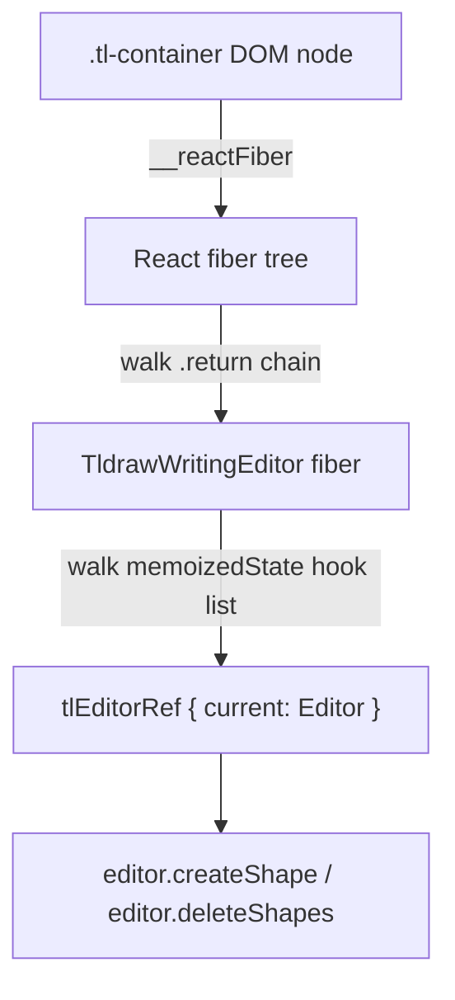

## Development

### Testing

This repository has three test modes:

1. **Unit and component tests (Jest)** — Fast, mocked tests for components and utilities.
2. **End-to-end tests (WebdriverIO)** — Automated E2E tests against a real Obsidian instance using [wdio-obsidian-service](https://github.com/jesse-r-s-hines/wdio-obsidian-service).
3. **Manual QA** — The [qa-test-vault](../qa-test-vault/README.md) with generated notes for visual regression testing.

#### Unit and component tests (Jest)

Jest runs with a browser-like environment (jsdom) and React Testing Library for React component tests.

#### What’s installed and why

- @testing-library/react: Render React components and query the DOM in tests (ergonomic, user-focused API).
- @testing-library/jest-dom: Extra DOM matchers for Jest (e.g., `toBeInTheDocument`, `toHaveAttribute`).
- jest-environment-jsdom: Provides a DOM for component tests (since Jest 28 it’s not bundled by default).
- @babel/preset-react: Transforms JSX/TSX so Jest can execute component tests.

#### How Jest is configured

See `jest.config.ts`:

- testEnvironment: `jest-environment-jsdom` so React components can render under a DOM.
- transform: `babel-jest` handles `.ts`, `.tsx`, `.js`, `.jsx` using the top-level `babel.config.js`.
- Babel presets: `@babel/preset-env`, `@babel/preset-typescript`, `@babel/preset-react`.
- moduleNameMapper:
  - Styles (`.scss`, `.css`) → `tests/__mocks__/styleMock.js` (no-ops in Node).
  - SVGs → `tests/__mocks__/fileMock.js`.
  - Absolute imports (`^src/(.*)$`) → `<rootDir>/src/$1`.
  - Plugin/main and host modules:
    - `^src/main$` → `tests/__mocks__/mainMock.js` (prevents loading the real plugin runtime).
    - `^obsidian$` → `tests/__mocks__/obsidianMock.js` (stubs Obsidian types like `Menu`, `Notice`).
- setupFilesAfterEnv: `tests/setupTests.ts` centralizes global mocks.
- transformIgnorePatterns: transpiles modern ESM packages like `chalk` used by logging utilities.

#### Global mocks and helpers

In `tests/setupTests.ts`:

- DOM shims: `window.matchMedia` and `IntersectionObserver` so components relying on these APIs don’t crash.
- `react-inlinesvg` is mocked to a no-op component (previews render consistently in Node).
- `@tldraw/tldraw` is lightly mocked:
  - Exposes a `TldrawEditor` that immediately calls `onMount` with a minimal `Editor` stub.
  - Provides `ShapeUtil` and placeholders for `defaultTools`, `defaultShapeUtils`, etc., so shape utils/classes can import without failing.
- `src/logic/utils/tldraw-helpers` is mocked to no-op functions (camera, snapshot, etc.).
- `src/logic/utils/getInkFileData` returns a tiny `{ previewUri: 'data:image/png;base64,AAAA' }` by default.
- `src/stores/global-store.getGlobals()` returns a minimal `plugin` with settings and a vault stub (used by v2 preview components).
- `src/logic/utils/storage.embedShouldActivateImmediately()` returns `false` to keep embeds from auto-activating in tests.

These mocks ensure tests focus on component structure/logic without pulling in heavy runtime dependencies (Obsidian, real tldraw, filesystem).

#### How to run tests

- **Unit tests** (Jest, with coverage):

```bash
npm test
# or
npm run test:unit
```

Coverage output appears under the `coverage/` directory.

- **E2E tests** (WebdriverIO + Obsidian):

```bash
npm run test:e2e
```

This builds the plugin, regenerates the qa-test-vault, and runs E2E specs against Obsidian. The first run downloads Obsidian into `.obsidian-cache/`. Requires Node.js and a supported OS (Windows, macOS, Linux).

- **Manual vault inspection** (open Obsidian without running tests):

```bash
npm run open-qa
```

This builds the plugin, regenerates the vault from scratch (clearing all plugin data), and launches Obsidian with the vault loaded. Obsidian stays open until you close it manually. Changes made during the session are discarded — the vault is copied to a temporary directory first, so the source `qa-test-vault/` folder is not modified.

Use this when you want to manually inspect the plugin's behaviour against specific test scenarios, try out new features, or debug issues interactively.

#### Writing new tests

General guidelines:

- Prefer React Testing Library for rendering and queries:

```ts
import { render, screen } from '@testing-library/react';
import { Provider as JotaiProvider } from 'jotai';
import Component from 'src/components/...';

test('renders component', () => {
  render(
    <JotaiProvider>
      <Component {...props} />
    </JotaiProvider>
  );
  expect(screen.getByText('...')).toBeInTheDocument();
});
```

- Wrap components that use Jotai atoms with `JotaiProvider`.
- For components expecting Obsidian types like `TFile`, pass a simple stub: `{ path: 'path/to/file', vault: { read: jest.fn() } }`.
- v1 preview components often fetch `previewUri` via `getInkFileData` (already mocked). Assertions can target visible container classes (e.g., `.ddc_ink_*` root nodes) or callouts.
- v2 preview components may call `getGlobals()`. The mock returns a minimal `plugin` object and vault for `getResourcePath`, so you can pass a `TFile` stub.
- If you trigger state updates (e.g., clicking to switch modes), consider wrapping in React Testing Library’s `act(async () => { ... })` or use `await` for effects to settle.
- If you add components that import additional asset types, map them in `moduleNameMapper` (e.g., fonts, images) to a simple mock file.

Folder conventions:

- Existing tests live under `tests/...` and `src/.../*.test.ts`. Follow the current pattern:
  - Component tests: `tests/components/.../*.test.tsx` mirroring the component path
  - Utility tests: colocated in `src/logic/utils/*.test.ts`

What to assert:

- Aim for behavior and user-visible output rather than implementation details.
- For preview components, asserting the presence of preview containers and basic props is sufficient.
- For editor wrappers, asserting that the wrapper renders without crashing and mounts the editor is sufficient given the heavy runtime is mocked.

Adding new mocks:

- If a new dependency fails in Node (e.g., a new browser API or library), add a light mock to `tests/setupTests.ts`.
- If you need to bypass a new host module (e.g., a different Obsidian entry), add a `moduleNameMapper` entry to redirect it to a mock file under `tests/__mocks__/`.

#### Embed lock/unlock — test coverage

The lock/unlock round-trip is covered end-to-end by `tests/e2e/embed-lock-unlock.e2e.ts`. There is one `describe` block per embed type and each reloads Obsidian with the qa-test-vault before running.

| Describe block | File opened | What it tests |
|---|---|---|
| Current Writing | `01 - Basic Embeds/Single Writing Embed.md` | Click preview to unlock → editor mounts; click lock button → preview returns, editor unmounts. |
| Current Drawing | `01 - Basic Embeds/Single Drawing Embed.md` | Same round-trip for drawing embeds. |
| Legacy v1 Writing | `02 - Legacy Format/V1 Writing Embed.md` | Same round-trip for v1 writing code-block embeds. |
| Legacy v1 Drawing | `02 - Legacy Format/V1 Drawing Embed.md` | Round-trip test + a second test that reads the `handdrawn-ink` code block from the vault file after locking and calls `JSON.parse()` on it, guarding against the regression where the wrong `replaceRange` end position caused properties to be appended outside the closing brace. |

#### Buffer lines resize — test coverage

The buffer lines resize system has a dedicated test suite split across two tiers.

**How the resize decision works**

The resize guard is a three-condition predicate extracted into `shouldResizeForNewHeight(newHeight, curHeight, bufferLines)` in `tldraw-helpers.ts`:

```
curHeight === null          → always resize  (first open)
newHeight < curHeight       → always resize  (content shrank / erase)
newHeight > curHeight + (bufferLines - 1) * WRITING_LINE_HEIGHT
                            → resize         (content grew past buffer zone)
otherwise                  → no resize
```

`resizeWritingTemplateInvitinglyIfNecessary` calls this predicate and delegates to it, so the guard can be unit-tested without a live tldraw editor.

**Unit test coverage** (`tests/components/formats/current/utils/`)

| File | What it tests |
|---|---|
| `ResizeWritingGuard.test.ts` | Every branch of `shouldResizeForNewHeight`: first stroke, no-resize within buffer, resize at exhaustion, erase shrink, buffer setting sensitivity, threshold uses `WRITING_LINE_HEIGHT`, full 9-line fixture sequence, sequential erase, add→erase→add pattern. |
| `CropWritingHeight.test.ts` | `cropWritingStrokeHeightInvitingly` and `cropWritingStrokeHeightTightly` including a `bufferLines=3` successive-lines group that validates the formula against all 9 fixture lines. |

**E2E test coverage** (`tests/e2e/buffer-lines.e2e.ts`)

Tests are grouped by scenario; each group reloads Obsidian to guarantee a clean `curHeight` starting state.

| Group | What it tests |
|---|---|
| Settings | Default value is 3, setting appears in UI, persists after save. |
| Mount Resize | Fixture file (9 lines) mounts at expected height; bufferLines=1 produces smaller height; height is a multiple of 0.5 × `WRITING_LINE_HEIGHT`. |
| Sequential Add | Two strokes same line → no resize; lines 1–2 within buffer → no resize; line 3 → resize; lines 4–5 no resize; line 6 → resize. |
| Sequential Erase | Erase line 6 down to line 1 one at a time → height decreases on every step. |
| Add, Erase, Add Again | Re-adding content within the buffer zone after an erase does not cause extra resizes; re-adding past the threshold does. |
| Minimum Height Floor | Template height is never below `WRITING_MIN_PAGE_HEIGHT` (375 px). |
| Setting Respected at Runtime | Changing `writingBufferLines` mid-session takes effect on the very next stroke without a reload. |

**How E2E tests access the tldraw editor**

The E2E tests need to programmatically create and delete tldraw draw shapes to drive the resize logic. Because the editor lives inside a React component ref, the tests locate it via React fiber traversal starting from the `.tl-container` DOM element:



The helper installs itself on `window.__inkTest` once (via `installBrowserHelpers()`) so the closure over `findTldrawEditor` is preserved across `browser.execute()` calls. Shape IDs are tracked in `window.__inkTest.shapeIds` for ordered erasure.

Troubleshooting:

- Syntax errors in `.tsx` tests usually mean Babel isn’t transforming JSX/TSX — ensure `@babel/preset-react` is installed and present in `babel.config.js`.
- Errors complaining about missing DOM APIs (e.g., `matchMedia`, `IntersectionObserver`) — add or extend shims in `tests/setupTests.ts`.
- ESM packages failing with “Cannot use import statement outside a module” — add them to `transformIgnorePatterns` or mock them.


