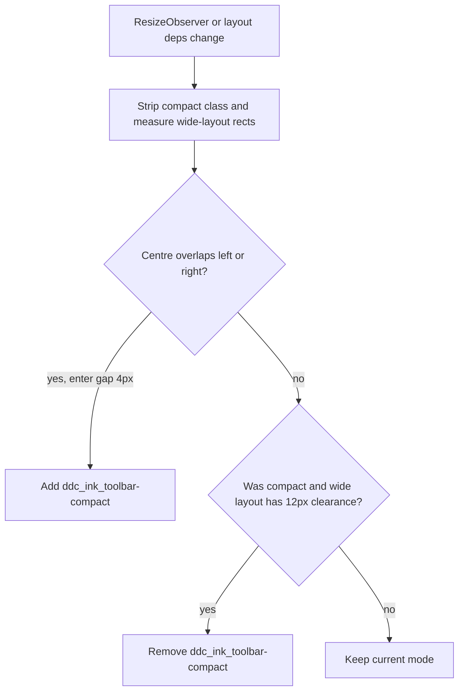
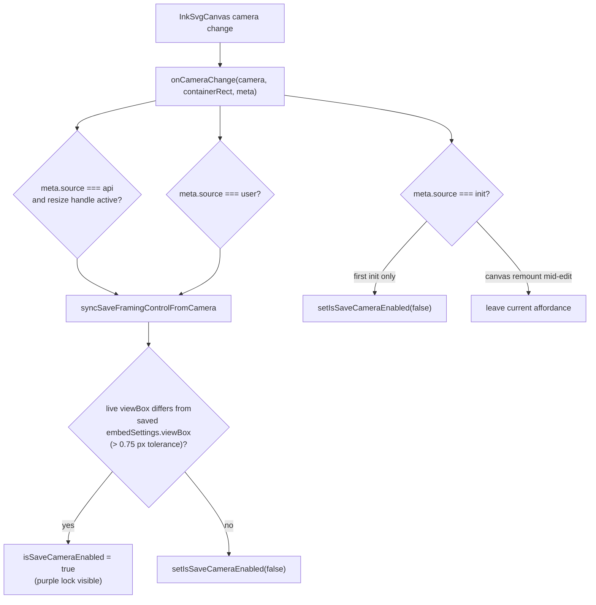
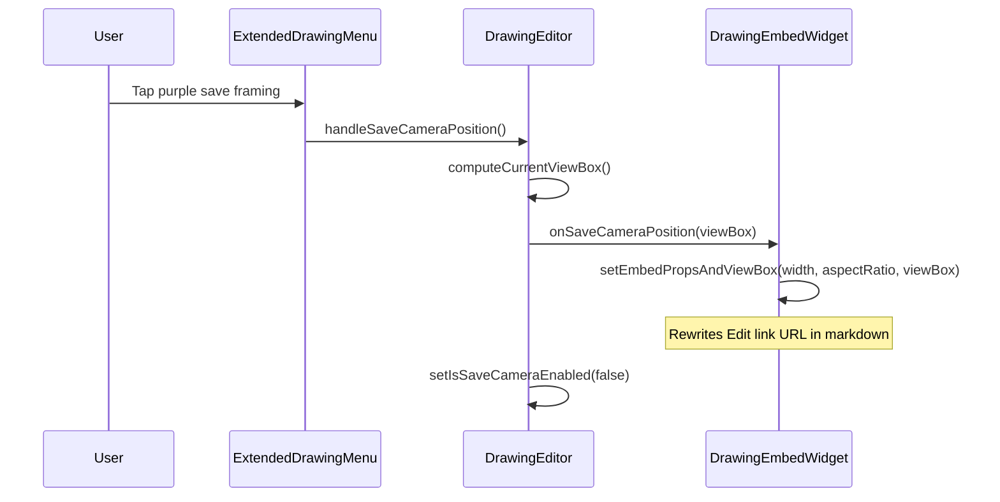

# Drawing embed framing (edit mode)

**Why it exists:** A drawing embed’s visible crop and box size are stored on the Edit Drawing link (`width`, `aspectRatio`, `viewBox*`). While editing inline, users pan, zoom, and resize the embed box; they need a clear affordance to **save** that framing to the note or **abandon** it and return to preview without persisting changes.

## Conceptual understanding

Framing is two related things:

| Setting | What it controls | Persisted as |
|---|---|---|
| **Embed display** | Width and aspect ratio of the resize box in the note | `width`, `aspectRatio` on the Edit link |
| **View crop** | Which region of the ink canvas is visible inside that box | `viewBoxX`, `viewBoxY`, `viewBoxW`, `viewBoxH` on the Edit link |

In edit mode, `InkSvgCanvas` holds a **camera** (`x`, `y`, `zoom`). The live viewBox — what would be saved — is derived from that camera and the canvas container size:

- `viewBox.x = -camera.x`
- `viewBox.y = -camera.y`
- `viewBox.width = containerWidth / camera.zoom`
- `viewBox.height = containerHeight / camera.zoom`

Saved framing comes from `embedSettings.viewBox` parsed when the widget mounted (the Edit link URL). It does **not** update live while the user pans; only an explicit save rewrites the markdown.

### Toolbar controls

`ExtendedDrawingMenu` in embedded `DrawingEditor` shows:

| Control | Icon / label | Tooltip | When visible | Action |
|---|---|---|---|---|
| Finish editing | Lucide check (`CheckIcon`, stroke only) | **Finish editing** | Always in edit mode | Closes editor (preview). Does **not** save framing unless the user also tapped save framing. |
| Save framing | Purple lock frame (`LockFrameIcon`) + **Save framing** label | **Saving framing** | When live framing differs from saved | Writes current box size + viewBox to the Edit link via `setEmbedPropsAndViewBox`. |

When save framing is visible, the finish control tooltip reads **Abandon framing** — same close path, but framing was changed and is not saved yet.

Writing embeds use the same check icon and **Finish editing** tooltip via `ExtendedWritingMenu`.

### Toolbar layout

Embedded drawing edit mode uses two toolbar layouts:

| Mode | When | Appearance |
|---|---|---|
| **Wide** | Default when clusters fit | Three clusters: quick actions (left), draw tools (centre, absolutely positioned), extended menu (right — finish, save framing, overflow). |
| **Compact** | When centre cluster bounding boxes overlap left or right in wide layout | Single centred inline row; tool menu becomes static flow with dividers between groups. |

`useDrawingEmbedToolbarCompact` in `drawing-editor.tsx` probes wide layout on each resize (including embed resize-handle drags), measures `getBoundingClientRect()` for `.ink_quick-menu`, `.ink_tool-menu`, and `.ink_extended-writing-menu`, and toggles `ddc_ink_toolbar-compact` before clusters collide. Enter uses 4px clearance; exit requires 12px clearance to avoid flicker while resizing.

### Toolbar compact mode

## Flows

### Detect unsaved framing changes

`DrawingEditor` compares the **camera snapshot passed into** `onCameraChange` with saved settings, not a stale `getCamera()` read on a later render. That keeps pan/zoom detection aligned with the event that fired.

### Save framing

Resize-handle drags update embed width/aspect in local refs during the gesture; save framing persists those values together with the viewBox so a single markdown rewrite avoids widget range invalidation bugs.

## Technical details

| Piece | Location |
|---|---|
| Dirty check + menu state | `drawing-editor.tsx` — `syncSaveFramingControlFromCamera`, `isEmbedViewBoxDirtyComparedToSaved` |
| Camera → viewBox mapping | `viewBoxFromCameraAndContainerRect` in `drawing-editor.tsx` |
| User camera commits + `onCameraChange` | `commitUserCameraState` in `ink-svg-canvas.tsx` |
| Resize gesture gate for `api` camera events | `isEmbedResizeGestureActiveRef` in `drawing-editor.tsx` |
| Toolbar compact mode | `use-drawing-embed-toolbar-compact.ts`, `toolbar-cluster-overlap.ts`, `drawing-editor.scss` (`ddc_ink_toolbar-compact`) |
| Markdown persistence | `drawing-embed-extension.tsx` — `setEmbedPropsAndViewBox` |

### `onCameraChange` meta sources

| `meta.source` | DrawingEditor handling |
|---|---|
| `init` | Hide save framing **once** after unlock (fractional layout vs saved URL). Later `init` from canvas remount mid-edit does **not** clear an already-shown affordance. |
| `user` | Sync save-framing visibility (pan, zoom, wheel, two-finger gestures). |
| `api` | Sync only while the resize handle is active (anchor-preserving camera adjustments from `ResizeObserver`). |

## Technical Gotchas

### `commitUserCameraState` must emit synchronously

Embed pan/zoom pointer events are often **forwarded** from `FingerBlocker` to the SVG (`dispatchEvent`). If `commitUserCameraState` relied on a `setState` updater to compute the next camera before calling `onCameraChange`, the updater could run after the function returned — pan moved the camera visually but parent embed code never saw `meta.source === 'user'`. The fix computes from `cameraRef.current`, updates ref and state, then emits immediately.

### Do not clear save framing on every canvas `init`

`InkSvgCanvas` can remount during an edit session (e.g. after layout-driven remounts). Each remount emits `init`. Clearing `isSaveCameraEnabled` on every `init` hid the purple lock right after a successful zoom/pan. Only the **first** `init` after opening the editor suppresses the affordance (unlock fractional mismatch).

### Tolerance before showing save framing

`EMBED_VIEWBOX_DIRTY_EPS` (0.75 px) avoids flashing save framing immediately after unlock when `DOMRect` fractions differ slightly from saved URL integers. All four viewBox fields (`x`, `y`, `width`, `height`) are compared.

### Toolbar compact probes wide layout synchronously

`useDrawingEmbedToolbarCompact` temporarily removes `ddc_ink_toolbar-compact` inside `useLayoutEffect` before measuring cluster rects so overlap is evaluated against wide-mode positions, then reapplies the class in the same frame. Do not switch compact mode from a width-sum heuristic — the centre tool cluster is absolutely positioned and side clusters are asymmetric (especially when the labelled save-framing button is visible).

### Related docs

- [Pan and zoom](pan-zoom.md) — gestures that move the camera
- [Reading mode embed rendering](reading-mode-embed-rendering.md) — how saved `viewBox` is applied in preview/Reading mode
- [Camera repositioning on resize](camera-repositioning-on-resize.md) — `api` camera adjustments during embed resize
