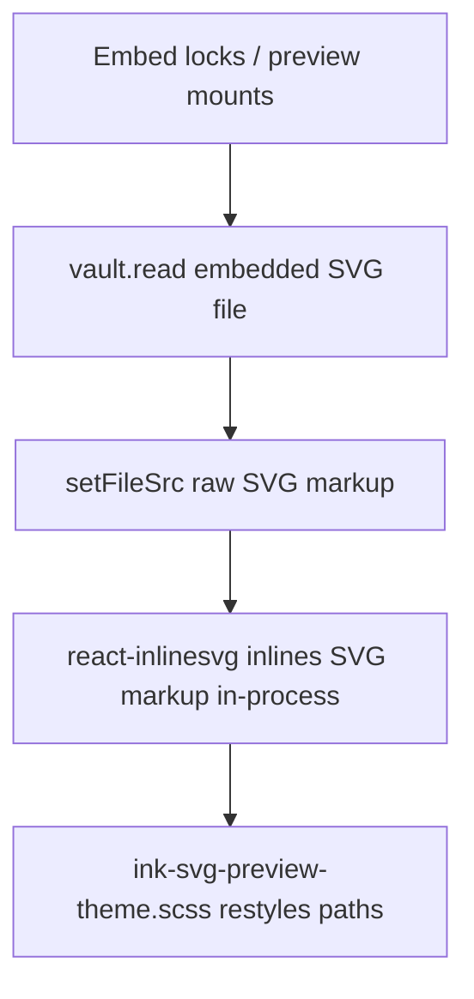

# Embed preview SVG loading

## Why it exists

Locked writing and drawing embeds show the vault SVG through `react-inlinesvg`. An earlier path used `vault.getResourcePath()` so InlineSVG could fetch an `app://…` URL. On installs that run Obsidian against **system Electron 39.8.10+** (common on Arch, CachyOS, Nixpkgs), that fetch fails CORS: the page origin is `app://obsidian.md` while the file URL is a different `app://` host. Locked Live Preview and Reading mode then show an empty placeholder even though edit mode still works (editors use `vault.read()`, not HTTP).

Embed previews therefore load SVG **through Obsidian’s vault API** and pass **raw markup** into InlineSVG so nothing is fetched over the network.

## Conceptual understanding

- **Edit mode** already reads the file with `vault.read()` and never hits CORS.
- **Locked preview** must also avoid XHR/`fetch` of `app://` resource URLs.
- `react-inlinesvg` treats a `src` that contains `<svg` as **inline content** (no request). Data URIs also avoid CORS, but writing previews treat any `data:` `src` as an ``, which breaks theme CSS that targets inlined paths.

## Flows

1. Preview mounts (Live Preview lock or Reading mode host).
2. `refreshSrc()` calls `vault.read` on the embedded `TFile`.
3. On success it sets React state to the SVG string (not a resource URL, not a data URI).
4. Writing and drawing previews render `<SVG src={fileSrc} />` (`react-inlinesvg`).
5. InlineSVG inlines the markup; shared theme CSS can recolour strokes.
6. Vault `modify` on that path runs `refreshSrc()` again so returning from edit updates the locked view.

## Technical details

| Piece | Location / behaviour |
|-------|----------------------|
| Drawing preview | `drawing-embed-preview.tsx` → `refreshSrc()` |
| Writing preview | `writing-embed-preview.tsx` → `refreshSrc()` |
| Why not `getResourcePath` | Resource URLs are fetched by InlineSVG and fail under Electron custom-protocol CORS |
| Why not data URI | Writing’s `isImg = fileSrc.startsWith('data')` would switch to `` and skip path theming |
| InlineSVG branch | Library uses `src.includes('<svg')` for in-process content (same idea as the empty writing SVG import) |

Related surfaces that also prefer vault string + inline DOM (not this React path): SVG picker and native SVG leaf via `mountInlineSvgPreview` — see [Ink colours and theming](ink-colours-and-theming.md).

## Technical gotchas

1. **Do not restore `getResourcePath` + InlineSVG fetch** — It regresses blank locked previews on system Electron 39.8.10+ even when the official Obsidian AppImage still works.
2. **Do not feed writing previews a `data:` URI** — Writing still branches on `data` → ``; that undoes dark-theme path fills under `.ddc_ink_writing-embed-preview`.
3. **Raw markup must include `<svg`** — InlineSVG only skips fetch when that substring is present; other strings are treated as URLs again.
4. **Async read races** — `refreshSrc` does not cancel in-flight reads; rapid modify/unmount can briefly apply a stale string. Prefer vault read over resource URLs anyway; add cancellation only if a race shows up in practice.
5. **Official Electron upgrades** — Upstream Obsidian may eventually CORS-enable `app://`. Keep the vault-read path anyway: it matches edit mode and keeps theming reliable.

## See also

- [Ink colours and theming](ink-colours-and-theming.md) — Why previews must stay inlined SVG
- [Reading mode](reading-mode.md) — Reading mode mounts the same locked preview components
- [Reading mode embed rendering](reading-mode-embed-rendering.md) — Post-processor that hosts those previews
