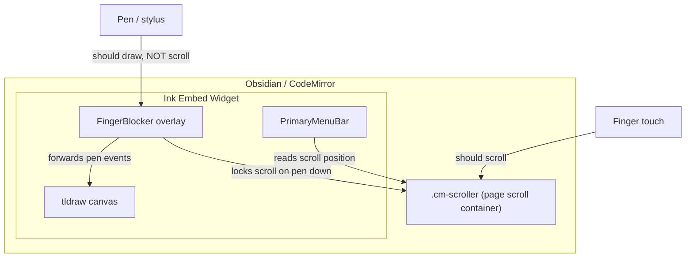
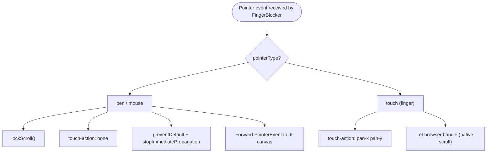
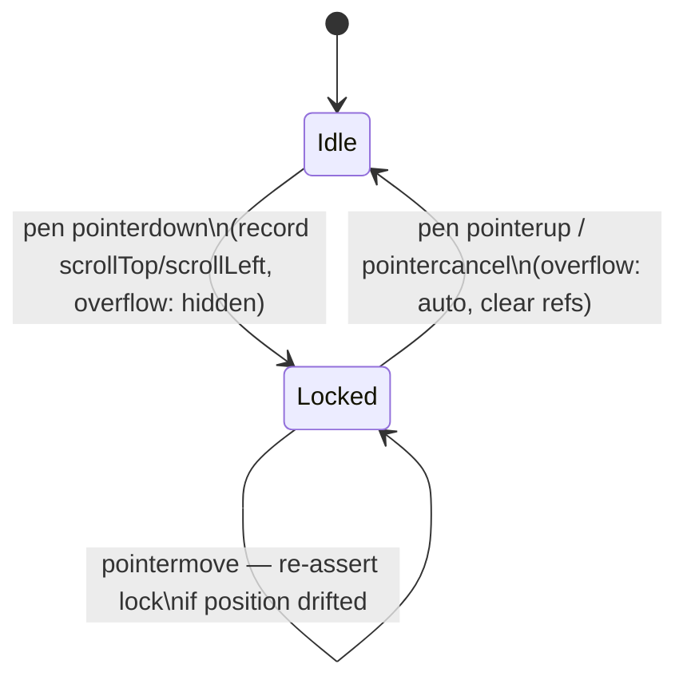
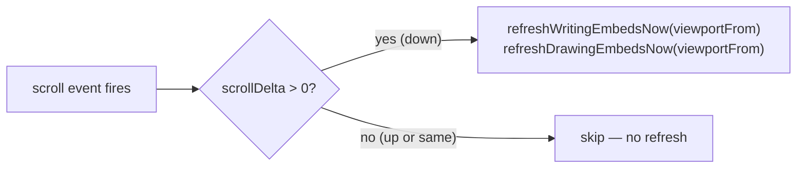
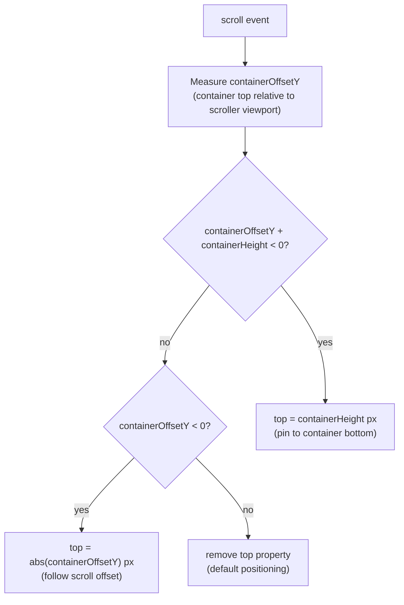
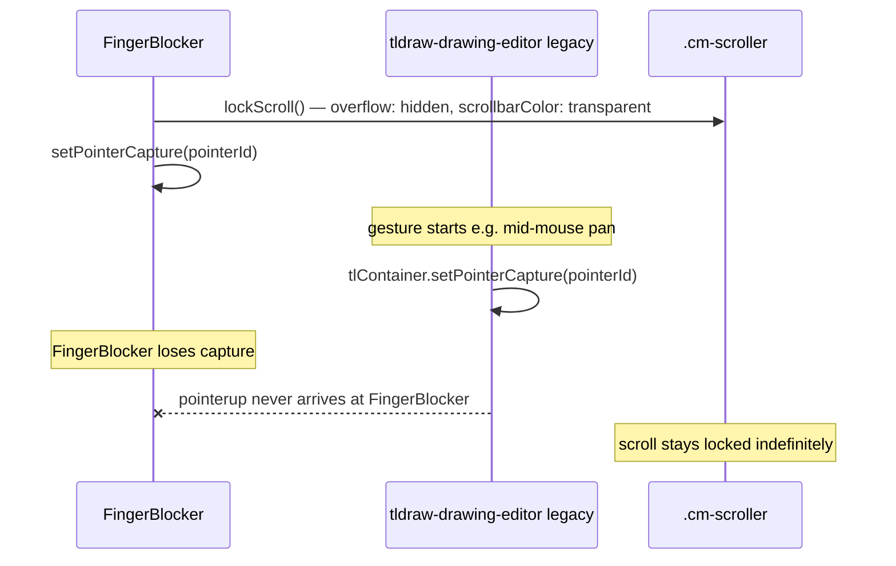

# Embed Scrolling

This document describes all scrolling-related mechanisms in the current format embed system. Each mechanism targets a distinct problem; together they form a layered defence against the scroll conflicts that arise from embedding an interactive drawing canvas inside a scrollable text editor.

## The core tension

Ink embeds live inside CodeMirror's `.cm-scroller` element — the element Obsidian uses to scroll the note. This creates three competing scroll concerns that must coexist:

1. **Page scrolling** — the user panning through the note with a finger or mouse wheel.
2. **Pen drawing** — stylus/mouse strokes that must not cause page scrolling.
3. **tldraw internals** — tldraw has its own scroll and pan concepts (canvas panning, UI menus) that must not leak out to the page scroller.

---

## 1. Pen vs. finger input — FingerBlocker

**Source:** `src/components/jsx-components/finger-blocker/finger-blocker.tsx`  
**Related doc:** `docs/pen-vs-finger-handling.md` (covers this mechanism in full detail)

The `FingerBlocker` is a transparent `div` that sits as an absolute overlay covering the tldraw canvas at `z-index: 1000`. It intercepts all pointer input, classifies it as pen or finger, and routes it accordingly. It is the primary mechanism for preventing pen strokes from scrolling the page.

### Why an overlay is needed

tldraw renders its own canvas and handles its own pointer events. Without an overlay, the browser cannot distinguish between a pointer event on the canvas that should draw (pen) and one that should scroll the page (finger) — both arrive at the same element. The overlay gives us a single interception point with full control over event classification and forwarding.

### Decision flow

### Layer 1 — Dynamic `touch-action` toggling

On `pointerdown`, the CSS `touch-action` property of the blocker element is set based on the input type:

- **Pen / mouse:** `touch-action: none` — instructs the browser not to interpret the subsequent move events as a scroll gesture.
- **Finger:** `touch-action: pan-x pan-y` — explicitly restores native scrolling.
- **Up / cancel:** the property is cleared.

This is the first and cheapest line of defence. It is sufficient on many devices, but browsers (especially on Windows) can latch onto a scroll gesture before the CSS change takes effect.

### Layer 2 — Native capture-phase event listeners

All listeners are attached with `{ passive: false, capture: true }`:

- **Capture phase** intercepts events before they reach any child element or bubble through React's synthetic event system.
- **`passive: false`** is required to allow `preventDefault()` to cancel browser scroll handling.

The initial implementation used React's synthetic event system. This failed on Windows Surface devices because React synthetic events fire too late — the browser's gesture recogniser had already latched onto the scroll gesture before the React handler ran. Native listeners in the capture phase solve this timing problem.

### Layer 3 — Scroll pinning (brute-force failsafe)

For browsers that ignore the above (particularly Windows Ink):

On pen down, `lockScroll()` records the current `scrollLeft` / `scrollTop` of `.cm-scroller` and sets `overflow: hidden` on it. A separate capture-phase `scroll` listener is attached to the scroller element. If a scroll event fires while the pen is held (meaning the browser ignored the CSS lock), the listener immediately calls `scrollTo()` to forcefully restore the saved position, frame by frame.

On pen up, `unlockScroll()` restores `overflow: auto`. The `scrollbarColor` restoration is delayed by 200 ms to avoid a visible flash of the scrollbar reappearing.

### Layer 4 — Gesture and wheel suppression

While the pen is held, `wheel` and `touchmove` events on the blocker are caught and cancelled via `preventDefault` + `stopImmediatePropagation`. This prevents secondary effects like browser history swipe gestures (on macOS/iOS) or pinch-zoom.

### Transition edge cases

Two timing edge cases arise at the boundary between a pen stroke and a finger scroll:

| Transition | Problem | Fix |
|---|---|---|
| First pen stroke after a finger scroll | The scroll lock was applied on `pointerdown`, but because the previous interaction was a touch, `recentPenInputRef` is still true and the overlay may not have re-appeared in time. The lock is applied too late and position drifts. | `pointermove` re-asserts the lock by calling `scrollTo()` to the saved position if drift is detected. |
| First finger touch after a pen stroke | The scroll is unlocked on pen `pointerup`, but because `recentPenInputRef` is `true`, the overlay is briefly present and intercepts the first touch `pointermove`. The native scroll doesn't fire. | On touch `pointermove` when `recentPenInputRef` is `true`, the scroll position is manually updated using `e.movementY` / `e.movementX`. |

### tldraw tool handler wrapping

In addition to the DOM-level interception, `FingerBlocker` also wraps the `onPointerDown` and `onPointerUp` handlers of the active tldraw tool (via `wrapToolWithScrollHandlers`). This ensures `lockScroll` / `unlockScroll` are called even when tldraw's internal tool state machine processes events that might otherwise bypass the blocker overlay. The wrapper is re-applied whenever the active tldraw tool changes, tracked via an `editor.store.listen` subscription.

### Approaches not pursued

- **`pointerenter` hover detection** — explored as a way to lock scrolling before the pen touches down. Discarded because not all styluses support hover, and on Windows the browser's gesture recogniser still latches before the React state update or DOM reflow completes.
- **Static `touch-action: none`** — would have prevented all finger scrolling over the embed at all times.
- **`pointer-events: none`** on the overlay — would have allowed pen events to reach tldraw naturally, but at the cost of losing the classification point needed to prevent scrolling.

---

## 2. Scroll-based embed refresh — InkEmbedsExtension

**Source:** `src/components/formats/current/ink-embeds-extension/ink-embeds-extension.tsx`

Ink embeds are CodeMirror widget extensions. CodeMirror can remount or update widgets as the document viewport changes. To keep embeds in sync, the extension listens for scroll events on `scrollDOM` and calls `refreshWritingEmbedsNow` / `refreshDrawingEmbedsNow`.

### Downward-scroll-only refresh

Refreshes only fire on downward scroll. Upward-scroll refreshes were found to cause visible jank on iPad — the viewport jumps as embeds above the current view are remounted. Since embeds above the viewport are not visible, skipping upward-scroll refreshes has no user-facing cost.

### Viewport-relative refresh

`viewportFrom` (the character offset of the top of the CodeMirror viewport) is passed to the refresh functions. Only embeds at or below that position are refreshed, leaving already-rendered embeds above the viewport untouched.

**Tradeoff:** If a user scrolls down, then immediately back up to an embed they previously passed, that embed may not reflect the latest data until the next downward scroll. This is considered acceptable given the smoothness benefit.

---

## 3. Menu bar scroll tracking — PrimaryMenuBar

**Source:** `src/components/jsx-components/primary-menu-bar/primary-menu-bar.tsx`

The `PrimaryMenuBar` is absolutely positioned inside the embed container. Because the embed is a fixed-height block in the note, the menu bar can scroll off the top of the viewport when the user scrolls down, or remain below the visible area when the user hasn't scrolled far enough.

The component attaches a `scroll` listener to the nearest `.cm-scroller` ancestor and recalculates the menu bar's `top` CSS property on every scroll event.

The listener is dispatched immediately on mount with a synthetic `scroll` event to handle the case where the embed is already partially scrolled off-screen when it first renders.

**Note:** A focus-based approach (show menu on focusin, hide on focusout) was explored but is currently commented out. The scroll-tracking approach was retained because it does not require the user to interact with the embed to see the menu.

---

## 3b. Pointer capture and scroll restore — embed pan/zoom gestures

**Source:** `src/ink-canvas/ink-svg-canvas.tsx`, `src/components/jsx-components/finger-blocker/finger-blocker.tsx`  
**Related doc:** [pan-zoom.md](pan-zoom.md)

Current-format embed pan/zoom (middle-mouse pan, right-drag pan/zoom, mod+scroll zoom, two-finger touch pinch) is handled on `InkSvgCanvas` and `FingerBlocker` — not in the legacy `tldraw-drawing-editor` path.

Mod+scroll zoom in embeds: `FingerBlocker` listens in capture phase and forwards the wheel event to the ink SVG when `ctrlKey || metaKey`. The SVG listener calls `preventDefault()` on the forwarded event; the blocker calls `preventDefault()` only on the original (never `stopPropagation`). See [pan-zoom.md — Modifier + wheel zoom direction](pan-zoom.md).

Middle/right-button pan and zoom are handled on the SVG via pointer listeners. `FingerBlocker` does not call `lockScroll()` for non-primary mouse buttons.

### The pointer capture conflict (legacy tldraw embeds)

On **legacy** `tldraw-drawing-editor` embeds, middle/right pan/zoom called `tlContainer.setPointerCapture()`, which could leave `FingerBlocker` without a matching `pointerup` and the note scroller locked.

**Current-format** `InkSvgCanvas` embeds handle middle/right pan/zoom on the SVG directly; `FingerBlocker` skips `lockScroll()` for non-primary buttons, so this capture-transfer deadlock does not apply.

### Fix — non-primary button guard + `restoreEmbedScroll()`

Two complementary fixes work together:

**1. Non-primary button guard in `FingerBlocker`**  
`FingerBlocker` only calls `lockScroll()` and sets `isPenDownRef.current = true` for pen input or left mouse button (`button === 0`). Middle (`button 1`) and right (`button 2`) clicks are never drawing actions — they are used by embed pan/zoom gestures on `InkSvgCanvas`. Skipping the lock for these buttons means the scroll-pinning state is never entered, so the `handleScroll` force-restoration listener is never active during pan/zoom gestures.

> **Why not `lostpointercapture`?** An earlier attempt added a `lostpointercapture` listener to `FingerBlocker` to detect when another element stole pointer capture. However, `FingerBlocker` forwards events to `.tl-canvas` as synthetic `PointerEvent` objects via `dispatchEvent`. When `tldraw-drawing-editor` then calls `tlContainer.setPointerCapture(e.pointerId)` on the forwarded event, Electron/Chromium silently rejects it — `setPointerCapture` only works for pointer IDs that are registered from real hardware dispatch, not synthetic copies. As a result, FingerBlocker never actually loses capture, and `lostpointercapture` never fires. The `lostpointercapture` listener remains in the code as a safety net for any future scenario where real capture is taken.

**2. Embed scroll restore after ink canvas gestures**  
Legacy tldraw embeds call `restoreEmbedScroll()` from `tldraw-drawing-editor` gesture end handlers. Current-format `InkSvgCanvas` embeds rely on `FingerBlocker` not entering scroll lock for middle/right-button gestures; mod+scroll does not use `pointerup`. If note scrolling becomes stuck after pan/zoom, see [pan-zoom.md](pan-zoom.md) and the non-primary button guard above.

When using legacy tldraw embeds, `restoreEmbedScroll()`:

- Sets `overflow: 'auto'` immediately.
- Restores `scrollbarColor: 'auto'` after a 200 ms delay — matching the same delay `FingerBlocker` uses to avoid a visible flash of the scrollbar reappearing.

For mod+scroll zoom (which has no `pointerup`), `restoreEmbedScroll()` is called via a debounced timer that fires 150 ms after the last wheel event.

---

## 4. Supporting mechanisms

### Embed removal scroll jump prevention

**Source:** `src/logic/utils/embed.ts` — `removeEmbed()`

When `cmEditor.replaceRange()` removes the lines that contain an embed, CodeMirror recalculates the document height and the scroll position can jump significantly. After the `replaceRange` call, `cmEditor.setCursor(editorStart)` is called to move the cursor to the position the embed occupied. This causes CodeMirror to scroll back to approximately where the user was.

### Focus without scroll

**Source:** `src/components/formats/current/utils/tldraw-helpers.ts` — `focusChildTldrawEditor()`

When programmatically focusing the tldraw `.tl-container` element, `{ preventScroll: true }` is passed to `focus()`. Without this, the browser's default focus behaviour would scroll the container into view, which can cause an unexpected jump in a long note.

### CodeMirror event handler interception

**Source:** `src/components/formats/current/utils/createWidgetRootDomEventHandlers.ts` — `preventCodeMirrorHandlingWidgetsEvents()`

CodeMirror attaches its own `mousedown`, `touchstart`, and `click` handlers to the editor DOM. If these fire on elements inside an embed widget, CodeMirror may move the cursor or trigger selection behaviour that interferes with drawing. This utility returns a CodeMirror `EditorView.domEventHandlers` extension that returns `true` (handled) for those events when they originate inside an element matching `.ddc_ink_widget-root`, preventing CodeMirror from acting on them.

### Scroller margin compensation

**Source:** `src/logic/utils/embed.ts` — `applyCommonAncestorStyling()`

Obsidian (via CodeMirror) applies `paddingInlineStart` and `paddingInlineEnd` to `.cm-scroller` to create the readable line width margin. Embeds that need to be full-width must negate this padding with negative `margin-inline-start` / `margin-inline-end` on their `.cm-embed-block` ancestor. `applyCommonAncestorStyling` reads the computed padding values and applies the negation dynamically, because the padding varies by theme and user settings.

This is primarily a layout mechanism, but it affects how much of the `.cm-scroller` width the embed occupies, which in turn affects where the scrollbar appears and how pointer events land relative to the embed boundary.

---

## Mechanism summary

| Mechanism | Component / File | Problem solved |
|---|---|---|
| Dynamic `touch-action` toggling | `FingerBlocker` | Pen stroke triggers browser scroll gesture |
| Native capture-phase listeners | `FingerBlocker` | React synthetic events fire too late on Windows |
| Scroll pinning | `FingerBlocker` | Browser ignores `overflow: hidden` lock |
| Transition edge case handling | `FingerBlocker` | Late lock / late unlock at pen-to-touch boundary |
| Gesture suppression | `FingerBlocker` | Wheel / swipe gestures during pen input |
| Non-primary button guard | `FingerBlocker` | Scroll-pinning activated by middle/right-click embed pan/zoom gestures |
| `lostpointercapture` scroll unlock | `FingerBlocker` | Safety net: unlock if real pointer capture is transferred elsewhere |
| Pan/zoom gesture scroll restore | `InkSvgCanvas` + `FingerBlocker`; legacy: `tldraw-drawing-editor` | Overflow/scrollbar styles not restored after embed pan/zoom gestures |
| Downward-only embed refresh | `InkEmbedsExtension` | Remount jank on iPad during upward scroll |
| Menu bar scroll tracking | `PrimaryMenuBar` | Menu scrolls off-screen with embed |
| Embed removal cursor reset | `embed.ts` | Scroll jumps when embed is deleted |
| `preventScroll` on focus | `tldraw-helpers.ts` | Viewport jumps when tldraw is focused |
| CodeMirror event interception | `createWidgetRootDomEventHandlers.ts` | CodeMirror cursor/selection interferes with drawing |
| Scroller margin compensation | `embed.ts` | Theme padding reduces embed width unexpectedly |
