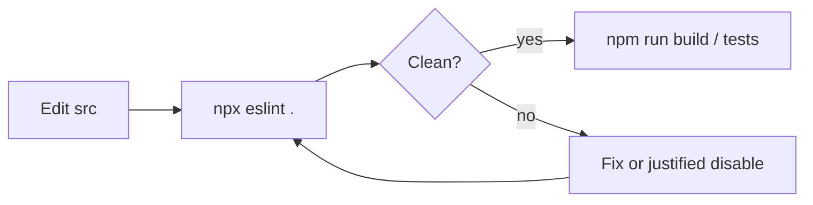
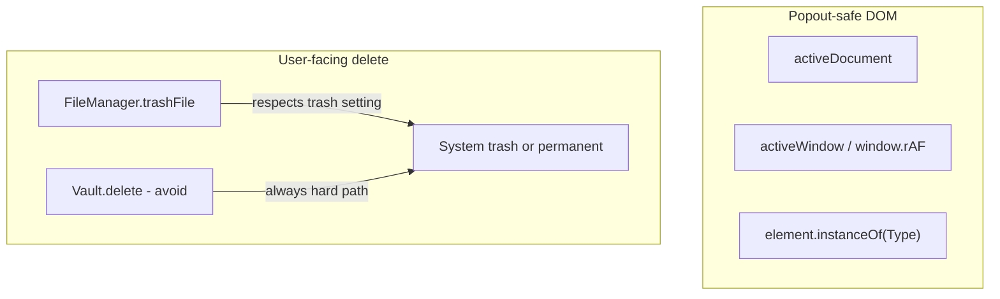

# ESLint and Obsidian plugin conventions

## Why it exists

Obsidian community plugins are reviewed against [plugin guidelines](https://docs.obsidian.md/Plugins/Releasing/Plugin+guidelines) (UI sentence case, popout-window safety, trash preferences, command naming, and more). This repo uses [`eslint-plugin-obsidianmd`](https://github.com/obsidianmd/eslint-plugin) so those rules are enforced in CI-adjacent local linting before release, instead of discovering them only at directory submission time.

## Conceptual understanding

Think of the linter as two layers:

1. **Obsidian compatibility** — Code that runs in a popout window must not assume the main window’s globals (`document`, `HTMLImageElement`, bare `requestAnimationFrame`). Obsidian provides `activeDocument`, `activeWindow`, `element.instanceOf(...)`, and window-scoped timers for that.
2. **Directory / UX conventions** — UI copy sentence case, prefer CSS classes over static inline styles, delete via `FileManager.trashFile()` so the user’s trash setting is respected, avoid putting the plugin id/name into command ids/names.

Ink keeps some intentional exceptions (product names like Ink/Boox, command-palette labels) via targeted `eslint-disable` comments with a short reason — not by turning the whole rule off.

## Flows





## Technical details

### How to run

There is no dedicated `npm run lint` script yet. From the repo root:

```bash
npx eslint .
npx eslint . --fix   # unused disables and other auto-fixes only
```

Config lives in `eslint.config.mjs`:

- Extends `obsidianmd.configs.recommended`.
- Type-aware Obsidian rules apply to `src/**/*.ts(x)` via `tsconfig.json`.
- Tooling, tests, vault fixtures, and build output are ignored.

### Conventions applied in this codebase

| Rule / theme | What we do |
|--------------|------------|
| `prefer-active-doc` | Use `activeDocument` instead of global `document` for UI DOM work. |
| `prefer-window-timers` | Use `window.requestAnimationFrame` (and other window timers) so callbacks run on the correct window. |
| `prefer-instanceof` | Use `element.instanceOf(HTMLImageElement)` (etc.) instead of `instanceof` for cross-window checks. |
| `prefer-file-manager-trash-file` | Permanent migrate and “remove and delete file” call `app.fileManager.trashFile`. |
| `no-static-styles-assignment` | Static layout (e.g. drawing embed centering) lives in SCSS; only dynamic sizes stay on `element.style`. |
| `ui/sentence-case` | Prefer sentence case; suppress with a reason when keeping product names or exact command-palette strings. |

### Migration entry points (no palette commands)

Bulk migration is opened from **Settings** (legacy migrate card and developer tldraw SVG migrate). Per-file migration uses the on-open notice CTA. Command-palette migration commands were removed so they are not a second, lint-violating entry path; e2e and unit tests call `plugin.openMigrationModal()` / `openTldrawSvgMigrationModal()` directly.

### Jest polyfills

jsdom does not ship Obsidian’s extras. `tests/setupTests.ts` polyfills:

- `Node.prototype.instanceOf` → `instanceof`
- `activeDocument` / `activeWindow` → `document` / `window`

Unit tests therefore exercise the same call sites as the plugin under Obsidian.

## Technical Gotchas

- **`activeDocument` vs schema fields** — A property named `document` on a tldraw snapshot is not the DOM global. Do not rename it for the lint rule; suppress that line with a short comment.
- **Sentence-case vs product names** — The rule lowercases many proper nouns (Ink, Boox, SVG). Prefer a one-line disable when UX should keep brand/acronym casing.
- **`FileManager` in unit tests** — `executeMigration(vault, fileManager, …)` needs a mock with `trashFile` (tests often delegate to the vault mock’s `delete` for assertions).
- **Static vs dynamic styles** — The static-styles rule only flags **literal** assignments (`style.left = '50%'`). Template literals with expressions (dynamic width/height) are allowed; put fixed centering in CSS classes instead.
- **Ignored paths** — `tests/` is not linted by the ESLint config; production `src/` is. Keep polyfills in `setupTests.ts` aligned with new Obsidian APIs used in `src/`.
