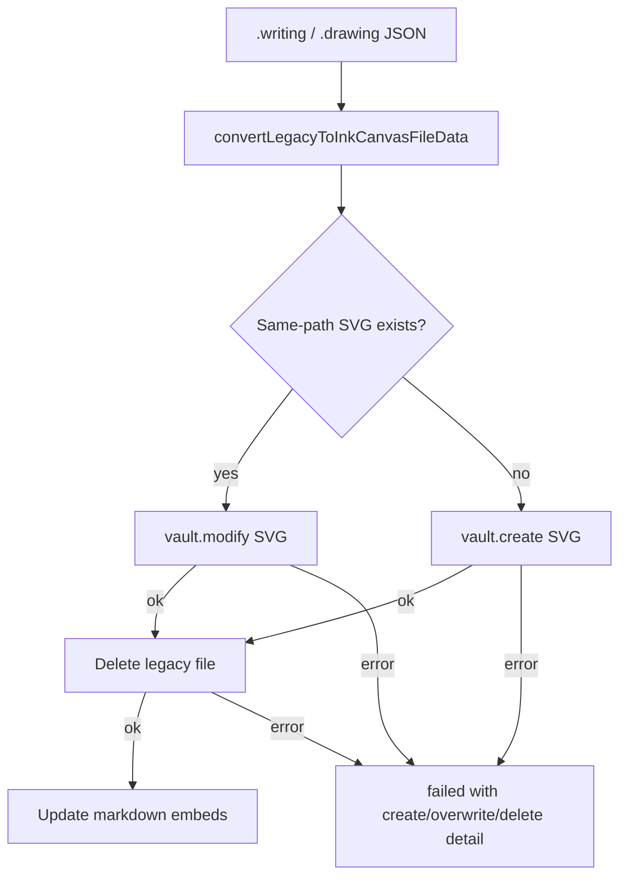
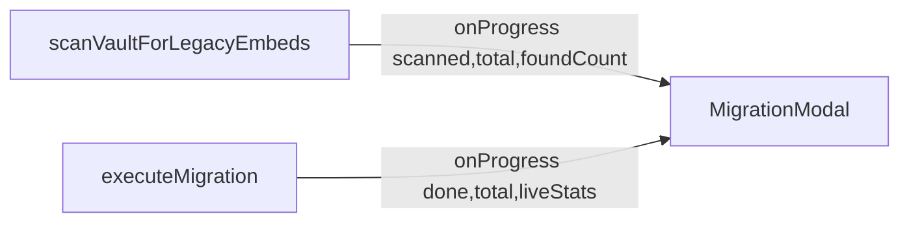

# File format and conversion

**Why it exists:** This doc describes the ink SVG file format and how drawing↔writing conversion preserves the visual preview, so future changes do not reintroduce the SVG preview loss bug.

## Format overview

Ink files are SVG files with embedded metadata. The visual content and metadata are siblings under the root `<svg>`. Embeds and the file picker load the SVG file directly; the preview is whatever visual content the file contains.

**Current engine (ink-canvas)** — stroke data in a plugin-specific snapshot:

```xml
<svg xmlns="..." ...>
  <!-- Visual content: paths from ink-canvas export -->
  <metadata>
    <ink plugin-version="..." file-type="inkDrawing|inkWriting"/>
    <ink-canvas version="0.5.0">JSON InkCanvasSnapshot</ink-canvas>
  </metadata>
</svg>
```

**Legacy engine (tldraw)** — still present on older files until the user edits and saves (lazy upgrade to ink-canvas):

```xml
<metadata>
  <ink plugin-version="..." file-type="inkDrawing|inkWriting"/>
  <tldraw version="2.4.3">JSON TLEditorSnapshot</tldraw>
</metadata>
```

Embed **Edit** links in markdown carry display settings (`width`, `viewBox`, etc.) only — not the ink-canvas format version. Format version lives on the SVG file.

## Ink-canvas format version

`INK_CANVAS_FORMAT_VERSION` in [`src/constants.ts`](../src/constants.ts) is the canonical semver for the **`version` attribute** on `<ink-canvas>` (e.g. `version="0.5.0"`). It describes the **functionality and structure** of the **ink-canvas format**: a custom ink payload defined and consumed by this plugin, distinct from:

- **`PLUGIN_VERSION`** on `<ink plugin-version="…">` — which Obsidian Ink build wrote the file.
- **`TLDRAW_VERSION`** on `<tldraw version="…">` — the tldraw library snapshot format (legacy files only).
- **`InkCanvasSnapshot.version`** inside the JSON (currently always `1`) — an internal snapshot schema revision, not the semver on the XML tag.

### Semver rules

| Segment | Meaning |
|--------|---------|
| **Major** | Breaking format changes — structure or semantics that older plugin versions cannot safely interpret without migration. |
| **Minor** | Non-breaking format changes — new optional fields or behaviour; files remain loadable on older readers within the same major. |
| **Patch** | Tweaks, bug fixes, and development iterations within the same compatibility band. |

When saving ink-canvas files, the plugin writes the current `INK_CANVAS_FORMAT_VERSION` via [`buildFileStr`](../src/components/formats/current/utils/buildFileStr.ts) and [`svg-export`](../src/ink-canvas/svg-export.ts). Loaders do not currently reject unknown `<ink-canvas version>` values; bump the constant when the on-disk format changes and add migration if the change is major.

### Technical gotchas

- Files may still show `<ink-canvas version="1">` from early ink-canvas builds; they load normally and are rewritten to the current semver on the next save.
- Do not confuse `<ink-canvas version="…">` with embed URL query parameters — URL `version=` was removed; only the SVG metadata carries format version.

## Vault migration (v1 code blocks)

**Why:** Older vaults used ` ```handwritten-ink` / ` ```handdrawn-ink` code fences pointing at `.writing` / `.drawing` JSON files with a tldraw snapshot inside.

The **Migrate legacy ink embeds** flow ([`migration-logic.ts`](../src/logic/utils/migration-logic.ts), [`MigrationModal`](../src/components/dom-components/modals/migration-modal/migration-modal.ts)):

1. Scans markdown for legacy code blocks and collects referenced legacy files.
2. For each legacy file, runs `convertLegacyToInkCanvasFileData`: migrate tldraw draw shapes → `InkCanvasSnapshot`, render SVG paths, write `<ink-canvas version="…">` via `buildFileStr` (not an intermediate tldraw-on-disk SVG).
3. Writes the SVG beside the legacy file (same basename, `.svg`). If that path already exists, **permanent** migration **overwrites** it; the legacy file is deleted only after that write succeeds.
4. Replaces code blocks in notes with current `![InkWriting]` / `![InkDrawing]` embeds.



**Test migration** (modal “test run”) is separate: it writes under `_ink-test-conversions/`, may append `_1` / `_2` basename suffixes on collisions within the batch, never deletes legacy files, and does not rewrite notes.

**Progress UI:** Scan and migrate callbacks pass live counts (`found` during scan; `converted` / `skipped` / `failed` during migrate). The modal must use those callback arguments — not `scanResult` / `migrationResult`, which stay null until each `await` finishes.



**Manual QA (progress density):** With only a handful of legacy files, the bar and counters jump too fast to verify mid-run updates. After `node qa-test-vault/generate.mjs` (or `npm run open-qa`), open **19 - Migration Progress Density** — forty unique `.writing`/`.drawing` copies plus embeds, for watching scan/migrate stats tick. Prefer **Test Migration** so permanent delete does not wipe the set mid-session.

### Technical gotchas

- Strokes that were in the legacy editor **stash** at last save are not in the v1 JSON and cannot be recovered (same limitation as before).
- Permanent migration (bulk settings/command **and** on-open single-file) overwrites an existing same-path `.svg`. Legacy deletion runs only after create/overwrite succeeds; create, overwrite, or delete failures are reported in `failed` (and surface in the modal or on-open notice) without deleting the legacy file.
- Mid-run modal stats must read callback args; assigning from `scanResult` / `migrationResult` inside `onProgress` always shows zeros until the phase completes.
- A vault with few unique legacy attachments cannot expose progress-UI regressions — regenerate section 19 when validating the migration modal.
- Open **Settings → Ink → Update Ink files…** or run the command **Migrate legacy ink embeds to ink-canvas**.
- For migrating a **single** file from the editor notice (embed vs dedicated reopen rules), see [legacy-migrate-on-open.md](./legacy-migrate-on-open.md).

## Drawing ↔ writing conversion

Conversion between `inkDrawing` and `inkWriting` changes only the tldraw store (adds/removes `writing-container` and `writing-lines` shapes) and the `file-type` attribute. The visual SVG content must be preserved so the preview does not disappear.

### Flow

1. **Close open ink views.** Any workspace leaves showing this file in the writing or drawing view are detached first. This prevents `getViewData()` from overwriting the converted file when those views save.
2. (Optional) Move the file to the target subfolder if the user chose "Also move file to …".
3. Read full file content from vault (`svgStr`).
4. Extract metadata via `extractInkJsonFromSvg(svgStr)` → `{ meta, tldraw }`.
5. Transform data: `convertWriteDataToDraw` or `convertDrawDataToWrite`.
6. Build new file: `buildFileStr({ ...converted, svgString: svgStr })`.
7. Write to vault.
8. Update all markdown notes that embed the file.
9. **Open in correct view.** After conversion, the file is opened in the matching view type (drawing view for `inkDrawing`, writing view for `inkWriting`).

### Technical gotchas

- **`buildFileStr` expects full SVG content.** The `svgString` parameter must be the complete SVG file (including any existing metadata). When re-serializing an existing file (e.g. during conversion), pass the raw file content, not `data.svgString` — `extractInkJsonFromSvg` does not return `svgString`.
- **`buildFileStr` strips existing metadata before appending.** When the input `svgString` already contains `<metadata>`, `buildFileStr` removes those elements before adding the new metadata. This avoids duplicate metadata and ensures `extractInkJsonFromSvg` reads the correct data on the next load.
