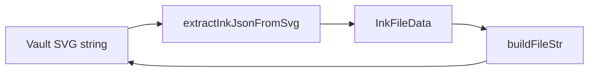
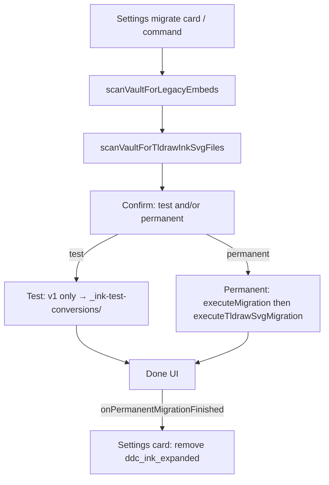
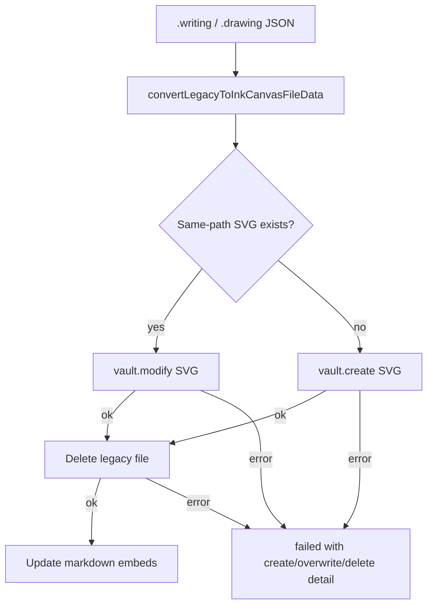
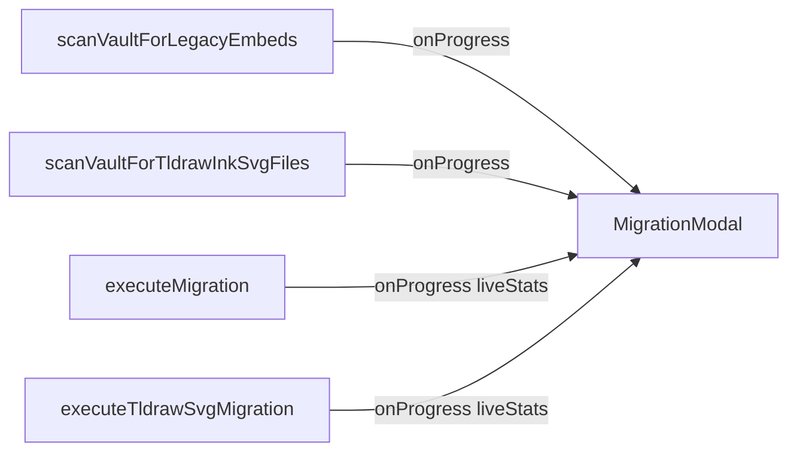

# File format and conversion

**Why it exists:** This doc describes the ink SVG file format and how drawing↔writing conversion preserves the visual preview, so future changes do not reintroduce the SVG preview loss bug.

## Format overview

Ink files are SVG files with embedded metadata. The visual content and metadata are siblings under the root `<svg>`. Embeds and the file picker load the SVG file directly; the preview is whatever visual content the file contains.

**Current engine (ink-canvas)** — stroke data in a plugin-specific snapshot:

```xml
<svg xmlns="..." ...>
  <!-- Visual content: paths from ink-canvas export -->
  <metadata>
    <ink plugin-version="..." file-type="inkDrawing|inkWriting"/>
    <ink-canvas version="0.5.0">JSON InkCanvasSnapshot</ink-canvas>
  </metadata>
</svg>
```

**Legacy engine (tldraw)** — still present on older files until the user edits and saves (lazy upgrade to ink-canvas):

```xml
<metadata>
  <ink plugin-version="..." file-type="inkDrawing|inkWriting"/>
  <tldraw version="2.4.3">JSON TLEditorSnapshot</tldraw>
</metadata>
```

Embed **Edit** links in markdown carry display settings (`width`, `viewBox`, etc.) only — not the ink-canvas format version. Format version lives on the SVG file.

## XML parse and serialize dependency

Save and load of ink SVG metadata use Node-side DOM APIs from **`@xmldom/xmldom`** (not the deprecated npm package `xmldom`):

| Path | Role |
|------|------|
| [`buildFileStr.ts`](../src/components/formats/current/utils/buildFileStr.ts) | `DOMParser` + `XMLSerializer` when rewriting `<metadata>` on save |
| [`extractInkJsonFromSvg.ts`](../src/logic/utils/extractInkJsonFromSvg.ts) | `DOMParser` when reading `<ink>` / `<ink-canvas>` / `<tldraw>` on open |



The maintained fork ships its own TypeScript types; do not re-add `@types/xmldom`.

## Ink-canvas format version

`INK_CANVAS_FORMAT_VERSION` in [`src/constants.ts`](../src/constants.ts) is the canonical semver for the **`version` attribute** on `<ink-canvas>` (e.g. `version="0.5.0"`). It describes the **functionality and structure** of the **ink-canvas format**: a custom ink payload defined and consumed by this plugin, distinct from:

- **`PLUGIN_VERSION`** on `<ink plugin-version="…">` — which Obsidian Ink build wrote the file.
- **`TLDRAW_VERSION`** on `<tldraw version="…">` — the tldraw library snapshot format (legacy files only).
- **`InkCanvasSnapshot.version`** inside the JSON (currently always `1`) — an internal snapshot schema revision, not the semver on the XML tag.

### Semver rules

| Segment | Meaning |
|--------|---------|
| **Major** | Breaking format changes — structure or semantics that older plugin versions cannot safely interpret without migration. |
| **Minor** | Non-breaking format changes — new optional fields or behaviour; files remain loadable on older readers within the same major. |
| **Patch** | Tweaks, bug fixes, and development iterations within the same compatibility band. |

When saving ink-canvas files, the plugin writes the current `INK_CANVAS_FORMAT_VERSION` via [`buildFileStr`](../src/components/formats/current/utils/buildFileStr.ts) and [`svg-export`](../src/ink-canvas/svg-export.ts). Loaders do not currently reject unknown `<ink-canvas version>` values; bump the constant when the on-disk format changes and add migration if the change is major.

### Technical gotchas

- Files may still show `<ink-canvas version="1">` from early ink-canvas builds; they load normally and are rewritten to the current semver on the next save.
- Do not confuse `<ink-canvas version="…">` with embed URL query parameters — URL `version=` was removed; only the SVG metadata carries format version.

## Vault migration (legacy → ink-canvas)

**Why:** Vaults may still contain (1) v1 `.writing` / `.drawing` JSON beside old code-fence embeds, and/or (2) SVG files that already use `![InkWriting]` / `![InkDrawing]` embeds but still store **tldraw** metadata instead of ink-canvas. Settings and the migrate command must convert **both** so leftover files do not keep showing the on-open Legacy CTA after a “successful” migrate.

### What counts as migratable

| Kind | Detection | Permanent migrate |
|------|-----------|-------------------|
| v1 attachment | `.writing` / `.drawing` referenced by legacy code fences | Convert beside path → `.svg`, delete legacy, rewrite notes |
| tldraw Ink SVG | Ink metadata + tldraw snapshot + `fileType` `inkWriting` or `inkDrawing` (not already ink-canvas; not plain unrelated SVGs) | In-place rewrite to `<ink-canvas>`; update drawing embed viewBoxes in notes when needed |

Eligibility helpers live in [`tldraw-svg-migration-logic.ts`](../src/logic/utils/tldraw-svg-migration-logic.ts) (`isMigratableLegacyInkFileData`, `sniffInkSvgFileType` first). The same rules drive Settings card visibility (`vaultNeedsInkFormatMigration`) and the tldraw half of the modal scan.

### Combined Settings / modal flow

[`MigrationModal`](../src/components/dom-components/modals/migration-modal/migration-modal.ts) runs **one** user-facing migrate:

1. Scan `.writing` / `.drawing` via `scanVaultForLegacyEmbeds`.
2. Scan migratable tldraw Ink SVGs via `scanVaultForTldrawInkSvgFiles` (embed-linked SVGs **and** a full-vault `.svg` pass for orphans / attachment-folder files).
3. **Test Migration** (only when v1 files exist): converts `.writing`/`.drawing` under `_ink-test-conversions/` — does **not** convert tldraw SVGs.
4. **Migrate Permanently**: `executeMigration` then `executeTldrawSvgMigration`.



**v1 permanent write rules** ([`migration-logic.ts`](../src/logic/utils/migration-logic.ts)):



### Settings migrate card

The card under Getting started uses CSS grid `0fr` ↔ `1fr` (`ddc_ink_expanded`) to animate open/closed. Visibility is **`vaultNeedsInkFormatMigration`** (same file set as the modal). On permanent migrate **Done** (not modal close), Settings refreshes that class on the **existing** wrapper so the card collapses in the background while the completion dialog is still open. Calling `display()` instead would empty the tab and skip the collapse transition.

Developer-only **Migrate tldraw SVG to ink-canvas** remains a separate settings control for the SVG-only path.

### Progress UI

Scan and migrate callbacks pass live counts (`found` during scan; `converted` / `skipped` / `failed` during migrate). The modal must use those callback arguments — not `scanResult` / `migrationResult`, which stay null until each `await` finishes. Combined scan progress is split across the two scan phases (≈50% + ≈50%).



**Manual QA (progress density):** After `node qa-test-vault/generate.mjs` (or `npm run open-qa`), open **19 - Migration Progress Density** — prefer **Test Migration** so permanent delete does not wipe the set mid-session. For full permanent coverage (including tldraw SVGs), use a vault that still has both kinds of leftovers.

### Technical gotchas

- Strokes that were in the legacy editor **stash** at last save are not in the v1 JSON and cannot be recovered (same limitation as before).
- Permanent v1 migration overwrites an existing same-path `.svg`. Legacy deletion runs only after create/overwrite succeeds.
- Mid-run modal stats must read callback args; assigning from `scanResult` / `migrationResult` inside `onProgress` always shows zeros until the phase completes.
- **Do not hide the Settings card from embed-linked SVGs only.** Attachment-folder / orphan tldraw Ink SVGs still need migrate and used to keep the on-open CTA after Settings “finished.”
- **Do not count plain SVGs.** Eligibility requires Ink sniff + tldraw + writing/drawing file types — otherwise unrelated vault art would keep the card open forever.
- Collapse the card by toggling `ddc_ink_expanded` on the live wrapper when permanent Done appears — not via full Settings `display()` rebuild, and not on modal close alone.
- Open **Settings → Ink → Show migration options…** (no command-palette migrate commands).
- For migrating a **single** file from the editor notice, see [legacy-migrate-on-open.md](./legacy-migrate-on-open.md). Writing embed height after migration: [writing-embed-aspect-ratio.md](./writing-embed-aspect-ratio.md).
- Permanent migrate deletes legacy files with `FileManager.trashFile` so the user’s trash preference applies.

## Drawing ↔ writing conversion

Conversion between `inkDrawing` and `inkWriting` changes only the tldraw store (adds/removes `writing-container` and `writing-lines` shapes) and the `file-type` attribute. The visual SVG content must be preserved so the preview does not disappear.

### Flow

1. **Close open ink views.** Any workspace leaves showing this file in the writing or drawing view are detached first. This prevents `getViewData()` from overwriting the converted file when those views save.
2. (Optional) Move the file to the target subfolder if the user chose "Also move file to …".
3. Read full file content from vault (`svgStr`).
4. Extract metadata via `extractInkJsonFromSvg(svgStr)` → `{ meta, tldraw }`.
5. Transform data: `convertWriteDataToDraw` or `convertDrawDataToWrite`.
6. Build new file: `buildFileStr({ ...converted, svgString: svgStr })`.
7. Write to vault.
8. Update all markdown notes that embed the file.
9. **Open in correct view.** After conversion, the file is opened in the matching view type (drawing view for `inkDrawing`, writing view for `inkWriting`).

### Technical gotchas

- **`buildFileStr` expects full SVG content.** The `svgString` parameter must be the complete SVG file (including any existing metadata). When re-serializing an existing file (e.g. during conversion), pass the raw file content, not `data.svgString` — `extractInkJsonFromSvg` does not return `svgString`.
- **`buildFileStr` strips existing metadata before appending.** When the input `svgString` already contains `<metadata>`, `buildFileStr` removes those elements before adding the new metadata. This avoids duplicate metadata and ensures `extractInkJsonFromSvg` reads the correct data on the next load.
- **Use `@xmldom/xmldom`, never `xmldom`.** The old `xmldom` package (including `0.6.x`) has no fix for [GHSA-crh6-fp67-6883](https://github.com/advisories/GHSA-crh6-fp67-6883) (multi-root XML). The fork is API-compatible for normal single-root ink SVGs; malformed multi-root input is rejected/logged more strictly and may return `null` from extract instead of silently succeeding.
