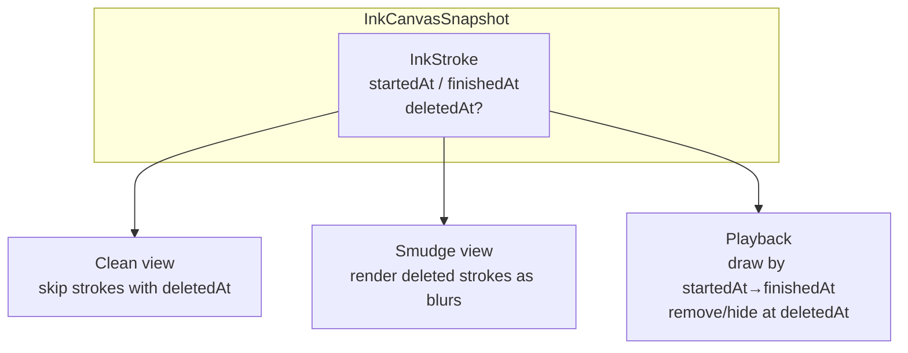
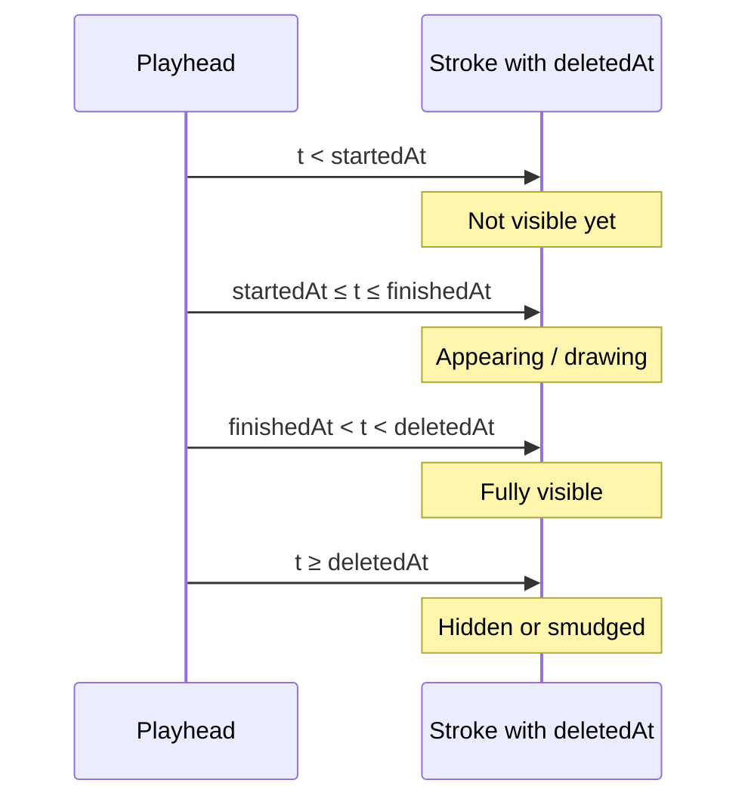

# Future feature: deleted stroke history

**Status:** Not implemented. Design notes for a future release.

## Why it exists

Today, erasing or deleting a stroke removes it from the ink-canvas snapshot. That loses authoring history: there is no way to replay how a page was written, or to keep a soft visual trace of what was removed.

This feature would **retain deleted strokes in the file** and mark when they were erased, so the same data can drive three experiences: a clean page, a page with deleted ink as background smudges/blurs, and a timed playback of writing (including later deletions).

## Conceptual understanding

Each stroke already carries optional timing metadata:

- **`startedAt`** — epoch ms when the stroke began
- **`finishedAt`** — epoch ms when the stroke ended

(See `InkStroke` in [`src/ink-canvas/types.ts`](../src/ink-canvas/types.ts).)

The proposed addition is a third optional timestamp:

- **`deletedAt`** (or **`erasedAt`**) — epoch ms when the stroke was deleted or erased

Strokes are never hard-removed from the snapshot when the user erases them. They stay in `strokes[]` with a deletion timestamp set. Display and playback modes interpret that field differently.



## Flows

### Clean display (default notes view)

1. Load all strokes from the snapshot.
2. For each stroke, if `deletedAt` is present, **ignore** it for primary ink rendering.
3. Draw only strokes without a deletion timestamp.

Result: the page looks as if erased ink was permanently gone, without discarding history.

### Smudge / blur background

1. Load all strokes.
2. Split into active strokes (`deletedAt` absent) and deleted strokes (`deletedAt` set).
3. Render deleted strokes first as soft blurs / smudges in the background.
4. Render active strokes normally on top.

Result: the page shows a faint memory of what was removed, without treating it as live ink.

### Writing history playback

1. Build a timeline from stroke timestamps (`startedAt`, `finishedAt`, and `deletedAt` when present).
2. Advance a playhead (at a chosen speed multiplier relative to real authoring time).
3. As the playhead crosses a stroke’s `startedAt`→`finishedAt` window, animate or reveal that stroke accordingly.
4. When the playhead reaches that stroke’s `deletedAt`, hide it or transition it into the deleted/smudge representation.

Result: playback can show the full authorship sequence — strokes appearing as they were written, then disappearing (or smudging) when they were erased.



## Technical details

### File format change (proposed)

Extend each ink-canvas stroke in the SVG metadata snapshot with an optional deletion timestamp. Name TBD between `deletedAt` and `erasedAt`; pick one term and use it consistently in types, serializers, and UI.

Conceptual shape (not implemented):

```ts
interface InkStroke {
  // ...existing fields...
  startedAt?: number;   // epoch ms — stroke began
  finishedAt?: number;  // epoch ms — stroke ended
  deletedAt?: number;   // epoch ms — stroke erased; omit if still active
}
```

Because the field is optional:

- Older files and active strokes omit it and remain valid.
- This should be a **non-breaking (minor)** format change under the ink-canvas semver rules in [File format and conversion](file-format-and-conversion.md): older readers that ignore unknown fields still load files; older writers simply never emit `deletedAt`.

### Mode behaviour summary

| Mode | Strokes without `deletedAt` | Strokes with `deletedAt` |
|------|-----------------------------|---------------------------|
| Clean display | Draw normally | Skip |
| Smudge background | Draw normally (foreground) | Draw as blur/smudge |
| Playback | Reveal between `startedAt` and `finishedAt` | Same reveal, then remove/smudge at `deletedAt` |

### Erase / delete behaviour (proposed)

On erase, **do not** splice the stroke out of `strokes[]`. Set `deletedAt` to `Date.now()` (or the erase gesture’s end time). Undo of an erase would clear `deletedAt` rather than re-inserting a removed object.

### Out of scope for this note

- UI for choosing clean vs smudge display
- Playback controls and speed UI
- Whether boox / remote strokes need special deletion rules
- Migration of already-hard-deleted history (unrecoverable)

## Technical gotchas

- **Hard delete today is irreversible.** Files saved before this feature cannot reconstruct erased strokes; only future erasures can be retained.
- **File size.** Retaining deleted strokes grows snapshots over time; a later cleanup or “compact history” action may be needed.
- **Legacy strokes.** `startedAt` / `finishedAt` are already optional and omitted on some migrated strokes; playback quality depends on timestamps being present. The same will apply to `deletedAt`.
- **Export / SVG preview.** The visible SVG paths in the file may still need a policy: export only active strokes for the static preview, while the JSON snapshot retains deleted history.
- **Naming.** Choose `deletedAt` vs `erasedAt` once; “delete” vs “erase” may mean different tools in the UI (select-delete vs eraser), but one timestamp field can cover both if product language stays consistent.
