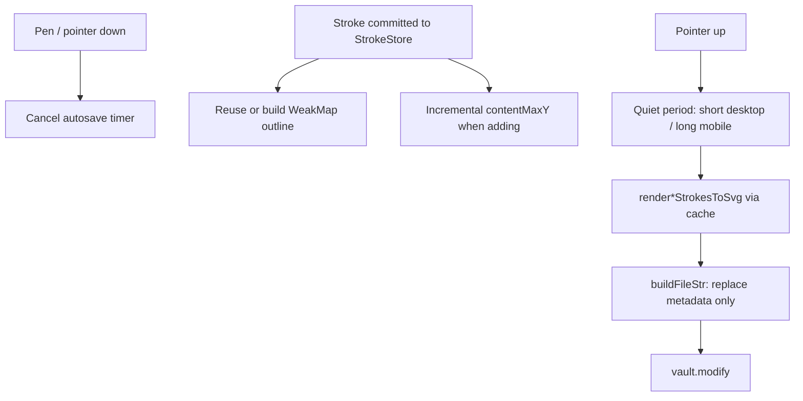

# Ink canvas: large attachment performance

## Why it exists

Long writing or drawing sessions on a single attachment used to become progressively laggy. Autosave work scaled with the full SVG (stroke outline regeneration, DOM parse / pretty-print of multi-megabyte markup, full-document height scans) and could land on the input thread while the pen was still down — especially on mobile WebViews such as older iPads. Related user reports: [#84](https://github.com/daledesilva/obsidian_ink/issues/84).

This page describes the performance contracts added so large ink-canvas attachments stay writable without splitting notes.

## Conceptual understanding

Three ideas keep save and render cost off the hot pen path:

1. **Share stroke geometry** — perfect-freehand outlines are expensive. Live `StrokePath` rendering and SVG export reuse one cached path + bounds per immutable stroke object.
2. **Touch only what changed** — store mutations report which stroke ids changed so path/bounds caches and writing-page height can update incrementally instead of clearing everything.
3. **Save after the pen is quiet** — autosave does not start while a pointer interaction is active; mobile waits longer than desktop before serializing.

## Flows

### Autosave while writing or drawing

1. Each store change sets “has unsaved changes” and calls `queueSaves`.
2. If the canvas reports an active interaction (`onInteractionChange(true)` from pointer down), timers are cleared and no save is scheduled.
3. On pointer up / cancel, if there are unsaved changes, `queueSaves` runs again.
4. Delay is `resolveInkAutosaveDelayMs(Platform, SHORT, LONG)` — desktop uses the short constant (500 ms); mobile / iOS / mobile-app flags use the long constant (2000 ms).
5. When the timer fires, one save path runs (`incrementalSave`): snapshot → SVG export → `props.save`. A second delayed “complete” save is **not** scheduled; for ink-canvas both functions did the same full serialize (the dual timer was leftover from legacy tldraw editors where incremental omitted SVG).

`completeSave` remains for **immediate** exits (`save`, `saveAndHalt`, `eraseAll`).

### Stroke geometry cache

- `getRenderedStrokeData(stroke)` in `rendered-stroke-cache.ts` stores `{ pathD, bounds }` in a `WeakMap` keyed by the stroke object.
- Editor `StrokePath` and `svg-export` both call it so autosave does not re-run perfect-freehand for every stroke on every save.
- `updateOffsets` replaces stroke objects (`{ ...stroke, offset }`); path data stays valid for the id-keyed editor cache, and the WeakMap entry for the old object is GC’d.

### Writing page height

On `add` / `addMany`, the canvas extends `contentMaxYRef` from new stroke bounds when they go lower. Clears reset to 0; other mutations still rescan. That avoids a full `computeApproxContentMaxY(store.getAll())` on every normal stroke.

### Empty / locked preview chrome

`sniffInkCanvasHasStrokes` peeks at the `"strokes"` array opener inside `<ink-canvas>` without XML-parsing or JSON-decoding every point — locked empty embeds only need empty vs non-empty.

## Technical details

| Piece | Location |
|--------|----------|
| Platform delay helper | `src/ink-canvas/autosave-delay.ts` |
| WeakMap outline cache | `src/ink-canvas/rendered-stroke-cache.ts` |
| Mutation events | `StrokeStoreChange` in `src/ink-canvas/stroke-store.ts` |
| Targeted cache invalidation + height | `ink-svg-canvas.tsx` (`invalidateStrokeCaches`, `contentMaxYRef`) |
| Combined path+bounds export | `renderStrokePathsAndBounds` in `svg-export.ts` |
| Metadata-only ink-canvas save | `buildInkCanvasFileStr` in `buildFileStr.ts` — see [file-format-and-conversion.md](file-format-and-conversion.md) |
| Writing / drawing autosave wiring | `writing-editor.tsx`, `drawing-editor.tsx` |
| Empty-stroke sniff | `sniffInkCanvasHasStrokes` in `ink-file-has-strokes.ts` |

Constants: `WRITE_SHORT_DELAY_MS` / `WRITE_LONG_DELAY_MS` and drawing equivalents in `src/constants.ts` (500 / 2000).

## Technical gotchas

1. **Do not restore a second autosave timer that duplicates the short save** — ink-canvas `incrementalSave` and `completeSave` bodies match; a long-delay twin only doubles serialize cost on large files.
2. **Do not run autosave while `onInteractionChange(true)`** — mid-stroke serialize was a remaining iPad hitch after outline caching.
3. **Boox / WebSocket strokes do not drive `onInteractionChange`** — they still reset the quiet timer via store `onChange`. Continuous bridge input delays save until a quiet gap; that is intentional.
4. **WeakMap assumes committed strokes are not mutated in place** — live drawing mutates a separate in-progress array; store strokes are replaced on offset updates. In-place point edits would serve stale outlines.
5. **Compact JSON in metadata** — ink-canvas snapshot JSON is no longer pretty-printed on save (size + CPU). Expect denser `<ink-canvas>` blobs in git diffs.
6. **Strip every `<metadata>` block before insert** — `buildInkCanvasFileStr` uses a global replace so a stale first metadata block cannot win on the next `extractInkJsonFromSvg`.

## See also

- [File format and conversion](file-format-and-conversion.md) — metadata-only ink-canvas serialize vs DOM path for legacy tldraw
- [Ink canvas: live drawing vs committed strokes](ink-canvas-live-drawing.md) — WYSIWYG live path; committed strokes use the shared cache
- [Ink canvas: stroke viewport culling](ink-canvas-stroke-viewport-culling.md) — separate id-keyed path/`d` caches for on-screen mounts
