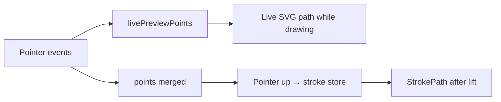
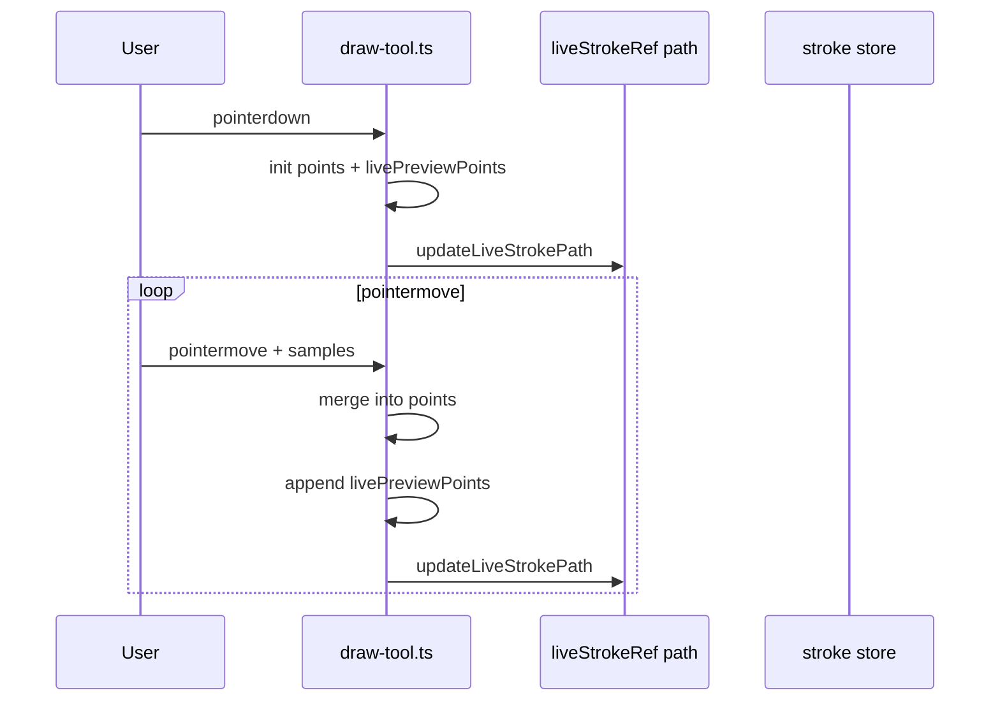
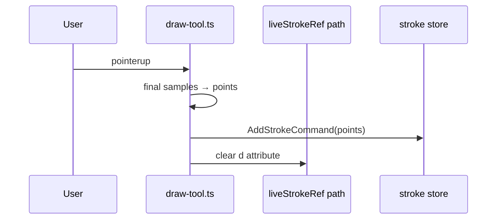

# Ink canvas: live drawing vs committed strokes

## Why it exists

While the pen is down, users need immediate visual feedback that tracks the stylus. After lift, the stroke must be stored efficiently and rendered consistently with the rest of the canvas. Those goals pull in different directions (dense samples vs merged storage, faithful preview vs pen/mouse smoothing on commit). This page describes how the current-format drawing editor (`InkSvgCanvas` + `draw-tool`) splits that work.

---

## Conceptual understanding

There are two visual layers on the SVG canvas:

| Layer | When it appears | What it represents |
|--------|------------------|-------------------|
| **Live preview** | From `pointerdown` until `pointerup` | In-progress stroke on a temporary `<path>` |
| **Committed stroke** | After `pointerup` | Stroke in the store, rendered like other saved strokes |

Pointer events feed **two point lists** during an active stroke:

| Array | Purpose |
|--------|--------|
| `points` | Merged samples (~1 screen pixel threshold) — saved on pointer up |
| `livePreviewPoints` | Denser, append-only trail — used only to build the live `<path>` |

Live preview and the committed stroke **intentionally use different outline pipelines** today: live favours following the pen (`getStroke` with `streamline: 0`, `last: true`); committed local strokes use `getInkStrokeOutline` (presets, smoothing, preprocessing). They may not match pixel-for-pixel when the pen lifts.

---

## Flows

### While drawing

### On lift

Boox / eInk Bridge strokes may bypass parts of this path when ingested over the WebSocket; see [websocket-programmatic-strokes.md](websocket-programmatic-strokes.md) and [boox-companion-integration.md](boox-companion-integration.md).

---

## Technical details

| Piece | Location |
|--------|-----------|
| Live `<path>` element | `src/ink-canvas/ink-svg-canvas.tsx` (`liveStrokeRef`) |
| Pointer handling, dual arrays, live path updates | `src/ink-canvas/tools/draw-tool.ts` |
| Committed stroke rendering | `StrokePath` in `ink-svg-canvas.tsx` (`getInkStrokeOutline` for local strokes) |
| Current-format drawing embed | `src/components/formats/current/drawing/tldraw-drawing-editor/` |

Legacy v1 drawing embeds use tldraw’s canvas directly and do not use this live-path pipeline.

---

## Technical Gotchas

- **Do not use `getInkStrokePoints` for live preview** without a live-specific mode: that preprocessor can skip interior samples until path length reaches brush `size`, which looks like a straight chord from start to tip during slow moves.
- **`points` and `livePreviewPoints` must not share the same array references** for the first vertex; merge logic updates `points` in place.
- **Reload the plugin** after changing `draw-tool` or `ink-svg-canvas`; the live path is updated imperatively and will not reflect code changes until Obsidian reloads the plugin build.
- **WYSIWYG** between live and committed is not guaranteed unless product code commits the same trail and outline options used for preview.
