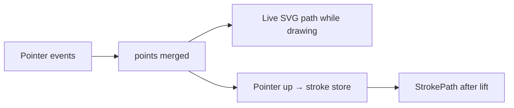
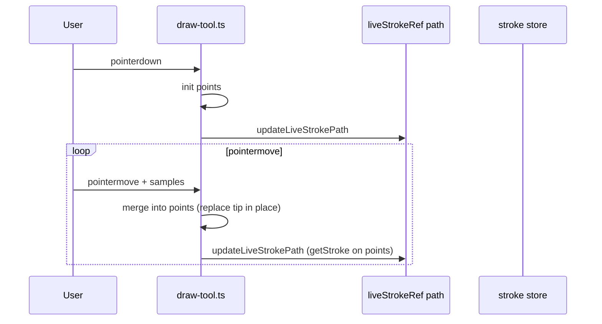
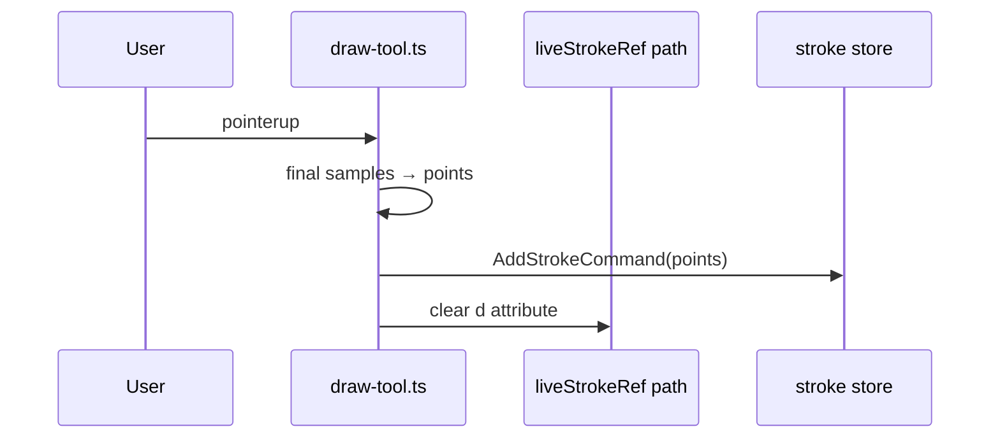
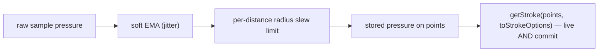

# Ink canvas: live drawing vs committed strokes

## Why it exists

While the pen is down, users need immediate visual feedback that tracks the stylus. After lift, the stroke must be stored efficiently and rendered consistently with the rest of the canvas. The product requirement is **WYSIWYG**: the committed stroke must look exactly like the live preview. This page describes how the current-format drawing editor (`InkSvgCanvas` + `draw-tool`) achieves that with a **single point array** rendered through a **single outline pipeline** for both layers.

---

## Conceptual understanding

There are two visual layers on the SVG canvas:

| Layer | When it appears | What it represents |
|--------|------------------|-------------------|
| **Live preview** | From `pointerdown` until `pointerup` | In-progress stroke on a temporary `<path>` |
| **Committed stroke** | After `pointerup` | Stroke in the store, rendered like other saved strokes |

Pointer events feed **one point list** during an active stroke:

| Array | Purpose |
|--------|--------|
| `points` | Merged samples (~1 screen pixel threshold) — drives the live `<path>` AND is saved on pointer up |

The last point is **replaced in place** while the pen stays within the merge radius, so `points` always tracks the pen tip without a chord lag — there is no separate dense preview trail.

Live preview and the committed stroke use the **same array, the same function, and the same options**: both call `getStroke(points, toStrokeOptions(style))`. Because the inputs are identical, the committed stroke is **byte-identical** to the preview (WYSIWYG). The per-input look (faithful pen vs smoother mouse) comes entirely from `style.streamline`/`smoothing` in the preset — pen is `streamline: 0`, mouse carries smoothing — and applies equally to both layers.

---

## Flows

### While drawing

### On lift

Boox / eInk Bridge strokes may bypass parts of this path when ingested over the WebSocket; see [websocket-programmatic-strokes.md](websocket-programmatic-strokes.md) and [boox-companion-integration.md](boox-companion-integration.md).

---

## Technical details

| Piece | Location |
|--------|-----------|
| Live `<path>` element | `src/ink-canvas/ink-svg-canvas.tsx` (`liveStrokeRef`) |
| Pointer handling, `points` array, live path updates | `src/ink-canvas/tools/draw-tool.ts` |
| Committed stroke rendering | `StrokePath` in `ink-svg-canvas.tsx` — `getStroke(points, toStrokeOptions(style))`, same call the live preview makes |
| Current-format drawing embed | `src/components/formats/current/drawing/tldraw-drawing-editor/` |

Legacy v1 drawing embeds use tldraw’s canvas directly and do not use this live-path pipeline.

**Streamline** and **smoothing** are scaled by **capture zoom** (reference 1×) in the preset (`buildInkStrokeStyleForTreatAs`) so smoothing stays consistent on screen when zoomed in. The scaled values live on `style`, so `getStroke` honours them for **both** live and committed equally. See [ink-canvas-zoom-scaled-strokes.md](ink-canvas-zoom-scaled-strokes.md).

### Pen pressure capture and the radius slew limit

Pen presets are deliberately **faithful** (low `streamline`/`smoothing` = `0.1`, `thinning = 0.6`), so the brush radius tracks real pressure closely. With faithful settings, a sharp pressure change between **sparsely-sampled fast** points makes the radius lurch; perfect-freehand then offsets the two sides of the outline so they **cross into a self-intersecting bowtie**, which renders as an **"xor-fill" hole** under SVG's default nonzero winding.

The fix is a **per-distance radius slew limit** applied to stored pressure at capture (`draw-tool.ts` → `penPressureSlewLimit`, constant `PEN_PRESSURE_SLEW_PER_SIZE` in `constants/pen-input.ts`):

- It bounds how much pressure (→ radius) may change **per brush-size of page travel** — a limit in *space*, not per-sample or per-time.
- This is **sample-rate / frame-rate independent**: slow strokes still reach full pressure (they cover the distance over many samples), while sparse fast samples can't make the radius jump and pinch the outline.
- It is applied to the **stored** pressure on `points` — the one array both layers render — so **live and committed are fixed in one place**.
- A soft per-sample pressure EMA (`PEN_PRESSURE_SMOOTHING_ALPHA`) still runs first for jitter rejection; the slew limit is the hard cap on top.

---

## Technical Gotchas

- **WYSIWYG depends on the single shared call.** Live and committed parity holds only because both render `getStroke(points, toStrokeOptions(style))` on the same `points`. If you reintroduce a preview-only point array, an outline preprocessor (e.g. a future `getInkStrokePoints`), or a per-layer option override (e.g. forcing `streamline: 0` on live only), they will diverge again. Apply any such change to **both layers** or keep it out of the render path.
- **Reload the plugin** after changing `draw-tool` or `ink-svg-canvas`; the live path is updated imperatively and will not reflect code changes until Obsidian reloads the plugin build.
- **Capture zoom** — see [ink-canvas-zoom-scaled-strokes.md](ink-canvas-zoom-scaled-strokes.md).
- **Pointer samples** — coalesced expansion in `pointer-samples.ts` is **off** (`USE_COALESCED_POINTER_SAMPLES = false`); one sample per `pointermove`. Re-enabling exposes raw digitizer positional jitter that the faithful outline traces into self-intersecting notches; see [ink-canvas-stroke-artifacts.md](ink-canvas-stroke-artifacts.md).
- **"xor-fill" outline notches** — caused by outline self-intersection (pressure→radius bowtie, fixed by `PEN_PRESSURE_SLEW_PER_SIZE`; or positional jitter from coalesced). Full causes, the shipped fix, and the approaches tried and **rejected** (distance gate, flat high streamline, backward-only reject, fill-rule, etc.) are documented in [ink-canvas-stroke-artifacts.md](ink-canvas-stroke-artifacts.md). **Do not re-add a forward distance gate** — it posterizes slow strokes and fixes neither cause.
