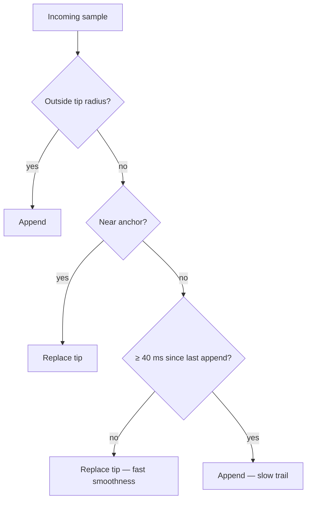
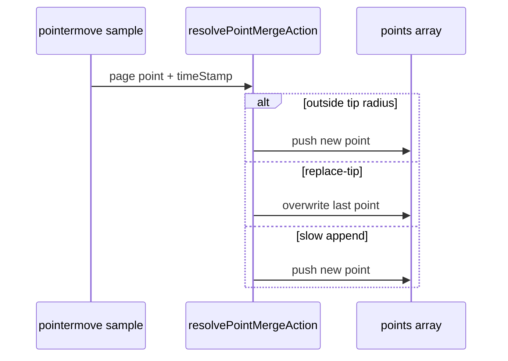

# Ink canvas: capture-time point merge (hybrid)

## Why it exists

While drawing, each `pointermove` can add a new knot to `points`. Without merging, the stored path faithfully follows **raw digitizer jitter** — especially on iPad, where coalesced sample expansion is off and the browser delivers **one sample per move**. That produces **jagged fast strokes**.

Merging nearby samples by **replacing the tip in place** smooths fast strokes, but if merging is too aggressive, **very slow** pen movement never commits new knots: the stroke becomes a **straight chord** between sparse anchors instead of following a curve.

Capture merge must satisfy both: **smooth fast strokes** and **faithful slow curves**.

---

## Conceptual understanding

Merge radius is ~**1 screen pixel** in page space:

$$\text{mergeThresholdPage} = \frac{1}{\text{camera.zoom}}$$

(See [ink-canvas-zoom-scaled-strokes.md](ink-canvas-zoom-scaled-strokes.md).)

For each incoming sample, `resolvePointMergeAction` in `draw-tool.ts` chooses **append** or **replace-tip**:

| Situation | Action | Purpose |
|-----------|--------|---------|
| Sample outside tip merge radius | **Append** | Normal stroke extension |
| Inside tip radius, near **anchor** (second-to-last point) | **Replace tip** | Micro-jitter smoothing at stroke start / tight corners |
| Inside tip radius, **far from anchor**, &lt; 40 ms since last append | **Replace tip** | Fast-stroke smoothness — collapse jitter without adding knots |
| Inside tip radius, **far from anchor**, ≥ 40 ms since last append | **Append** | Slow-draw trail — commit points along a creeping pen |

**Anchor** = second-to-last committed point. **Tip** = last point (updated in place when replacing).

Constant: `SLOW_DRAW_TIP_REPLACE_APPEND_MS = 40` in `src/ink-canvas/tools/draw-tool.ts`.

### Why replace-tip is necessary for fast strokes

Pen presets use **low streamline** (`~0`) so the outline follows the stylus faithfully. That is correct for slow, deliberate strokes, but it means **perfect-freehand draws through every stored knot** — there is no strong post-capture smoothing to hide noise.

On iPad (and with `USE_COALESCED_POINTER_SAMPLES = false` in `pointer-samples.ts`), consecutive move events sit within ~1 px but **wobble in different directions**. **Appending** each sample stores that wobble as separate knots; the outline zig-zags. **Replacing the tip** while the pen is still within the merge radius of the last knot collapses that jitter into a **single moving endpoint** that tracks the true tip without growing a sawtooth path.

The hybrid rule keeps replace-tip for **fast** extension (many samples within 40 ms) and switches to **append** only when the pen has been creeping slowly in the extension zone long enough to need a new committed knot.

---

## Flows

Live preview and committed stroke both render the same `points` array — see [ink-canvas-live-drawing.md](ink-canvas-live-drawing.md).

Pen pressure smoothing (`shouldReplaceTipWithPoint`) uses the **same merge decision** so EMA vs slew-limit behaviour stays aligned with geometry.

---

## Technical details

| Piece | Location |
|--------|-----------|
| Merge decision | `resolvePointMergeAction`, `applyAppendOrMergePoint` |
| Live capture | `appendOrMergePoint` → `ActiveStroke.lastCommittedPointAtMs` |
| Auto pen/mouse recompute on pointer up | `recomputeStrokeFromRawSamples` (synthetic 16 ms sample spacing) |
| Merge threshold | `1 / camera.zoom` in `appendDrawSamplesFromPointerEvent` |

---

## Technical Gotchas

- **Do not require both tip and anchor radii for replace-tip** (regression from commit `f77ee5a`): when the pen moves quickly, samples stay near the tip but **not** near the anchor → every sample appends → **jagged** fast strokes on iPad.
- **Do not replace-tip only with no time gate** (pre-`f77ee5a` behaviour): slow drawing never appends in the extension zone → **straight chords**.
- **Coalesced samples off** amplifies the fast-stroke jitter problem; re-enabling coalesced expansion without revisiting merge logic may re-expose notches — see [ink-canvas-stroke-artifacts.md](ink-canvas-stroke-artifacts.md).
- **Tuning `SLOW_DRAW_TIP_REPLACE_APPEND_MS`**: lower → more appends (better slow curves, slightly noisier fast strokes); higher → smoother fast strokes, risk of chord segments on very slow arcs.
