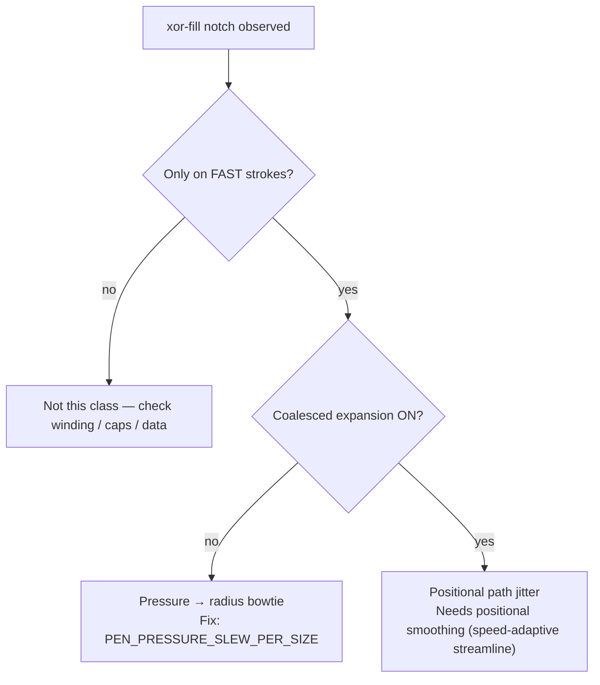
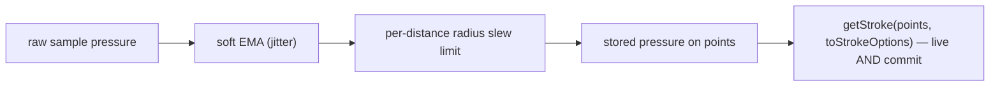

# Ink canvas: stroke outline artifacts ("xor-fill") — causes, fix, and rejected approaches

## Why it exists

Local pen strokes are rendered by offsetting a centerline into a filled outline (perfect-freehand) and serialising it to a single closed SVG `<path>`. Under some conditions that outline **self-intersects**, and because the path is filled with the default **nonzero** winding rule, the reverse-wound sub-loop renders as an empty notch — a visible **"xor-fill" hole / chevron wedge** in the stroke.

This page records what causes those artifacts, the fix that shipped, and the approaches that were tried and **rejected** (so they are not re-attempted). For the broader live-vs-committed pipeline, see [ink-canvas-live-drawing.md](ink-canvas-live-drawing.md).

---

## Conceptual understanding

The fill is one closed loop (up one side of the centerline, back down the other). It renders solid **unless the loop crosses itself**. Two independent things can make it cross:

| Cause | Mechanism | Where it shows |
|-------|-----------|----------------|
| **Pressure → radius bowtie** | Faithful settings make the brush radius track pressure closely. A sharp pressure change across **sparse, fast** samples makes the radius lurch; the two outline sides pinch and cross. | Fast "straightish" strokes; both live and committed |
| **Positional path jitter** | Dense/raw samples (e.g. coalesced) trace sideways **digitizer noise**; the faithful low-`streamline` outline follows the wiggle and folds. | Any fast stroke once coalesced is on |

Both are *geometry* problems (self-intersection), not a sampling-density or "too few points" problem. The distinction matters because the fixes are different — and some intuitive "fixes" make things worse.

---

## Flows

### Diagnosing an xor-fill hole

### The shipped capture pipeline (pressure path)

---

## Technical details

### Accepted fix — per-distance radius slew limit

The brush radius may change by at most a bounded amount **per brush-size of page travel**, applied to the stored pressure at capture.

- Constant: `PEN_PRESSURE_SLEW_PER_SIZE` in `src/ink-canvas/constants/pen-input.ts`.
- Applied in `appendDrawSamplesFromPointerEvent` (`src/ink-canvas/tools/draw-tool.ts`) via `penPressureSlewLimit(segmentPageDistance, size)`.
- It is a limit in **space**, not per-sample or per-time, so it is frame-rate / sample-rate independent. Slow strokes still reach full pressure (they cover the distance over more samples); sparse fast samples can't make the radius jump and pinch the outline.
- Applied to the **stored** pressure on `points` — the single array both layers render — so live and committed are fixed in one place.
- The faithful presets are **kept**: pen `streamline` `0` / `smoothing` `0.1`, `thinning` `0.6` (`src/ink-canvas/stroke-presets.ts`).

### Current settings

| Setting | Value | Note |
|---------|-------|------|
| `PEN_PRESSURE_SLEW_PER_SIZE` | `0.3` | Tunable; lower if bowtie holes appear on fast strokes, raise if deliberate pressure changes feel damped |
| Pen `streamline` / `smoothing` (1×) | `0` / `0.1` | Faithful; `streamline: 0` matches the live preview |
| Pen `thinning` | `0.6` | Full pressure expressiveness |
| `USE_COALESCED_POINTER_SAMPLES` | `false` | See rejected approaches |

---

## Tried and rejected

| Approach | What it was | Why rejected |
|----------|-------------|--------------|
| **Disable coalesced as "the fix"** (commit `6567889` revert) | Early A/B suggested coalesced expansion caused all artifacts. | Partly a red herring: coalesced-off + faithful presets still showed xor-fill on fast straight lines. The dominant cause was pressure→radius, not coalescing. Coalesced is still off, but for a *different* reason (positional jitter), not as "the fix". |
| **Accepted-tip distance gate** (`stroke-sample-gate.ts`) | Reject samples closer than N screen px to the accepted `livePreviewPoints` tip + backward-step reject. | The forward min-distance (10px) **posterized slow strokes** (visible stair-stepped tip) and did **nothing** for fast-stroke artifacts (fast samples are already far apart). Wrong regime. File and test deleted. |
| **Flat high `streamline`/`smoothing` (0.65)** | Raise smoothing globally so the outline stops self-intersecting. | Works, but over-rounds slow/deliberate strokes — sacrifices the faithful pen feel that is a product goal. Kept only as a diagnostic probe, not shipped. |
| **`thinning: 0`** | Constant radius, independent of pressure. | Diagnostic probe only — proved the bowtie is pressure→radius driven. Removes pressure expressiveness, so not a real fix. |
| **Backward-jitter reject** (`isBackwardJitterSample`) | Drop tiny non-monotonic *backward* samples to stop the outline folding. | No observed benefit with coalesced on: the remaining jitter is **perpendicular** path noise (still forward progress), which a backward-only test cannot catch. Removed. |
| **Coalesced expansion ON** (`USE_COALESCED_POINTER_SAMPLES = true`) | Use all `getCoalescedEvents()` for higher fidelity on fast strokes. | Exposes raw digitizer **positional jitter** that the faithful low-`streamline` outline traces into notches. Neither the slew limit (pressure) nor backward-reject (geometry-backward) addresses sideways noise. Left **off** pending positional smoothing. |
| **Change SVG `fill-rule`** | Use a winding rule that fills the self-overlap. | Considered, not attempted: nonzero is already the forgiving rule, and no winding rule makes a self-intersecting (bowtie) outline correct — it would also break overlapping strokes. The geometry must not self-intersect. |
| **Linear densify / resample fast segments** | Insert collinear points along long segments. | Rejected in design: adding collinear points does not change the turn angle at a vertex, so it does not remove corner self-intersection; only spline rounding (i.e. smoothing) would, which is the `streamline` lever instead. |

---

## Technical Gotchas

- **Identify which xor-fill cause you have before "fixing" it.** Pressure→radius bowtie → tune `PEN_PRESSURE_SLEW_PER_SIZE`. Positional jitter (coalesced) → needs positional smoothing, not a point filter.
- **Do not re-add a forward distance gate.** Thinning forward points posterizes slow strokes and addresses neither cause. (This is why `stroke-sample-gate.ts` was removed.)
- **Backward-only sample rejection does not fix coalesced jitter** — that noise is perpendicular, not backward.
- **`fill-rule` cannot rescue a self-intersecting outline.** Fix the geometry.
- **Coalesced is off on purpose.** Re-enabling requires positional smoothing (ideally **speed-adaptive streamline**: faithful when slow, smoother when fast where fine detail isn't perceptible). Re-enable only alongside that work.

---

## Open / future work

- **Speed-adaptive streamline** — per-segment streamline driven by segment distance (reuse the `metricForCaptureZoom` curve pattern in `stroke-zoom-scale.ts`). The old `getInkStrokePoints` preprocessor that would have hosted this has been removed (see below), so this would now go into the shared capture/outline path used by both live and commit. This is the prerequisite for re-enabling coalesced.
- **Live ↔ commit parity — DONE.** Live and committed now render the same `points` through the same `getStroke(points, toStrokeOptions(style))` call, so they are byte-identical. The custom `getInkStrokeOutline`/`getInkStrokePoints` preprocessor (and its `mergeNearDuplicatePoints`/`trim`/`smoothPressure` steps) was removed; pen `streamline` is `0` for both layers. See [ink-canvas-live-drawing.md](ink-canvas-live-drawing.md).
