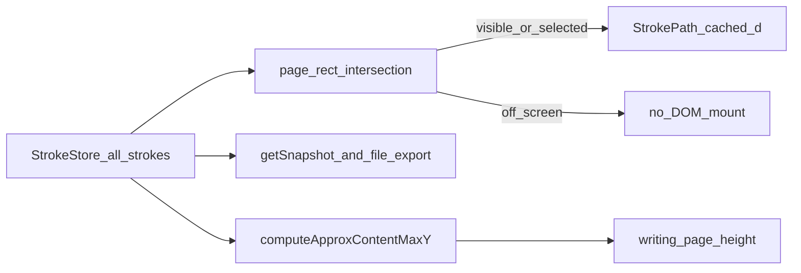

# Ink canvas: stroke viewport culling and render caches

## Why it exists

Long writing and drawing sessions accumulate hundreds or thousands of strokes. Mounting every committed stroke as a React `StrokePath` that runs perfect-freehand `getStroke` made interaction cost scale with **document length**, not with what is on screen.

Viewport culling and path caches keep interaction closer to **visible ink**, while the full stroke set stays in memory and on disk.

ClickUp: [Improve performance while writing](https://app.clickup.com/t/86d3p8gt3) (`86d3p8gt3`).

---

## Conceptual understanding

Culling and caches are **render-only**:

| Layer | Culled / cached? | Role |
|---|---|---|
| `StrokeStore` | No cull | Source of truth for all strokes |
| Snapshots / autosave JSON | No cull | `getSnapshot()` returns `store.getAll()` |
| File SVG export | No cull | Rebuilds from the full stroke array via outline `getStroke` |
| Live React SVG (`StrokePath`, writing guides) | Yes | Skip mounts off-screen; cache path `d` for mounted strokes |
| Page-height / inviting height | Approx `maxY` | Cheap points+pad bounds — not export-quality outlines |

---

## Flows

### Visibility (each canvas render)

1. Intersect canvas container with the browser viewport (+ ~80px margin) → page-space rect via camera.
2. For each store stroke: keep selected; else intersect approx AABB with that rect.
3. Mount `StrokePath` only when visible. Writing guide lines use an index range over the same Y band (not `Array.from(full page)` + nulls).

Scroll listeners (`.cm-scroller`, `.ddc_ink_writing-dedicated-scroller`, window / `visualViewport`) bump `viewportRevision` so culling re-runs without mutating the store.

### Path `d` cache

`StrokePath` is `React.memo`’d. SVG path `d` is cached by stroke id; **offset is a CSS translate** so select-and-move does not recompute outlines. Store notifications clear the cache (points/style may have changed).

### Approx content `maxY`

`computeApproxContentMaxY` drives writing page-height / inviting grow so store updates do not pay `getStroke` for every stroke. Outline `computeStrokesBounds` remains for export and mode conversion.

---

## Technical details

| Piece | Location |
|---|---|
| Approx AABB, content maxY, visible page rect | `src/ink-canvas/stroke-viewport-culling.ts` |
| Cull filter, caches, guide band, scroll bump | `src/ink-canvas/ink-svg-canvas.tsx` |
| Inviting height using approx maxY | `writing-editor.tsx` |

Tradeoffs: approx bounds bias high (extra empty ruled space is fine). Scroll remounts still cost until `d` hits cache. Mid-stroke live preview uses a separate HTML canvas overlay and is unaffected by SVG culling — see [ink-canvas-live-drawing.md](ink-canvas-live-drawing.md).

Related: [dedicated writing HTML scroll](dedicated-writing-html-scroll.md) — how dedicated views scroll without camera-Y thrash.

---

## Technical Gotchas

1. **Do not derive saves from the live SVG DOM** — culled strokes would disappear. Use `StrokeStore` / `getSnapshot()` / export helpers.
2. **Selected strokes always mount** — select-tool moves DOM groups.
3. **Cache clear is wholesale on store notify** — correct after erase/replace; moves only need transform if `d` were kept (today clear is simple and safe).
4. **Export still outlines every stroke** — intentional; not part of this optimization.
