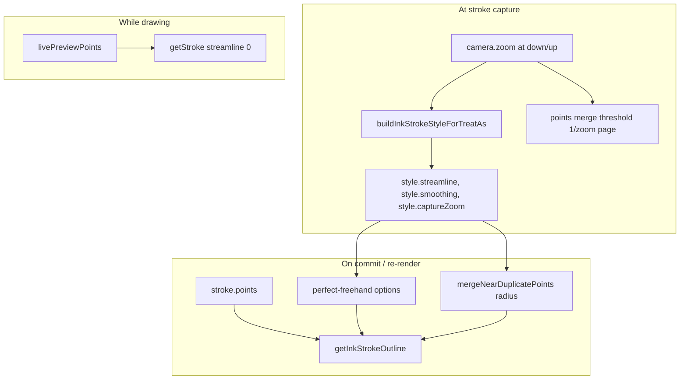
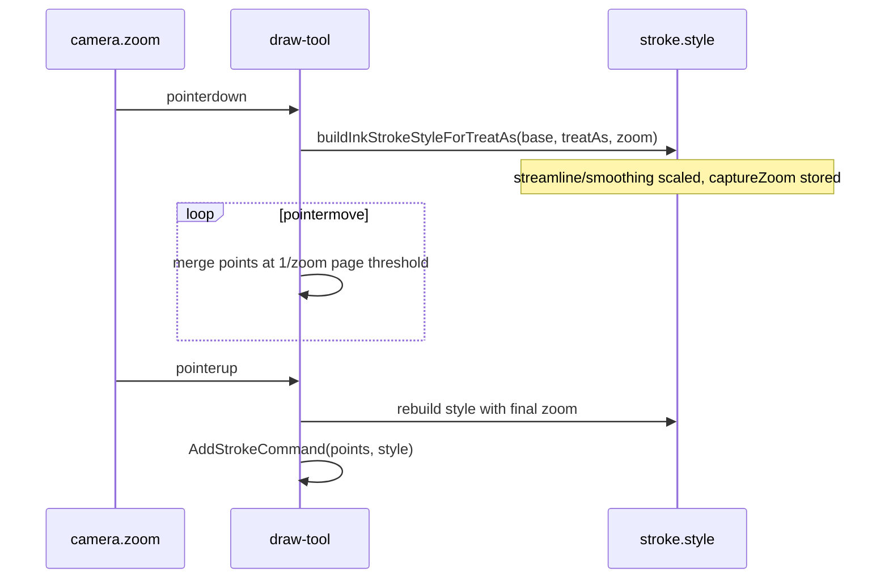
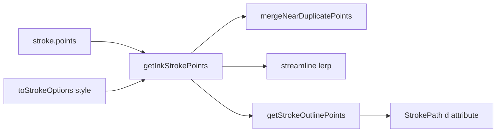

# Ink canvas: zoom-scaled stroke smoothing

## Why it exists

Stroke capture and outline generation run in **page space** (canvas coordinates inside the SVG `<g>` transform). Users judge strokes in **screen space** (pixels on the display). When the camera is zoomed in, the same on-screen pen motion produces **denser page-space samples** and the same numeric `streamline` / `smoothing` values cut corners more aggressively than at 1× zoom — committed strokes can look “smoothed beyond recognition” right after lift even though live preview looked correct.

Presets in `stroke-presets.ts` (pen `streamline: 0.65`, etc.) were tuned at **reference zoom 1**. Zoom scaling adjusts commit-time smoothing and duplicate-point merging so behaviour stays roughly **consistent in screen space** across zoom levels.

Related: [ink-canvas-live-drawing.md](ink-canvas-live-drawing.md) (live vs committed pipelines). Plan context: `plans/stroke-smoothing/` (merge threshold already used `1 / camera.zoom` for capture; this doc covers commit-time scaling).

---

## Conceptual understanding

### Page space vs screen space

From [pan-zoom.md](pan-zoom.md), viewport coordinates relate to page coordinates via camera `zoom` (`z`):

$$\text{pageDelta} \approx \frac{\text{screenDelta}}{\text{zoom}}$$

So at **higher zoom**, a 1 px on-screen move is a **smaller** step in page space → more points per inch of screen travel after merge, and streamline lerps between **closer** page-space knots → stronger apparent smoothing.

### Reference zoom

All scaling uses **`INK_STROKE_ZOOM_REFERENCE = 1`** (`src/ink-canvas/stroke-zoom-scale.ts`). At zoom 1, multipliers are identity. Above 1, smoothing and merge radii **shrink** in page space.

### What is scaled (and what is not)

| Mechanism | Scaled with capture zoom? | When applied |
|-----------|---------------------------|--------------|
| **Live preview** (`getStroke`, `streamline: 0`) | No | While pen is down |
| **`streamline` / `smoothing` on saved `stroke.style`** | Yes — baked at capture | Pointer down/up → persisted on stroke |
| **`mergeNearDuplicatePoints`** in `getInkStrokePoints` | Yes — via `captureZoom` on outline options | Commit outline + re-render/export |
| **Capture merge** (`appendOrMergePoint`, `1 / zoom` page threshold) | Yes — uses **current** camera each move | While capturing into `points` |

Live preview intentionally does **not** use these scalers; only **committed** local strokes do.

---

## Flows

### When values are recorded

`captureZoom` is stored on the stroke so **re-open, export, and zooming the canvas later** still use the zoom at which the stroke was drawn — not the current view zoom.

### Outline pipeline on commit

`toStrokeOptions` passes `captureZoom` into `InkStrokeOutlineOptions` for duplicate merging only; `streamline` and `smoothing` are already the scaled numbers on `style`.

---

## Technical details

### Shared scale factor

For capture zoom `z` (clamped to camera min/max, same as pan/zoom):

$$\text{scale} = \frac{\text{zoomRef}}{z} \qquad (\text{zoomRef} = 1)$$

Implemented as `numericForCaptureZoom` in `stroke-zoom-scale.ts`.

### Streamline and smoothing

At style build time (`buildInkStrokeStyleForTreatAs`):

$$\text{storedValue} = \mathrm{clamp}_{[0,1]}(\text{presetValue} \times \text{scale})$$

Example (pen preset, reference 1):

| Capture zoom | Streamline (0.65 base) | Smoothing (0.62 base) |
|--------------|------------------------|------------------------|
| 1× | 0.65 | 0.62 |
| 2× | 0.33 | 0.31 |
| 4× | 0.16 | 0.16 |

`thinning`, brush `size`, and colour are **not** zoom-scaled.

### mergeNearDuplicatePoints

Before streamline, `getInkStrokePoints` collapses consecutive input points closer than a page-space threshold. Base radius at reference zoom is **`size / 3`** (see `plans/stroke-smoothing/05_enhanced-stroke-point-pipeline.md`).

At capture zoom `z`:

$$\text{mergeDistancePage} = \frac{\text{size}}{3} \times \frac{\text{zoomRef}}{z}$$

$$\text{threshold} = \text{mergeDistancePage}^2$$

Higher zoom → smaller radius → fewer collapses → more detail retained for the outline step.

### Capture-time point merge (draw-tool)

Separate from duplicate merge above: while drawing, `appendOrMergePoint` uses:

$$\text{mergeThresholdPage} = \frac{1}{\text{camera.zoom}}$$

(~1 screen pixel in page units). Documented in Plan 2; unchanged by `stroke-zoom-scale.ts` but solves the same page-vs-screen mismatch during capture.

### Code map

| Responsibility | File |
|----------------|------|
| Scale helpers, `INK_STROKE_ZOOM_REFERENCE` | `src/ink-canvas/stroke-zoom-scale.ts` |
| Apply to presets + set `captureZoom` | `src/ink-canvas/stroke-presets.ts` |
| Read `captureZoom` in outline options | `src/ink-canvas/types.ts` (`InkStrokeStyle`, `toStrokeOptions`) |
| Duplicate merge uses threshold | `src/ink-canvas/freehand/get-ink-stroke-points.ts` |
| Pass zoom at down/up | `src/ink-canvas/tools/draw-tool.ts` |
| Boox ingest style | `tldraw-drawing-editor.tsx`, `tldraw-writing-editor.tsx` |

---

## Technical Gotchas

- **Legacy strokes** without `captureZoom` default to **1** in `toStrokeOptions` — behaviour matches pre-scaling commits.
- **Do not scale at render time from current camera** — stroke shape would change when the user zooms the editor after drawing. Values are fixed at **capture** zoom.
- **Live vs commit** — zoom scaling does not affect live preview; a small difference on lift can remain if commit still uses `getInkStrokeOutline` vs live `getStroke` with `streamline: 0`.
- **Mid-stroke zoom** — style is rebuilt on **pointer up** with final `camera.zoom`; zoom changes during a stroke are rare but use lift-time zoom for stored scalars.
- **Boox strokes** (`authoringSource: 'boox'`) render with `getStroke` and skip `getInkStrokePoints`; `captureZoom` may still be stored on style for consistency but duplicate-merge scaling does not apply to that path.
- **Tuning** — change pen/mouse presets at reference zoom 1; adjust `INK_STROKE_ZOOM_REFERENCE` or the formula in `stroke-zoom-scale.ts` only if the global curve needs changing, not per-device in this layer.
