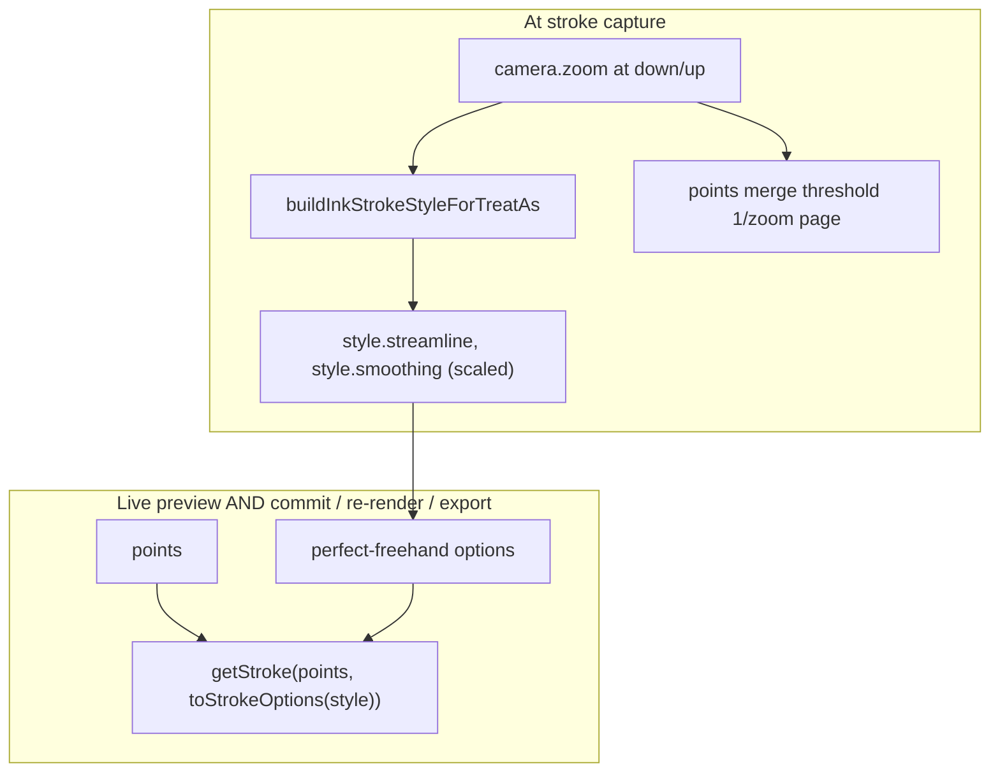
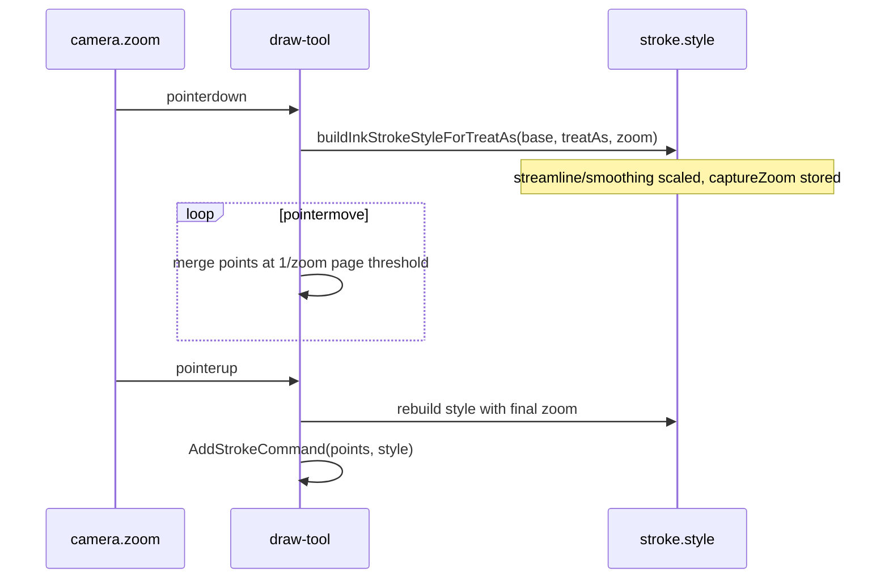
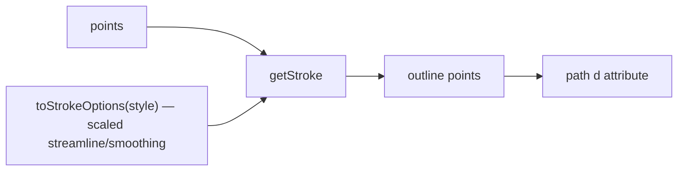

# Ink canvas: zoom-scaled stroke smoothing

## Why it exists

Stroke capture and outline generation run in **page space** (canvas coordinates inside the SVG `<g>` transform). Users judge strokes in **screen space** (pixels on the display). When the camera is zoomed in, the same on-screen pen motion produces **denser page-space samples** and the same numeric `streamline` / `smoothing` values cut corners more aggressively than at 1× zoom — committed strokes can look “smoothed beyond recognition” right after lift even though live preview looked correct.

Presets in `stroke-presets.ts` (pen `streamline: 0`/`smoothing: 0.1`, mouse smoother) are tuned at **reference zoom 1**. Zoom scaling adjusts the `streamline`/`smoothing` numbers **baked onto the stroke style at capture** so behaviour stays roughly **consistent in screen space** across zoom levels.

> **Single pipeline:** live preview and the committed stroke render the same `points` through the same `getStroke(points, toStrokeOptions(style))` call (see [ink-canvas-live-drawing.md](ink-canvas-live-drawing.md)). Because the zoom-scaled `streamline`/`smoothing` live on `style`, they apply **identically** to both layers — there is no separate commit-only smoothing or duplicate-point merge step anymore.

Related: [ink-canvas-live-drawing.md](ink-canvas-live-drawing.md) (single render pipeline). Plan context: `plans/stroke-smoothing/` (capture merge threshold uses `1 / camera.zoom`).

---

## Conceptual understanding

### Page space vs screen space

From [pan-zoom.md](pan-zoom.md), viewport coordinates relate to page coordinates via camera `zoom` (`z`):

$$\text{pageDelta} \approx \frac{\text{screenDelta}}{\text{zoom}}$$

So at **higher zoom**, a 1 px on-screen move is a **smaller** step in page space → more points per inch of screen travel after merge, and streamline lerps between **closer** page-space knots → stronger apparent smoothing.

### Reference zoom

All scaling uses **`INK_STROKE_ZOOM_REFERENCE = 1`** (`src/ink-canvas/stroke-zoom-scale.ts`). At zoom 1, multipliers are identity. Above 1, smoothing and merge radii **shrink** in page space.

### What is scaled (and what is not)

| Mechanism | Scaled with capture zoom? | When applied |
|-----------|---------------------------|--------------|
| **`streamline` / `smoothing` on saved `stroke.style`** | Yes — baked at capture | Pointer down/up → persisted on stroke, used by both live preview and commit |
| **Capture merge** (`appendOrMergePoint`, `1 / zoom` page threshold) | Yes — uses **current** camera each move | While capturing into `points` |

Because the scaled values live on `style` and both layers call `getStroke(points, toStrokeOptions(style))`, the scaling applies equally to live and committed — they cannot diverge.

---

## Flows

### When values are recorded

Because the scaled `streamline`/`smoothing` are **baked onto `style` at capture**, re-opening, exporting, or zooming the canvas later does not re-scale the stroke — its shape is fixed at the zoom it was drawn at.

> **`captureZoom` is now vestigial for rendering.** It is still stored on `style` (and passed through `toStrokeOptions`) for historical/diagnostic reasons, but nothing in the render path reads it anymore — the only former consumer (`mergeNearDuplicatePoints` in the deleted `getInkStrokePoints`) is gone. Scaling happens once, at capture, when the scaled numbers are written onto `style`.

### Outline pipeline (live, commit, and export)

`streamline` and `smoothing` are already the scaled numbers on `style`; `getStroke` consumes them directly.

---

## Technical details

### Two-branch formula (`metricForCaptureZoom`)

Constants: `zoomRef = 1`, `zoomMin = 0.1` (camera `MIN_ZOOM`). Preset `P` is the **1× reference** in `stroke-presets.ts`. Zoom-out target `T_out` depends on input kind (`STREAMLINE_SMOOTHING_ZOOM_OUT_TARGET`).

$$\text{lerpT}(z) = \frac{1/z - 1}{1/z_\text{min} - 1}$$

| Direction | Condition | Effective value |
|-----------|-----------|-----------------|
| **Reference** | `z = 1` | `P` |
| **Zoom out** | `z_min ≤ z < 1` | `P + \text{lerpT}(z)\,(T_\text{out} - P)` |
| **Zoom in** | `z ≥ 1` | `P \times (zoomRef / z)` |

Then `clamp` to `[0, 1]` for streamline/smoothing. **Never use `P/z` when `z < 1`** (that would push values above 1).

| Input | `P` @ 1× streamline / smoothing (`stroke-presets.ts`) | `T_out` @ 0.1× (`STREAMLINE_SMOOTHING_ZOOM_OUT_TARGET`) |
|--------|-------------------------------------------------------|------------------------------------------------------|
| Pen | 0 / 0.10 | 0.20 |
| Mouse | smoothed / smoothed | 0.40 |

Pen `streamline` is **0** at 1× for a faithful, pen-following stroke (matching the live preview by construction). On **zoom-in** it stays ~0 (`0 × zoomRef/z = 0`); on **zoom-out** it lerps toward `T_out` so far-zoomed strokes don't get jagged. `smoothing` follows the same curve from its own `P`.

`thinning`, brush `size`, and colour are **not** zoom-scaled.

### Capture-time point merge (draw-tool)

Separate from duplicate merge above: while drawing, `appendOrMergePoint` uses:

$$\text{mergeThresholdPage} = \frac{1}{\text{camera.zoom}}$$

(~1 screen pixel in page units). **Append vs replace-tip** follows the hybrid rules in [ink-canvas-point-merge.md](ink-canvas-point-merge.md) (fast-stroke tip replacement + slow-draw time gate). Threshold scaling is documented in Plan 2; unchanged by `stroke-zoom-scale.ts` but solves the same page-vs-screen mismatch during capture.

### Code map

| Responsibility | File |
|----------------|------|
| Scale helpers, `INK_STROKE_ZOOM_REFERENCE` | `src/ink-canvas/stroke-zoom-scale.ts` |
| Apply scaled streamline/smoothing to presets + set `captureZoom` | `src/ink-canvas/stroke-presets.ts` |
| Stroke style + `toStrokeOptions` (carries vestigial `captureZoom`) | `src/ink-canvas/types.ts` (`InkStrokeStyle`, `toStrokeOptions`) |
| Pass zoom at down/up | `src/ink-canvas/tools/draw-tool.ts` |
| Boox ingest style | `tldraw-drawing-editor.tsx`, `tldraw-writing-editor.tsx` |

---

## Technical Gotchas

- **Legacy strokes** without `captureZoom` default to **1** in `toStrokeOptions` — harmless now that nothing in the render path reads `captureZoom`.
- **Do not scale at render time from current camera** — stroke shape would change when the user zooms the editor after drawing. Scaled values are baked onto `style` at **capture** zoom.
- **Live vs commit** — they cannot differ from zoom scaling: both render `getStroke(points, toStrokeOptions(style))` and the scaled values live on `style`.
- **Mid-stroke zoom** — style is rebuilt on **pointer up** with final `camera.zoom`; zoom changes during a stroke are rare but use lift-time zoom for stored scalars.
- **Boox strokes** (`authoringSource: 'boox'`) render through the same `getStroke` call as every other stroke; there is no longer a separate local-vs-boox outline branch.
- **Tuning** — change pen/mouse presets at reference zoom 1; adjust `INK_STROKE_ZOOM_REFERENCE` or the formula in `stroke-zoom-scale.ts` only if the global curve needs changing, not per-device in this layer.
