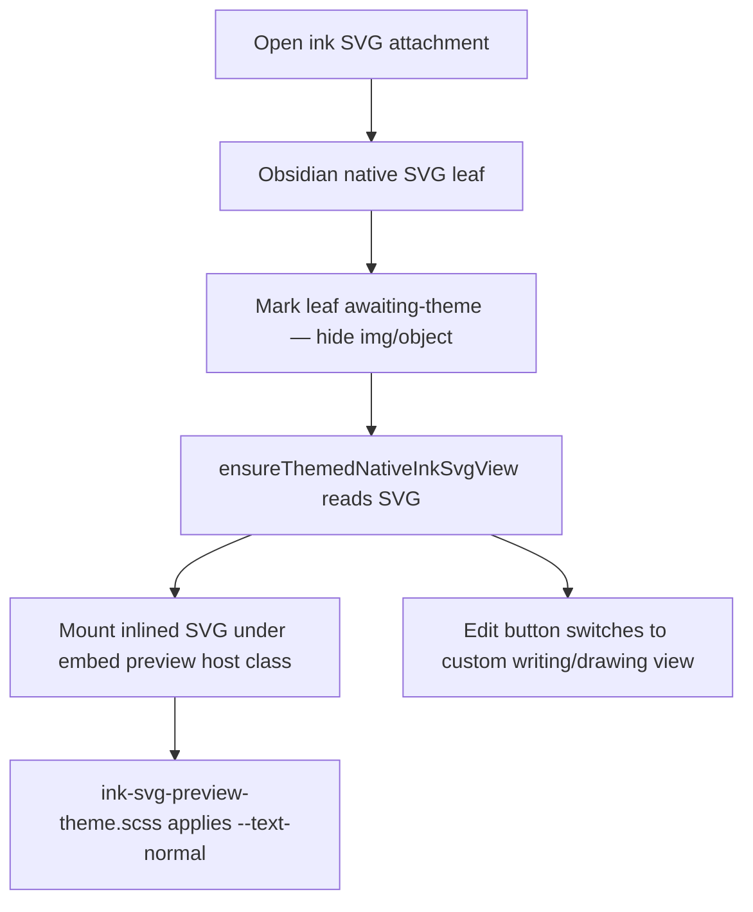

# Ink colours and theming

## Why it exists

Ink strokes need to stay visible in light themes, dark themes, and when you print or share the raw SVG file. Those situations need different colours.

If the app only stored “whatever colour looked right on screen right now,” the file would look wrong when you switched theme, opened the SVG outside Obsidian, or printed it.

Ink splits the problem in two: **colours baked into the saved file**, and **colours applied when the app displays the file**.

## Conceptual understanding

### Saved file colours

When Ink saves an SVG, pen strokes are written as **black** (`#000000`). Writing guide lines are written as **medium gray** (`#888888`).

Those values are fixed in the file on purpose. Black ink on a white page is what you expect on paper. The file stays readable even if Obsidian is not installed.

The SVG also carries small class names on strokes and lines so the app knows which shapes are pen ink and which are guide lines.

### Display colours

When Ink **shows** an ink SVG inside Obsidian, it does not rely on the baked black and gray alone. It loads the SVG into the page as real SVG markup (not a flat image tag) and applies CSS that points at Obsidian’s theme variables.

That themed display path is shared across:

- **Note embeds** (Live Preview and Reading mode locks)
- **SVG file picker** thumbnails
- **Obsidian’s native SVG leaf** when you open an ink `.svg` attachment directly (before switching into Ink’s custom writing/drawing editor)

- **Pen strokes** use `--text-normal` — the same colour as body text in the current theme.
- **Writing guide lines** use `--color-base-50` — a soft line colour that fits the theme.
- **Optional writing background and drawing frame** use other theme surface colours when those settings are on.

When you toggle light or dark mode, those variables change. The preview updates without resaving the SVG.

### Two layers, one file

| Layer | Where it lives | Purpose |
|-------|----------------|---------|
| Baked colours | Inside the `.svg` file on disk | Print, export, fallback outside Obsidian |
| Theme colours | Ink preview CSS while viewing in Obsidian | Match light/dark and editor appearance |

The file on disk stays black and gray. The preview overrides those for display only.

## Flows

### Saving

1. You draw or write in the editor.
2. Ink exports paths and lines into the SVG.
3. Strokes get black fill and the stroke class.
4. Guide lines get gray stroke and the line class.
5. The file is written to your vault.

### Displaying in Live Preview or Reading mode

1. Ink loads the SVG into the preview area as inline SVG.
2. Theme CSS sets stroke and fill from Obsidian variables.
3. Guide lines pick up the writing-line colour; pen paths pick up text colour.
4. You change theme → variables change → preview colours change immediately.

### Opening an ink SVG in Obsidian’s native leaf

Opening an attachment as a normal SVG file uses Obsidian’s built-in media view (`img` / `object`), which cannot recolour inner paths. Ink detects ink writing/drawing metadata, then:

1. `ensureThemedNativeInkSvgView` marks the leaf awaiting-theme **before** `vault.read`.
2. It confirms ink metadata, then mounts themed chrome via `addEditButtonToSvgView`.
3. Native media is hidden immediately (`ddc_ink_svg-view--awaiting-theme`, then `ddc_ink_svg-native-media--hidden` after mount).
4. `mountInlineSvgPreview` parses the SVG string into a real `<svg>` under `ddc_ink_svg-native-view-preview` plus the same writing/drawing embed preview class used elsewhere.
5. Shared rules in `ink-svg-preview-theme.scss` restyle paths to `var(--text-normal)`.
6. If inline mount fails, native media is unhidden so the leaf still shows the baked file.

### Displaying outside Ink’s preview

If something shows the SVG as a normal image (or you open the raw file in a browser), you see the **baked** black and gray. That is expected. Theme colours only apply when Ink’s preview CSS is active.

## Technical details

| Element | Baked in file | On screen in Ink preview |
|---------|---------------|--------------------------|
| Pen strokes | `#000000` | `var(--text-normal)` |
| Writing guide lines | `#888888` | `var(--color-base-50)` |
| Writing background (optional setting) | — | `var(--color-base-05)` |
| Drawing frame (optional setting) | — | `var(--color-base-30)` |

Constants for baked values live in `src/default-content-colours.ts`. Shared preview theme rules live in `src/components/shared/ink-svg-preview-theme.scss`.

Ink must **inline** the SVG for theme CSS to reach individual paths and lines. A plain `` tag treats the drawing as one bitmap-like object; inner paths cannot be restyled.

| Surface | Entry | Mount helper | Theme host classes |
|---------|-------|--------------|--------------------|
| Note embeds | Embed preview components | `mountInlineSvgPreview` (or equivalent inline path) | `ddc_ink_writing-embed-preview` / `ddc_ink_drawing-embed-preview` |
| SVG picker | `svg-picker-modal.ts` | `mountInlineSvgPreview` | Same embed preview classes |
| Native SVG leaf | `ensureThemedNativeInkSvgView` (writing/drawing registers) | `mountInlineSvgPreview` | `ddc_ink_svg-native-view-preview` **plus** the matching embed preview class |

Native-leaf layout (sizing, scroll, centered media) lives in `src/logic/utils/svg-edit-button.scss`. Colour overrides stay in the shared theme partial so dedicated native views cannot drift from embeds.

## Technical gotchas

1. **Image tags do not theme** — Reading mode, the native SVG leaf, and any other `img`/`object` path must swap to (or hide behind) an inlined SVG preview, or strokes stay black in dark mode.
2. **Baked black wins without CSS** — SVG `fill="#000000"` on a path is strong. Preview CSS uses `!important` so theme colour can override it inside Ink previews.
3. **Reuse embed host classes on the native leaf** — Native-view layout uses `ddc_ink_svg-native-view-preview`; colour comes from the same writing/drawing embed classes. Do not invent a parallel stroke-colour stylesheet for dedicated native views.
4. **Hide native media before `vault.read`** — Ink marks the leaf with `ddc_ink_svg-view--awaiting-theme` synchronously on open so Obsidian’s `img`/`object` never paints baked-black strokes during the async read. Removing that early suppress brings back a dark-mode flash.
5. **Hide native media only after a successful inline mount** — If parse/mount fails, restoring the `img`/`object` keeps the leaf usable with baked colours.
6. **Editor vs file** — While editing, the canvas may still use live drawing colours. Only the **exported SVG** and **locked / native previews** follow the bake + theme rules described here.
7. **Legacy files** — Older tldraw-era SVGs may use different stored colours. New ink-canvas exports follow black strokes and gray guide lines.
8. **Print and share** — Exported files intentionally stay black/gray so hard copies stay legible.

## See also

- [Reading mode](reading-mode.md) — How Reading mode loads and shows embed previews
- [Reading mode embed rendering](reading-mode-embed-rendering.md) — Reading mode implementation
- [Plugin memory and persistence](plugin-memory-and-persistence.md) — What lives in vault files vs settings
