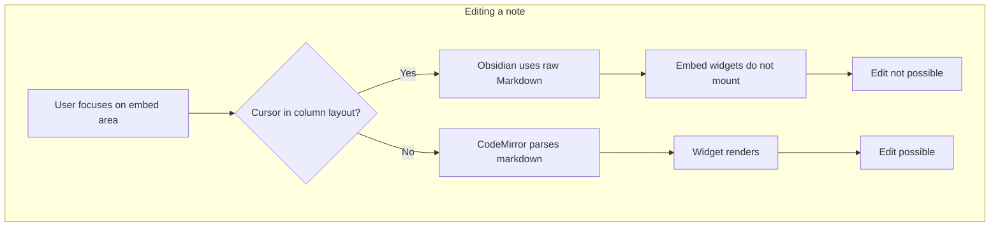

# Ink Embeds: Contexts and Limitations

## Why it exists

Ink embeds (writing and drawing) are rendered via CodeMirror widgets in Obsidian’s Live Preview editor. Their behaviour depends on the surrounding markdown structure. This document explains where embeds work fully, where they are limited, and where workarounds are needed — so users and contributors understand expectations.

## Conceptual overview



### Context matrix

| Context | Insert | Display | Edit in place | Notes |
|---------|--------|---------|---------------|-------|
| Normal paragraphs | Yes | Yes | Yes | Fully supported |
| Native callouts | Yes | Yes | Yes | Fully supported |
| Blockquotes | Yes | Yes | Yes | May overflow right edge; fix planned — see [Embeds in blockquotes](#embeds-in-blockquotes) |
| Columns (Obsidian Columns, MCM, MCL) | Yes | Yes | No | See [Embeds in columns](embeds-in-columns.md) |
| Admonition code blocks | Yes | No | No | Content parsed as code, opaque to markdown parser |
| Source mode | N/A | No | N/A | Live Preview only; extensions return `Decoration.none` |
| Reading mode | N/A | Yes | No | Preview-only; sizing matches LP — see [Reading mode embed rendering](reading-mode-embed-rendering.md) |

## Supported contexts

- **Normal flow** — Embeds between paragraphs, in lists, in tables, or inside native Obsidian callouts (`> [!note]`, etc.) work as expected.
- **Native callouts** — Obsidian’s built-in callout syntax is parsed as markdown, so ink widgets mount and editing works.
- **Lists and tables** — The QA vault tests embeds in list items and table cells; they render and are editable in Live Preview.

## Limited or unsupported contexts

### Embeds in columns

Ink embeds can be inserted into column layouts (e.g. Obsidian Columns `[!col]`, Multi-Column Markdown, MCL `[!multi-column]`). They display correctly in Reading mode and Live Preview when you are not editing that area. **You cannot edit embeds while the cursor is inside the column structure** — Obsidian’s column rendering collapses back to raw Markdown when you focus on editing, so the CodeMirror widgets never mount.

See [Embeds in columns](embeds-in-columns.md) for details and workarounds.

### Embeds in blockquotes

Embeds inside blockquotes (`> ...`) may overflow the right edge of the note because our full-bleed CSS is designed for full-page width. A fix is planned. See [plan-embeds-in-quote-blocks](../.github/plans/plan-embeds-in-quote-blocks.md).

### Admonition code blocks

Embeds inside Admonition plugin blocks (e.g. ` ```ad-note`) do not render. The content is inside a fenced code block, so Obsidian parses it as code, not markdown. CodeMirror extensions only process markdown syntax; they cannot see inside code fences.

### Source mode

In Source mode, Obsidian shows raw markdown. Ink embed extensions intentionally return `Decoration.none` when `editorLivePreviewField` is false, so no widgets are rendered. See [ux-decisions](ux-decisions.md#embed-extensions-and-source-mode).

### Reading mode

Embeds display in Reading mode with the same preview sizing and layout as Live Preview (read-only — no in-place editing). Implemented via a markdown post-processor. See [Reading mode embed rendering](reading-mode-embed-rendering.md).

## Technical gotchas

1. **Writing embeds never show the drawing grid** — The teal dot grid is a drawing-only feature. Writing embeds always render without it, even if the source file was converted from a drawing.
2. **Live Preview vs Source** — Ink embeds exist only in Live Preview. Any view that uses raw markdown (Source mode, or collapsed column markup during edit) will not show interactive embeds.
3. **Column plugins** — Community column plugins (Obsidian Columns, Multi-Column Markdown, MCL) rely on Live Preview’s rendered output. When you focus on editing that region, Obsidian may switch to a source representation, bypassing the widget pipeline.
4. **Code fences** — Content inside ` ```...` code blocks is never parsed as markdown; ink embed syntax there is treated as literal text.

## See also

- [Embeds in columns](embeds-in-columns.md) — Detailed explanation of the columns limitation.
- [Reading mode embed rendering](reading-mode-embed-rendering.md) — How reading mode matches Live Preview preview layout.
- [Blocked features](blocked-features.md) — Other incomplete features (if any).
- [UX decisions](ux-decisions.md) — Source mode technical notes.
