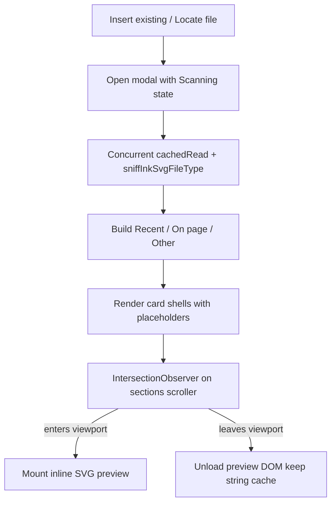

# Insert existing file picker

## Why it exists

Users need to pick an existing ink writing or drawing SVG from the vault (Insert existing… commands, and “Locate file” on a broken embed). A large vault can contain hundreds of SVGs, many of them large tldraw or ink-canvas files. Opening the picker must stay responsive: the modal should appear immediately, discovery should not parse every file’s full metadata JSON, and scrolling must not mount every preview DOM at once.

## Conceptual understanding

The picker is a modal with three sections (Recent, On current page, Other) and a fuzzy filename search. Internally it separates **discovery** (which vault SVGs are ink writing vs drawing) from **preview rendering** (mounting themed inline SVG for cards).

## Flows

### Opening and discovery

1. `openInkFilePicker` opens `SvgFilePickerModal` immediately with empty sections and `isScanning: true`.
2. In the background it lists vault `.svg` files and classifies them with `collectMatchingInkSvgFiles` (bounded concurrency, default 8).
3. Classification uses `sniffInkSvgFileType` — regex checks for ink markers and `file-type="inkWriting"|"inkDrawing"` — **not** `DOMParser` + `JSON.parse` of the embedded payload.
4. When discovery finishes, `setSections` fills the grid and clears the scanning status. If the user already closed the modal, results are discarded (`hasClosed`).

### Preview mounting while scrolling

1. Each card starts with an empty placeholder.
2. An `IntersectionObserver` (root = the sections scroller, with a small rootMargin) enqueues mount when a card intersects.
3. At most four preview loads run at once so scrolling does not stampede `cachedRead` + `DOMParser`.
4. Leaving the viewport unmounts the preview DOM but keeps the SVG string in a modal-lifetime cache so revisiting a card is cheap.
5. Closing the modal clears the observer, pending queue, and string cache.

### Manual QA (large vault)

Regenerate the qa-test-vault (`node qa-test-vault/generate.mjs`), then use **19 – Insert Existing Picker**:

- ~50 unique ink-canvas writing + ~50 drawing SVGs (`picker-stress-*.svg`)
- Density note with ~60 unique embeds
- Notes that exercise “other” vs “on current page” sections

## Technical details

| Piece | Location | Role |
|---|---|---|
| Open + discovery | `src/logic/utils/open-ink-file-picker.ts` | Immediate open, concurrent sniff, section build |
| Cheap type check | `sniffInkSvgFileType` in `extractInkJsonFromSvg.ts` | Writing/drawing without full JSON parse |
| Modal UI + lazy previews | `svg-picker-modal.ts` / `.scss` | Sections, search, IntersectionObserver queue |
| Inline themed SVG | `mountInlineSvgPreview` in `inline-svg-preview.ts` | Parse SVG string into host for CSS theming |
| Stress fixtures | `qa-test-vault/generate.mjs` → section 19 | Many current-format files for manual picker QA |

Section layout (Recent / On current page / Other) and recent-path `localStorage` behaviour are also described under [Copy & paste embeds](copy-paste-embeds.md#insert-existing-file-modal).

## Technical Gotchas

- **Do not restore full `extractInkJsonFromSvg` in the discovery path** — large tldraw payloads make open latency scale with vault size. Sniff only.
- **Writing vs drawing without `file-type`** — ink-canvas SVGs that lack `<ink file-type="…">` sniff as drawing (same default as format extraction). Stress fixtures always set `file-type` so both pickers stay populated.
- **Unload vs cache** — unloading drops DOM only; the string cache is intentional so scroll-back does not re-read every file. The cache is cleared on modal close so edits on disk are visible next open (via a fresh `cachedRead`).
- **`hasClosed` guards** — discovery and `setSections` must no-op after close so a late scan cannot resurrect UI on a disposed modal.
- **Observer root** — the observer uses the sections scroller, not the window. Changing layout without updating `root` breaks unload and remount.
- **QA vault is generated and mostly gitignored** — only `generate.mjs` and `README.md` are tracked; re-run the generator after pulling fixture changes.
