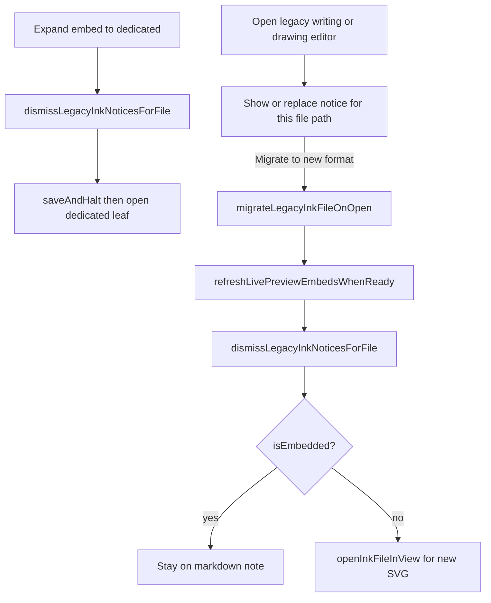

# Legacy migrate on open

**Why it exists:** Opening a single legacy ink file shows a notice that can migrate just that attachment, without running the vault-wide migration modal. Users often hit legacy content while editing or reviewing embeds; a one-click path converts that file and keeps them in the same editing context when possible.

## Conceptual understanding

When a writing or drawing editor loads a legacy file (v1 `.writing` / `.drawing`, or an SVG that still stores tldraw metadata), Ink shows a persistent notice with **Migrate to new format**. Only **one** notice is kept open per attachment path: showing another for the same file replaces the previous CTA.

That migrate action permanently converts only the opened attachment, refreshes Live Preview embeds that reference it, and then either:

- **stays on the markdown note** if migration started from an **embed**, or
- **opens the converted SVG in a dedicated ink view** if migration started from a **dedicated** writing/drawing leaf.

Expanding an unlocked embed to a dedicated view **dismisses** any migrate notice for that file first (expand also `saveAndHalt`s, which can already rewrite a tldraw SVG as ink-canvas on disk).

Bulk vault migration (Settings / command palette) remains a separate path; see [file-format-and-conversion.md](./file-format-and-conversion.md).

## Flows

Editors pass `isEmbedded` from their existing `embedded` prop into `showLegacyInkUnlockNotice`. `runLegacyInkMigrationFromNotice` skips `openInkFileInView` when that flag is set.

## Technical details

| Piece | Role |
|-------|------|
| [`legacy-ink-notice.ts`](../src/logic/utils/legacy-ink-notice.ts) | Notice UI; per-path tracking; `dismissLegacyInkNoticesForFile`; forwards `isEmbedded` |
| Drawing/writing embed `openInDedicatedView` | Dismisses the migrate CTA before `saveAndHalt` + dedicated open |
| [`migrate-legacy-ink-on-open.ts`](../src/logic/utils/migrate-legacy-ink-on-open.ts) | Single-file migrate (legacy extension or tldraw SVG); embed refresh; conditional dedicated reopen |
| [`ink-embed-refresh.ts`](../src/components/formats/current/ink-embeds-extension/ink-embed-refresh.ts) | Rebuilds Live Preview writing/drawing widgets after the note stays active |

Call sites that show the notice (current ink-canvas editors and v1 tldraw editors) all pass `isEmbedded: props.embedded`.

## Technical Gotchas

- **Do not always reopen in a dedicated view after migrate.** `openInkFileInView` uses the active leaf. From an embed that leaf is the markdown note; opening an ink view replaces the note and also prevents `refreshLivePreviewEmbedsWhenReady` from seeing an active Live Preview markdown view.
- **Dedicated reopen is still required for path changes.** Migrating `.writing` / `.drawing` produces a new `.svg` path; the dedicated leaf must open that file in the correct writing/drawing view type.
- **Embed path depends on the note remaining active.** Refresh retries until the active view is source-mode Live Preview; stealing the leaf for an ink view makes refresh a no-op.
- **One notice per file path.** Unlocking an embed and then opening the same attachment dedicated used to stack two migrate CTAs. Migrating from the first deleted `.writing`/`.drawing` while the second still pointed at the old path (ENOENT / “not eligible”). Notices are tracked per path, replaced on re-show, dismissed on expand-to-dedicated, and cleared after a successful migrate.
- **Expand may rewrite tldraw SVG as ink-canvas.** `saveAndHalt` before dedicated open persists the in-memory ink-canvas snapshot. Dismissing the embed notice avoids a leftover migrate CTA against a file that is no longer tldraw on disk.
