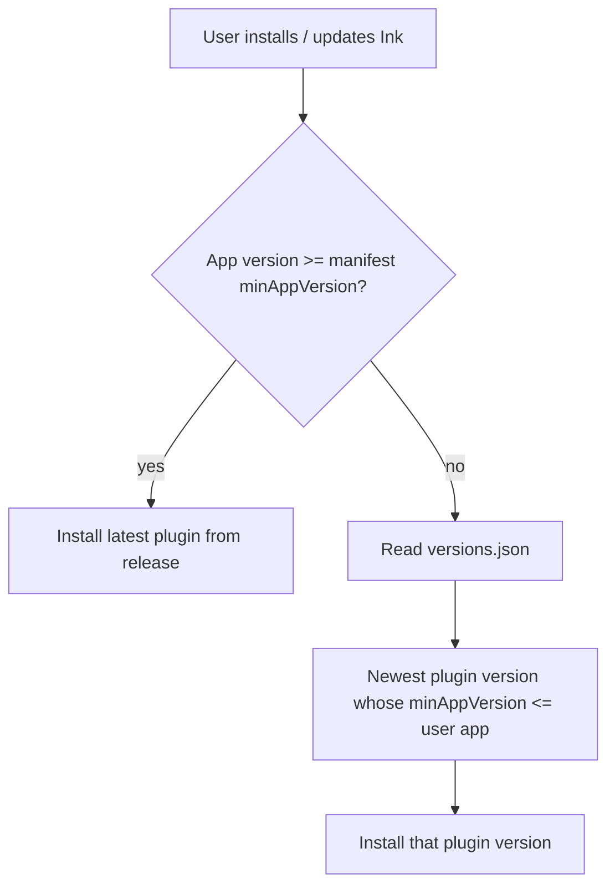
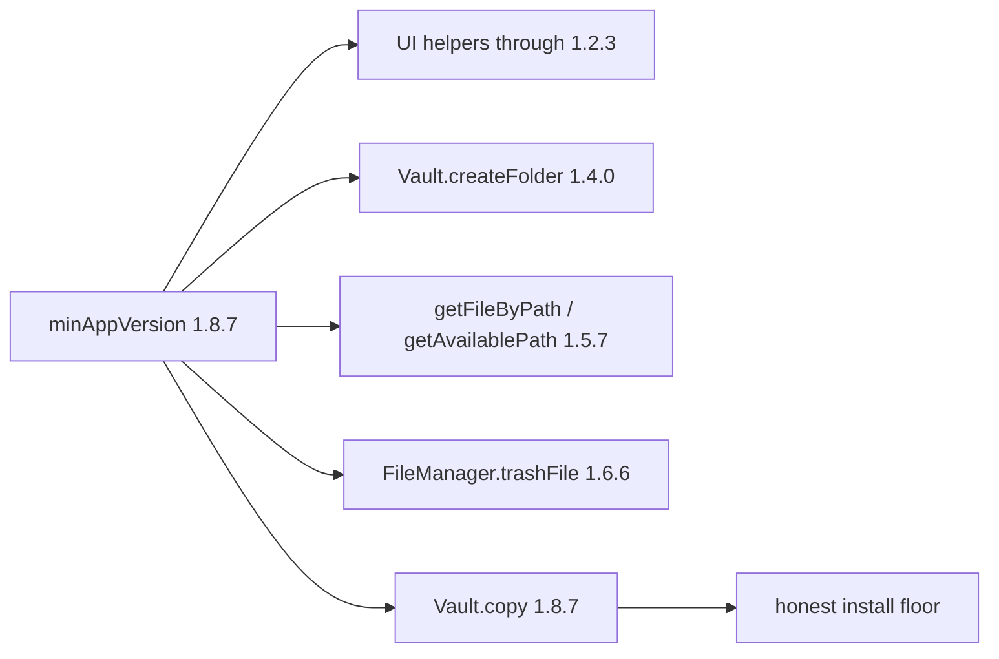

# Manifest `minAppVersion` and `versions.json`

## Why it exists

Obsidian community directory checks reject an invalid `minAppVersion` in `manifest.json`. The field must be a three-part app version (`x.y.z`) with no leading zeros in any segment. Ink also ships `versions.json` so older Obsidian installs can fall back to a compatible plugin release when `minAppVersion` rises later.

## Conceptual understanding

- **`manifest.json` / `manifest-beta.json` `minAppVersion`** — Minimum Obsidian app version required to run the current plugin build.
- **`versions.json`** — Map of `pluginVersion → minAppVersion`. Obsidian consults it only when the user’s app is older than the latest manifest’s `minAppVersion`, to pick the newest plugin release that still runs.

When `minAppVersion` rises (currently Obsidian `1.8.7`), keep prior plugin versions in `versions.json` mapped to their older floors so those installs can fall back. You do not need one line per GitHub release while the floor is unchanged.

## Flows



## Technical details

| File | Role |
|------|------|
| `manifest.json` | Public / release manifest copied into `dist/` on build |
| `manifest-beta.json` | Beta channel packaging; same `minAppVersion` contract |
| `versions.json` | Repo-root fallback map for older Obsidian apps |
| `version-bump.mjs` | On `npm version`, sets `manifest.version` and records `versions[targetVersion] = minAppVersion` |

Current contract (plugin `0.5.6`):

```json
{
  "minAppVersion": "1.8.7"
}
```

```json
{
  "0.5.5": "1.0.0",
  "0.5.6": "1.8.7"
}
```

The floor is `1.8.7` because unguarded Obsidian APIs in `src/` require that app version. Community SOURCE CODE checks run `obsidianmd/no-unsupported-api`, which compares each call site to `@since` tags in the Obsidian API typings. The highest unguarded API in use is `Vault.copy` (`@since 1.8.7`) in the duplicate-file helpers; other binding APIs (for example `FileManager.trashFile` 1.6.6, `Vault.getFileByPath` 1.5.7, `Vault.createFolder` 1.4.0, `ButtonComponent.setDisabled` 1.2.3) sit below that ceiling.

Plugin `0.5.5` remains mapped to `1.0.0` so Obsidian installs older than `1.8.7` can fall back to that release via `versions.json`.



Historical tags used the invalid string `1.00.0` (semver rejects leading zeros). Community validation expects the same three-number shape Obsidian itself uses (e.g. `1.0.0`, not `1.00.0` or `1.0`).

## Technical Gotchas

- **`1.00.0` is not valid** — `semver.valid('1.00.0')` is `null`. Obsidian reviewers treat malformed `minAppVersion` as a check failure even when humans read it as “1.0.0”.
- **Do not list every release** — Official guidance: update `versions.json` when `minAppVersion` changes, not on every plugin bump. While the floor is stable, duplicate rows for past tags add no fallback value.
- **Keep prior floors when raising** — When `minAppVersion` increases, leave older plugin versions mapped to their previous floors so older Obsidian apps still get a compatible Ink build. `version-bump.mjs` only writes the new `targetVersion` key; it does not rewrite or delete older entries.
- **Local lint vs community scanner** — Project `obsidian` typings may lag the `@since` map the hosted scanner uses. A clean local `npx eslint .` does not prove `no-unsupported-api` will pass community checks; keep `minAppVersion` at or above the highest unguarded API `@since`.
- **Lowering the floor needs code changes** — Dropping below `1.8.7` requires replacing or `requireApiVersion`-guarding APIs such as `Vault.copy`, not only editing the manifest.
- **Template leftover** — An old sample entry `"1.0.0": "0.15.0"` mapped a non-existent Ink plugin version to an ancient app floor; that was unrelated to this project’s release history and must not be restored.
- **Beta vs public** — Keep `minAppVersion` aligned across `manifest.json` and `manifest-beta.json` unless a channel intentionally raises the floor.
