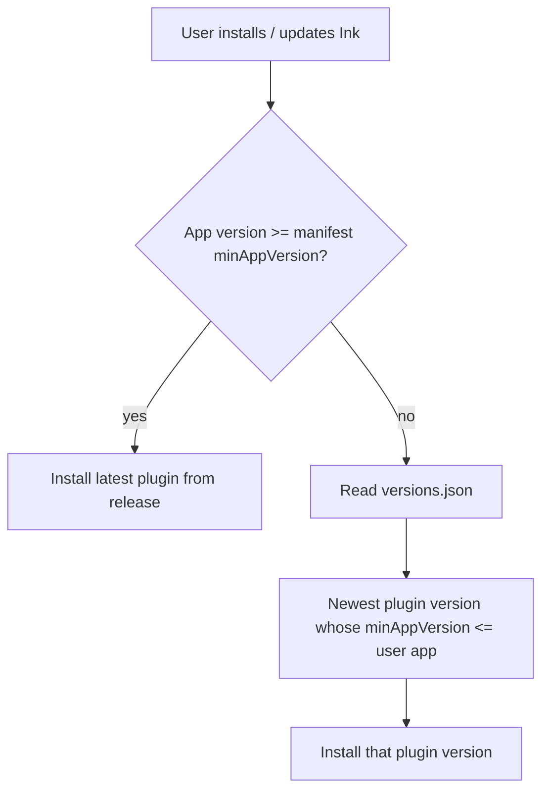

# Manifest `minAppVersion` and `versions.json`

## Why it exists

Obsidian community directory checks reject an invalid `minAppVersion` in `manifest.json`. The field must be a three-part app version (`x.y.z`) with no leading zeros in any segment. Ink also ships `versions.json` so older Obsidian installs can fall back to a compatible plugin release when `minAppVersion` rises later.

## Conceptual understanding

- **`manifest.json` / `manifest-beta.json` `minAppVersion`** — Minimum Obsidian app version required to run the current plugin build.
- **`versions.json`** — Map of `pluginVersion → minAppVersion`. Obsidian consults it only when the user’s app is older than the latest manifest’s `minAppVersion`, to pick the newest plugin release that still runs.

If every Ink release shares the same floor (currently Obsidian `1.0.0`), a single current entry in `versions.json` is enough. You do not need one line per GitHub release.

## Flows



## Technical details

| File | Role |
|------|------|
| `manifest.json` | Public / release manifest copied into `dist/` on build |
| `manifest-beta.json` | Beta channel packaging; same `minAppVersion` contract |
| `versions.json` | Repo-root fallback map for older Obsidian apps |
| `version-bump.mjs` | On `npm version`, sets `manifest.version` and records `versions[targetVersion] = minAppVersion` |

Current contract (plugin `0.5.5`):

```json
{
  "minAppVersion": "1.0.0"
}
```

```json
{
  "0.5.5": "1.0.0"
}
```

Historical tags used the invalid string `1.00.0` (semver rejects leading zeros). Community validation expects the same three-number shape Obsidian itself uses (e.g. `1.0.0`, not `1.00.0` or `1.0`).

## Technical Gotchas

- **`1.00.0` is not valid** — `semver.valid('1.00.0')` is `null`. Obsidian reviewers treat malformed `minAppVersion` as a check failure even when humans read it as “1.0.0”.
- **Do not list every release** — Official guidance: update `versions.json` when `minAppVersion` changes, not on every plugin bump. Duplicate `"x.y.z": "1.0.0"` rows for past tags add no fallback value while the floor stays `1.0.0`.
- **Template leftover** — An old sample entry `"1.0.0": "0.15.0"` mapped a non-existent Ink plugin version to an ancient app floor; that was unrelated to this project’s release history and must not be restored.
- **Beta vs public** — Keep `minAppVersion` aligned across `manifest.json` and `manifest-beta.json` unless a channel intentionally raises the floor.
