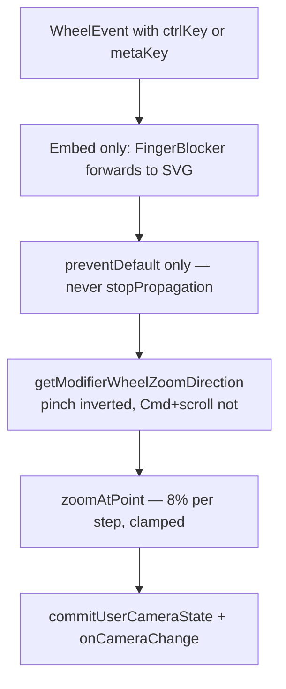
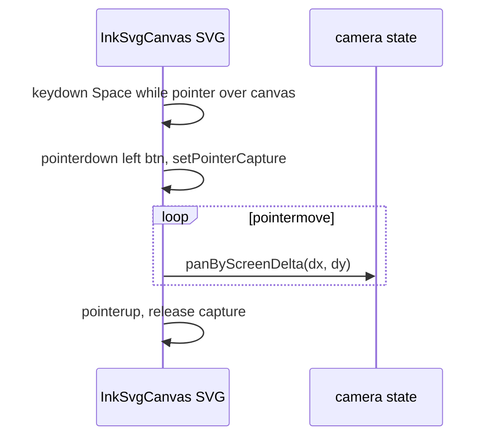
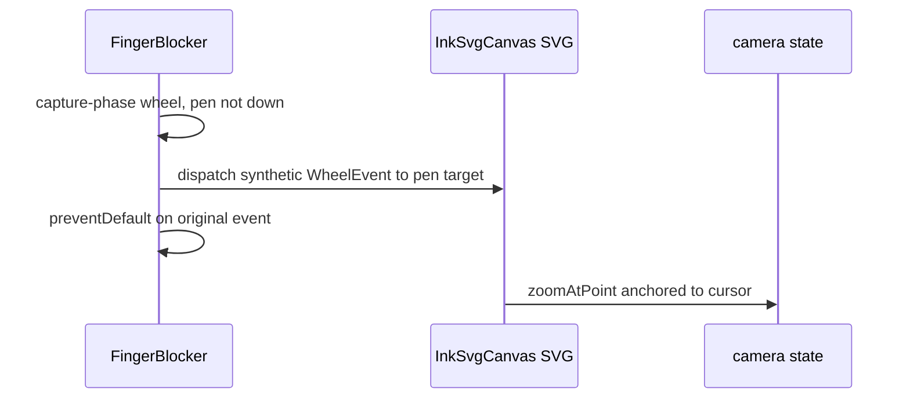
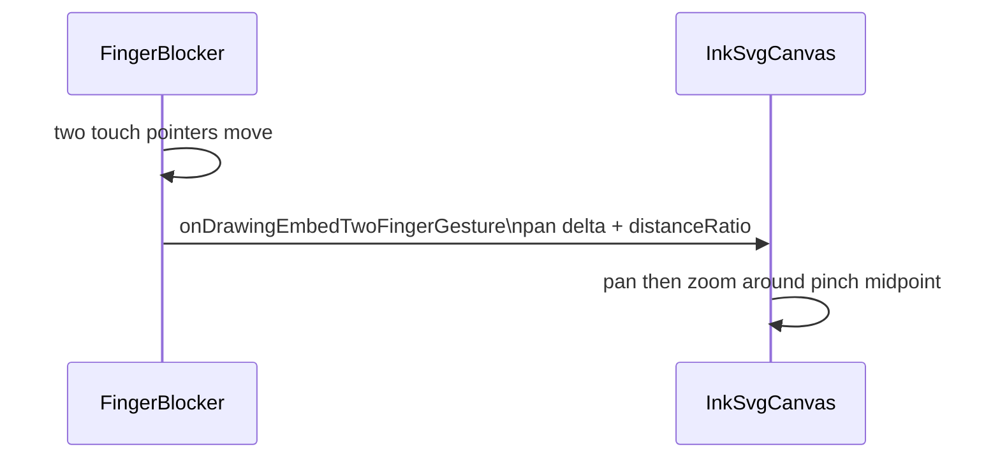

# Pan and Zoom

This document describes the pan and zoom gestures available in **current-format** drawing editors (`InkSvgCanvas`) — both in a dedicated view and as an inline embed inside a note.

## Why it exists

Drawing embeds need fluid, cursor-anchored zoom and natural canvas panning without relying on toolbar buttons or coarse stepped zoom. Users work on large or dense drawings and expect the same interaction patterns as a desktop canvas app while the note scroller remains usable when not gesturing on the canvas.

## Conceptual understanding

Current-format drawing editors render through `InkSvgCanvas`, which maintains a **camera** with three values: `x`, `y` (offset in page-space), and `zoom`. The SVG content group applies:

$$\text{screenX} = (\text{pageX} + \text{camera.x}) \times \text{camera.zoom}$$

To zoom around a fixed viewport point `(s_x, s_y)` — so that the content under the cursor does not shift — the camera offset must be adjusted:

$$\text{newCamX} = \text{camX} + s_x \left(\frac{1}{\text{newZoom}} - \frac{1}{\text{oldZoom}}\right)$$

Pan deltas are in screen-pixel space. Camera `x`/`y` are in page-space, so deltas are divided by `zoom` to keep pan speed consistent regardless of zoom level.

Stroke commit smoothing and duplicate-point merging are also adjusted for capture zoom so they stay consistent in screen space; see [ink-canvas-zoom-scaled-strokes.md](ink-canvas-zoom-scaled-strokes.md).

### Dedicated view vs. embed

| Context | Outer scroller | Mod+wheel zoom path |
|---|---|---|
| Dedicated view | None — full-screen | `InkSvgCanvas` SVG `wheel` listener |
| Embed | `.cm-scroller` must stay scrollable when not gesturing | `FingerBlocker` capture listener forwards mod+wheel to the SVG listener |

In embeds, `FingerBlocker` still manages pen/touch scroll locking and forwards non-drawing pointer and wheel input to the ink canvas. See [embed-scrolling.md — section 3b](embed-scrolling.md).

---

## Gestures

### Dedicated view

| Gesture | Action |
|---|---|
| Mod (⌘/Ctrl) + scroll wheel | Zoom in / out, anchored to cursor |
| Mod (⌘/Ctrl) + trackpad pinch | Zoom in / out (pinch direction — see below) |
| Space + left-drag | Pan |
| Right-drag | Pan |
| Mod + right-drag | Zoom in / out, anchored to drag start point |
| Two-finger touch (no mod) | Pan with momentum on trackpad-style wheel deltas |

Cursor feedback: Space held shows `grab`; drag shows `grabbing`.

### Embed

| Gesture | Action |
|---|---|
| Mod (⌘/Ctrl) + scroll wheel | Zoom in / out, anchored to cursor |
| Mod (⌘/Ctrl) + trackpad pinch | Zoom in / out (pinch direction — see below) |
| Middle-mouse drag | Pan |
| Right-drag | Pan |
| Mod + right-drag | Zoom in / out, anchored to drag start point |
| Two-finger touch pinch | Pan + zoom (distance ratio on touch pointers) |

### Modifier + wheel zoom direction

macOS and Electron report both mouse wheels and trackpads as `wheel` events, often in `DOM_DELTA_PIXEL` mode. The two inputs cannot be distinguished reliably from `deltaY` magnitude alone (mouse wheels frequently emit a small ~4 px lead-in before larger deltas in the same burst).

| Input | Typical modifiers | Zoom direction |
|---|---|---|
| Mouse scroll wheel + ⌘/Ctrl | `metaKey` and/or `ctrlKey` | **Not inverted** — scroll up zooms in, scroll down zooms out |
| Trackpad two-finger scroll + ⌘/Ctrl | `metaKey` | **Not inverted** — same as mouse |
| Trackpad pinch (no ⌘ required on macOS) | `ctrlKey` **without** `metaKey` | **Inverted** — pinch together zooms out, spread apart zooms in |

Implementation: `isPinchWheelZoomEvent()` in `src/ink-canvas/pan-momentum.ts` (`ctrlKey && !metaKey`). All other modifier+wheel events use the raw `deltaY` sign.

Touch-screen two-finger pinch (actual touch pointers, not trackpad wheel) uses finger distance ratio in `FingerBlocker` and is already in natural spread/pinch semantics.

---

## Flows

### Mod+scroll zoom (dedicated view and embed)

### Dedicated view — space+drag pan

The space+drag handler only activates when the pointer is over the canvas (`mouseenter`/`mouseleave` flag), so Space is not stolen from other Obsidian UI.

### Embed — mod+scroll zoom

`FingerBlocker` forwards mod+wheel for embedded drawing ink canvases only. It uses `preventDefault()` on the original event and does **not** call `stopPropagation()`.

### Embed — two-finger touch pinch

---

## Technical details

**Primary source:** `src/ink-canvas/ink-svg-canvas.tsx` — native `wheel` and pointer listeners on the SVG element.

**Direction helper:** `src/ink-canvas/pan-momentum.ts` — `getModifierWheelZoomDirection()`, `isPinchWheelZoomEvent()`, `createModifierWheelZoomDirectionResolver()`.

**Embed wheel forwarding:** `src/components/jsx-components/finger-blocker/finger-blocker.tsx` — capture-phase `wheel` handler when `ctrlKey || metaKey` on an embedded drawing ink canvas.

**Zoom math:** `src/ink-canvas/camera.ts` — `zoomAtPoint()`, `panByScreenDelta()`, `getRightDragZoomDelta()`.

### Constants

| Constant | Value | Effect |
|---|---|---|
| `ZOOM_FACTOR` | `1.08` | 8% zoom per wheel step or direction toggle |
| `MIN_ZOOM` | `0.1` | Lower clamp — further zoom-out wheel events have no effect |
| `MAX_ZOOM` | `5` | Upper clamp |

### Right-drag zoom — dominant axis

Right-drag with mod held uses the dominant screen axis (`dx` vs `dy`, with `dy` negated so up = zoom in). `getRightDragZoomDelta()` accumulates an exponential factor per pixel.

### Camera change emission

User-driven camera updates call `commitUserCameraState()`, which applies `setCameraState` and then invokes `onCameraChange` **after** the state update returns. Calling `onCameraChange` inside a `setState` updater triggers React warnings because embed parents (e.g. `DrawingEditor`) update their own state in the callback.

### Legacy v1 tldraw drawing embeds

Older code-block embeds still use `tldraw-drawing-editor` with separate pan/zoom listeners and constants (`WHEEL_ZOOM_FACTOR`, embed camera lock/unlock). This document describes the current `InkSvgCanvas` path only.

---

## Technical Gotchas

### Never call `stopPropagation` on wheel events in Obsidian / Electron

On macOS, `stopPropagation()` on a `WheelEvent` interrupts the native OS scroll gesture recogniser state for the entire Electron session. After it fires once, normal page scrolling can remain broken until the window is closed — even after the handler is removed. Use `preventDefault()` only. Embed mod+wheel forwarding in `FingerBlocker` follows this rule.

### Do not invert Cmd+scroll using wheel delta heuristics

A previous approach inverted zoom when `deltaMode === PIXEL` and `abs(deltaY)` was small. On macOS, **mouse wheels also use pixel mode** and often begin each notch with a ~4 px event before larger deltas. Locking “trackpad” classification from that lead-in inverted entire mouse-wheel bursts and caused direction to flip when the 80 ms gesture lock expired between events.

The pinch-only rule (`ctrlKey && !metaKey`) avoids this: ⌘+scroll (mouse or trackpad) shares one code path, while OS-mapped trackpad pinch keeps natural spread/pinch semantics.

### Zoom appears to stop while scrolling

When `zoom` is already at `MIN_ZOOM` (0.1) or `MAX_ZOOM` (5), further wheel events in that direction still run but `clampZoom` leaves the level unchanged. This is expected — it can feel like the scroll wheel “does nothing” when trying to zoom out at minimum or zoom in at maximum.

### Pointer capture and embed scroll restore

Middle-button pan, right-drag, and mod+scroll in embeds interact with `FingerBlocker` scroll locking. Non-primary mouse buttons skip `lockScroll()`; gesture end paths and embed scroll restore are documented in [embed-scrolling.md — section 3b](embed-scrolling.md).

### Space+drag pointer capture

Space+drag pan calls `setPointerCapture` on the SVG target. The matching `pointerup` must clear pan state on the same element so capture is released cleanly.
