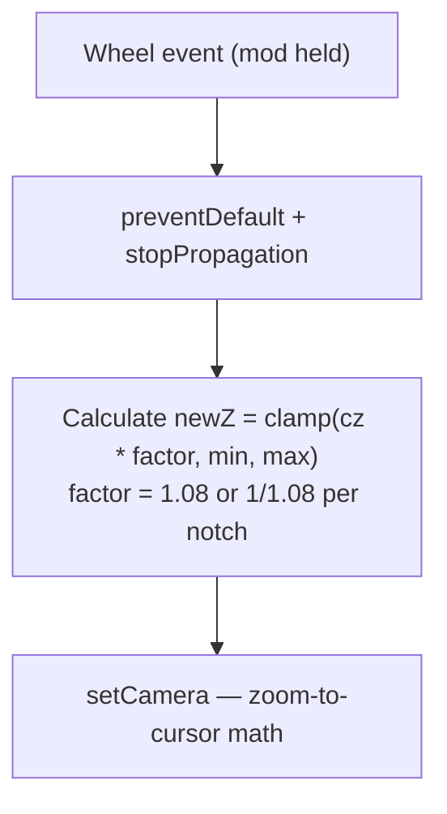
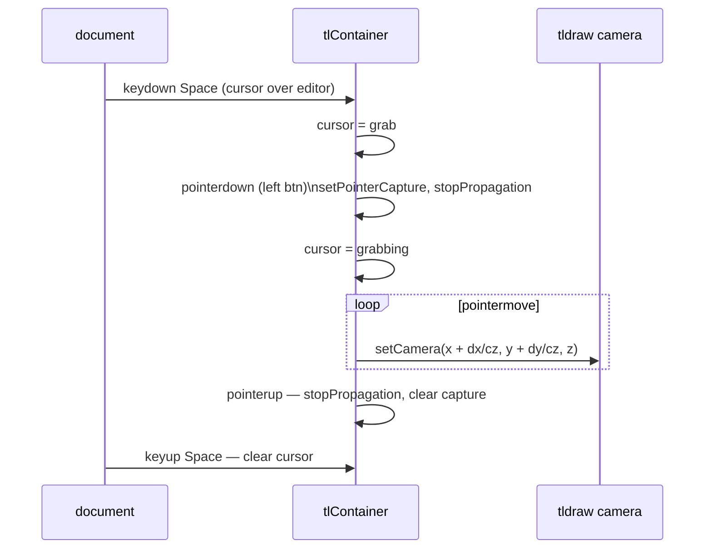
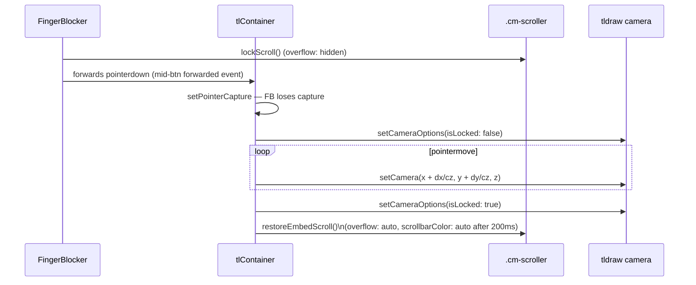
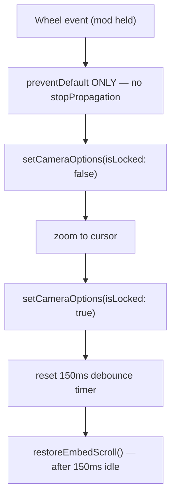

# Pan and Zoom

This document describes the pan and zoom gestures available in drawing editors — both when a drawing is opened in a dedicated view and when it appears as an inline embed inside a note.

## Why it exists

tldraw's default zoom (via `zoomIn` / `zoomOut`) snaps between fixed preset steps, making it feel coarse. For large or dense drawings, users need fluid, cursor-anchored zoom and natural canvas panning without leaving the editor or using toolbar buttons.

## Conceptual understanding

Each drawing editor instance runs inside a tldraw editor. tldraw maintains an internal **camera** described by three values: `x`, `y` (offset in page-space), and `z` (zoom level). The relationship between page-space coordinates and viewport (screen) coordinates is:

$$\text{viewportX} = (\text{pageX} + c_x) \times c_z$$

To zoom around a fixed viewport point `(s_x, s_y)` — so that the content under the cursor doesn't shift — the new camera `x` must be adjusted:

$$\text{newCx} = c_x + s_x \left(\frac{1}{\text{newZ}} - \frac{1}{c_z}\right)$$

Pan deltas are in screen-pixel space. Camera `x`/`y` are in page-space, so deltas must be divided by the current zoom level `c_z` to keep pan speed consistent regardless of zoom.

### Dedicated view vs. embed

| Context | Camera default | Page scroll concern |
|---|---|---|
| Dedicated view | Unlocked (tldraw controls it) | None — full-screen, no outer scroller |
| Embed | **Locked** (`isLocked: true`) | `.cm-scroller` must remain scrollable when not gesturing |

In embeds the camera is locked by default so accidental mouse movement doesn't pan the drawing. Each gesture temporarily unlocks the camera, manipulates it, then re-locks it. Because `FingerBlocker` locks the Obsidian note scroller on every mouse/pen `pointerdown`, each embed gesture must also explicitly restore the scroller on gesture end (see [embed-scrolling.md — section 3b](embed-scrolling.md)).

---

## Gestures

### Dedicated view

| Gesture | Action |
|---|---|
| Mod (⌘/Ctrl) + scroll wheel | Zoom in / out, anchored to cursor position |
| Space + left-drag | Pan |
| Right-drag | Zoom in / out, anchored to drag start point |

Cursor feedback: Space held shows `grab`; drag shows `grabbing`; right-drag shows `ns-resize`.

### Embed

| Gesture | Action |
|---|---|
| Mod (⌘/Ctrl) + scroll wheel | Zoom in / out, anchored to cursor position |
| Middle-mouse drag | Pan |
| Right-drag | Zoom in / out, anchored to drag start point |
| Two-finger pinch (touch) | Zoom (tldraw native, camera temporarily unlocked) |

---

## Flows

### Dedicated view — mod+scroll zoom

### Dedicated view — space+drag pan

`stopPropagation` on `pointerdown` means tldraw never sees that event. The matching `pointerup` and all intermediate `pointermove` events for the same `pointerId` must also be stopped — otherwise tldraw receives an orphaned `pointerup` and its state machine breaks for subsequent interactions.

### Embed — mid-mouse pan

### Embed — mod+scroll zoom (no pointerup)

---

## Technical details

**Source:** `src/components/formats/current/drawing/tldraw-drawing-editor/tldraw-drawing-editor.tsx` — `handleMount`

All pan/zoom listeners are registered with `{ capture: true }` (or `addEventListener(type, handler, true)`) to intercept events before tldraw and Obsidian receive them.

### Constants

| Constant | Value | Effect |
|---|---|---|
| `WHEEL_ZOOM_FACTOR` | `0.08` | 8% zoom per scroll notch (dedicated view) |
| `DRAG_ZOOM_FACTOR_PER_PX` | `0.015` | 1.5% zoom per dominant-axis pixel (dedicated view) |
| `EMBED_WHEEL_ZOOM_FACTOR` | `0.08` | 8% zoom per scroll notch (embed) |
| `EMBED_DRAG_ZOOM_FACTOR_PER_PX` | `0.015` | 1.5% zoom per dominant-axis pixel (embed) |

### Right-drag zoom — dominant axis

Both the dedicated-view and embed right-drag handlers use the dominant axis (whichever of `dx` or `dy` has the larger absolute value, with `dy` negated so up = zoom in) to determine zoom direction. `Math.pow(1 + factor, dominantDelta)` accumulates the factor per pixel, making zoom speed proportional to drag speed.

### Zoom clamping

Zoom is clamped to `[zoomSteps[0], zoomSteps[last]]` from `editor.getCameraOptions()`. This respects tldraw's configured min/max zoom levels.

### Cleanup

All listeners are stored in `panZoomCleanupFns` (an array of `() => void`). These are called both in `unmountActions` (tldraw's `onMount` return path) and in a safety-net `useEffect` cleanup that fires on React unmount, ensuring listeners are always removed even if the `onMount` callback is not invoked.

---

## Technical Gotchas

### Never call `stopPropagation` on wheel events in Obsidian / Electron

On macOS, `stopPropagation()` on a `WheelEvent` interrupts the native OS scroll gesture recogniser state for the entire Electron session. After it fires once, normal page scrolling is permanently broken until the window is closed — even after the gesture handler is removed. Use `preventDefault()` only. This applies to **both** dedicated view and embed wheel handlers.

### Pointer capture transfer breaks FingerBlocker's unlock chain

`FingerBlocker` locks the Obsidian note scroller on every mouse/pen `pointerdown` and maintains a scroll-pinning `handleScroll` listener that forcefully snaps the scroller back to the locked position on every scroll event. The embed pan/zoom gestures (middle-mouse pan, right-drag zoom) use non-left mouse buttons, which FingerBlocker forwards to `.tl-canvas` as synthetic events. When `tldraw-drawing-editor` then calls `tlContainer.setPointerCapture()`, it does so on a synthetic pointer ID — Electron/Chromium rejects this silently, so `lostpointercapture` never fires on FingerBlocker, and `isPenDownRef.current` stays `true` permanently.

Two fixes work together:
- **Non-primary button guard in `FingerBlocker`** — `lockScroll()` is only called for pen input or left mouse button (`button === 0`). Middle and right clicks skip the lock entirely, so the scroll-pinning mechanism is never entered for pan/zoom gestures.
- **`restoreEmbedScroll()` in each gesture end handler** — restores `overflow: 'auto'` and defers `scrollbarColor: 'auto'` by 200 ms to restore the visual state `FingerBlocker` may have set for any earlier pen stroke.

A `lostpointercapture` listener remains on `FingerBlocker` as a safety net for future scenarios involving real hardware pointer capture transfer.

See [embed-scrolling.md — section 3b](embed-scrolling.md).

### Space+drag pointerup must always stop propagation

If `stopPropagation` is called on `pointerdown` for the space+drag pan but not on the subsequent `pointerup`, tldraw receives an orphaned `pointerup` for a pointer it never saw go down. This corrupts tldraw's internal pointer-tracking state, making subsequent draw strokes behave incorrectly. Always pair: if you stop a `pointerdown`, you must stop the matching `pointerup` and all intervening `pointermove` events for the same `pointerId`.

### Hover guard required for space+drag

Keyboard focus in Obsidian is unreliable — any click outside the editor moves focus to `document.body` with no reliable way to detect or restore it before the next `keydown`. The space+drag handler therefore checks a hover flag (`isPointerOverEditor`) rather than focus. The flag is set by `mouseenter`/`mouseleave` on the editor wrapper element.
