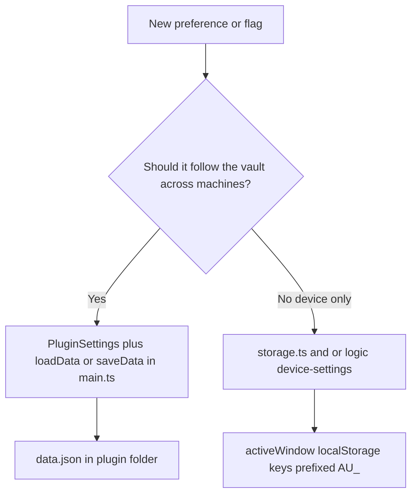
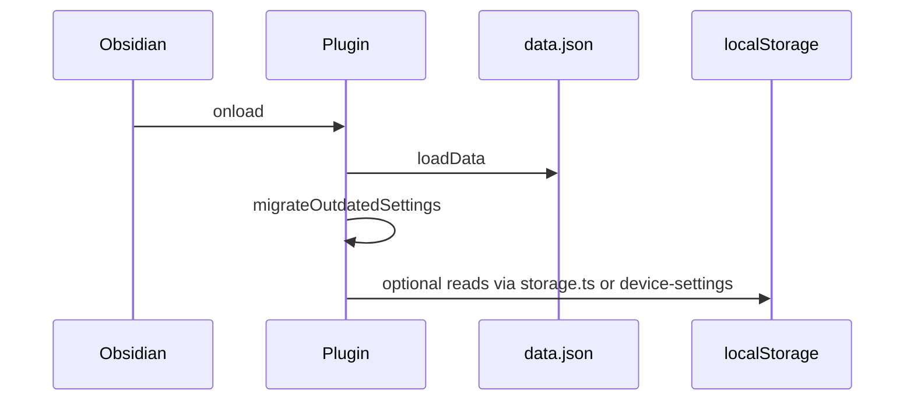

# Plugin memory and persistence

## Why it exists

Ink stores data in several places with different **lifetimes**, **sync behaviour**, and **scopes**. Mixing them up leads to wrong expectations (for example, assuming a preference will follow the user to another computer when it is stored in `localStorage`, or editing `data.json` when a value actually lives only on the device). This page is the map of where state lives and how it is intended to be used.

---

## Conceptual understanding

Think in four buckets:

| Bucket | Typical content | Travels with vault? | Travels with device/browser? |
|--------|------------------|---------------------|------------------------------|
| **Vault files** | Ink SVGs, markdown notes, optional debug logs | Yes (normal file sync) | Yes when the whole vault is copied |
| **Plugin settings (`data.json`)** | Feature toggles, folders, dominant hand, debug logging, etc. | Yes — lives under the vault’s `.obsidian` tree | Yes on setups that sync `.obsidian` (e.g. Obsidian Sync) |
| **Host `localStorage`** | Per-machine UI/session keys, device-only preferences (Boox companion, stroke input treat-as, recent picker paths) | **No** | Stays on that browser profile / Obsidian window host |
| **In-memory only** | Open editor state, undo stacks for the session, Jotai atoms not backed by storage | No | Lost on reload |

**Obsidian popouts:** several code paths use `window.activeWindow.localStorage` (not the global `localStorage` identifier) so reads and writes attach to the window that hosts the current UI, including popout windows.

---

## Flows

### Where a preference should go

### Plugin load: settings vs device

---

## Technical details

### 1. Plugin settings — `data.json` (vault-scoped, synced with vault config)

- **API:** `Plugin.loadData()` / `Plugin.saveData()` (see [`src/main.ts`](../src/main.ts) — `loadSettings`, `saveSettings`).
- **On disk:** `<vault>/.obsidian/plugins/<plugin-id>/data.json` (exact folder name follows the installed plugin manifest id).
- **Shape:** Versioned `PluginSettings`; migrations run on load. See [Plugin settings versioning](plugin-settings-versioning.md).
- **Use for:** Anything that should match the vault when the user uses Obsidian Sync (or clones the vault) **and** that should appear in the main **Settings** UI for the plugin.

### 2. Device-local `localStorage` — `storage.ts` prefix `AU_`

- **Implementation:** [`src/logic/utils/storage.ts`](../src/logic/utils/storage.ts) — `saveLocally`, `fetchLocally`, `deleteLocally`.
- **Key format:** `AU_<key>` (from `LOCAL_STORAGE_PREFIX` + suffix).
- **Examples today:**
  - One-shot embed activation: `activateNextEmbed` (boolean; consumed after read).
  - Recent picker paths: `recentDrawingFilePaths`, `recentWritingFilePaths` (JSON string arrays).
  - Versioned device settings blob: `deviceSettings_v1` (JSON; see below).
- **Use for:** Per-device behaviour, session helpers, or data that must **not** be tied to vault sync (e.g. “Treat input as” pen vs mouse per editor kind).

### 3. Device settings module — versioned JSON blob

- **Location:** [`src/logic/device-settings/`](../src/logic/device-settings/) (`readDeviceSettings`, `patchDeviceSettings`, `getStrokeInputTreatAs`, `setStrokeInputTreatAs`, `subscribeDeviceSettingsChanged`).
- **Storage key:** `deviceSettings_v1` via `saveLocally` / `fetchLocally`.
- **Fields:** `pluginVersion` (current Ink semver, updated on read/write), `booxConnectionEnabled` (default off), `strokeInputTreatAs` per editor kind, `lastDetectedStrokeInput`.
- **Same-tab updates:** Writes dispatch a custom window event; readers (e.g. React hooks in the ink canvas) also listen for the native `storage` event for other tabs.
- **UI:** “Enable Boox companion app” and “Smoothing and pressure” (pen vs mouse, separate for writing and drawing) read/write this blob, not `data.json`. Vault **Reset settings** also resets `booxConnectionEnabled` to off on this device.
- **Migration:** On load, legacy `booxConnectionEnabled` / `einkBridgeEnabled` values in `data.json` are copied into device storage once, then removed from the vault file.

### 4. Jotai `atomWithStorage` (still `localStorage`, separate from `storage.ts`)

- **Example:** [`src/stores/device-memory-store.ts`](../src/stores/device-memory-store.ts) — `showHiddenFoldersAtom` uses `LOCAL_STORAGE_PREFIX` (`AU_`) + `show-hidden-folders`.
- **Use for:** Small UI toggles that should persist on the device and are convenient to bind with Jotai. Prefer **one** convention per new feature: either extend the shared **device-settings** blob for structured/versioned fields, or use `storage.ts` helpers for simple string keys — avoid scattering ad-hoc key names without documenting them here.

### 5. In-memory Jotai (not persisted)

- **Examples:** [`src/stores/global-store.ts`](../src/stores/global-store.ts) (`globalsAtom`), [`src/stores/dominant-hand-store.ts`](../src/stores/dominant-hand-store.ts) (`dominantHandAtom` — **hydrated from** `PluginSettings` on load; the atom itself is runtime convenience for React).
- **Use for:** Process-wide handles and UI state that should reset when the plugin reloads.

### 6. Ink document content (vault files)

- **Writing / drawing:** SVG attachments (and embedded JSON snapshots) in the vault; not in `data.json`.
- **Debug logging to vault:** When enabled in plugin settings, [`src/logic/utils/log-to-vault.ts`](../src/logic/utils/log-to-vault.ts) appends to `ink-debug_<YYYY-MM-DD>.md` in the vault root — that is normal vault file I/O, not plugin storage.

### 7. Special case: mobile emulation guard

- [`src/main.ts`](../src/main.ts) uses raw `window.localStorage` for a short-lived reload guard key during mobile emulation. This is intentionally narrow and not part of the general `storage.ts` API.

---

## Technical Gotchas

- **`data.json` vs vault-only files:** Plugin settings sync (or not) exactly however the user’s Obsidian setup syncs the `.obsidian/plugins` folder. Do not assume every install syncs `.obsidian`; some users only sync note content.
- **`localStorage` is not in the vault:** Keys under `AU_*` do not move with a vault export that omits local app data. Treat them as **device- or profile-local**.
- **Popout windows:** Always use `storage.ts` (active window storage) for new device-local keys so behaviour matches the focused Obsidian window.
- **Corrupt JSON in device blobs:** Device settings readers should defensively parse and fall back to defaults (see `readDeviceSettings`); new blobs should stay versioned for future migrations.
- **Do not store functions in any persisted JSON:** Stroke easing and similar behaviour are derived from serialisable fields (e.g. `inputKind`, `simulatePressure`) at render time — see ink canvas types and stroke presets.

---

## Related documentation

- [Plugin settings versioning](plugin-settings-versioning.md) — `data.json` shape and migrations.
- [Copy / paste embeds](copy-paste-embeds.md) — mentions recent paths in `localStorage` for the file picker.

When adding a new persisted field, update this page with the **key name**, **format**, and **bucket** (settings vs device-local vs file).
