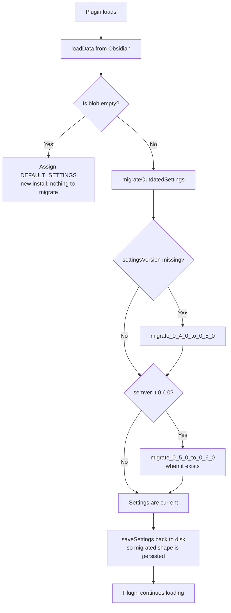
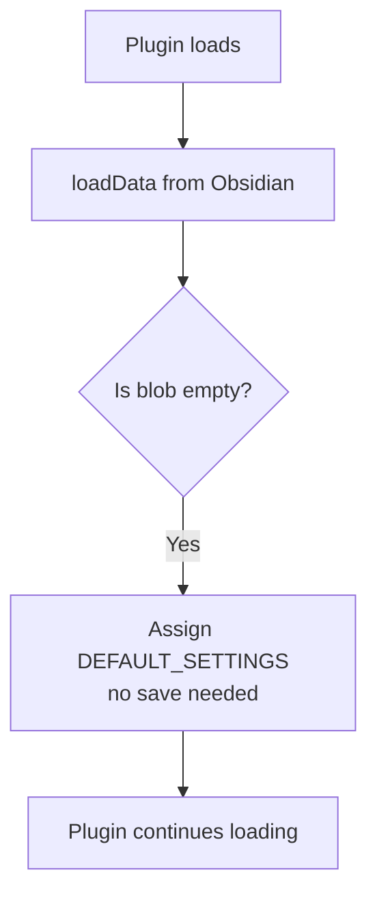

# Plugin Settings Versioning

## Why it exists

Obsidian plugins persist settings as a flat JSON blob (`data.json` in the plugin folder). When a new plugin version adds, removes, or renames settings fields, users upgrading from an older version will have a stale blob that no longer matches the current shape. Without migration logic, those users either silently lose their preferences or hit runtime errors on unexpected `undefined` values.

This system tracks the settings shape at each relevant plugin version and upgrades stored blobs forward through each version when the plugin loads.

---

## Conceptual understanding

Settings are versioned in parallel with the plugin itself. Each time the settings shape changes in a way that is not safely backward-compatible (new required field, renamed field, restructured field), a new versioned snapshot of the full interface is recorded and a migration function is written to convert the previous shape into the new one.

The system is similar to a database schema migration chain — each migration is a pure function that takes the old shape and returns the new shape, and they are applied in order.

The key principle: **the rest of the codebase only ever sees the canonical `PluginSettings` type and `DEFAULT_SETTINGS` constant**. Those are re-exported aliases that always point at the current version. Nothing outside `src/types/` needs to change when a new version is introduced.

---

## File structure

```
src/types/
├── plugin-settings_0_4_0.ts       # Snapshot: settings at 0.4.0 (pre-versioning baseline)
├── plugin-settings_0_5_0.ts       # Snapshot: settings at 0.5.0 (first versioned shape)
├── plugin-settings-migrations.ts  # Migration chain + individual migration functions
├── types-map.ts                   # Re-exports current version as canonical PluginSettings
└── plugin-settings.ts             # Thin re-export shim — preserves existing import paths
```

---

## Flows

### Plugin startup (existing user)



### Plugin startup (new install)



---

## Technical details

### Versioned snapshot files (`plugin-settings_X_Y_0.ts`)

Each file contains:
- An interface `PluginSettings_X_Y_0` — the exact shape of settings at that version.
- A constant `DEFAULT_PLUGIN_SETTINGS_X_Y_0` — the full default values for that version.

**Naming rule:** The version in the filename and interface name uses underscores for dots (e.g. `0.5.0` → `_0_5_0`). The `settingsVersion` string value uses the normal semver dot format (`'0.5.0'`).

**Baseline (0.4.0):** This was the last public release before versioning was introduced. Its interface has no `settingsVersion` field — that absence is how `migrateOutdatedSettings` detects it needs to run.

**Subsequent versions (0.5.0+):** Each version `extends` the previous, only declaring the new or changed fields. The default constant spreads the previous default and overrides what changed.

```typescript
// Example: 0.5.0 extends 0.4.0
export interface PluginSettings_0_5_0 extends PluginSettings_0_4_0 {
    settingsVersion: string,
    gettingStartedExpanded: boolean,
    // ... new fields only
}

export const DEFAULT_PLUGIN_SETTINGS_0_5_0: PluginSettings_0_5_0 = {
    ...DEFAULT_PLUGIN_SETTINGS_0_4_0,
    settingsVersion: '0.5.0',
    gettingStartedExpanded: true,
    // ... new fields with their defaults
}
```

### `plugin-settings-migrations.ts`

Contains two things:

**1. `migrateOutdatedSettings(raw)`** — the entry point called from `main.ts`. It runs the chain of migrations in order using semver comparisons. Each step is only applied if the current blob is older than the target version.

```typescript
export function migrateOutdatedSettings(raw: Record<string, unknown>): PluginSettings {
    let settings: unknown = raw;

    // No settingsVersion means it's a pre-0.5.0 blob
    if (!raw.settingsVersion) {
        settings = migrate_0_4_0_to_0_5_0(settings as PluginSettings_0_4_0);
    }
    if (semver.lt(settings.settingsVersion, '0.6.0')) {
        settings = migrate_0_5_0_to_0_6_0(settings as PluginSettings_0_5_0);
    }
    // ... and so on

    return settings as PluginSettings;
}
```

**2. `migrate_X_Y_0_to_A_B_0(old)`** — individual pure migration functions. Pattern:

```typescript
export function migrate_0_5_0_to_0_6_0(oldSettings: PluginSettings_0_5_0): PluginSettings_0_6_0 {
    const newSettings: PluginSettings_0_6_0 = {
        // 1. Spread new defaults as a safety net
        ...DEFAULT_PLUGIN_SETTINGS_0_6_0,
        // 2. Spread old settings to carry forward unchanged values
        ...oldSettings,
        // 3. Explicitly overwrite anything that changed
        //    — new fields (old value would be undefined or from the spread default)
        //    — renamed fields (map old name to new name)
        //    — restructured fields (transform the data)
        newField: DEFAULT_PLUGIN_SETTINGS_0_6_0.newField,
        renamedField: oldSettings.oldFieldName,
        settingsVersion: DEFAULT_PLUGIN_SETTINGS_0_6_0.settingsVersion,  // Always last
    };
    // Deep clone to avoid reference sharing
    return JSON.parse(JSON.stringify(newSettings));
}
```

The `...DEFAULT` spread first and `...oldSettings` spread second means: "start with all new defaults, then let old user values win — except for the explicit overrides below".

### `types-map.ts`

The single file that controls what `PluginSettings` and `DEFAULT_SETTINGS` mean at any given time. Update only this when adding a new version:

```typescript
// Before (0.5.0)
import { DEFAULT_PLUGIN_SETTINGS_0_5_0, PluginSettings_0_5_0 } from './plugin-settings_0_5_0';
export interface PluginSettings extends PluginSettings_0_5_0 {}
export const DEFAULT_SETTINGS = DEFAULT_PLUGIN_SETTINGS_0_5_0;

// After adding 0.6.0
import { DEFAULT_PLUGIN_SETTINGS_0_6_0, PluginSettings_0_6_0 } from './plugin-settings_0_6_0';
export interface PluginSettings extends PluginSettings_0_6_0 {}
export const DEFAULT_SETTINGS = DEFAULT_PLUGIN_SETTINGS_0_6_0;
```

### `main.ts` — `loadSettings()`

```typescript
async loadSettings() {
    const loaded = await this.loadData() as Record<string, unknown> | null;
    const isNewInstall = !loaded || Object.keys(loaded).length === 0;
    if (isNewInstall) {
        this.settings = Object.assign({}, DEFAULT_SETTINGS);
    } else {
        this.settings = migrateOutdatedSettings(loaded);
        await this.saveSettings();  // Persist the migrated shape immediately
    }
}
```

---

## How to add a new settings version

Follow these steps in order.

### Step 1 — Create the versioned snapshot file

Create `src/types/plugin-settings_X_Y_0.ts`. Extend the previous version's interface and only declare fields that are new or changed. Set `settingsVersion` to the plugin version string where this change ships.

```typescript
import { PluginSettings_0_5_0, DEFAULT_PLUGIN_SETTINGS_0_5_0 } from './plugin-settings_0_5_0';

export interface PluginSettings_0_6_0 extends PluginSettings_0_5_0 {
    settingsVersion: string,
    myNewField: boolean,       // new field
    // If renaming: remove old name and add new name here
}

export const DEFAULT_PLUGIN_SETTINGS_0_6_0: PluginSettings_0_6_0 = {
    ...DEFAULT_PLUGIN_SETTINGS_0_5_0,
    settingsVersion: '0.6.0',
    myNewField: false,
}
```

### Step 2 — Write the migration function

Add `migrate_0_5_0_to_0_6_0` to `plugin-settings-migrations.ts`. Import the new types at the top of the file.

```typescript
export function migrate_0_5_0_to_0_6_0(oldSettings: PluginSettings_0_5_0): PluginSettings_0_6_0 {
    const newSettings: PluginSettings_0_6_0 = {
        ...DEFAULT_PLUGIN_SETTINGS_0_6_0,
        ...oldSettings,
        myNewField: DEFAULT_PLUGIN_SETTINGS_0_6_0.myNewField,
        settingsVersion: DEFAULT_PLUGIN_SETTINGS_0_6_0.settingsVersion,
    };
    return JSON.parse(JSON.stringify(newSettings));
}
```

### Step 3 — Wire it into the migration chain

In `migrateOutdatedSettings`, add the new step after the existing ones:

```typescript
if (semver.lt(updatedSettings.settingsVersion as string, '0.6.0')) {
    updatedSettings = migrate_0_5_0_to_0_6_0(updatedSettings as unknown as PluginSettings_0_5_0);
}
```

Also uncomment and update the placeholder comment that already sits in `migrateOutdatedSettings` as a guide.

### Step 4 — Update `types-map.ts`

Point the canonical exports at the new version:

```typescript
import { DEFAULT_PLUGIN_SETTINGS_0_6_0, PluginSettings_0_6_0 } from './plugin-settings_0_6_0';
export interface PluginSettings extends PluginSettings_0_6_0 {}
export const DEFAULT_SETTINGS = DEFAULT_PLUGIN_SETTINGS_0_6_0;
```

### Step 5 — Build and verify

```sh
npm run build
```

No other files need to change. The `PluginSettings` type used everywhere will automatically reflect the new shape.

---

## Technical gotchas

**`settingsVersion` is missing, not wrong, for the 0.4.0 baseline.** The check in `migrateOutdatedSettings` is `!raw.settingsVersion` (absence), not a semver comparison. This is intentional — 0.4.0 pre-dates the versioning system entirely and never wrote that field to disk.

**Always deep-clone with `JSON.parse(JSON.stringify(...))` at the end of each migration function.** Spreading objects creates shallow copies. Nested objects (e.g. `onboardingTips`) will still be shared references without this step, which could cause the original `raw` object to be mutated.

**`settingsVersion` must be overwritten last in the migration body.** Because `...oldSettings` is spread before the explicit overrides, and `oldSettings` may contain an old `settingsVersion` string, you must explicitly set `settingsVersion` after the spread — otherwise you'll persist the old version string and the chain will re-run on next load.

**New fields must be explicitly listed even when the default spread covers them.** The `...DEFAULT` spread does set new fields, but listing them explicitly after `...oldSettings` makes intent clear and prevents old builds that coincidentally saved a key with the same name from shadowing the correct default.

**`semver` is already a dependency** (`semver ^7.6.2` in `package.json`). Use `semver.lt(version, target)` for version comparisons in the chain. Do not use string equality or manual parsing.

**The migration saves back to disk immediately** (`await this.saveSettings()` in `loadSettings`). This means the first launch after a migration writes the upgraded shape. Subsequent launches will see the new `settingsVersion` and skip all migration steps — the chain is idempotent.

**Do not skip version numbers in the chain.** A user upgrading from 0.4.0 directly to 0.7.0 must pass through 0.5.0 and 0.6.0 migrations in order. Each step assumes the input matches its specific input type — skipping steps would pass the wrong shape.
